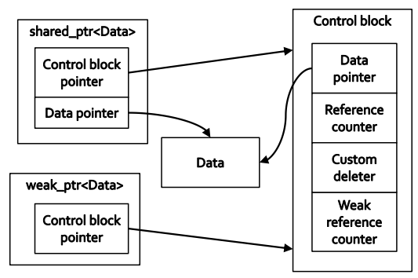
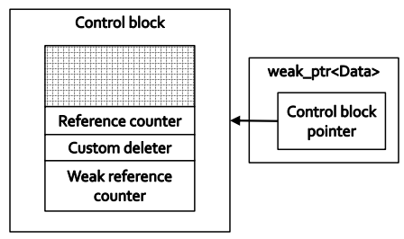
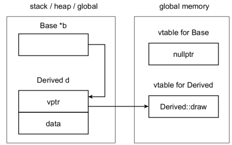
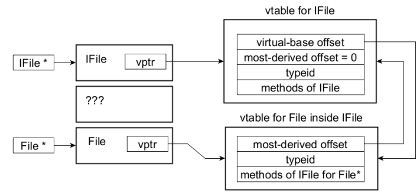
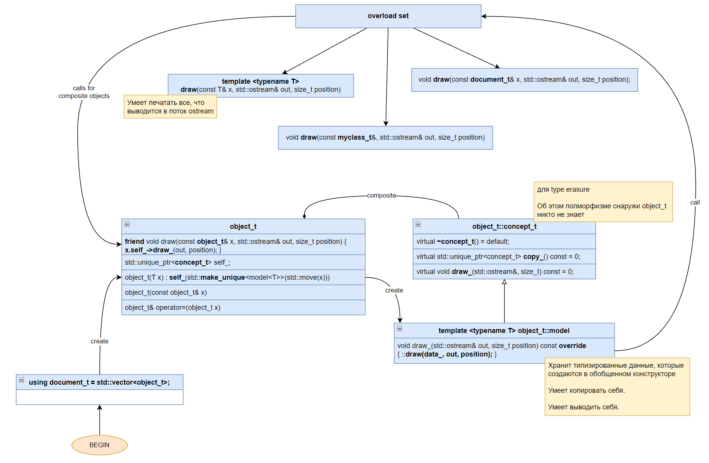
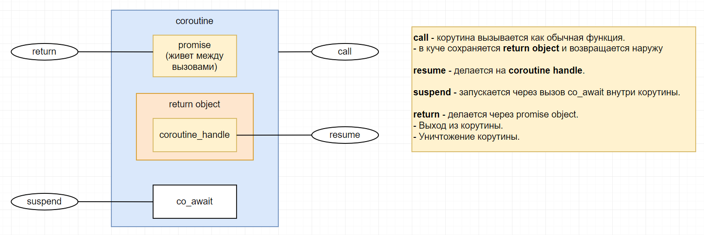
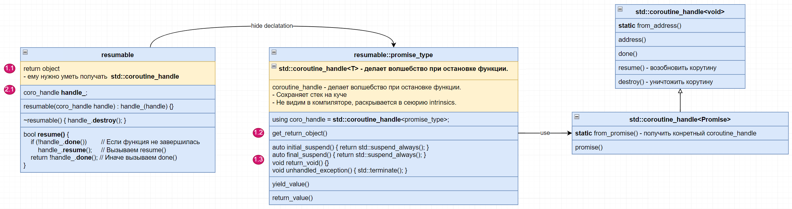

# Konstantin Vladimirov - "Магистерский курс C++, MIPT" - 2022-2023 (Full Notes)

- [About the course](#about-the-course)
- [01. Strings](#01-strings)
  - [Стандартные преобразования: lvalue to rvalue, array to pointer, function to function pointer](#стандартные-преобразования-lvalue-to-rvalue-array-to-pointer-function-to-function-pointer)
  - [Побочные эффекты и asm](#побочные-эффекты-и-asm)
  - [Проблема `C-строк`](#проблема-c-строк)
  - [`std::string_view` (C++17)](#stdstring_view-c17)
  - [Идиома COW (Copy-On-Write) для `std::string` провалилась](#идиома-cow-copy-on-write-для-stdstring-провалилась)
  - [SSO (Small String Optimization) for `std::string`](#sso-small-string-optimization-for-stdstring)
- [02. Шаблоны функций](#02-шаблоны-функций)
  - [Создаем шаблонный метод `do_nth_power` с концептами](#создаем-шаблонный-метод-do_nth_power-с-концептами)
  - [Управление инстанцированием](#управление-инстанцированием)
  - [Правила инстанцирования](#правила-инстанцирования)
  - [`Non-type parameters`](#non-type-parameters)
  - [Шаблонные параметры по умолчанию](#шаблонные-параметры-по-умолчанию)
  - [Пишем правильный оператор сравнения для `basic_string`](#пишем-правильный-оператор-сравнения-для-basic_string)
  - [Идея построения цепочки преобразований](#идея-построения-цепочки-преобразований)
  - [Перегрузка и шаблоны](#перегрузка-и-шаблоны)
  - [Cпециализации не участвуют в перегрузке](#cпециализации-не-участвуют-в-перегрузке)
  - [Компилятор не занимается жадным матчингом в шаблонах](#компилятор-не-занимается-жадным-матчингом-в-шаблонах)
- [03.1 Шаблоны классов](#031-шаблоны-классов)
  - [ODR (One Definition Rule) для классов и функций работает по разному](#odr-one-definition-rule-для-классов-и-функций-работает-по-разному)
  - [Частичная специализация шаблонов (работает только для классов)](#частичная-специализация-шаблонов-работает-только-для-классов)
  - [Частичная специализация не всегда должна иметь меньше или равное количество шаблонов-параметров](#частичная-специализация-не-всегда-должна-иметь-меньше-или-равное-количество-шаблонов-параметров)
  - [Трюк Саттера для создания частичной специализации функции через класс](#трюк-саттера-для-создания-частичной-специализации-функции-через-класс)
  - [Специализация классов только лишь похожа на наследование - она нарушает LSP (Liskov Substitution Principle)](#специализация-классов-только-лишь-похожа-на-наследование---она-нарушает-lsp-liskov-substitution-principle)
- [03.2 Шаблоны классов - Специализация методов классов](#032-шаблоны-классов---специализация-методов-классов)
  - [`.template` используется для разрешения неоднозначности, если мы хотим вызвать шаблонный метод](#template-используется-для-разрешения-неоднозначности-если-мы-хотим-вызвать-шаблонный-метод)
  - [Для специализации шаблонного метода шаблонного класса нужно съедать и параметры класса и параметры метода](#для-специализации-шаблонного-метода-шаблонного-класса-нужно-съедать-и-параметры-класса-и-параметры-метода)
  - [Переходники типов - специализация метода класса по параметру шаблона класса](#переходники-типов---специализация-метода-класса-по-параметру-шаблона-класса)
  - [Переходник типов для имитации частичной специализации функций](#переходник-типов-для-имитации-частичной-специализации-функций)
- [03.3 Шаблоны классов - Вывод типов шаблонами классов](#033-шаблоны-классов---вывод-типов-шаблонами-классов)
  - [Конструкторы классов могут использоваться для вывода типов (С++17)](#конструкторы-классов-могут-использоваться-для-вывода-типов-с17)
  - [`Deduction Hints` - хинты вывода типов могут быть использованы для вывода типов конструкторами классов и агрегатами (С++17)](#deduction-hints---хинты-вывода-типов-могут-быть-использованы-для-вывода-типов-конструкторами-классов-и-агрегатами-с17)
- [03.4 Шаблоны классов - Разрешение имен](#034-шаблоны-классов---разрешение-имен)
  - [Двухфазное разрешение имен (тонкий пример)](#двухфазное-разрешение-имен-тонкий-пример)
  - [Disambiguation (Разрешение неоднозначности): `.template`, `typename`](#disambiguation-разрешение-неоднозначности-template-typename)
  - [Отношение **общий**, **частный** в специализации шаблонных классов](#отношение-общий-частный-в-специализации-шаблонных-классов)
- [04.1 Модули - One Definition Rule (ODR)](#041-модули---one-definition-rule-odr)
  - [Единица трансляции](#единица-трансляции)
  - [Классы связывания](#классы-связывания)
  - [ODR(One Definition Rule)](#odrone-definition-rule)
  - [(1) `non-inline` for ODR](#1-non-inline-for-odr)
  - [(2) `odr-used` for ODR](#2-odr-used-for-odr)
  - [(3) `discarded statement` for ODR](#3-discarded-statement-for-odr)
  - [Предкомпилированные header файлы (первая попытка ускорить компиляцию)](#предкомпилированные-header-файлы-первая-попытка-ускорить-компиляцию)
  - [Модули (C++20) - идеальные предкомпилированные header файлы](#модули-c20---идеальные-предкомпилированные-header-файлы)
  - [Импортируем модуль в модуль](#импортируем-модуль-в-модуль)
  - [Что нельзя экспортировать из модуля](#что-нельзя-экспортировать-из-модуля)
  - [Глобальный фрагмент модуля, в который можно сделать `include`](#глобальный-фрагмент-модуля-в-который-можно-сделать-include)
- [05. SFINAE (Substitution Failure Is Not An Error)](#05-sfinae-substitution-failure-is-not-an-error)
  - [Можно создавать шаблонные переменные](#можно-создавать-шаблонные-переменные)
  - [SFNIAE unwrapping](#sfniae-unwrapping)
  - [Использование `void_t`, чтобы спросить, если у типа определенный метод (интерфейс)](#использование-void_t-чтобы-спросить-если-у-типа-определенный-метод-интерфейс)
  - [`void_t` — это не шаблон, это алиас. Алиасы имеют некоторые особенности](#void_t--это-не-шаблон-это-алиас-алиасы-имеют-некоторые-особенности)
  - [ENABLE\_IF - условная конструкция для типов](#enable_if---условная-конструкция-для-типов)
- [06. Constexpr](#06-constexpr)
  - [`if constexpr` - выкидывает ветки ШАБЛОННЫХ инстанцирований](#if-constexpr---выкидывает-ветки-шаблонных-инстанцирований)
  - [`constexpr` функции времени компиляции](#constexpr-функции-времени-компиляции)
  - [`consteval` (C++20)](#consteval-c20)
  - [`constinit` (С++20)](#constinit-с20)
  - [`if consteval` (C++23)](#if-consteval-c23)
  - [Core constant expressions](#core-constant-expressions)
  - [`constexpr` не сохраняется через передачу по аргументам](#constexpr-не-сохраняется-через-передачу-по-аргументам)
  - [В `constexpr-функциях` на этапе компиляции запрещено UB.](#в-constexpr-функциях-на-этапе-компиляции-запрещено-ub)
  - [`constexpr-evaluation` и контейнер, который работает на этапе компиляции (С++14)](#constexpr-evaluation-и-контейнер-который-работает-на-этапе-компиляции-с14)
  - [Виртуальные constexpr функции (C++20)](#виртуальные-constexpr-функции-c20)
  - [`constexpr new`](#constexpr-new)
  - [`Вариабельный суффикс` - пользовательские литералы времени компиляции через вариабельные шаблоны](#вариабельный-суффикс---пользовательские-литералы-времени-компиляции-через-вариабельные-шаблоны)
  - [`Cтроковые литералы` - как писать пользовательские литералы времени компиляции для строк](#cтроковые-литералы---как-писать-пользовательские-литералы-времени-компиляции-для-строк)
  - [Литералы `физических величин` и автоматический контроль размерности](#литералы-физических-величин-и-автоматический-контроль-размерности)
  - [`boost::hana` - Представление типов значениями](#boosthana---представление-типов-значениями)
  - [Перенос процесса `инстанцирования` на процесс `Constexpr Evaluation` (быстрее и мы хотим этого)](#перенос-процесса-инстанцирования-на-процесс-constexpr-evaluation-быстрее-и-мы-хотим-этого)
- [07. Concepts](#07-concepts)
  - [Неявный интерфейс](#неявный-интерфейс)
  - [Используем SFINAE, чтобы сделать более явным интерфейс (костыль)](#используем-sfinae-чтобы-сделать-более-явным-интерфейс-костыль)
  - [Используем `if constexpr` и `static_assert` для явного интерфейса](#используем-if-constexpr-и-static_assert-для-явного-интерфейса)
  - [Используем `Constraints(ограничения)` для явного интерфейса (`requires`)](#используем-constraintsограничения-для-явного-интерфейса-requires)
  - [`Concepts` - ограничения с отношениями частное-общее](#concepts---ограничения-с-отношениями-частное-общее)
  - [Что такое `Concept`?](#что-такое-concept)
  - [Карирование аргументов](#карирование-аргументов)
  - [Концепты определяют над собой частичный порядок (частное-общее)](#концепты-определяют-над-собой-частичный-порядок-частное-общее)
- [08. Type Inference (Вывод типов)](#08-type-inference-вывод-типов)
  - [Категории выражений](#категории-выражений)
  - [`rvalue` всегда связывается с `modifiable rvalue reference` (`T&&` - `not const T&&`)](#rvalue-всегда-связывается-с-modifiable-rvalue-reference-t---not-const-t)
  - [`RVO` (Return Value Optimization) and `NRVO` (Named RVO)](#rvo-return-value-optimization-and-nrvo-named-rvo)
  - [Надо различать вызван ли `decltype` от `имени` или от `выражения`](#надо-различать-вызван-ли-decltype-от-имени-или-от-выражения)
  - [`decltype(auto)` ведет себя как `decltype`, но при этом выводится из всей правой части](#decltypeauto-ведет-себя-как-decltype-но-при-этом-выводится-из-всей-правой-части)
  - [`decltype(auto)` разбор примера](#decltypeauto-разбор-примера)
  - [`auto` можно уточнять концептами](#auto-можно-уточнять-концептами)
  - [Правила написания правильных ограничений для шаблонов (используйте только позитивные ограничения)](#правила-написания-правильных-ограничений-для-шаблонов-используйте-только-позитивные-ограничения)
- [09. Variadic Templates](#09-variadic-templates)
  - [C-style `...`](#c-style-)
  - [C++ style `...`](#c-style--1)
  - [`Variadic Templates` - несколько простых примеров](#variadic-templates---несколько-простых-примеров)
  - [`Variadic Templates` - более сложные примеры](#variadic-templates---более-сложные-примеры)
  - [Документация по паттернам раскрытия](#документация-по-паттернам-раскрытия)
  - [Экзотические свертки](#экзотические-свертки)
  - [Светрки с пустыми пачками тоже работают](#светрки-с-пустыми-пачками-тоже-работают)
  - [`std::conjunction_v` - проверка всех типов на истинность](#stdconjunction_v---проверка-всех-типов-на-истинность)
  - [Вариабельные концепты и каррирование](#вариабельные-концепты-и-каррирование)
  - [Свертки очень важны для концептов, так как у нас нет рекурсии и выхода (нет откусывания пачки)](#свертки-очень-важны-для-концептов-так-как-у-нас-нет-рекурсии-и-выхода-нет-откусывания-пачки)
  - [Пачка параметров обычно должна идти последним аргументом, т.к. из за жадности она заберет все последующие аргументы](#пачка-параметров-обычно-должна-идти-последним-аргументом-тк-из-за-жадности-она-заберет-все-последующие-аргументы)
  - [Пример с `auto` для вывода указателя на поле класса](#пример-с-auto-для-вывода-указателя-на-поле-класса)
- [10. Lambda-выражения](#10-lambda-выражения)
  - [Синтаксис `->` для указания типа возвращаемого значения (C++11)](#синтаксис---для-указания-типа-возвращаемого-значения-c11)
  - [Что такое `λ-выражение` и `closure` без захвата](#что-такое-λ-выражение-и-closure-без-захвата)
  - [`std::invoke` и callable объекты](#stdinvoke-и-callable-объекты)
  - [`std::invoke` и указатель на поле класса](#stdinvoke-и-указатель-на-поле-класса)
  - [Positive Lambda Hack](#positive-lambda-hack)
  - [Generic Lambda - это лямбда-функция с шаблонным оператором приведения](#generic-lambda---это-лямбда-функция-с-шаблонным-оператором-приведения)
  - [`decltype([](auto x) { return 2 * x; })` - лучший способ запомнить lambda тип (С++20)](#decltypeauto-x--return-2--x----лучший-способ-запомнить-lambda-тип-с20)
  - [Явные шаблонные аргументы (С++20)](#явные-шаблонные-аргументы-с20)
  - [Лямбда-функции c захватом](#лямбда-функции-c-захватом)
  - [Захват c переименованием](#захват-c-переименованием)
  - [Илучшаем свой идеальный проброс](#илучшаем-свой-идеальный-проброс)
  - [Захват с вариабельными пачками (C++20)](#захват-с-вариабельными-пачками-c20)
  - [Карирование функции - это частичная подстановка ее аргументов](#карирование-функции---это-частичная-подстановка-ее-аргументов)
  - [Захватывается только локальный нестатический контекст](#захватывается-только-локальный-нестатический-контекст)
  - [Мотивация использовать `std::tuple` для хранения аргументов](#мотивация-использовать-stdtuple-для-хранения-аргументов)
  - [Четыре способа создать `std::tuple`](#четыре-способа-создать-stdtuple)
  - [`std::forward_as_tuple` для решения проблемы форвардинга пачки агрументов в лямбда захват](#stdforward_as_tuple-для-решения-проблемы-форвардинга-пачки-агрументов-в-лямбда-захват)
  - [`std::apply` - для вызова функции на пачке аргументов](#stdapply---для-вызова-функции-на-пачке-аргументов)
  - [`std::any` - стирает типы](#stdany---стирает-типы)
  - [`std::variant` - альтернатива `std::any`, которая хранит только один из заданных типов. Работает в сочетании с `std::visit`, который проверяет тип и вызывает соответствующую функцию.](#stdvariant---альтернатива-stdany-которая-хранит-только-один-из-заданных-типов-работает-в-сочетании-с-stdvisit-который-проверяет-тип-и-вызывает-соответствующую-функцию)
  - [Изобретаем свою перегрузку методов](#изобретаем-свою-перегрузку-методов)
  - [`std::function` - это аналог `std::any`, но для функций. По сути это красиво обернутый `void*`.](#stdfunction---это-аналог-stdany-но-для-функций-по-сути-это-красиво-обернутый-void)
  - [`deducing this`, чтобы добиться `forward` поведения для захвата `closure`](#deducing-this-чтобы-добиться-forward-поведения-для-захвата-closure)
  - [`deducing this` and `std::visit` паттерн](#deducing-this-and-stdvisit-паттерн)
  - [Использование `deducing this` вне лямбда-функций](#использование-deducing-this-вне-лямбда-функций)
- [11. Ranges](#11-ranges)
- [11.1 Наблюдения за стандартными алгоритмами](#111-наблюдения-за-стандартными-алгоритмами)
  - [(1) Sentinel (Сингулярный итератор). Стандартные алгоритмы работают с парами равнозначных итераторов, хотя часто от второго требуется только сравнение.](#1-sentinel-сингулярный-итератор-стандартные-алгоритмы-работают-с-парами-равнозначных-итераторов-хотя-часто-от-второго-требуется-только-сравнение)
  - [(2) Объединение или разделение? `copy_if` и `transform`](#2-объединение-или-разделение-copy_if-и-transform)
  - [(3) Энергичность. Стандартные алгоритмы энергичные.](#3-энергичность-стандартные-алгоритмы-энергичные)
- [11.2 Библиотека Ranges (C++20)](#112-библиотека-ranges-c20)
  - [Примеры Ranges](#примеры-ranges)
- [11.2 Концепции ranges](#112-концепции-ranges)
  - [(1) Concepts применяются для итераторов в ranges](#1-concepts-применяются-для-итераторов-в-ranges)
  - [(2) Компараторы и проекции в ranges](#2-компараторы-и-проекции-в-ranges)
- [12. Allocators](#12-allocators)
  - [Foreword: глобальные аллокаторы (аллокаторы в C)](#foreword-глобальные-аллокаторы-аллокаторы-в-c)
  - [Проблемы использования наивных аллокаторов. (С++98)](#проблемы-использования-наивных-аллокаторов-с98)
  - [Полный пример аллокатора на старых С++(С++98)](#полный-пример-аллокатора-на-старых-сс98)
  - [Allocator traits (C++11)](#allocator-traits-c11)
  - [Пример `freelist_alloc`, который не освобождает память при удалении объектов](#пример-freelist_alloc-который-не-освобождает-память-при-удалении-объектов)
  - [Локальный (arena-based) подход](#локальный-arena-based-подход)
  - [Решение проблемы разных аллокаторов в одном контейрене в C++11: scoped alloc](#решение-проблемы-разных-аллокаторов-в-одном-контейрене-в-c11-scoped-alloc)
  - [В C++17 придумали концепцию `polymorphic_allocator`, который принимает `memory_resource`](#в-c17-придумали-концепцию-polymorphic_allocator-который-принимает-memory_resource)
  - [Существующие в стандарте ресурсы](#существующие-в-стандарте-ресурсы)
  - [Пример современного полиморфного аллокатора в С++20 (std::pmr)](#пример-современного-полиморфного-аллокатора-в-с20-stdpmr)
  - [Как можно использовать стандартный контейнер `std::vector` с полиморфным аллокатором](#как-можно-использовать-стандартный-контейнер-stdvector-с-полиморфным-аллокатором)
  - [Case study: тестовый memory resource](#case-study-тестовый-memory-resource)
  - [Установка ресурса по умолчанию на программу](#установка-ресурса-по-умолчанию-на-программу)
  - [Сторожевой узел (Sentinel Node)](#сторожевой-узел-sentinel-node)
  - [Создаем собственный prm контейнер (union, CRTP и сторожевой узел)](#создаем-собственный-prm-контейнер-union-crtp-и-сторожевой-узел)
- [13. Smart Pointers](#13-smart-pointers)
  - [Список возможных алтернатив указателям](#список-возможных-алтернатив-указателям)
  - [PRVALUE elision и NRVO](#prvalue-elision-и-nrvo)
  - [`make_unique` не может быть использован в случае закрытых конструкторов](#make_unique-не-может-быть-использован-в-случае-закрытых-конструкторов)
  - [`std::tuple` используется для оптимизации хранения указателя и делитера в классе `unique_ptr`.](#stdtuple-используется-для-оптимизации-хранения-указателя-и-делитера-в-классе-unique_ptr)
  - [Как можно использовать полиморфный аллокатор для управления удалением объектов через `unique_ptr`](#как-можно-использовать-полиморфный-аллокатор-для-управления-удалением-объектов-через-unique_ptr)
  - [`aliasing ctors` для `shared_ptr`, чтобы вернуть `shared_ptr` на часть объекта](#aliasing-ctors-для-shared_ptr-чтобы-вернуть-shared_ptr-на-часть-объекта)
  - [CRTP (Curiously Recurring Template Pattern) - полиморфизм без использования виртуальных функций](#crtp-curiously-recurring-template-pattern---полиморфизм-без-использования-виртуальных-функций)
  - [`enable_shared_from_this` (пример CRTP техники)](#enable_shared_from_this-пример-crtp-техники)
  - [`static_pointer_cast` для приведения типов `shared_ptr`](#static_pointer_cast-для-приведения-типов-shared_ptr)
  - [`shared_ptr` vs `unique_ptr`](#shared_ptr-vs-unique_ptr)
  - [`weak_ptr` - решение проблемы циклических ссылок](#weak_ptr---решение-проблемы-циклических-ссылок)
  - [`make_shared` может привести к проблемам при использовании `weak_ptr`](#make_shared-может-привести-к-проблемам-при-использовании-weak_ptr)
  - [COW строки на основе `shared_ptr`](#cow-строки-на-основе-shared_ptr)
- [14. Динамический полиморфизм](#14-динамический-полиморфизм)
  - [Примеры статического и динамического полиморфизма](#примеры-статического-и-динамического-полиморфизма)
  - [Мотивации использования динамического полиморфизма:](#мотивации-использования-динамического-полиморфизма)
  - [Как работает виртуальная таблица](#как-работает-виртуальная-таблица)
  - [CRTP, как альтернатива виртуальным функциям](#crtp-как-альтернатива-виртуальным-функциям)
  - [CRTP mixin](#crtp-mixin)
  - [CRTP-mixin для clone (C++20, C++23)](#crtp-mixin-для-clone-c20-c23)
  - [Симметрия исключений и множественного наследования](#симметрия-исключений-и-множественного-наследования)
  - [Виртуальное наследование и влияение его на инициализацию](#виртуальное-наследование-и-влияение-его-на-инициализацию)
  - [Смердженные виртуальные таблицы после виртуального наследования](#смердженные-виртуальные-таблицы-после-виртуального-наследования)
  - [`dynamic_cast`](#dynamic_cast)
  - [14.1 ПРОБЛЕМА (Пример Sean Parent и хранение/возврат разных типов без виртуализации](#141-проблема-пример-sean-parent-и-хранениевозврат-разных-типов-без-виртуализации)
  - [14.2 Решение (Задача Дионне - ручное управление таблицами)](#142-решение-задача-дионне---ручное-управление-таблицами)
  - [14.3 Решение (От Sean Parent - сведение полиморфизма к перегрузке - value семантика и полиморфизм)](#143-решение-от-sean-parent---сведение-полиморфизма-к-перегрузке---value-семантика-и-полиморфизм)
- [15. Concurrency](#15-concurrency)
  - [Важные термины](#важные-термины)
  - [`std::thread`](#stdthread)
  - [`data race`](#data-race)
  - [`volatile` не работает для предупреждения `data race`](#volatile-не-работает-для-предупреждения-data-race)
  - [`data race` и не скалярные типы](#data-race-и-не-скалярные-типы)
  - [`std::mutex` -\> `std::lock_guard`](#stdmutex---stdlock_guard)
  - [15.0 Гарантии безопасности относительно многопоточности](#150-гарантии-безопасности-относительно-многопоточности)
  - [15.1 Если объект защищен `синхронизацией`, то он безопасен.](#151-если-объект-защищен-синхронизацией-то-он-безопасен)
  - [15.2 Объект, никакие операции с которым в этом окружении не приводят к `data race`.](#152-объект-никакие-операции-с-которым-в-этом-окружении-не-приводят-к-data-race)
  - [15.3 `API race` - когда у объекта такое API, которое может привести к проблемам в многопоточном коде.](#153-api-race---когда-у-объекта-такое-api-которое-может-привести-к-проблемам-в-многопоточном-коде)
  - [15.4 `deadlock` - когда два потока ждут друг друга.](#154-deadlock---когда-два-потока-ждут-друг-друга)
  - [DCL - Double-Checked Locking - плохой паттерн](#dcl---double-checked-locking---плохой-паттерн)
  - [Класс `std::flag_once` и `std::call_once` решают проблему DCL](#класс-stdflag_once-и-stdcall_once-решают-проблему-dcl)
  - [`std::unique_lock` - введен для работы с `std::condition_variable`. Помимо RAII его можно `unlock` и `lock` в любой момент.](#stdunique_lock---введен-для-работы-с-stdcondition_variable-помимо-raii-его-можно-unlock-и-lock-в-любой-момент)
  - [Как посылать уведомления(события) между потоками - `std::condition_variable`](#как-посылать-уведомлениясобытия-между-потоками---stdcondition_variable)
  - [`mutable` - ключевое слово для маркировки mutex в классе для указания, что оно не является инвариантом класса.](#mutable---ключевое-слово-для-маркировки-mutex-в-классе-для-указания-что-оно-не-является-инвариантом-класса)
  - [Блокировки на чтении и записи, когда чтение происходит в 1000 раз чаще: `std::shared_mutex`](#блокировки-на-чтении-и-записи-когда-чтение-происходит-в-1000-раз-чаще-stdshared_mutex)
  - [Реккурсивные блокировки - `std::recursive_mutex` - антипаттерн](#реккурсивные-блокировки---stdrecursive_mutex---антипаттерн)
  - [Размеры объектов синхронизации](#размеры-объектов-синхронизации)
- [16. Многопоточные очеререди (multithreaded queues)](#16-многопоточные-очеререди-multithreaded-queues)
  - [1. хотим уйти от проектирования многопоточного кода, потому что с ним много проблем](#1-хотим-уйти-от-проектирования-многопоточного-кода-потому-что-с-ним-много-проблем)
  - [2. Дальнейшие улучшения очереди - удаляем лишний condition\_variable путем использования безграничной очереди](#2-дальнейшие-улучшения-очереди---удаляем-лишний-condition_variable-путем-использования-безграничной-очереди)
  - [Возврат данных из потоков - `std::future` и `std::promise`](#возврат-данных-из-потоков---stdfuture-и-stdpromise)
  - [Правила осторожности с `std::promise` и `std::future`](#правила-осторожности-с-stdpromise-и-stdfuture)
  - [Маршаллинг исключений между потоками: `std::future` и `std::promise`](#маршаллинг-исключений-между-потоками-stdfuture-и-stdpromise)
  - [ВКЛАДЫВАНИЕ ИСКЛЮЧЕНИЙ](#вкладывание-исключений)
  - [`std::packaged_task` уже содержит `std::promise` внутри себя](#stdpackaged_task-уже-содержит-stdpromise-внутри-себя)
  - [Коммуникация в другую сторону - хотим что-то требовать от потока (например останова) - `std::jthread` (C++20)](#коммуникация-в-другую-сторону---хотим-что-то-требовать-от-потока-например-останова---stdjthread-c20)
  - [`std::jthread` (C++20) умеет принимать `std::stop_token`.](#stdjthread-c20-умеет-принимать-stdstop_token)
  - [`std::shared_future` - много потоков могут ждать одного состояния](#stdshared_future---много-потоков-могут-ждать-одного-состояния)
  - [Представте, если вы хотите подождать чего-то, что произойдет в другом потоке - барьеры](#представте-если-вы-хотите-подождать-чего-то-что-произойдет-в-другом-потоке---барьеры)
  - [`std::latch` - барьеры в C++20](#stdlatch---барьеры-в-c20)
  - [Мы хотим перейти от очереди интов, к очереди задач (функторов, разных по сигнатуре).](#мы-хотим-перейти-от-очереди-интов-к-очереди-задач-функторов-разных-по-сигнатуре)
- [17. Atomics \[TODO\_NOTES\]](#17-atomics-todo_notes)
- [18. Parallelism](#18-parallelism)
  - [`std::packaged_task` + `std::thread` = `std::async`](#stdpackaged_task--stdthread--stdasync)
  - [Синхронизация на GPU](#синхронизация-на-gpu)
  - [`std::execution` (C++26) - новый способ управления параллелизмом](#stdexecution-c26---новый-способ-управления-параллелизмом)
- [19. Сопрограммы (coroutines, fibers) \[TODO\_NOTES\]](#19-сопрограммы-coroutines-fibers-todo_notes)
  - [Интерфейс функции и сопрограммы: SUSPEND, ACTIVATE, TERMINATE, YIELD](#интерфейс-функции-и-сопрограммы-suspend-activate-terminate-yield)
  - [Классификация корутин (мы будем рассматривать асимметричные встроенные корутины)](#классификация-корутин-мы-будем-рассматривать-асимметричные-встроенные-корутины)
  - [Сопрограммы в C++20 (пример)](#сопрограммы-в-c20-пример)
  - [Составные части корутины](#составные-части-корутины)
  - [Диаграмма корутины](#диаграмма-корутины)
  - [`co_await` - точка магии](#co_await---точка-магии)
  - [Жизнь корутины](#жизнь-корутины)
  - [`std::generator` C++23: range-based generator](#stdgenerator-c23-range-based-generator)
  - [1. Делаем свою корутину](#1-делаем-свою-корутину)
  - [2. Добавляем `co_yield` к нашей корутине](#2-добавляем-co_yield-к-нашей-корутине)
  - [3. добавляем range-based for к нашей корутине](#3-добавляем-range-based-for-к-нашей-корутине)

## About the course

- [Konstantin Vladimirov](https://github.com/tilir)
- [Youtube playlist](https://www.youtube.com/playlist?list=PL3BR09unfgcgf7R88ZQRQqWOdLy4pRW2h)
- [Original Code Samples](submodules/cpp-masters/)
- [My Code Samples](/code/tilir_masters/)
- [MY Mini Notes](2024-08-09_0020_TILIR_MASTERS_MINI.md)

## 01. Strings

### Стандартные преобразования: lvalue to rvalue, array to pointer, function to function pointer

- Последовательность стандартных преобразований всегда начинается с не более чем одного из трех преобразований.

```cpp
  int a = 5, b; b = a + 2; // lvalue to rvalue: `a` была lvalue, но в выражении `a + 2` она преобразуется в rvalue

  int a[10], int *b; b = a; // array to pointer

  int foo(int);
  int (*b)(int);
  b = foo; // function to function pointer
```

### Побочные эффекты и asm

- https://godbolt.org/z/TT7Ebjczf
- [code/tilir_masters/01_10_side_effects.cpp](code/tilir_masters/01_10_side_effects.cpp)
- Компилятор должен сохранять порядок побочных эффектов.

```cpp

int* bar()
{
    volatile std::nullptr_t a = nullptr;
    int* b;
    b = a;
    return b;
}

// clang asm:
// bar():
//         mov     qword ptr [rsp - 8], 0
//         xor     eax, eax
//         ret
// -------------------------------------------------------------------------
// gcc asm
// bar():
//         mov     QWORD PTR [rsp-8], 0
//         mov     rax, QWORD PTR [rsp-8]
//         xor     eax, eax
//         ret

```

### Проблема `C-строк`

- В C строках нет инварианта на размер строки. С этим связано много уязвимостей. Поэтому и решили придумать C++ с классами, которые помогают защитить инвариант.

### `std::string_view` (C++17)

- `std::string_view` реализует `reference семантику`, потому что `std::string_view` не является владельцем данных, на которые она указывает,
- а `std::string` владеет данными, и это называется `value-семантикой`.
- `std::string_view` реализует набор удобных операций для управления окном из символов. Можно уменьшать, расширять окно, копировать, сравнивать, искать.

```cpp
// Здесь нет ни heap indirection ни создания временного объекта

static const std::string_view kName = "FOO";
// .....
int foo(const std::string_view &arg);
// .....
foo(kName);
```

### Идиома COW (Copy-On-Write) для `std::string` провалилась

- Плюсы
  - Экономия памяти
  - Дешёвое копирование (просто инкремент счётчика ссылок)
  - Меньше аллокаций и удалений в куче => прирост производительности

- Минусы
  - Лишний уровень косвенности
  - Вирусное проникновение копирования во все модифицирующие операции
  - Проблемы thread safety (Multithread COW disease): В многопоточных приложениях COW приводит к так называемой Multithreaded COW disease. Это происходит из-за того, что при изменении объекта (когда он должен сделать копию данных) возникает необходимость безопасно управлять общими ресурсами между несколькими потоками. Если один поток пытается изменить строку, а другие продолжают её читать, возникает условие гонки, которое может привести к повреждению данных или неопределённому поведению.
  - Однако есть соображение, которое рушит баланс. Это **инвалидация указателей**

- Написать Lazy строку за 15 минут [TODO] [PRACTICE]
  - Проблемы, например, с многопоточностью, потому что RefCount не защищен.
  - Безопасность относительно исключений.
  - Семантика перемещения.

```cpp
lass stringbuf {
    char *data;
    size_t size;
    size_t capacity;
    int refcount;
    // etc...
};

class string {
    stringbuf *buf;
    // etc...
};
```

### SSO (Small String Optimization) for `std::string`

```
<-------------------- 32 bytes ------------------>
┌─────────────┬─────────────┬───────────┬────────┐
│ data: points│  size > 15  │ capacity  │ padding│
│ to heap     │             │           │        │
│             │             │           │        │
└─────────────┴─────────────┴───────────┴────────┘

<-------------------- 32 bytes ------------------>
                            <----- 16 bytes ----->
┌─────────────┬─────────────┬────────────────────┐
│ data: points│ size <= 15  │        small       │
│ to small    │             │        string      │
│ string      │             │                    │
└─────────────┴─────────────┴────────────────────┘
```

- Это решение позволяет избежать потерь времени при доступе
- Но уменьшает размер строки, которую можно хранить в SSO
- Пример с хорошей SSO строкой. Но без TypeTraits и Аллокаторов:

```cpp
template <typename CharT> class basic_string {
    CharT *data;
    size_t size;
    union {
        size_t capacity;
        enum { SZ = (sizeof(data) + 2*sizeof(size_t) + 31) / 32 };
        CharT small_str[SZ];
    } sso;
public:
    // тут все его 89 методов
};
```

- Напишите для `basic_string` сравнение (`operator==`) [TODO] [PRACTICE]
  - Сделаете ли вы этот оператор методом класса или свободной функцией?
  - Как должны сравниваться строки с одинаковым `CharT`, но разными `Traits`?
  - А если у них одинаковые `CharT` и `Traits`, но разные аллокаторы?

```cpp
template <typename CharT,
          typename Traits = std::char_traits<CharT>,
          typename Allocator = std::allocator<CharT>>
class basic_string { ... };
```

## 02. Шаблоны функций

### Создаем шаблонный метод `do_nth_power` с концептами

- [code/tilir_masters/02_10_nth_power.cpp](code/tilir_masters/02_10_nth_power.cpp)
- [code/tilir_masters/02_12_nth_power_default_id_traits.cpp](code/tilir_masters/02_12_nth_power_default_id_traits.cpp)
- [code/tilir_masters/02_14_nth_power_concepts.cpp](code/tilir_masters/02_14_nth_power_concepts.cpp)

### Управление инстанцированием

- `Инстанцирование` - это процесс порождения экземпляра специализации. Может быть **явным** или **неявным**.
  - Инстанцирование может быть **явно запрещено** в этой единице трансляции: `extern template int max<int>(int, int);`.
  - Инстанцирование может быть **явно вызывано**: `template int max<int>(int, int);`.
- Эта техника может использоваться для уменьшения размера объектных файлов при инстанцировании тяжелых функций.
- https://github.com/tilir/cpp-masters/tree/master/functempls/instantiations-demo

```cpp
// max.hpp
template <typename T>[[gnu::noinline]] T max(T x, T y) { return (x > y) ? x : y; }
extern template int max<int>(int, int); // block instancing everywhere  <===

// main.cpp
template int max<int>(int, int); // force instancing here               <===

// maxuser1.cpp
#include "max.hpp"
int main() { return max<int>(1, 2); }

// maxuser2.cpp
#include "max.hpp"
int main() { return max<int>(3, 4); }
```

### Правила инстанцирования

- https://youtu.be/FshTrPe_Woc?t=1840
- [code/tilir_masters/02_18_instantiation_rules.cpp](code/tilir_masters/02_18_instantiation_rules.cpp)
- Явное инстанцирование единожды в программе.
- Явная специализация единожды в программе.
- Явное **инстанцирование должно следовать за явной специализацией**.
- Нарушение приводит к **IFNDR** (**Ill-formed, no diagnostic required**).
- **IFNDR** - это такая ошибка, когда компилятор не обязан делать диагностику. Аналогично ситуации, когда вы забыли поставить скобку.

```cpp
template <typename T> T max(T x, T y) { return x > y ? x : y; }

template int max<int>(int, int); // error: explicit specialization of 'max<int>' after instantiation

template <> int max<int>(int x, int y) { return x > y ? x : y; } // <===
```

### `Non-type parameters`

- [code/tilir_masters/02_20_non_type_parameters.cpp](code/tilir_masters/02_20_non_type_parameters.cpp)
- `non-type template parameter` могут быть:
  - Скалярные типы.
  - Левые ссылки.
  - Структуры, у которых все поля и базовые классы public и не mutable.

- Проще говоря, все должно быть **compile-time known**.
- `non-type template parameter` можно также **параметризовать указателями** на `nullptr`, на `глобальную память` или `статические объекты`.

```cpp
struct Pair {
  int x = 1, y = 1;
};

template <int N, int *PN, int &RN, Pair P> int foo() {
  return N + *PN + RN + P.x + P.y;
}

constexpr Pair p;
int x = 1;
int y = 1;

TEST(nontypes, foo) {
  int res = foo<2, &x, y, p>();
  EXPECT_EQ(res, 2 + 1 + 1 + 1 + 1);
}
```

### Шаблонные параметры по умолчанию

- [code/tilir_masters/02_22_template_default_params.cpp](code/tilir_masters/02_22_template_default_params.cpp)

```cpp
template <typename T = double>  // Defaults for type
double foo(T x = 1.5)           // Defaults for value
{
    return x;
}

TEST(deduce, context)
{
    double v0 = foo(2.0);
    EXPECT_EQ(v0, 2.0);
    double v1 = foo<int>();
    EXPECT_EQ(v1, 1);
    double v2 = foo(); // <=== works well with default for type and value
    EXPECT_EQ(v2, 1.5);
}
```

- Можно использовать слово `auto` для автоматического вывода типа.
- [code/tilir_masters/02_24_template_auto_type.cpp](code/tilir_masters/02_24_template_auto_type.cpp)

```cpp
template <auto n> // <=== auto for type deduction
int foo() { return n; }
```

### Пишем правильный оператор сравнения для `basic_string`

```cpp
template <typename CharT, typename Traits = std::char_traits<CharT>, typename Allocator = std::allocator<CharT>>
bool operator==(const basic_string<CharT, Traits, Allocator>& lhs,
                const basic_string<CharT, Traits, Allocator>& rhs) {
    return lhs.compare(rhs) == 0;
}

template <typename CharT, typename Traits, typename Allocator>
bool operator==(const CharT* lhs, const basic_string<CharT, Traits, Allocator>& rhs) {
    return rhs.compare(lhs) == 0;
}

template <typename CharT, typename Traits, typename Allocator>
bool operator==(const basic_string<CharT, Traits, Allocator>& lhs, const CharT* rhs) {
    return lhs.compare(rhs) == 0;
}
```

### Идея построения цепочки преобразований

- [code/tilir_masters/02_26_chain_of_casts.cpp](code/tilir_masters/02_26_chain_of_casts.cpp)
- С наивной точки зрения цепочку преобразований входят:
  - С высшим приоритетом: **стандартные преобразования**.
  - Немного ниже: **пользовательские преобразования**.
  - С низшим приоритетом: **троеточия**.
- В любой цепочке преобразований может быть **только одно пользовательское преобразование**.
- Выбор пользовательского преобразования зависит от длины хвоста стандартных преобразований. Голова не участвует в конкурсе.

```
| Conversion                         | Category                  | Rank        |
| ---------------------------------- | ------------------------- | ----------- |
| No conversions required            | Identity                  | Identity    |
| Lvalue-to-rvalue conversion        | Lvalue Transformation     | Exact Match |
| Array-to-pointer conversion        | Lvalue Transformation     | Exact Match |
| Function-to-pointer conversion     | Lvalue Transformation     | Exact Match |
| Qualification conversions          | Qualification Adjustment  | Exact Match |
| Function pointer conversion        | Qualification Adjustment  | Exact Match |
| Integral promotions                | Promotion                 | Promotion   |
| Floating-point promotion           | Promotion                 | Promotion   |
| Integral conversions               | Conversion                | Conversion  |
| Floating-point conversions         | Conversion                | Conversion  |
| Floating-integral conversions      | Conversion                | Conversion  |
| Pointer conversions                | Conversion                | Conversion  |
| Pointer-to-member conversions      | Conversion                | Conversion  |
| Boolean conversions                | Conversion                | Conversion  |
```

### Перегрузка и шаблоны

- Шаблон может выиграть перегрузку. При этом запускается вывод типов.

```cpp
void foo(double x); // 1
template <typename T> void foo(T x); // 2

foo(1); // → несомненно, 2
```

- Для выигрывающего перегрузку шаблона запускается инстанцирование или ищется специализация.
  - Вызов `foo(1)` находит `PrimaryTemplate 2`, понимает, что это тип `int`, видит, что для типа `int` есть специализация, и вызывает `специализацию 3`.

```cpp
template <> void foo<int>(int x); // 3

foo(1); // → что вы думаете?
```

### Cпециализации не участвуют в перегрузке

- Важно помнить: специализации не участвуют в перегрузке.
- Cначала разрешается перегрузка, потом ищется наименее общая специализация.

```cpp
template <typename T> void foo(T); // 1
template <> void foo (int*); // 2
template <typename T> void foo(T*); // 3

int x;
foo(&x); // вызовет [3], хотя [2] подходит лучше
// Но в данном случае (2) не специализирует (3), так как встречается раньше.
```

### Компилятор не занимается жадным матчингом в шаблонах

- Компилятор не занимается жадным матчингом.
- **Компилятор пытается сделать как можно более точный матчинг**.
- Поэтому будет выбрано инстанцирование шаблона 2.

```cpp
template <typename T> void f(T); // 1
template <typename T> void f(T*); // 2

int **a;
foo(a); // → ?
```

## 03.1 Шаблоны классов

### ODR (One Definition Rule) для классов и функций работает по разному

1. **Для функций**: Правило ODR (One Definition Rule) означает, что функция может быть определена **только один раз в пределах всей программы**. Это касается не только тела функции, но и её сигнатуры, что подразумевает наличие одного уникального определения на программу. Если функция определена в нескольких местах, то это может привести к **ошибке компоновки (linker error)**.

2. **Для классов**: ODR работает немного по-другому. Класс **может быть определён в каждой единице трансляции**, в которой он используется, но каждое из этих определений **должно быть идентичным**. Иными словами, все единицы трансляции должны "видеть" одно и то же определение класса. Если определения класса в разных единицах трансляции различаются, это также приведет к нарушению ODR и, следовательно, к **ошибкам на этапе компоновки или выполнения**.

### Частичная специализация шаблонов (работает только для классов)

- *Это простые примеры специализации. А что, если передать `float*, float*`?* (риторический вопрос)
- [code/tilir_masters/03_10_class_spec_example.cpp](code/tilir_masters/03_10_class_spec_example.cpp)

```cpp
template <typename T, typename U> class Foo {}; // 1
template <typename T> class Foo<T, T> {}; // 2
template <typename T> class Foo<T, int> {}; // 3
template <typename T, typename U> class Foo<T*, U*> {}; // 4

Foo<int, float> mif; // соответствует 1
Foo<float, float> mff; // соответствует 2
Foo<float, int> mfi; // соответствует 3
Foo<int*, float*> mp; // соответствует 4
```

### Частичная специализация не всегда должна иметь меньше или равное количество шаблонов-параметров

- Частичная специализация съедает какое-то количество параметров primary шаблона.
- До тех пор, пока она менее специальна в неком смысле, у неё может быть даже **больше** шаблонных параметров.
- Для создания аналога `std::function` мы можем, наоборот, увеличить количество параметров, и это будет более специальный пример.

```cpp
template <typename T> class X;
template <typename R, typename Arg> class X<R(Arg)> {};
```

### Трюк Саттера для создания частичной специализации функции через класс

- [code/tilir_masters/03_12_satters_trick.cpp](code/tilir_masters/03_12_satters_trick.cpp)
- Частичная специализация функций запрещена.
- Можно ли симитировать частичную специализацию функций через частичную специализацию классов?
- Здесь используется то, что статический метод stateless класса мало отличается от свободной функции.

```cpp
template <typename T> struct FImpl;
template <typename T> void f(T t) { FImpl<T>::f(t); }
template <typename T> struct FImpl {
    static void f(T t);
};
```

### Специализация классов только лишь похожа на наследование - она нарушает LSP (Liskov Substitution Principle)

- Можно ли шаблонную специализацию назвать разновидностью наследования?
- Увы, нет. С точки зрения наследования это нарушение LSP. Т.е. "наследник" не может заменить предка.
- Специализация может не иметь ничего общего с полной версией.

```cpp
template <typename T> struct S { void foo (); };
template <> struct S<int> { void bar (); };

S<double> sd; sd.foo();
S<int> si; si.bar();
```

## 03.2 Шаблоны классов - Специализация методов классов

### `.template` используется для разрешения неоднозначности, если мы хотим вызвать шаблонный метод

- По дефолту все что может быть засчитано как поле класса, будет засчитано как поле класса.
- Поэтому, если мы хотим что-то трактовать не как поле, а как шаблонный метод, то нужно использовать `.template`.

```cpp
template <typename T> class DataReader {
    const T& source_;
public:
    template <typename R> R read(); // <===
};

template <typename T>
template <typename R>
R DataReader<T>::read() {
    R res = source_.template read<R>(); // <===
    return res;
}
```

### Для специализации шаблонного метода шаблонного класса нужно съедать и параметры класса и параметры метода

- [code/tilir_masters/03_14_method_full_spec.cpp](code/tilir_masters/03_14_method_full_spec.cpp)
- Чтобы специализировать метод шаблонного класса, нужно не просто "съесть" параметр именно шаблонного метода, а также "съесть" параметр самого класса.
- Иначе компилятор подумает, что это частичная специализация функции, которая запрещена, потому что функция передается на неявный указатель на `this`.

```cpp
struct Data { template <typename T> T read() const; };

template <typename T> class DataReader {
    const T& source_;
public:
    template <typename R> R read();
};

template <>         // <=== съедаем параметр класса
template <>         // <=== съедаем параметр метода
string DataReader<Data>::read<string>() {
    return source_.template read<string>(); // <===
}
```

### Переходники типов - специализация метода класса по параметру шаблона класса

- https://accu.org/journals/overload/10/50/wigley_385/
- Паттерн — **переходник типов**, который позволяет решить проблему специализации метода класса по параметру шаблона класса.
- Это подход для реализации разных вариантов поведения в зависимости от типа, переданного в шаблонный параметр.
- Работает на механиземе перегрузки методов класса.

```cpp

template <typename T> struct Type2Type { // <=== Переходник типов
    typedef T OriginalType;
};

template <typename T1, typename T2>
struct A {
    void func() {
        internal_func(Type2Type<T1>()); // Использование переходника типов - работает на перегрузке.
    }
private:
    template <typename V> void internal_func(V) { cout << "all\n"; }

    void internal_func(Type2Type<int>) { cout << "int\n"; } // <=== Специализация метода класса
};

A<int, double> a;
A<float, double> b;

a.func(); // вызовется internal_func для int, благодаря разрешению перегрузки
b.func(); // вызовется internal_func для всех остальных типов
```

### Переходник типов для имитации частичной специализации функций

- Переходники `Type2Type` изначально были придуманы Александреску для ещё одной имитации частичной специализации функций.
- Красиво, хотя и накладывает обязательства. Критику и альтернативы можно найти в статье https://accu.org/journals/overload/10/50/wigley_385/. [TODO]
- Он решил задачу специализации метода класса по параметру шаблона класса (в качестве примера шаблонная функция-конструктор):

```cpp

// BEFORE: doen't compile
template <typename T, typename U> T* Create(const U& arg);
template <typename U> Widget* Create<Widget, U>(const U& arg); // not C++

// AFTER: works fine
template <typename T, typename U>
T* Create(const U& arg, Type2Type<T>);

template <typename U>
Widget* Create(const U& arg, Type2Type<Widget>);
```

## 03.3 Шаблоны классов - Вывод типов шаблонами классов

### Конструкторы классов могут использоваться для вывода типов (С++17)

- Классы сами по себе не могут выводить типы, но конструкторы классов в C++17 могут быть использованы для вывода типов.

```cpp
template <typename T>
struct container {
    container(T t);
    // и так далее
};

container c(7); // → container<int> c(7);
auto c = container(7); // → аналогично
auto c = new container(7); // → аналогично
```

### `Deduction Hints` - хинты вывода типов могут быть использованы для вывода типов конструкторами классов и агрегатами (С++17)

- Можно использовать `iterator_traits<Iter>::value_type`, а можно написать просто `Iter::value_type`. Однако `iterator_traits` предпочтительнее, потому что он умеет выводить типы для указателей, у которых нет вложенного типа `value_type`.

```cpp
template <class T>
struct container {
    template <class Iter>
    container(Iter beg, Iter end);
    // и так далее
};

// пользовательский хинт для вывода
template <class Iter>
container(Iter b, Iter e) -> container<typename iterator_traits<Iter>::value_type>;

vector<double> v;
auto d = container(v.begin(), v.end()); // → container<double>
```

## 03.4 Шаблоны классов - Разрешение имен

### Двухфазное разрешение имен (тонкий пример)

- Что будет на экране?
- Аргумент `S x` в параметрах метода `call_foo` является независимым, поэтому он разрешается сразу и связывается с функцией `foo<S>(x)`, которая выводит `"S"`.
- Зависимый параметр `t`, который идет первым в аргументах, разрешается позже и уже будет распечатан как `"T"`.

```cpp
template<typename T> void foo (T) { std::cout << "T"; }

struct S { };

template<typename T> void call_foo (T t, S x) {
    foo (x); // x независимое имя, разрешается в foo<S>(x) <===
    foo (t); // t зависимое имя, разрешение откладывается  <===
}

void foo (S) { std::cout << "S"; }

int bar (S x) {
    call_foo (x, x); // здесь t разрешается в foo(S)
}
```

### Disambiguation (Разрешение неоднозначности): `.template`, `typename`

- Дизамбигуация (разрешение неоднозначности) требуется, когда есть зависимость от типа шаблона.
- Без явного указания `template` компилятор может попытаться интерпретировать `foo` как поле, а не как шаблонный метод, как это показано в данном случае.
- `typename` используется чтобы указать, что `T::subtype` является типом, а не статическим членом, который может участвовать в умножении.

```cpp
template<typename T> struct S {
    template<typename U> void foo(U *p) {}
};

template<typename T> int foo(const T& x) {
    typename T::subtype *y;                 // <=== typename
    S<T> s;
    s.template foo<T>(y);                   // <=== .template
}
```

### Отношение **общий**, **частный** в специализации шаблонных классов

- Задача на определение более частной или более общей специализации шаблонных классов **решается аналогично задаче перегрузки функций**.
- В данном случае **шаблонные классы трактуются как вызовы функций**. Путем сопоставления специализаций определяется, какая из них является более частной, а какая — более общей.

```cpp
template<int I, int J> class X<I, J, int> {};
template<int I> class X<I, I, int> {};

// Переписываем в функции с вымышленными аргументами
template<int I, int J> void f(X<I, J, int>);  // (1)
template<int I> void f(X<I, I, int>);        // (2)

// И мы получаем уже решённую задачу перегрузки для шаблонов функций:
f(X<I1, I2, int>); // не подходит для (2)
f(X<I1, I1, int>); // подходит для (1)
```

## 04.1 Модули - One Definition Rule (ODR)

### Единица трансляции

- Единица трансляции была введена для того, чтобы сделать возможным существование статических и динамических библиотек.
- Как альтернатива, могла бы быть система, где все функции видны между всеми файлами без учета единиц трансляции.

```cpp
// myfile.cc
int bar();
int foo() { return bar() + 1; }
```

В данном случае мы говорим, что `foo` и `bar` используют внешнее связывание. Мы верим, что функция `bar()` где-то существует, и что мы правильно угадали её сигнатуру. Это создает риски ошибок и неприятностей, от которых мы можем попытаться застраховаться.

### Классы связывания

- **Виды связывания**:
  - Никакого связывания (no linkage) - переменная не может быть использована за пределами своего скоупа. Т.е. не видна линкеру.
  - Внешнее связывание (external linkage)
  - Внутреннее связывание (internal linkage)
  - Модульное связывание (module linkage)
- **Задавайте себе вопросы**:
  - Этот **definition** может быть **использован** в другом модуле?
  - Этот **declaration** может быть **прийти/вызыван** из другого модуля?

```cpp
extern int v0; // внешнее
static int v1; // внутреннее

int foo() { extern int y; } // внешнее
int bar() { static int z; } // никакого - не может быть вызван из другого места

template <typename T> int bar(T x); // внешнее
namespace { int buz(); } // внутреннее

struct T; // внешнее
template <typename T> struct U; // внешнее
struct S { static int x; }; // внешнее
```

### ODR(One Definition Rule)

- ODR - имя должно иметь одно определение в программе.
- ODR
  - No translation unit shall contain more than one definition of any variable, function, class type, enumeration type, template [...].
  - Every program shall contain exactly one definition of every **(1) non-inline** function or variable that is **(2) odr-used** in that program outside of a **(3) discarded statement**.
- После препроцессинга типы должны полексемно совпадать с их определениями.

```cpp
// header.h
#pragma once

// ok, т.к это исключение из ODR.
// Ключевое слово inline не влияет на связывание. Функция одна все все единицы трансляции.
// Как будто бы у нее есть небольшой свой модуль, который подлинкован ко всем и как будто там она есть.
// На самом деле это weak функция, и линковщик берет первую попавшуюся.
inline int foo(int n) { return n; }

static int bar(int n) { return n; } // ok, но multiple defs.
```

### (1) `non-inline` for ODR

- https://github.com/tilir/cpp-masters/blob/master/modules/fullspec.hpp
- `inline` - УСТАРЕВШЕЕ ЗНАЧЕНИЕ: это способ сказать компилятору, что функция должна быть вставлена в каждое место вызова.
- `inline` - НОВОЕ ЗНАЧЕНИЕ: означает исключение из ODR. Т.е. чтобы она была в header файле, но одна на все единицы трансляции.
  - Это свойство удобно использовать в **специализациях шаблонов**, которые специализированы **в header файле**.

### (2) `odr-used` for ODR

```cpp
struct S {
  static const int n = 5; // declaration
};

int x = S::n + 1; // n not ODR-used                         <=== определение не требуется

int foo(const int *x) { return *x; }

#if 0
const int S::n; // definition
#endif

int y = foo(&S::n) + 1; // n ODR-used [class.static.data]   <=== требуется определение
```

### (3) `discarded statement` for ODR

- "Не вычеркнуто с помощью `if constexpr`"
- Обратите внимание: `if constexpr` влияет на инстанцирование и на ODR

```cpp
extern int x;

int foo() {
    if constexpr(false) { return x; }   // <=== if constexpr(false) - discarded statement - не требует определения
    else return 0;
}

template <int N> int bar() {
    if constexpr(false) { return x; }   // <===
    else return 0;
}
```

### Предкомпилированные header файлы (первая попытка ускорить компиляцию)

- Откомпилированный заголовочный файл содержит AST (Abstract Syntax Tree) вместо текста.
- Компиляция header файла создает предкомпилированный файл с расширением `.gch`.

```cpp
// hello-afx.h
#pragma once
#include <iostream>
#include <string>
#include <vector>
// и так далее

// hello-afx.cpp
#include "hello-afx.h"

// > g++ -O2 stdafx.h                               # создаст stdafx.h.pch
// > g++ -O2 hello-afx.cc # найдёт stdafx.h.pch     # использует stdafx.h.pch вместо hello-afx.h
```

### Модули (C++20) - идеальные предкомпилированные header файлы

- https://github.com/tilir/cpp-masters/tree/master/modules/simplest
- https://youtu.be/Dsfccho1QX0?t=1416

- Минусы предкомпилированных header файлов:
  - Мы хотим управлять видимостью и хотим управлять linkage.
  - В предкомпилированных header все символы видны всем, а не только тем, кто их импортировал.

- Модули - это идеальные предкомпилированные header файлы с
  - `module linkage` связыванием.
  - Регулировкой видимости.

- `Модульное связывание` - доступно из всех единиц трансляций входящих в модуль.
  - В других единицах трансляции это будет другое имя.

**Пишем модуль**

```cpp
export module first_module;         // Модуль может содержать несколько единиц трансляции. Только одна из них может быть экспортная.

namespace hello {

int foo(int x) { return x; }        // Модульное связывание. Деталь реализации.

export int e = 42;                  // Внешнее связывание. Экспортируется из модуля. Нет ODR violation.

export int bar() { return foo(e); } // Внешнее связывание, но объявление ровно одно на все места, где влючен этот модуль. Похоже на inline. Нет ODR violation.

} // namespace hello
```

**Используем модуль**

```cpp
// main.cpp

#include <iostream>

import first_module;

int main() {
  std::cout << "foo: " << hello::foo() << std::endl;    // Error because foo is not visible
  std::cout << "bar: " << hello::bar() << std::endl;    // OK: 42
  std::cout << "e: " << hello::e << std::endl;          // OK: 42
}
```

`
**Сборка**

```bash
# компиляция модуля
clang++ --std=c++20 -fmodules --stdlib=libc++ --precompile first_module.cppm -o first_module.pcm

# компиляция main c использованием модуля
clang++ --std=c++20 -fmodules --stdlib=libc++ -fmodule-file=first_module.pcm first_module.pcm main.cc
```

### Импортируем модуль в модуль

**Экспорт без транзитивности**

```cpp
export module first_extended;               // Экспортируем новый модуль
import first_module;                        // Импортируем первый модуль, но не видим его содержимое вне нового модуля(не транзитивно).
export int bar() { return hello::bar(); }   // Используем функцию из первого модуля.
```

**Экспорт с транзитивностью**

```cpp
export module first_extended;         // Экспортируем новый модуль
export import first_module;           // Импортируем первый модуль и видим его содержимое вне нового модуля(транзитивно).
export int buz() { return bar(); }    // Используем функцию из первого модуля.
```

**importable header**

- `import <iostream>;` - в данном случае это дирректива препроцессора. Не путать ее с `import module;`.
  - Эта команда берет header.
  - Предкомпилирует его.
  - Делает из него модуль.
  - Импортирует его.
  - Также импортируются макросы! Обычный импорт не импортирует макросы.
- Не любой header может быть importable. Это зависит от реализации стандартной библиотеки.

```cpp
export module helloworld;
import <iostream>;                                                  // Importable header
export void hello() { std::cout << "Hello, World!" << std::endl; }
```

**Циклические зависимости диагностируются на этапе компиляции**

```cpp
export module M1; // file: M1.cppm
import M2;

export module M2; // file: M2.cppm
import M3;

export module M3; // file: M3.cppm
import M1;                          // <=== Error: cyclic dependency
```

```cpp
export module M1; // file: M1.cppm
export int foo() { return 42; }

export module M2; // file: M2.cppm
export int foo() { return 42; }     // <=== Error: multiple definitions
```

### Что нельзя экспортировать из модуля

```cpp
// Имена с внутренним связыванием.
export static int x; // ошибка
namespace { export int x; } // ошибка

// Имена со связыванием на уровне модуля.
struct S; // тут S неполный тип, module linkage
export struct S; // ошибка (ok, если убрать строчку выше)

// Нечто, вообще не являющееся объявлением, вводящим имя.
export using namespace N; // ошибка
```

### Глобальный фрагмент модуля, в который можно сделать `include`

```cpp
module;                 // Глобальный фрагмент модуля
#include <iostream>;    // Тут можно делать только диррективы препроцессора: include, define...

export module hello;    // Экспорт модуля
import <string>;        // Импорт должен быть до всех decls

// Содержимое модуля (exports и прочее, также говорят "perview")

```

## 05. SFINAE (Substitution Failure Is Not An Error)

### Можно создавать шаблонные переменные

```cpp
template<typename T, typename U> struct is_same : false_type {};
template<typename T> struct is_same<T, T> : true_type {};
template<typename T, typename U>
using is_same_t = typename is_same<T, U>::type;

// Так лучше не делать, потому что эта
// переменная будет находится в глобальной памяти.
template<typename T, typename U>
bool is_same_v = is_same<T, U>::value; // не is_same_t<....>::value!    // <=== шаблонная переменная в шлобальной памяти

assert (is_same<int, int>::value && is_same<char, int>::value);
assert (is_same_v<int, int> && !is_same_v<char, int>);

// Лучше использовать constexpr переменные в шаблонах
template<typename T, typename U>
constexpr bool is_same_v2 = is_same<T, U>::value;                       // <=== шаблонная переменная constexpr

```

### SFNIAE unwrapping

```cpp
using is_same_t = typename is_same<T, U>::type;

template <typename T> struct not_ : false_type {};
template <> struct not_<false_type> : true_type {};
template <typename T> using not_t = typename not_<T>::type;         // <=== unwrapping alias

assert(and_v<is_same  <int, int>, not_ <is_same  <char, int>>>);    // Error: потому что нет unwarapping
assert(and_v<is_same_t<int, int>, not_t<is_same_t<char, int>>>);    // OK
```

### Использование `void_t`, чтобы спросить, если у типа определенный метод (интерфейс)

```cpp
template <typename, typename = void>
struct has_typedef_foobar : false_type { };

template <typename T>
struct has_typedef_foobar<T, void_t<typename T::foobar>> : true_type { };
```

### `void_t` — это не шаблон, это алиас. Алиасы имеют некоторые особенности

- Полная и частичная специализация шаблонов алиасов невозможна.

```cpp
template <typename T> using MyType = std::vector<T>;
template <> using MyType<int> = int; // ошибка
```

- Алиасы шаблонов не выводятся выводом типов:

```cpp
template <class T> using Vec = std::vector<T>;

Vec<int> v; // std::vector<int, std::allocator<int>> v;

template <template <typename> typename TT> void f(TT<int>);

f(v); // ошибка вывода
```

### ENABLE_IF - условная конструкция для типов

- Получившаяся триада `enable_if` является одной из самых полезных идиом в практическом SFINAE.
- Она используется, чтобы выкидывать (sfinae-out) инстанциации шаблонов.
- Для тренировки дома можно попробовать
  - найти n-ное простое число на этапе компиляции, используя шаблоны в C++ [TODO].
  - Факториал на этапе компиляции [TODO].
  - Числа Фибоначчи на этапе компиляции [TODO].
  - Целочисленный квадратный корень на этапе компиляции [TODO].

```cpp
template <bool B, typename T = void>
struct enable_if { using type = T; };

template <typename T = void>
struct enable_if<false, T> {};

template <bool B, typename T = void>
using enable_if_t = typename enable_if<B, T>::type;
```

## 06. Constexpr

### `if constexpr` - выкидывает ветки ШАБЛОННЫХ инстанцирований

- https://godbolt.org/z/xKz77dEeY
- `if constexpr` - выкидывает ветки шаблонных инстанцирований
  - весь код во всех ветках проходит через первую фазу инстанцирования шаблонов
  - Но на второй фазе компилятор выкидывает `if constexpr (false)` ветки.

```cpp
// (1) template case: constexpr works

template <typename T>
void bar(T value) {
  if constexpr (std::is_pointer_v<T>)
    std::cout << "Ptr to " << *value << std::endl; // Error
  else
    std::cout << "Ref to " << value << std::endl;
}

template void bar<int>(int); // instantiate here!
template void bar<int*>(int *); // instantiate here!

// (2) non-template case: constexpr fails

void foo() {
  auto value = 100; // deduce int
  if constexpr (std::is_pointer_v<decltype(value)>)
    std::cout << "Ptr to " << *value << std::endl; // Error
  else
    std::cout << "Ref to " << value << std::endl;
}
```

### `constexpr` функции времени компиляции

- Написать целочисленный логарифм времени компиляции (https://youtu.be/jyYys1UcHkM?t=2868).

### `consteval` (C++20)

- [code/tilir_masters/06_10_challange_math_trit_via_consteval.cpp](code/tilir_masters/06_10_challange_math_trit_via_consteval.cpp)
- [code/tilir_masters/06_12_challange_math_array_size.cpp](code/tilir_masters/06_12_challange_math_array_size.cpp)
- [code/tilir_masters/06_14_challange_bitmask_logic_or.cpp](code/tilir_masters/06_14_challange_bitmask_logic_or.cpp)
- `consteval` - это `constexpr`, который гарантирует, что функция будет вызвана во время компиляции.

```cpp

// https://youtu.be/jyYys1UcHkM?t=4444
// Тритами называются цифры сбалансированной системы счисления
// по основанию 3. Т.е. {-1, 0, 1}. Обозначим -1 как j.
// Написать функцию вычисления в compile-time.
// [TODO] написать также для вещественных чисел: 11j0.jj = 32 + 5/9
template <typename T = int>
consteval T ct_trit(const char* str)
{
    T result = 0;

    for (size_t i = 0; str[i] != '\0'; ++i)
    {
        char ch = str[i];

        switch (ch)
        {
        case '0': result *= 3; break;
        case '1': result = result * 3 + 1; break;
        case 'j': result = result * 3 - 1; break;
        default: throw "Only ['0','1','j'] symbols may be used";
        }
    }

    return result;
}

// https://youtu.be/jyYys1UcHkM?t=4630
// Написать вычисление длины массива времени компиляции
template <typename T, size_t SZ>
consteval size_t arraySize(const T(&)[SZ])
{
    return SZ;
}

// Написать класс для конкатенации битовых масок.
// Сделать это в compile-time, чтобы такое можно было использовать в switch.
enum class bitmask
{
    b0 = 0x1,
    b1 = 0x2,
    b2 = 0x4
};

consteval bitmask operator|(bitmask v0, bitmask v1)
{
    return static_cast<bitmask>(int(v0) | int(v1));
}

```

### `constinit` (С++20)

- [code/tilir_masters/06_01_constinit.cpp](code/tilir_masters/06_01_constinit.cpp)
- `constinit` - не просто форсит `constexpr`, но гарантирует статическую констунтную инициализацию, что не возможно для объектов на стеке.
- Невозможно создать локальную `constinit` переменную.

### `if consteval` (C++23)

- `if consteval` - помогает узнать внутри функции, находимся мы на этапе компиляции или на этапе выполнения.

```cpp
constexpr size_t int_log (size_t N)
{
    if consteval                    // <=== if consteval
    {
        return int_log_ce(N);       // Выполняется на этапе компиляции
    }
    else
    {
        return __builtin_ctz(N);    // Выполняется на этапе выполнения
    }
}
```

### Core constant expressions

- [code/tilir_masters/06_16_core_constant_expr.cpp](code/tilir_masters/06_16_core_constant_expr.cpp)
- Такое ощущение, что `constexpr` метод класса может быть `static`.
- Все что использует этот метод, тоже должно быть `constexpr`.

```cpp
struct S
{
    int n_;
    S(int n) : n_(n) {}     // <===  non-constexpr ctor!
    constexpr int get() { return 42; }
};

TEST(cexpr, cce)
{
    S s{2};
    constexpr int k =
        s.get();            // <=== Core Constant Expression
    EXPECT_EQ(k, 42);
}
```

### `constexpr` не сохраняется через передачу по аргументам

- Компилятор ориентируется на синтаксис.
- `constexpr` не сохраняется через передачу по аргументам. Вместо этого можно было бы передавать как шаблонный параметр.
- В примере ниже компилятор выполняет синтаксический анализ, и вызов `PRED(TRUE)` не является `constexpr-выражением`, поэтому компиляторы возвращают здесь ошибки.

```cpp
consteval bool negate(bool x) { return !x; }

template <typename Predicate>
constexpr int f(Predicate pred) {
    if constexpr (pred(true))       // <=== не является constexpr - ошибка компиляции
        return 1;
    return 0;
}

constexpr int x = f(negate);
```

### В `constexpr-функциях` на этапе компиляции запрещено UB.

- Любое выражение, которое могло бы привести к UB в runtime, в compile-time вызовет ошибку.
- Поэтому `constexpr`-функции можно использовать как UB-санитайзеры.

```cpp
template <typename FwdIt, typename Value>
constexpr FwdIt static_find(FwdIt it, FwdIt fin, Value v) {
    while ((v != *it) && (it != fin)) ++it;
    return it;
}

int a[] = {1};
static_find(a, a + 1, 4); // array subscript value '1' is
                          // outside the bounds of array
```

### `constexpr-evaluation` и контейнер, который работает на этапе компиляции (С++14)

- Написать собственный контейнер, который будет работать во время компиляции, чтобы набить руку [TODO] [PRACTICE].
- Это работает благодаря тому, что в C++14 добавился процесс `constexpr-evaluation` к таким процессам, как инстанцирование вывод типов и подобное.

```cpp
template <typename T, size_t N>
class array_result {
    constexpr static size_t size_ = N;
    T data_[N] {};
public:
    template <typename ... Ts>
    constexpr array_result(Ts ... ints) : data_{ints...} {}

    constexpr size_t size() const { return N; }
    constexpr T& operator[](size_t n) { return data_[n]; }

    using iterator = const T*;
    constexpr iterator begin() const { return data_; }
    constexpr iterator end() const { return data_ + N; }
};
```

### Виртуальные constexpr функции (C++20)

- На самом деле, constexpr-виртуальные методы не создают виртуальную таблицу.
- Происходит иллюзия Type Erasure. Компилятор помнит все типы, и вызов по базовому указателю не будет через vtable.
- Таким образом, введённые в C++20 virtual constexpr функции — это псевдо-стирание типов.

```cpp
struct Base { // Нет constexpr конструктора
  virtual constexpr int data() const { return 1; }
};

struct Derived : Base {
  constexpr int data() const override { return 2; }
};

constexpr int foo() {
  const Base b;
  const Derived d;
  const Base *bases[] = {&b, &d};
  return bases[0]->data(); // обычное использование внутри функции
}
```

```cpp
  const Base *bases[] = {&b, &d};

  // Если эта функция действительно выполняется во время
  // компиляции, компилятор отлично запомнит типы.
  for (auto pb : bases)
    sum += pb->data();
```

### `constexpr new`

- `[expr.const] [E не является constexpr, если его частью является] a new-expression, unless the selected allocation function is a replaceable global allocation function and the allocated storage is deallocated within the evaluation of E.`

- То есть следующее будет работать и работает:
- `Constexpr Evaluation` позволяет писать new в своих функциях, но запрещает эту память отдавать наружу. Нужно обязательно вызывать `delete`, иначе будут ошибки при компиляции.

```cpp
constexpr int test() {
    int *p = new int(2); // почему бы не std::vector?
    int k = *p;
    delete p;
    return k;
}
```

### `Вариабельный суффикс` - пользовательские литералы времени компиляции через вариабельные шаблоны

- Допустим, хочется переопределить суффикс `_binary` для бинарных констант.
- Решение: вариабельный суффикс.
- `binparser` - отбрасывает элементы из пачки по одному.

```cpp
template<char... Chars>
constexpr unsigned long long operator "" _binary() {
    return binparser(0ull, Chars...);
}
```

### `Cтроковые литералы` - как писать пользовательские литералы времени компиляции для строк

- Попытка применить: `10j01_tr1t` заставляет компилятор рассматривать `j01_tr1t` как суффикс.
- Более общий подход: строковые литералы.
- Нужно использовать кавычки и по-честному принимать указатель на `const char` и размер.
- Дополнить существующий пример литераля времени компиляции для тритов [CODE](code/tilir_masters/06_10_challange_math_trit_via_consteval.cpp) [TODO] [PRACTICE].

```cpp
constexpr long long
operator "" _tr1t(char const *s, size_t len) { // <===
    return ct_tr1t<long long>(s);
}

constexpr long long n = "10j01"_tr1t;
```

### Литералы `физических величин` и автоматический контроль размерности

- Цель: работа с физическими величинами с контролем размерности на этапе компиляции.
- По аналогии с физическими величинами можно использовать эту технику в вашем игровом движке.  [TODO] [PRACTICE]
  - чтобы делать переводы систем координат в Compile Time в нужное пространство координат.
  - Я не уверен, что это получится, но кажется, что получится.

```cpp
Speed sp1 = 100_m / 9.8_s;     // ok
Speed sp2 = 100_m / 9.8_s2;    // ошибка (м/с² это ускорение)
Speed sp3 = 100 / 9.8_s;       // ошибка (1/с это частота)
Acceleration acc = sp1 / 0.5_s; // ok

// Идея для решения: единица измерения как `enum`.
template<int M, int K, int S> struct Unit {         // <===
    enum { m=M, kg=K, s=S };
};
```

### `boost::hana` - Представление типов значениями

- Благодаря `constexpr` функциям в языке мы можем работать со значениями.
- Эти идеи легли в основу `boost::hana`.
- Представлен пример использования мощной библиотеки `boost::hana` для преобразования типов с использованием лямбда-функции на этапе компиляции. [TODO] [PRACTICE]

```cpp
template <typename T> struct type {};

template <typename T>
constexpr type<T*> add_pointer(type<T>) { return {}; }

auto types = hana::tuple_t<int, char, float, void>;
auto pointers = hana::transform(types, [](auto t) {     // <===
    return add_pointer(t);
});
```

### Перенос процесса `инстанцирования` на процесс `Constexpr Evaluation` (быстрее и мы хотим этого)

- Аналог `mpl::find` из `boost::mpl` на `constexpr` функциях.
- Основная идея этого слайда заключается в переносе процесса инстанцирования на процесс `Constexpr Evaluation`, поскольку он, вероятно, работает быстрее, чем традиционные методы инстанцирования шаблонов.

```cpp
template <int N> struct ct_ints {
    std::array<int, N> arr_;

    template <int... Is>
    constexpr ct_ints(std::integer_sequence<int, Is...>) : arr_{Is...} {}

    constexpr int find(int tag) const {
        for(int i = 0; i < N; ++i)
            if (arr_[i] == tag)
                return i;
        return N + 1;
    }
};
```

## 07. Concepts

### Неявный интерфейс

```cpp
// (1). В этом примере мы не видим явный интерфейс, который требуется от `range`.
template<typename R, typename T>
bool contains (R const& range, T const& value) {
    for (auto const& x : range)
      if (x == value)
        return true;
    return false;
}
```

### Используем SFINAE, чтобы сделать более явным интерфейс (костыль)

- Используем SFINAE, чтобы сделать более явным интерфейс (костыль). Способы:
  - (1) Ввести шаблонный параметр.
  - (2) Испортить возвращаемый тип (усложняется перегрузка, потому что по возвращаемому значению перегружать нельзя).
  - (3) Испортить один из параметров функции (получаем испорченный вывод типов).
- ПРОБЛЕМА: мы объюзим механиз SFINAE и можем его сломать явно указав все параметры шаблона.

```cpp
template <typename T, typename U, typename = void>
struct is_equality_comparable : std::false_type {};
template <typename T, typename U>
struct is_equality_comparable <T, U,
  std::void_t<decltype(std::declval<T>() == std::declval<U>())>
>: std::true_type {};

template <typename T, typename U,
          typename = std::enable_if_t <is_equality_comparable<T, U>::value>> // <=== SFINAE - вводим дополнительный шаблонный параметр
bool check_eq (T &&lhs, U &&rhs) {
  return (lhs == rhs);
}

check_eq<int, int,
    void                // <=== (2) ПРОБЛЕМА: мы объюзим механиз SFINAE и можем его сломать таким образом.
    >(1, "2")`.
```

### Используем `if constexpr` и `static_assert` для явного интерфейса

- Используем `if constexpr` и `static_assert` для явного интерфейса.
- Проблема в том, что приходится лезть внутрь функции и смотреть на код. Наружение OCP принципа.

```cpp
template <typename T, typename U>
bool check_eq (T &&lhs, U &&rhs) {
  if constexpr (!is_equality_comparable<T, U>::value) {     // <=== Используем if constexpr для выбрасывания плохой ветки.
    static_assert(0 && "equality comparable expected");     // <=== Используем static_assert для хорошей ошибки.
    return false;
  }
  else {
    return (lhs == rhs);
  }
}
```

### Используем `Constraints(ограничения)` для явного интерфейса (`requires`)

- https://godbolt.org/z/MWMzxjcoK

```cpp
template <typename T, typename U>
requires is_equality_comparable<T, U>::value    // <=== Используем requires для явного интерфейса
bool check_eq (T &&lhs, U &&rhs) {
  return (lhs == rhs);
}
```

- Ограничения (constraints) можно комбинировать
- https://godbolt.org/z/4T66PjEcs

```cpp
template <typename Iter>
  requires is_forward_iterator<Iter>::value &&                      // <=== Комбинирование ограничений
           is_totally_ordered<typename Iter::value_type>::value
Iter my_min_element(Iter first, Iter last) {
  Iter min = first;
  while (first != last) {
    if (*first < *min)
      min = first;
    ++first;
  }
  return min;
}
```

- `requires` - Это хук разрешения имен. Поэтому работает и такой код
- https://godbolt.org/z/GPs6jzKKj
- [over.dcl] two function declarations of the same name refer to the same function if they are in the same scope and have equivalent parameter declarations and equivalent **trailing requires-clauses**, if any.
- По простому функции считаются разными. Они счтаются разными полексемно (лексемы внутри `requires`)
- `requires` не входит в манглирование.

```cpp

template <typename T> requires (sizeof(T) > 4) // OK
int foo (T x) { return 1; }
template <typename T> requires (sizeof(T) <= 4) // OK
int foo (T x) { return 2; }

// В отличие от SFINAE:
template <typename T, typename = std::enable_if_t<(sizeof(T) > 4)>> // FAIL
int foo (T x) { return 1; }
template <typename T, typename = std::enable_if_t<(sizeof(T) <= 4)>> // FAIL
int foo (T x) { return 2; }

```

- Проблема с `requires` - это отсутвие отношения частное-общее.

### `Concepts` - ограничения с отношениями частное-общее

- `requires requires` - это `requires-clause + requires-expression`.
  - `requires-clause` - условие над функцией.
  - `requires-expression` - выражение, которое мы вычисляем на этапе компиляции. Это `constexpr` предикат над SFINAE характеристиками.

- https://godbolt.org/z/fjPMK4zY7

```cpp
template <typename T, typename U>
  requires requires(T t, U u)
                                { t == u; }     // <=== не вычисляется, а только оценивается(проверяется на валидность).
bool check_eq (T &&lhs, U &&rhs) {
  return (lhs == rhs);
}
```

- Сравните `requires` и `requires requires`:
- https://godbolt.org/z/edY544jEb

```cpp
template <typename T> constexpr int somepred() { return 14; }

template <typename T> requires (somepred<T>() == 42)            // <=== просиходит вычисление, т.е 14 == 42
bool foo (T&& lhs, T&& rhs) { return lhs < rhs; }

template <typename T>
requires requires (T t) { somepred<T>() == 42; }                // <=== просиходит оценка, т.е. что операция (T == 42) существует
bool bar (T&& lhs, T&& rhs) { return lhs < rhs; }
```

### Что такое `Concept`?

- `requires (T t) { somepred<T>() == 42; }` - вот это условие можно назвать `Concept`. И его можно вынести в переменную типа `concept`.
- https://godbolt.org/z/PG9aYbj6v
- Концепты определяют над собой частичный порядок (частное-общее).

```cpp
requires(T t, U u) {
    u + v;              // true если u + v синтаксически возможно   <=== [simple]   - проверяют интерфейс.
    typename T::inner;  // true если T::inner есть                  <=== [type]     - проверяют наличие типов.
    {*x} -> typename T::inner //                                    <=== [compound] - проверяют совместимость выражений и типов.
    {*x} -> convertible_to<typename T::inner>; //                   <=== [compound] - convertible_to имеет два аргумента. Второй будет подставлен в то, что выведется из x.
    { ++t } noexcept; //                                            <=== [compound] - проверка, что есть ++t и что он не кидает исключения.
    requires sizeof(T) == 4; //                                     <=== [nested]   - вложенные requires. В этом случае внутри форсятся вычисления.
    //                                                                                Т.е. это нужно для того, чтобы сказать концепту, что надо что-то посчитать
}

template<class From, class To>
concept convertible_to =                                // <=== Объявление концепта
    std::is_convertible_v<From, To> &&
    requires(From (&f)()) { static_cast<To>(f()); };

template <typename T> int foo(T x)
requires convertible_to<T, int>                         // <=== Использование концепта

template <Sortable T> void sort(T& t);                  // <=== Можно писать концепт вместо типа. Sortable - это концепт
```

### Карирование аргументов

```cpp
requires(T t, U u) {
    {*x} -> convertible_to<typename T::inner>;                      // <=== просиходит карирование, т.е. получится что-то вроде
                                                                    // convertible_to<decltype(*x), typename T::inner>;
}

template <SomeConcept<int> T> struct S; // SomeConcept<int, T>      // <=== карирование аргументов

```

### Концепты определяют над собой частичный порядок (частное-общее)

- https://godbolt.org/z/shxvK3GWK

```cpp
// RandomAccessIterator : BidirectionalIterator : ForwardIterator : InputIterator

template <InputIterator Iter>                           // <=== [InputIterator] - более общий
int my_distance(Iter first, Iter last) {
    int n = 0;
    while (first != last) { ++first; ++n; }
    return n;
}

template <RandomAccessIterator Iter>                    // <=== [RandomAccessIterator] - более частный
int my_distance(Iter first, Iter last) {
    return last - first;
}
```

## 08. Type Inference (Вывод типов)

### Категории выражений

- **Категории характеризуют выражения, но не типы**.

- Категории выражений:
  - `prvalue`- это рецепт для построения объекта, но не сам объект. **Не имеет локации в памяти**, но может быть преобразовано в `xvalue`.
  - `xvalue` - (Expiring Value) образуется, когда мы вызываем `std::move` на объекте, что означает, что объект **имеет локацию** в памяти и **может быть перемещен**.
  - `lvalue` - (Locator Value) - это объект, который **имеет локацию** в памяти и **не может быть перемещен**.

- Группы категорий
  - `glvalue` = `lvalue` or `xvalue` - это объект, который **имеет локацию** в памяти.
  - `rvalue` = `prvalue` or `xvalue` - это объект, который **может быть перещен**.

### `rvalue` всегда связывается с `modifiable rvalue reference` (`T&&` - `not const T&&`)

- `rvalue` всегда связывается с `modifiable rvalue reference`
- Это очень важное правило, иначе бы в языке ничего не работало.
- Перегрузки 3 и 4 никогда не вызовутся. Вызовы связываются с 1 и 2, потому что там нет `const`.

```cpp
int foo(int &p);   // 1
int foo(int &&p);  // 2
int foo(const int &p);   // 3
int foo(const int &&p);  // 4

int x = 1;
foo(x);  // → 1
foo(1);  // → 2
```

### `RVO` (Return Value Optimization) and `NRVO` (Named RVO)

- `RVO` и `NRVO` часто применяются компиляторами, чтобы повысить производительность кода, уменьшив количество временных объектов и копий

- Пример `RVO` (Return Value Optimization):
  - Компилятор может применить оптимизацию, при которой временный объект `Verbose`, возвращаемый функцией, создается непосредственно в месте назначения
  - (вместо создания временного объекта и затем его копирования).

```cpp
  Verbose foo() {
      return Verbose();
  }
```

- Пример `NRVO` (Named Return Value Optimization):
  - Компилятор может применить оптимизацию, при которой переменная `foo`, возвращаемая функцией, также создается сразу в месте назначения
  - (вместо создания временного объекта и его копирования).

```cpp
  Verbose bar() {
      Verbose foo;
      return foo;
  }
```

### Надо различать вызван ли `decltype` от `имени` или от `выражения`

- Надо различать вызван ли `decltype` от `имени` или от `выражения`.
  - Для `имени` он выводит тип переменной, как она была объявлена.
  - Для `lvalue выражений` он добавляет `&`.
  - Для `xvalue выражений` он добавляет `&&`.
  - Для `prvalue выражений` он ничего не добавляет.

```cpp
// (1) `decltype(name)` выводит тип переменной, как она была объявлена.
int x; decltype(x) t1 = y;  // name -> int

// (2) `decltype(id-expr)` различает категории значений.

// (2.1) Для lvalues он добавляет левую ссылку.
decltype((x)) t2 = y;  // lvalue expr -> int&

// (2.2) Для xvalues он добавляет правую ссылку.
decltype(std::move(x)) t3 = 1;  // xvalue expr -> int&&

// (2.3) Для prvalues он ничего не добавляет.
decltype(x + 0) t4;  // prvalue expr -> int
```

### `decltype(auto)` ведет себя как `decltype`, но при этом выводится из всей правой части

- `decltype(auto)` cовмещает лучшие стороны двух механизмов вывода.
- Вывод типов является **точным**, но при этом **выводится из всей правой части**.
- `decltype(auto)` ведет себя как `decltype`, но при этом выводится из всей правой части.
  - Если правая часть — это имя, то `decltype` работает по правилам работы с именами,
  - а если правая часть — это выражение, то `decltype` работает по правилам работы с выражениями.

```cpp
double x = 1.0;

decltype(x) tmp = x;  // два раза x не нужен
decltype(auto) tmp = x;  // это именно то, что нужно

decltype(auto) tmp = x;     // → double tmp = x;    // <===
decltype(auto) tmp = (x);   // → double& tmp = x;   // <===
```

### `decltype(auto)` разбор примера

- `decltype(auto)` в нижнем примере работает следующим образом.
  - `auto` берет правую часть и возвращает `T&&` от `xvalue`.
  - А `decltype(auto)`, по правилам `decltype`, добавляет еще одну ссылку `&&`, потому что это x-value.
  - Затем происходит сворачивание ссылок, `T&& && -> T&&`.

```cpp
// - Предыдущий вариант:
template <typename T, typename R = std::remove_reference_t<T>&&>
R almost_move(T&& a) {
    return static_cast<R>(a);
}

// - Используем `decltype(auto)`:
template <typename T> decltype(auto) almost_move(T&& a) {
    using R = std::remove_reference_t<T>&&;
    return static_cast<R>(a);               // <=== `decltype(auto)` от xvalue
}
```

### `auto` можно уточнять концептами

```cpp
template <typename T> requires Sortable<T> void sort(T&);   // <=== такой вариант предпочтителен для экспортных методов
template <Sortable T> void sort(T&);

// Аббревированный аргумент.
// Он работает даже для локальных переменных.
void sort(Sortable auto&);                                  // <=== Пример уточнения агрумента концептом

// Это очень полезная техника:
// просто `auto` может быть не слишком понятно...
std::vector<int> V;
std::input_iterator auto In = std::back_inserter(V);        // <=== Пример уточнения локальной переменной концептом
```

### Правила написания правильных ограничений для шаблонов (используйте только позитивные ограничения)

1. Никогда не используйте негативные ограничения. Негативные ограничения ограничивают типы, которые "дурно пахнут", но могут зацепить другие типы, которые вы не хотите пропускать в функцию.
2. Если вы делаете дефолтные значения для аргумента, то указывайте дефолтный тип в шаблоне для этого аргумента.

**Позитивное ограничение**

```cpp
class Customer {
    MyString fst, snd;
public:
    template <typename S1, typename S2 = const char *>
    requires(std::is_convertible_v<S1, MyString>)
    Customer(S1 &&s1, S2 &&s2 = "") :
        fst(std::forward<S1>(s1)), snd(std::forward<S2>(s2)) {}
};
```

## 09. Variadic Templates

### C-style `...`

- [code/tilir_masters/09_10_c-style-dot-dot-dot.cpp](code/tilir_masters/09_10_c-style-dot-dot-dot.cpp)
- C-style `...`
  - (1) `variadic function`:    `void f(int x, ...);`
  - (2) `variadic macros`:      `#define f(x, ...) ...`

```cpp
int sum_all(int nargs, ...)
{
    va_list ap;
    int cnt = 0;
    va_start(ap, nargs);

    for (int i = 0; i < nargs; ++i)
        cnt += va_arg(ap, int);

    va_end(ap);
    return cnt;
}

#define NUMARGS(...) (sizeof((int[]){__VA_ARGS__}) / sizeof(int))
#define DOSUM(...) sum_all(NUMARGS(__VA_ARGS__), __VA_ARGS__)
```

### C++ style `...`

- Вместо `variadic функции` у нас рекурсивный `variadic template`.
- [code/tilir_masters/09_12_variadic_templates.cpp](code/tilir_masters/09_12_variadic_templates.cpp)

```cpp

// ERROR
template <typename T, typename... Ts>
T sum_all(T&& arg, Ts&&... args)
{
    return arg +
        sum_all(args...);   // error: non-const lvalue reference to type 'int' cannot bind to a temporary of type 'int'
                            // T = const int&,      Ts = const int&,    return = const int&
}

// OK - Первый способ починить
template <typename T, typename... Ts>
auto                                    // <=== fix: auto режет тип и выводит return = int - OK
sum_all(T&& arg, Ts&&... args)
{
    return arg + sum_all(args...);
}

// OK - Второй способ починить
template <typename T, typename... Ts>
T
sum_all2(T&& arg, Ts&&... args)
{
    return arg + sum_all(
        std::forward<Ts>(args)...);     // T = int&&,      Ts = int&&,    return = int&& - OK
}

```

### `Variadic Templates` - несколько простых примеров

- https://eel.is/c++draft/temp.variadic

```cpp
// Каждый элемент из `args` применяется дважды: один раз внутри первого вызова `f` и один раз внутри второго
f(f(args...) + f(args)...)  // ->
                            //      f(f(x, y, z) + f(x),
                            //      f(x, y, z) + f(y),
                            //      f(x, y, z) + f(z));

// Каждый элемент `args` комбинируется с другими элементами того же пакета аргументов, создавая несколько вариаций последовательностей.
f(f(args, args...)...)      // ->
                            //      f(x, x, y, z),
                            //      f(y, x, y, z),
                            //      f(z, x, y, z);
```

### `Variadic Templates` - более сложные примеры

- Как корректно раскрыть пакет аргументов (`parameter pack`) с использованием конструкции `expand_t`, которая помогает избежать проблем с простым раскрытием пакета через запятую.
- `void()` используется для создания пустого выражения, чтобы предотвратить выполнение перегруженного оператора `operator,`.

**Иногда случаи, которые кажутся простыми, не работают.**

```cpp
template <typename ... T>
void foo(T ... ts) {
    bar(ts)...;
}
```

**Настоящий метод выглядит куда интересней.**

```cpp
struct expand_t {
    template <typename ... T>
    expand_t(T...) {}
};

template <typename ... T>
void foo(T ... ts) {
    expand_t{(bar(ts), void(), 0)...};
}
```

### Документация по паттернам раскрытия

- https://eel.is/c++draft/temp.variadic

### Экзотические свертки

- https://godbolt.org/z/j9YPnvdjs

```cpp
template <typename T> struct Node {
  T data;
  Node *left = nullptr;
  Node *right = nullptr;
};

template<class T, class... Args>
Node<T> *tree_get(Node<T> *top, Args... args) {
  return (top ->* ... ->* args);                    // <===
}

TEST(variadic, exoticfold) {
  Node<int> t[5];
  t[0].left = &t[1];
  t[1].left = &t[2];
  t[2].right = &t[3];
  t[3].data = 5;
  auto left = &Node<int>::left;                     // <===
  auto right = &Node<int>::right;                   // <===
  auto *res = tree_get(&t[0], left, left, right);
  EXPECT_EQ(res->data, 5);
}
```

### Светрки с пустыми пачками тоже работают

- https://godbolt.org/z/z4h9E6ME9
- [code/tilir_masters/09_14_variadic_templates_empty_pack.cpp](code/tilir_masters/09_14_variadic_templates_empty_pack.cpp)
- Пустая пачка для `&&` - это `true`, а для `||` - `false`.
- Пустая пачка для `+` вызывает ошибку компиляции.

```cpp
template <typename... Ts>
auto sum_all(Ts... args)
{
    return (... + args); // error: unary fold expression has empty expansion for operator '+' with no fallback value
}

template <typename... Ts>
auto and_all(Ts... args)
{
    return (... && args); // OK => true
}
```

### `std::conjunction_v` - проверка всех типов на истинность

- `std::conjunction` — это логическое "и" для типов, которое используется в работе с вариативными шаблонами (variadic templates).

```cpp
template <typename T, typename ... TS>
constexpr inline bool are_same_v = std::conjunction_v<std::is_same<T, TS>...>; // <===

template <typename ... TS>
auto sum_all(TS&& ... args)
    requires are_same_v<TS...>                  // <===
{
    return (... + std::forward<TS>(args));
}

TEST(variadic, cstyle) {
    int res;
    res = sum_all(1, 2, 3, 4);
    EXPECT_EQ(res, 10);
}

```

### Вариабельные концепты и каррирование

```cpp
// Базовый концепт для пачки параметров - это свертка
template <typename ... Ts>
    requires (EqualityComparable<Ts> && ... && true)
void f(Ts ... ts);

// Если переписать через шаблонный параметр, то он будет сворачивать с true
template <EqualityComparable ... Ts>    // <===
void f(Ts ... ts);

// Если есть дополнительные аргументы
template <typename ... Ts>
    requires (ConvertibleTo<Ts, int> && ... && true)
void f(Ts ... ts);

// При указании в шаблоне работает КАРРИРОВАНИЕ
template <ConvertibleTo<int> ... Ts> // ok      <=== Тут типы подставляются перед int: ConvertibleTo<Ts, int>
void f(Ts ... ts);
```

### Свертки очень важны для концептов, так как у нас нет рекурсии и выхода (нет откусывания пачки)

- На слайде показан пример реализации одного и того же через откусывание первого параметра из пачки и без откусывания, но с использованием сверток.
- Важно отметить, что откусывание запрещено в концептах, поэтому если мы пишем концепт для пачки, то мы можем использовать только свертку.
- В концептах нельзя метапрограммировать. Это свойство запрещено, потому что `requires` — это хук разрешения имён, а метапрограммирование разрешено только на этапе инстанцирования.

```cpp
template <typename T, typename ... Ts>
concept Addable = requires(T&& arg, Ts&& ... args) {
    arg + Addable(std::forward<Ts>(args)...);           // FAIL - откусывание в концептах запрещено
}

template <typename ... Ts>
concept Addable = requires(Ts&& ... args) {
    (std::forward<Ts>(args) + ...);                     // OK - свертка в концептах разрешена
}

template <typename T, typename ... Ts>
auto sum_all(T&& arg, Ts&& ... args) {
    if constexpr(sizeof...(args) != 0)
        return arg + sum_all(std::forward<Ts>(args)...); // OK - откусывание в шаблонных функциях разрешено
    return 0;
}

template <typename ... Ts>
auto sum_all(Ts&& ... args) {
    return (std::forward<Ts>(args) + ...);              // OK - свертка в шаблонных функциях разрешена
}
```

### Пачка параметров обычно должна идти последним аргументом, т.к. из за жадности она заберет все последующие аргументы

- https://godbolt.org/z/77PEx6xsj
- https://godbolt.org/z/KsM1Kjhrr

```cpp
// ОШИБКА
template <typename T> class Stack {
  struct StackElem {
    T elem;
    StackElem *next;
    StackElem(T e, StackElem *nxt) : elem(e), next(nxt) {}  // <===

    template <class... Args>
    StackElem(Args &&... args, StackElem *nxt)              // <=== ERROR: Пачка параметров съест StackElem *nxt
        : elem(std::forward<Args>(args)...), next(nxt) {}   //      Поэтому будет вызыван конструктор StackElem(T e, StackElem *nxt)
  };

// ---

// ИСПРАВЛЕНИЕ
template <typename T> class Stack {
  struct StackElem {
    T elem;
    StackElem *next;
    StackElem(StackElem *nxt, T e) : elem(e), next(nxt) {}

    template <class... Args>
    StackElem(StackElem *nxt, Args &&... args)              // <=== Пачка параметров идет после StackElem *nxt, все хорошо!
        : elem(std::forward<Args>(args)...), next(nxt) {}
  };

```

### Пример с `auto` для вывода указателя на поле класса

- [code/tilir_basics/template_fold_examples.cpp](code/tilir_basics/template_fold_examples.cpp)
- https://godbolt.org/z/j9YPnvdjs

```cpp
// Шаблон для перемещения по дереву, указывая левый или правый указатель.
template <typename T>
struct Node
{
    T data;
    Node* left;
    Node* right;
};

template <typename Node, typename First, typename... Rest>
Node* get_tree(Node* node, First first, Rest... rest)
{
    return get_tree(node->*first, rest...);
}

auto left = &Node<int>::left;                   // <===
auto right = &Node<int>::right;                 // <===
auto subTree = get_tree(root, left, right);
```

## 10. Lambda-выражения

### Синтаксис `->` для указания типа возвращаемого значения (C++11)

- Основная мотивация: простота вывода из типов аргументов.
- Также этот синтаксис работает для `λ-выражений`.
- Объект `adder` – это объект `closure`. Собственно, в лямбде функции через стрелочку можно указать тип, который она возвращает, но это опционально. Она может вывести сама тип, по аналогии как это делает `auto`.

```cpp
auto foo() { return 2.0; }                                  // <=== есть вывод типа
auto foo() -> int { return 2.0; }                           // <=== нет вывода типов

auto foo(std::input_iterator auto inp) -> decltype(*inp)    // <=== пользовательский вывод типа
{ ..... }

auto adder = [](int x, int y) -> int { return x + y; };     // <=== применяется в лямбда-выражениях
```

### Что такое `λ-выражение` и `closure` без захвата

- `Lambda-выражение` без захвата - это объект `closure` с перегруженным `оператором приведения` к указателю на функцию.
- Если у лямбда нет состояния, то это, по сути, статический метод. Это делается, чтобы экономить лишний вызов по указателю.
- Также это позволяет использовать лямбду вместо указателя на функцию.

```cpp
auto adder = [](int x, int y) -> int { return x + y; };

struct Closure {
  static int func(int x, int y) { return x + y; }
  using func_t = std::decay_t<decltype(func)>;
  operator func_t() const { return func; }          // <=== оператор приведения типа
};

int (*pf)(int x, int y) = adder; // implicit cast   // <=== такой код будет работать
```

### `std::invoke` и callable объекты

- [code/tilir_masters/10_10_std_invoke.cpp](code/tilir_masters/10_10_std_invoke.cpp)
- Для вашего обобщённого кода он абстрагирует callables, включая stateful.
- Т.е. вместо вызова `obj()` можно использовать `std::invoke(obj)`.
- `std::invoke` позволяет также получать доступ к полям класса.

```cpp
struct S {
  int n = 2;
  int foo(int y) { return 3; }
};

auto psf = &S::foo;                  // <=== указатель на метод класса
auto psn = &S::n;                    // <=== указатель на поле класса

auto r1 = std::invoke(foo, 1);
auto r2 = std::invoke(psf, s, 1);
auto r3 = std::invoke(psf, &s, 1);
auto r4 = std::invoke(psn, s);      // <=== возвращает значение поля
```

### `std::invoke` и указатель на поле класса

- Благодаря магии `invoke`, лямбды иногда сводятся к проекторам.
- Указатель на поле класса — это особый вид указателя, который не вызывает функцию, а просто возвращает значение этого поля.
- Это полезно в обобщённом коде, когда, например, нужно передавать проекции, а не писать сложные лямбды.

```cpp
template <typename Range, typename Callable>
void print_range(Range r, Callable c) {
    for (auto e : r)
        std::cout << std::invoke(c, e) << " ";
    std::cout << std::endl;
}

std::vector<std::pair<int, int>> v = {{1, 1}, {2, 2}, {3, 3}};
print_range(v, [](const std::pair<int, int> &p)
    { return p.second; });                              // <=== проекция на второй элемент

print_range(v, &std::pair<int, int>::second);           // <=== проекция на второй элемент
```

### Positive Lambda Hack

- Интересно, что кложура не копируема (но copy-конструируема), а указатель на функцию копируема.
- `Positive Lambda Hack` заключается в использовании оператора `+` перед лямбда-функцией для явного вызова приведения кложуры к типу указателя на функцию. Это приводит к тому, что хранится не уникальная кложура, а указатель на функцию, который можно заменять другим указателем на функцию.

```cpp
auto test = []{};
test = []{};          // FAIL

auto test = +[]{};    // OK - positive lambda hack - вызов приведения типов руками.
test = +[]{};
```

### Generic Lambda - это лямбда-функция с шаблонным оператором приведения

- Аналогичный код внизу (он не компилируется). Проблемы в коде решены в `generic lambda`.
- https://godbolt.org/z/58Y5vffG5

```cpp
struct Capture {
  template <typename T, typename U>
  static auto func(T x, U y) { return x + y; };

  template <typename T, typename U>
  using func_t = std::decay_t<decltype(func<T, U>)>;

  template <typename T, typename U>
  operator func_t<T, U>() { return func; }
};

TEST(lamdas, callables) {
  Capture c;
  auto res = c(1, 1.0);
  EXPECT_EQ(res, 2);
}
```

### `decltype([](auto x) { return 2 * x; })` - лучший способ запомнить lambda тип (С++20)

- https://godbolt.org/z/fzv9oGPx1
- Этот трюк построен на ленивом инстанцировании шаблонов.

```cpp
decltype([](auto x) { return 2 * x; }) twice;   // <=== это объект типа лямбда
auto x = twice(2); // x == 4
```

### Явные шаблонные аргументы (С++20)

- Синтаксис явных шаблонных аргументов для лямбда-функций позволяет добавлять концепты, которые могут зависеть от нескольких типов.
- В этом примере используются все виды скобок в языке.

```cpp
auto l = []<typename T, typename U>(T x, U y)         // <===
        requires Addable<T, U> { return x + y; };
```

### Лямбда-функции c захватом

- При наличии захвата, обобщённое λ-выражение — это структура с оператором вызова.
- Теперь поговорим про лямбда-функции с захватом.
- В них уже нет оператора приведения к указателю на функцию. В них **есть оператор круглых скобок**.
- Для отключения `const` в захвате используется `mutable`: `auto l = [x = 1]() mutable { x = 2; };`.
- Захват по ссылке: `auto l = [&x]() { x = 2; };`. Можем менять `x` даже без `mutable`.
- Захват по значению: `auto l = [x]() { x = 2; };`.
- Лайфхак для захвата по константной ссылке: `auto l = [const& x]() { x = 2; };`.
- Захват по константной ссылке: `auto l = [&x = std::as_const(x)]() { x = 2; };`.

```cpp
int a = 2, b = 3;
auto parm_adder = [a, b]                        // <===
    (int x, int y) {
        return x * a + y * b;
};

struct Closure {
    int a_, b_;
    Closure(int a, int b) : a_(a), b_(b) {}
    auto operator()(int x, int y)
        const                                   // <===
        { return x * a_ + y * b_; }
};
```

### Захват c переименованием

- https://godbolt.org/z/aGP1xqh5W
- https://godbolt.org/z/cTc3oj4x7 - константные ссылки должны же связываться с rvalue-ссылками?

```cpp
int a = 1;
auto lmd = [&ra = a, va = a] { return va + ra; };   // <=== хороший тон это явное переименование

std::vector b = {1, 2, 3};
auto lmd2 = [vb = std::move(b)] { return vb; };     // <=== даёт возможность move-захвата
                                                    //      полее vb внутри замыкания это value
```

### Илучшаем свой идеальный проброс

- https://godbolt.org/z/co8YYqsPM
- Добавляя `std::invoke` мы по сути получаем ничем не отличающийся собственный метод от `std::invoke`.

```cpp
template<typename Fun, typename... Args>
decltype(auto) transparent(Fun&& fun, Args&&... args) {
    return std::forward<Fun>(fun)                               // <=== Добавляем std::forward
        (std::forward<Args>(args)...);
}

template<typename Fun, typename... Args>
decltype(auto) transparent(Fun&& fun, Args&&... args) {
    return std::invoke                                          // <=== Добавляем std::invoke
        (std::forward<Fun>(fun), std::forward<Args>(args)...);  //      Внезапно мы переизобрели std::invoke
}
```

### Захват с вариабельными пачками (C++20)

- [code/tilir_masters/10_20_lambda_and_folds.cpp](code/tilir_masters/10_20_lambda_and_folds.cpp)

```cpp
template <typename ... Args>
int foo(Args ... args) {
  auto lm1 = [args...] { return sizeof...(args); };                 // возможность раскрыть пачку в списке инициализации
  auto lm2 = [...xs = args] { return sizeof...(xs); };              // перекладывание пачки в пачку
  auto lm3 = [&...xs = args] { return sizeof...(xs); };             // захват пачки с capture reference (сделали все ссылками)
  auto lm4 = [...xs = std::move(args)] { return sizeof...(xs); };   // захват пачки с переименованием (move каждого элемента)
  return lm1() + lm2() + lm3() + lm4();
}
```

### Карирование функции - это частичная подстановка ее аргументов

- **Классическое** карирование - это **подстановка в конец**.

```cpp
// ЗАДАЧА: Написать функцию curry, которая частично применяет аргументы к функции
auto add = [](auto x, auto y) { return x + y; }
auto add4 = curry(add, 4);
assert(add4(11) == 15);

// РЕШЕНИЕ
template <typename Fun, typename... Args>
auto curry(Fun fun, Args... args)                   // <=== Съедаем первую часть аргументов
{
    return [=](auto... rest)                        // <=== Съедаем все остальные аргументы
    {
        return std::invoke(fun, args..., rest...);  // <=== Восстанавливаем вызов со всеми аргументами
    };
}
```

### Захватывается только локальный нестатический контекст

- [code/tilir_masters/10_24_lambda_local_context.cpp](code/tilir_masters/10_24_lambda_local_context.cpp)

```cpp
int g = 1;              // <=== не копируется в лямбду, т.к. глобальная.

void foo(int b)
{
    int x = 2;
    static int a = 3;   // <=== не копируется в лямбду, т.к. статическая.
    if (b == 4)
    {
        int y = 5;
        auto lam = [=]
        {
            return x + y + a + b + g;
        };

#if INCREMENT_ALL_VARIABLES
        // здесь изменения x, y, b уже не изменят результат
        // зато изменения a и g − изменят
        g++; b++; x++; a++; y++;
#endif

        std::cout << lam() << std::endl;
    }
```

**ПРИМЕР НА ПОНИМАНИЕ**

- [code/tilir_masters/10_24_lambda_local_context.cpp](code/tilir_masters/10_24_lambda_local_context.cpp)

```cpp
auto factory(int parameter)
{
    static int a = 0;           // Этот член будет общим

    return [=](int argument)    // <=== Этот вызов всегда возвращает один и тот же класс
    {
        static int b = 0;       // Этот член будет общим
        a += parameter;
        b += argument;
        return a + b;
    };
}

int main()
{
    auto func1 = factory(1);
    auto func2 = factory(2);
    std::cout << func1(20) << " " << func1(30) << " " << func2(20) << " " << func2(30) << std::endl;
}
```

### Мотивация использовать `std::tuple` для хранения аргументов

- Умеет хранить в себе пачки аргументов.
- Имеет методы, которые позволяют форвадить все агрументы в один вызов.
- Реализует EBCO (Empty Base Class Optimization) для stateless объектов. Он хитрым образом наследуется от таких типов, чтобы они не занимали место.

### Четыре способа создать `std::tuple`

1. конструктор
2. `tuple<VTypes...> make_tuple(Types&&...)` - создает tuple с автовыводом типов. Похож на захват по значению.
3. `tuple<CTypes...> tuple_cat(Tuples&&...)` - конкатенация - рассыпаем и захватываем.
4. `tuple<Types&...> tie(Types&...)` - создает ссылки на переменные.
5. `tuple<T&&...> forward_as_tuple(T&&...)` - берет T&& и форвардит его в T&&.

```cpp
// 1. конструктор
std::tuple<int, double, std::string> t1(1, 2.0, "3");

// 2. make_tuple
auto t2 = std::make_tuple(1, 2.0, "3");

// 3. tuple_cat
auto t3 = std::tuple_cat(t1, t2, std::make_pair(1, 2));
assert(t3 == std::make_tuple(1, 2.0, "3", 1, 2.0, "3", 1, 2));

// 4. tie
int a; double b; std::string c;
auto t4 = std::tie(a, b, c);

int c; double d;
std::tuple<int, double> foo();
std::tie(c, d) = foo();                 // <=== Через ссылки на переменные записали в них значения.

// Сокращенный синтаксис std::tie - structured binding (C++17)
auto [c, d] = foo();
auto && [c, d] = foo();                 // <=== rvalue

int a[2] = {1, 2};
auto& [xr, yr] = a;                     // <=== Работает и для массивов

struct { int x; double y; } s = {1, 2.0};
const auto& [xcr, ycr] = s;             // <=== Работает на любых классах, у которых открыты все нестатические элементы

// Связывание для собственных классов
// Чтобы поддержать связывание для собственного класса, необходимо определить специализации для всего трёх функций
class Config {
    int x; double y; std::string z;
    // открытые члены, включая геттеры вида get_x(), get_y() и get_z()
};
template<> struct tuple_size<Config>: integral_constant<size_t, 3> {};  // <=== 1. Размер tuple
template<> decltype(auto) get<0>(Config& c) { return c.get_x(); }       // <=== 2. get
template<> struct tuple_element<0, Config> { using type = int; };       // <=== 3. Тип элемента
// Теперь будет работать (нужно добавить get для остальных).
auto [id, value, name] = get_config();                                  // <=== Результат

// 5. forward_as_tuple
auto t5 = std::forward_as_tuple(1, 2.0, "3");
```

### `std::forward_as_tuple` для решения проблемы форвардинга пачки агрументов в лямбда захват

- [code/tilir_masters/10_28_lambda_perfect_forward_fail.cpp](code/tilir_masters/10_28_lambda_perfect_forward_fail.cpp)
- [code/tilir_masters/10_30_lambda_perfect_forward_custom_wrapper.cpp](code/tilir_masters/10_30_lambda_perfect_forward_custom_wrapper.cpp)
- [code/tilir_masters/10_32_lambda_perfect_forward_tuple_custom.cpp](code/tilir_masters/10_32_lambda_perfect_forward_tuple_custom.cpp)
- [code/tilir_masters/10_34_lambda_perfect_forward_forward_as_tuple.cpp](code/tilir_masters/10_34_lambda_perfect_forward_forward_as_tuple.cpp)

```cpp
auto foo = []<typename ... T>(T&&... a)
{
    return
        [a = std::forward_as_tuple(a...)]       // <=== Форвардим каждый элемент в пачке
        () mutable
    {
        return ++std::get<0>(a);
    };
};
```

### `std::apply` - для вызова функции на пачке аргументов

- `std::apply`- нужен для вызова функции на пачке аргументов, например на tuple.
- [code/tilir_masters/10_36_std_apply.cpp](code/tilir_masters/10_36_std_apply.cpp)

```cpp
auto add = [](auto x, auto y) { return x + y; };
auto sum1 = std::apply(add, std::pair(1, 2));
EXPECT_EQ(sum1, 3);

auto mult = std::apply( [](auto&&... xs)
                            { return (1 * ... * xs); },
                        std::make_tuple(1, 2, 3, 4, 5));
EXPECT_EQ(mult, 120);

// for_each для каждого элемента tuple
// форвардинг добавить самостоятельно и починить ошибки компиляции TODO
// auto fn = add;
// auto t = std::make_tuple(1, 2, 3.0, 4);
// auto sum2 = std::apply([&fn](auto&& ... xs) {(fn(xs), ...);}, t);
// EXPECT_EQ(sum2, 10.0);
```

### `std::any` - стирает типы

- Превращает С++ в Python.
- [code/tilir_masters/10_38_std_any_type_erasure.cpp](code/tilir_masters/10_38_std_any_type_erasure.cpp)

```cpp
std::any a = 1;
EXPECT_EQ(std::any_cast<int>(a), 1);
EXPECT_EQ(a.has_value(), true);
a.reset();
EXPECT_EQ(a.has_value(), false);
auto h = std::make_any<HeavyObject>(100);
```

### `std::variant` - альтернатива `std::any`, которая хранит только один из заданных типов. Работает в сочетании с `std::visit`, который проверяет тип и вызывает соответствующую функцию.

- [code/tilir_masters/10_40_std_variant.cpp](code/tilir_masters/10_40_std_variant.cpp)

```cpp
std::variant<int, float> v = 12;
EXPECT_EQ(std::get<int>(v), 12);
EXPECT_EQ(std::holds_alternative<float>(v), false);

std::vector<std::variant<int, float, std::string>> vec = {10, 1.5f, "hello"};

for (auto& v : vec)
{
    std::visit(
        [](auto&& arg)
        {
            using T = std::decay_t<decltype(arg)>;
            if constexpr (std::is_same_v<T, int>)   // <=== Используем if constexpr, чтобы делать специфичные для
                                                    //      типов операции.
            {
                std::cout << arg % 5 << std::endl;
            }
            else if constexpr (std::is_same_v<T, float>)
            {
                std::cout << "I am a float " << std::round(arg) << std::endl;
            }
        },
        v);
}
```

### Изобретаем свою перегрузку методов

- [code/tilir_masters/10_42_lambda_overloading.cpp](code/tilir_masters/10_42_lambda_overloading.cpp)
- [code/tilir_masters/10_44_lambda_overloading_deduction_hint.cpp](code/tilir_masters/10_44_lambda_overloading_deduction_hint.cpp)

```cpp
template<typename ... F>
struct overloaded : F...
{
    using F::operator()...;
};

template <class... Ts> overloaded(Ts...) -> overloaded<Ts...>;      // <=== deduction hint

TEST(std_custom_overloaded, basics)
{
    auto f = overloaded(
        [](int i) { return "int"; },
        [](double i) { return "double"; },
        [](std::string i) { return "string"; }
    );

    EXPECT_EQ(f(1.5), "double");
    EXPECT_EQ(f(100), "int");

    std::vector<std::variant<int, float, std::string>> vec {1, 2.0f, "3"};
    for (auto& v: vec)
    {
        auto result = std::visit(f, v);
        std::cout << result << std::endl;
    }
}
```

### `std::function` - это аналог `std::any`, но для функций. По сути это красиво обернутый `void*`.

- `std::function` - это обертка над функцией, которая позволяет хранить любой тип функции. Использует кучу.
- `auto closure = [x = 1](int y) { return x + y; };` - это объект `closure`. Хранится на стеке.
- `std::move_only_function<int(int)> f = [x = std::move(v)] {...};` - если хотим захватить не копируемое замыкание. Позволяет вызывать `std::move(f)();` только один раз. (C++23). Имеет вызов только для rvalue reference.

```cpp
auto factorial = [&] (int i) {
    return (i == 1) ? 1 : i * factorial(i - 1);     // <=== ERROR: use before deduction
};

// ***

auto closure = [x](int a) { return x - a; };            // <=== Объект на стеке

std::function<int(int)> factorial = [&](int i)          // <=== Объект в куче (heap indirection)
{
    return (i == 1) ? 1 : i * factorial(i - 1);
};

EXPECT_EQ(factorial(1), 1);
EXPECT_EQ(factorial(2), 2);

std::cout << factorial.target_type().name() << std::endl;
```

### `deducing this`, чтобы добиться `forward` поведения для захвата `closure`

**ПРОБЛЕМА**

```cpp
// У нас и для обычных функций можно сделать std::move.
std::function<int(int)> func = [x](int a) { .....
func(1);                                            // use captured x
std::move(func)(2);                                 // finally use captured x

// Можем ли мы находясь внутри лямбды понять lvalue её замыкание или rvalue?
struct Closure {
auto operator()(int) & { ..... }                    // <=== use captured x
auto operator()(int) && { ..... }                   // <=== finally use captured x
```

**РЕШЕНИЕ - deducing this**

- [code/tilir_masters/10_50_deducing_this.cpp](code/tilir_masters/10_50_deducing_this.cpp)
- Синтаксис языка был расширен таким образом чтобы иметь возможность аннотировать параметр this.
- Разумеется не только в лямбдах, в методе любого класса.
- Проблема: мы должны **сделать move захвата (y) в зависимости от свойств self**.
  - Если self - lvalue, то мы хотим копировать захват
  - Если self - rvalue, то мы хотим перемещать захват
  - Но **решить в зависимости от свойств self, а не от свойств захвата (y)**.

```cpp
auto func = [y](this auto&& self, int x) { .... };  // <=== сделать move захвата (y) в зависимости от свойств self
func(5);                                            //      Если self - lvalue, то мы хотим копировать захват
                                                    //      Если self - rvalue, то мы хотим перемещать захват

// 1. like_t
like_t<const int&, double>  // -> const double&    <=== Перенос декорации из первого типа на второй
like_t<int&&, double>       // -> double&&

// 2. forward_like
forward_like<T>(u)          // -> forward<like_t<T, decltype(u)>>(u)  <=== Перенос декорации из шаблонного типа с последующим forward

auto callback = [
                    m,                              // <=== захват по значению, поэтому мы хотели бы его форварднуть, в зависимости от self
                    &sched
                ]
                (this auto &&self) {
    return sched.submit
        (std::forward_like<decltype(self)>(m));     // <=== тут мы решаем про форвард, делать ли перемещение или копирование.
};
```

**ЭВОЛЮЦИЯ КОДА**

```cpp
// BEFORE
std::function<int(int)> factorial1 =                // <=== делаем type erasure
                                        [&]         // <=== необходимо было делать захват
                                        (int i)
{
    return (i == 1) ? 1 : i * factorial1(i - 1);
};
EXPECT_EQ(factorial1(5), 120);

// BEFORE from HolyBlackCat
// Лучше std::function, потому что не изпользуется куча
// и скорее всего компилятор сможет это соптимизировать
auto factorial2 = [](auto &factorial2, int i) -> int
{
    return i == 1 ? 1 : i * factorial2(factorial2, i - 1);
};
EXPECT_EQ(factorial2(factorial2, 5), 120);

// НОВЫЙ СПОСОБ - без стирания типа                          // <============= !!!
auto factorial_new = [] (this auto && self, int i) -> int
{
    return (i == 1) ? 1 : i * self(i - 1);
};
EXPECT_EQ(factorial_new(5), 120);
```

### `deducing this` and `std::visit` паттерн

- [code/tilir_masters/10_52_deducing_this_with_variant_pattern.cpp](code/tilir_masters/10_52_deducing_this_with_variant_pattern.cpp)

```cpp
// Задача на подсчет количества листьев в дереве

struct Leaf {};
struct Node; // fw declaration
using Tree = std::variant<Leaf, Node*>;
struct Node { Tree left, right; };

template<typename ... F> struct overloaded : F... { using F::operator()...; };
template <class... Ts> overloaded(Ts...) -> overloaded<Ts...>; // deduction hint

int num_leaves(Tree const& tree)
{
    return std::visit(overloaded{
        [](Leaf const&) { return 1; },
        [](this auto const& self, Node* n)
        {
            return std::visit(self, n->left) +
                   std::visit(self, n->right);
        }
    }, tree);
}
```

### Использование `deducing this` вне лямбда-функций

```cpp
struct S1
{
    auto foo() const&;
    auto foo() &;
    auto foo() &&;
};

struct S2                       // <=== Начали переписывать под deducing this
{                               //      видим, что можно использовать шаблонный this
    auto foo(this const S&);
    auto foo(this S&);
    auto foo(this S&&);
};

struct S3
{
    template<typename Self>     // <=== Получаем один метод на все случаи
    auto foo(this Self&&);
};
```

## 11. Ranges

## 11.1 Наблюдения за стандартными алгоритмами

### (1) Sentinel (Сингулярный итератор). Стандартные алгоритмы работают с парами равнозначных итераторов, хотя часто от второго требуется только сравнение.

- Сингулярный итератор - это итератор, который нельзя разыменовывать и инкрементировать. Его можно только сравнить.
- Ренджи работают с парой итераторов - первый обычный, а второй сингулярный (потому что от него не требуется разыменование).

```cpp
std::for_each(                                              // Алгоритм похож на transform_copy_if
    std::istream_iterator<int>{is},
    std::istream_iterator<int>{},                           // <=== Сингулярный итератор
    [&os](int d) { if (d < 5) { os << d * 2 << " "; } });
```

### (2) Объединение или разделение? `copy_if` и `transform`

- `transform_copy_if` - это выдуманный алгоритм.

```cpp
template <typename InputIt, typename OutputIt, typename UnaryPred, typename UnaryFunc>
OutputIt transform_copy_if(InputIt first, InputIt last, OutputIt d_first, UnaryPred pred, UnaryFunc func);

// Пример использования
transform_copy_if(istream_iterator<int>{is},
    istream_iterator<int>{}, ostream_iterator<int>{os, " "},
    [](int n) { return n < 5; }, [](int n) { return n * 2; });

```

### (3) Энергичность. Стандартные алгоритмы энергичные.

```cpp
//А может быть наоборот, не объединять, а разделять?
std::vector<int> v;
istream_iterator<int> start{is}, fin{};
ostream_iterator<int> d_start{os, " "}

std::copy_if(start, fin, std::back_inserter(v), [](int n){ return n < 5; }); // <=== copy_if
std::transform(v.begin(), v.end(), d_start, [] (int n){ return n * 2; });    // <=== transform
```

## 11.2 Библиотека Ranges (C++20)

### Примеры Ranges

- [code/tilir_masters/11_12_meet_ranges.cpp](code/tilir_masters/11_12_meet_ranges.cpp)

```cpp
auto t = ranges::istream_view<int>(is) |
    ranges::views::filter([](int n) { return n < 5; }) |
    ranges::views::transform([](int n) { return n * 2; });
```

## 11.2 Концепции ranges

### (1) Concepts применяются для итераторов в ranges

- https://en.cppreference.com/w/cpp/algorithm/ranges/sort

- ranges использует концепты.
- Базовый концепт - это `ranges::range`.
- Концепты могут комбинироваться.

```cpp
template<ranges::random_access_range R,             // <=== concept random_access_range
         class Comp = ranges::less,
         class Proj = std::identity >
requires
  std::sortable<ranges::iterator_t<R>, Comp, Proj>
constexpr
ranges::borrowed_iterator_t<R>
    sort( R&& r, Comp comp = {}, Proj proj = {} );

// ПРИМЕР КОЦЕПТОВ
template <typename T> concept range = requires(T&& t) {
    ranges::begin(t);                                       // <=== begin и end достаточно
    ranges::end(t);
};

// ПРИМЕР ИТЕРАТОРОВ
template <typename T>
using iterator_t = decltype(ranges::begin(declval<T&>()));  // <=== Итератор
template <typename T>
using sentinel_t = decltype(ranges::end(declval<T&>()));    // <=== Сингулярный итератор

// ПРИМЕР КОМБИНИРОВАНИЯ КОНЦЕПТОВ
template<class T> concept input_range =
    range<T> && input_iterator<iterator_t<T>>;              // <=== input_range   = range + input_iterator
template<class T> concept forward_range =
    range<T> && input_iterator<iterator_t<T>>;              // <=== forward_range = range + forward_iterator
```

### (2) Компараторы и проекции в ranges

- [code/tilir_masters/11_16_ranges.cpp](code/tilir_masters/11_16_ranges.cpp)
- [submodules/cpp-masters/ranges/proj.cc](submodules/cpp-masters/ranges/proj.cc)
- https://quick-bench.com/q/KZEK53ef70061_-N1gbjMOTOE7c - показывает, что короткая форма работает чуть дольше.
- https://quick-bench.com/q/rUMr3meHTgQfYOIW7ValdUjSeIU
- Компаратор семантически должен удовлетворять требованиям `strict weak ordering`.
- Проекция `std::identity` - это просто возвращение аргумента. Туда можно вставить лямбду.

```cpp
template<ranges::random_access_range R,
         class Comp = ranges::less,                 // <=== comparator, немного отличается от std::less
         class Proj = std::identity >               // <=== projector
requires
  std::sortable<ranges::iterator_t<R>, Comp, Proj>
constexpr
ranges::borrowed_iterator_t<R>
    sort( R&& r, Comp comp = {}, Proj proj = {} );

// Теперь у нас есть альтернатива: сложный компаратор или проекция.
ranges::sort(v,
[](auto a, auto b) { return a.x < b.x; }    // <=== comparator
);                                          // <=== нет проекции

ranges::sort(v,
{},                                         // <=== нет компаратора
[](auto a) { return a.x; }                  // <=== проекция
);

ranges::sort(v, {},
    &S::x);                                 // <=== упрощенный вариант записи проекции
```

// TODO - Продложить просмотр лекции с 32 минуты и затем сделать все заметки до конца.
    https://www.youtube.com/watch?v=sfweY8osTEs

## 12. Allocators

### Foreword: глобальные аллокаторы (аллокаторы в C)

- Аллокаторы в С
  - **В языке C аллокаторы пользуются хорошей репутацией**.
  - Разные компании разрабатывают свои библиотеки аллокации, и тогда оператор `malloc` начинает обращаться к этим библиотекам.
- Аллокаторы в С++
  - Однако **в C++ аллокаторы пользуются плохой репутацией**, потому что в C++ они означают совсем другое, и их использование может быть более сложным и специфичным.

- Под словом "аллокатор" в C и подобных языках называется механизм, реализующий глобальный `malloc` и `free`.
- `ptmalloc` — стандартный аллокатор `glibc`, one size fits all.
- `jemalloc` — более совершенный по многим параметрам аллокатор. Используется во FreeBSD, Mozilla, Facebook.
- `tcmalloc`, `tbbmalloc`, `mimalloc` — аллокаторы от Google, Intel, Microsoft.
- `ltcmalloc`

- Однако в C++ аллокация памяти с помощью операторов `new` и `delete` может работать независимо от `malloc` и `free`.
  - Операторы `new` и `delete` в C++ могут быть переопределены на уровне класса или глобально,
  - что позволяет использовать свои собственные механизмы управления памятью, отличные от стандартного `malloc`.
  - Это дает возможность более гибкого управления памятью и позволяет создавать специализированные аллокаторы для конкретных типов объектов или ситуаций.

- **аллокаторы в C++ изначально не задумывались как механизм выделения памяти в традиционном понимании**.
  - Основная идея аллокаторов заключалась в том, чтобы абстрагировать различия в указателях, которые использовались различными вендорами для расширения возможностей работы с памятью.
  - Например, разные вендоры предлагали свои расширения для работы с указателями **(например, `far pointers`)**, но стандарт языка понимал только обычные указатели (`T*`).
  - Алекс Степанов хотел **скрыть эти различия за интерфейсом аллокаторов**, чтобы контейнеры могли работать с различными типами памяти и указателей **без необходимости напрямую взаимодействовать с конкретными расширениями вендоров**.
  - Таким образом, **аллокаторы служат скорее адаптером к различным механизмам выделения памяти, чем самостоятельным механизмом выделения**.

### Проблемы использования наивных аллокаторов. (С++98)

- https://godbolt.org/z/d3MfWYfjj
- [code/tilir_masters/12_10_alloc_problems.cpp](code/tilir_masters/12_10_alloc_problems.cpp)

```cpp
// Представим, что у вас в программе есть особый распределитель памяти s_malloc.
template<typename T> struct s_alloc {
    typedef T value_type;
    typedef T* pointer;

    pointer allocate (size_t n) {
        return static_cast<pointer>(s_malloc(n * sizeof(T)));
    }

    void deallocate(pointer p, size_t n) { s_free(p); }
};
```

**Взаимозаменяемость аллокаторов**:

- Когда мы создаем два объекта, использующих разные аллокаторы, возникает вопрос, должны ли эти объекты быть взаимозаменяемыми. Например:

```cpp
vector<int, s_alloc<int>> v1, v2;
// тут много кода
v1 = v2; // Что должно произойти? Должны ли аллокаторы быть взаимозаменяемыми и не влиять на процесс присваивания?

// РЕШЕНИЕ В C++98: все конкретные экземпляры любого типа аллокаторов должны быть эквивалентными.
template <typename T>
bool operator== (const s_alloc<T>&, const s_alloc<T>&) {
    return true;
}

template <typename T, typename U>
bool operator!= (const s_alloc<T>&, const s_alloc<T>&) {
    return false;
}
```

**Проблема приведения аллокаторов**:

- Когда мы говорим о контейнерах, таких как `std::list`, внутри которых выделяется память не только под элементы типа `T`, но и под структуры, которые содержат указатели на следующий и предыдущий элементы, возникает вопрос, как аллокатор должен с этим справляться.
- Внутри списка создаются не просто объекты типа `T`, а узлы, которые содержат указатели на другие узлы. В таком случае нужно, чтобы аллокатор мог корректно выделять память для этих узлов, а не только для элементов типа `T`.
- Эти проблемы особенно важны при реализации таких оптимизаций, как Small Vector Optimization, где необходимо учитывать, как и где выделяется память, чтобы не нарушить работу аллокатора и контейнера в целом.

```cpp
std::list<T, s_alloc<T>> list;

// РЕШЕНИЕ В C++98: Это снимает проблему приведения из allocator<T> в allocator<__list_node<T>>

template<typename T> struct s_alloc {
    // тут всё как было
    template<typename U> s_alloc(const s_alloc<U>&) {}                  // <=== Обратите внимание, тут теперь тип U != T
    template<typename U> struct rebind { typedef s_alloc<U> other; };
};
```

**Обязанность также предоставлять методы construct и destroy**:

- Методы использовались для конструирования и разрушения объектов в заранее выделенной памяти.

```cpp
template<typename T> struct s_alloc {
    // тут всё как было
    void construct(pointer p, const T& t) { new(p) T(t); }
    void destroy(pointer p) { p->~T(); }
};
```

### Полный пример аллокатора на старых С++(С++98)

- `Coercion ctor` - конструктор, который позволяет неявное преобразование одного типа в другой.
- `rebind` — это механизм, который позволяет аллокатору выделять память для другого типа, отличного от того, для которого аллокатор был изначально параметризован.
  - Это позволяет создавать новый аллокатор для типа `U`, используя существующий аллокатор для типа `T`.

```cpp
template <typename T>
struct logging_alloc
{
    typedef T value_type;
    typedef T* pointer;

    pointer allocate(size_t n)                                  // Запрос на выделение памяти
    {
        printf("allocate %zu elements\n", n);
        void* Chunk = ::operator new(n * sizeof(value_type));
        return static_cast<pointer>(Chunk);
    }

    void deallocate(pointer p, size_t n)                        // Запрос на освобождение памяти
    {
        printf("deallocate\n");
        ::operator delete(p);
    }

    template <typename U>
    logging_alloc(const logging_alloc<U>&)                      // Coercion ctor - для приведения аллокаторов
    {
        printf("coercion ctor\n");
    }

    logging_alloc() { printf("default ctor\n"); }
    logging_alloc(const logging_alloc&) { printf("copy ctor\n"); }

#if __cplusplus < 201103L
    // these required only for C++98, but having it is good practice
    typedef const T* const_pointer;
    typedef T& reference;
    typedef const T& const_reference;
    typedef size_t size_type;
    typedef ptrdiff_t difference_type;

    // rebind will be deprecated in C++20, but required in C++98
    template <typename U>
    struct rebind                                               // rebind - для выделения памяти для другого типа
    {
        typedef logging_alloc<U> other;
    };

    // C++98 also requires construct and destroy
    void construct(pointer p, const T& t)                       // Запрос на конструирование объекта
    {
        printf("construct\n");
        new (p) T(t);
    }

    void destroy(pointer p)                                     // Запрос на разрушение объекта
    {
        printf("destroy\n");
        p->~T();
    }

    // C++98 also explicitly requires max_size
    size_type max_size() const                                  // Запрос на максимальный размер
    {
        printf("max_size\n");
        return numeric_limits<size_type>::max() / sizeof(T);
    }
#endif
};

template <typename T>
bool operator==(const logging_alloc<T>&, const logging_alloc<T>&)
{
    return true;
}

template <typename T>
bool operator!=(const logging_alloc<T>&, const logging_alloc<T>&)
{
    return false;
}

TEST(allocs, attempt1)
{
    std::vector<int, logging_alloc<int>> v;

    for (int i = 0; i < 16; ++i)
        v.push_back(i);
    printf("---\n");
    std::vector<int, logging_alloc<int>> v2 = v;
    v2.push_back(16);
    EXPECT_EQ(v2[16], 16);

// problems:

// 1. Assign (what to do with allocator on assign?)
#if defined(PROBLEM1)
    v = v2;
#endif

// 2. Rebind (how to create allocator for the list node from T?)
#if defined(PROBLEM2)
    std::list<int, logging_alloc<int>> l(v.begin(), v.end());
#endif
}
```

### Allocator traits (C++11)

- **Преимущества использования `allocator_traits`:**
  - **Унификация интерфейса аллокаторов:** Стандартный способ работы с различными аллокаторами.
  - **Поддержка новых возможностей C++:** Совместимость с современными стандартами языка.
  - **Облегчение написания собственных аллокаторов:** Меньше шаблонного кода и более простая интеграция.

- **`allocator_traits` упрощают работу с аллокаторами и автоматически обрабатывают необходимость `rebind`.**

```cpp
// Использование `allocator_traits` для аллокации другого типа:
std::allocator<int> alloc;
using AllocForDouble = std::allocator_traits<std::allocator<int>>::rebind_alloc<double>;
AllocForDouble alloc_double = alloc;
double* p = alloc_double.allocate(1);
```

- **`allocator_traits` решает проблему разделения ответственности между выделением памяти (`allocate`) и конструированием объектов в этой памяти (`construct`)**.
  - allocate работает с pointer, а construct — с типом T*.
  - Метод `allocate` выделяет память под определенное количество элементов типа, для которого предназначен аллокатор. В примере на слайде метод `allocate` просто вызывает соответствующий метод аллокатора `a.allocate(n)`, где `n` — количество выделяемых элементов.
  - Метод `construct` занимается непосредственно конструированием объектов в ранее выделенной памяти. В примере метод `construct` пытается вызвать соответствующий метод аллокатора `a.construct`, если он существует. Если такой метод отсутствует, то используется placement new, чтобы создать объект `T` в ранее выделенной памяти по адресу `p`, передавая в конструктор аргументы `args`.

```cpp
template <typename Alloc>
class allocator_traits {
    // тут всё остальное
    static pointer allocate(Alloc &a, size_type n) {
        return a.allocate(n);
    }
    template <typename T, typename ... Args>
    static void construct(Alloc &a, T* p, Args&& ... args) {
        a.construct(p, std::forward<Args>(args)...) ||
        new (static_cast<void*>(p)) T(std::forward<Args>(args)...);
    }
};
```

### Пример `freelist_alloc`, который не освобождает память при удалении объектов

- https://godbolt.org/z/qWY8rrGbz
- [code/tilir_masters/12_12_freelist_alloc.cpp](code/tilir_masters/12_12_freelist_alloc.cpp) (С++11 works, C++20 doesn't work).
- Основная идея этого аллокатора заключается в том, чтобы минимизировать количество операций выделения и освобождения памяти, которые могут быть дорогими с точки зрения производительности.

```cpp

template <typename T>
class freelist_alloc
{
    union node
    {
        node* next;
        storage_type storage;
    };

    node* list = nullptr;                       // <=== Список свободных узлов

    T* allocate(size_type n)
    {
        printf("allocate %zu from: ", n);
        if (n == 1)
        {
            auto ptr = list;
            if (ptr)
            {
                printf("freelist\n");
                list = list->next;              // <=== Взяли из списка свободных узлов
            }
            else
            {
                printf("new node\n");
                ptr = new node;
            }
            return reinterpret_cast<T*>(ptr);
        }

        printf("new memory\n");
        return static_cast<T*>(::operator new(n * sizeof(T)));
    }

    void deallocate(T* ptr, size_type n) noexcept
    {
        printf("deallocate %zu to: ", n);
        if (n == 1)
        {
            printf("freelist\n");
            auto node_ptr = reinterpret_cast<node*>(ptr);
            node_ptr->next = list;              // <=== Положили в список свободных узлов
            list = node_ptr;
        }
        else
        {
            printf("global delete\n");
            ::operator delete(ptr);
        }
    }
};

TEST(allocs, freelist) {
    std::vector<int, freelist_alloc<int>> v;
    for (int i = 0; i < 16; ++i)
        v.push_back(i);
    printf("----\n");
    std::list<int, freelist_alloc<int>> l(v.begin(), v.end());
    printf("----\n");
    l.remove(0);
    l.remove(6);
    l.remove(9);
    l.insert(l.begin(), -1);
    l.insert(l.begin(), -3);
    l.insert(l.begin(), -5);
    printf("----\n");
}
```

### Локальный (arena-based) подход

- Ареной называется класс, управляющий локальным ресурсом.
- Оператор `alignas` в C++ используется для указания конкретного выравнивания данных в памяти. Выравнивание определяет, на какой границе памяти (например, на границе 8, 16 или 32 байт) должен располагаться объект. Это может быть важно для производительности, особенно на некоторых архитектурах процессоров, где доступ к данным на выровненных адресах может быть быстрее.

```cpp
template <size_t N, size_t alignment = alignof(max_align_t)>
class arena {
    alignas(alignment) char buf_[N];                            // <=== Использование оператора alignas
    char* ptr_;
public:
    arena() noexcept : ptr_(buf_) {}
    arena(const arena&) = delete;
    arena& operator=(const arena&) = delete;
    template <size_t ReqAlign> char* allocate(size_t n);
    void deallocate(char* p, size_t n) noexcept;
```

### Решение проблемы разных аллокаторов в одном контейрене в C++11: scoped alloc

- Единый аллокатор для всех элементов: Все элементы контейнера используют тот же самый аллокатор, что и контейнер.
- Передача аллокатора: Когда контейнер создает новые элементы, он передает им свой аллокатор.
- Использование Scoped Allocator упрощает управление памятью и устраняет необходимость вручную управлять аллокаторами для элементов контейнера.

```cpp
using String = std::string<char, std::char_traits<char>, CustomAlloc<char>>;
using Vector = std::vector<String,
    td::scoped_allocator_adaptor<CustomAlloc<String>>>;     // <=== scoped_allocator_adaptor
CustomAlloc<String> As(LOCAL);
CustomAlloc<char> Ac(As);

Vector V(As);
V.push_back(String("hello"));   // Ok, не требует аргумента
V.push_back("world");           // Тоже ok и это вообще волшебно
```

### В C++17 придумали концепцию `polymorphic_allocator`, который принимает `memory_resource`

- Если убрать типы, то мы должны вручную передать alignment.
- Используем идиому NVI, чтобы можно было безопасно работать с аргументами по умолчанию.
- Особенность `polymorphic_allocator`
  - Всегда scoped и всегда является локальным аллокатором.

```cpp
template <class Tp> class polymorphic_allocator:
public scoped_allocator_adaptor<__details::polymorphic_allocator_imp<Tp>>
```

- Содержит указатель на memory_resource `private: memory_resource* memory_rsrc;`
- При этом копирующий конструктор копирует этот указатель `polymorphic_allocator(const polymorphic_allocator& other) = default;`
- Запрещает копирующее присваивание `polymorphic_allocator& operator=(const polymorphic_allocator& rhs) = delete;`
  - Запрет на копирующее присваивание и использование копирующего конструктора с копированием указателя на ресурс памяти обеспечивают безопасность и целостность работы контейнеров с памятью.
  - Это предотвращает случайные изменения аллокатора и гарантирует, что весь контейнер будет использовать один и тот же ресурс памяти на протяжении всего своего жизненного цикла.

```cpp
struct memory_resource {
    void* allocate(size_t n, size_t align = alignof(max_align_t)) {
        return do_allocate(n, align);
    }

    void deallocate(void* p, size_t n) {
        do_deallocate(p, n);
    }

    bool is_equal(const memory_resource& other) const noexcept {
        return do_is_equal(other);
    }

protected:
    virtual void* do_allocate(size_t n, size_t align) = 0;
    virtual void do_deallocate(void* p, size_t n) = 0;
    virtual bool do_is_equal(const memory_resource& other) const noexcept = 0;
};

template<typename T> struct polymorphic_allocator {                     // <=== polymorphic_allocator
    polymorphic_allocator();
    polymorphic_allocator(memory_resource *mr);
    T* allocate (size_t n);
    void deallocate(T* p, size_t n);
    // и так далее
};
```

### Существующие в стандарте ресурсы

- Теперь, когда существует `memory_resource`, от него можно наследовать.
  - `null_memory_resource` – самый интересный ресурс, всегда `nullptr`.
  - `new_delete_resource` – стандартный ресурс с `new/delete`.
  - `synchronize_pool_resource` – мультипул с многопоточной синхронизацией.
  - `unsynchronize_pool_resource` – быстрый мультипул без синхронизации.
  - `monotonic_buffer_resource` – монтонное выделение.
- Тут встречаются два новых термина – мультипул (`multipool`) и монотонное (`monotonic`) выделение.
- Это две стратегии работы с памятью, настолько себя зарекомендовавшие, что их предложили в стандарт.

### Пример современного полиморфного аллокатора в С++20 (std::pmr)

- https://godbolt.org/z/bPs7TMjEq
- [code/tilir_masters/12_14_polimorfic_alloc_cpp20.cpp](code/tilir_masters/12_14_polimorfic_alloc_cpp20.cpp)
- `std::pmr::vector` принимает аллокатор, в конструктор, а не в шаблонный тип.
- Бенчмарк: https://quick-bench.com/q/Uxk1Z3xATEaf0JBw6xVwiiUezCQ

```cpp
constexpr size_t sz = 1000 * sizeof(double);
alignas(double) char buffer[sz];                        // <=== Буфер на стеке
std::pmr::monotonic_buffer_resource alloc(buffer, sz);  // <=== Аллокатор на основе буфера
std::pmr::vector<double> v1(&alloc);                    // <=== Использует аллокатор alloc

double start = 0.0;
std::generate_n(std::back_inserter(v1), 10, [start]() mutable { return (start += 1.1); });
for (auto x : v1)
    std::cout << x << std::endl;
```

### Как можно использовать стандартный контейнер `std::vector` с полиморфным аллокатором

- В С++17 в пространство prm включена вся стандартная библиотека.

```cpp
namespace pmr {
    template <class T> using vector = ::std::vector<T, std::pmr::polymorphic_allocator<T>>;
}
```

### Case study: тестовый memory resource

- Тестовый ресурс памяти проверяет что аллокация соответствует деаллокации и проверяет утечки
- [code/tilir_masters/12_18_custom_memory_resourse.cpp](code/tilir_masters/12_18_custom_memory_resourse.cpp)
- test_resource наследует `pmr::memory_resource`, что делает его специализированным ресурсом памяти.
- `pmr::memory_resource *parent_;` - Этот указатель указывает на родительский ресурс памяти, к которому текущий ресурс может обращаться в случае нехватки собственной памяти. Это важный механизм, позволяющий создавать цепочки ресурсов, где один ресурс "делегирует" управление памятью другому.

```cpp

struct test_resource : public pmr::memory_resource {
    // тут всякий интерфейс
private:
    struct allocation_rec {
        void *ptr_;
        size_t nbytes_, nalign_;
    };
    pmr::memory_resource *parent_;
    pmr::vector<allocation_rec> blocks_;
};
```

### Установка ресурса по умолчанию на программу

- Для тестирования удобно установить логгирующий ресурс по умолчанию.
- Обратите внимание: ресурс обязательно static, ему ещё освобождать всё в деструкторах.

```cpp
int main() {
    static test_resource newdefault{pmr::new_delete_resource()};
    pmr::set_default_resource(&newdefault);
    // .... и так далее ....
}
```

### Сторожевой узел (Sentinel Node)

- **Сторожевой узел** — это специальный узел, который всегда присутствует в структуре данных, такой как связный список, независимо от того, пуст ли список или нет. Он служит в качестве маркера, который помогает упростить алгоритмы работы со списком.

```cpp
template <typename T>
struct Node {
    T data;
    Node* next;
    Node* prev;
};

template <typename T>
class LinkedList {
private:
    Node<T> sentinel;                           // <=== Сторожевой узел
    size_t size;

public:
    LinkedList() : size(0) {
        sentinel.next = &sentinel;
        sentinel.prev = &sentinel;
    }

    void insert_front(const T& value) {
        Node<T>* newNode = new Node<T>
            {value, sentinel.next, &sentinel};
        sentinel.next->prev = newNode;          // <=== Вставка в начало
        sentinel.next = newNode;
        size++;
    }

    void remove_front() {
        if (size == 0) return;
        Node<T>* frontNode = sentinel.next;     // <=== Удаление из начала
        sentinel.next = frontNode->next;
        frontNode->next->prev = &sentinel;
        delete frontNode;
        size--;
    }

    // Другие методы списка...
};

```

### Создаем собственный prm контейнер (union, CRTP и сторожевой узел)

- `union` сам по себе не вызывает конструкторы по умолчанию для своих членов.

```cpp
// УСТРОЙСТВО УЗЛА КОНТЕЙНЕРА
template <typename Tp> struct node;
template <typename Tp> struct node_base {
    node<Tp> *next_ = nullptr;
    // тут явно запрещены копирование и присваивание
};
template <typename Tp> struct node : node_base<Tp> {    // <=== CRTP - наследование без виртуальных функций.
    union { Tp value_; };                               // <=== union, чтобы не вызывать конструкторы.
};

// КЛАСС КОНТЕЙНЕРА ЛИСТ
template <typename T> struct slist {
    using value_type = T;
    using iterator = <итератор>;
    // всё остальное
private:
    node_base head_;                                    // <=== сторожевой узел пустого списка
    node_base *ptail_;
    size_t size_;
    allocator_type alloc_; // храним аллокатор
};

// Ключевой метод: emplace, так как insertion будет реализован через него.
// Реализован без оглядки на безопасность исключений.
template <typename T>
template <typename ... Args> iterator
slist<T>::emplace(iterator i, Args&& ... args) {
    node *ret = alloc_.resource()->allocate(sizeof(node), alignof(node));
    node *ret = static_cast<node*>(mem);
    ret->next_ = i.prev->next_;
    alloc_.construct(std::addressof(ret->value_), std::forward<Args>(args)...);
    i.prev->next_ = ret;
    // какая-то обработка крайних случаев, инкремент размера, etc
}

// Поэтому необходимо предусмотреть копирование если пришёл объект того же класса с другим аллокатором.
slist& operator=(slist&& rhs) { // увы, никакого noexcept
    if (alloc_ == rhs.alloc_) {
        swap(rhs.head_, head_);
        swap(rhs.tail_p_, tail_p_);
    }
    else
        operator=(rhs); // копирование
    return *this;
}
```

## 13. Smart Pointers

### Список возможных алтернатив указателям

1. Семантика значения (не используем указатели).
2. Запрет копирования и перемещения (`const std::unique_ptr`).
3. Запрет копирования (`std::unique_ptr`).
4. Подсчёт ссылок в контрольном блоке (`std::shared_ptr`).
5. Интрузивный подсчёт ссылок (`boost::intrusive_ptr`).

### PRVALUE elision и NRVO

- https://godbolt.org/z/E6G4W8azx
- [code/tilir_masters/13_10_prvalue_ellision.cpp](code/tilir_masters/13_10_prvalue_ellision.cpp)
- Представим, что в классе `ScopedPointer` запрещен конструктор копирования и перемещения.
- NRVO - Работает на возврате Named Object, если разрешен copy or move constructor.
- PRVALUE elision - работает при передаче rvalue объектов на стек другой функции или при возврате prvalue, даже если у нас нет конструктора перемещения.

```cpp
void foo(ScopedPointer<int>);                   // <=== PRVALUE elision: Аргумент конструируется как будто-бы на стеке внутри функции
foo(ScopedPointer<int>{new int(42)});           // OK

auto bar() {
    return ScopedPointer<int>{new int(42)};     // <=== PRVALUE elision: OK
}
auto n = bar();                                 // n конструируется в месте вызова bar

auto buz() {
    ScopedPointer<int> t{new int(42)};
    return t;                                   // <=== FAIL, NRVO case
}
```

### `make_unique` не может быть использован в случае закрытых конструкторов

- Функции не могут обращаться к закрытым членам класса.
- Операторы могут обращаться к закрытым членам класса.
- В этом их ключевое отличие.

```cpp
class A {
    int val;
    A(int v) : val(v) {}
public:
    // это не сработает
    unique_ptr<A> createNext() { return make_unique<A>(val); }          // <=== Ошибка. make_unique не может обратиться к закрытому конструктору

    // это сработает
    unique_ptr<A> createNext() { return unique_ptr<A>(new A(val)); }    // <=== ОК. new может обратиться к закрытому конструктору
};
```

### `std::tuple` используется для оптимизации хранения указателя и делитера в классе `unique_ptr`.

- `std::tuple` используется для хранения пары значений: указателя на объект типа `T` и `Deleter`.
- Основная идея заключается в том, что если делитер является *stateless* (то есть не хранит внутреннего состояния), то благодаря *Empty Base Class Optimization* (EBCO) он не будет занимать дополнительное место в `std::tuple`.
- Как я понял, `std::tuple` хитро наследуются от своих элементов и если они пустые, то благодаря EBCO не занимают место.

```cpp
template <typename T, typename Deleter = default_delete<T>>
class unique_ptr {
    std::tuple<T*, Deleter> content_;
};
```

### Как можно использовать полиморфный аллокатор для управления удалением объектов через `unique_ptr`

```cpp
// ЗАДАЧА
struct Bar { pmr::string data{"data"}; };
struct Foo {
    std::unique_ptr<Bar> bar_{ std::make_unique<Bar>() };
};

// ИСПОЛЬЗОВАНИЕ
pmr::vector<Foo> foos; // по умолчанию стоит test_resource
foos.emplace_back();
foos.emplace_back();

// Поскольку в стандарте нет `pmr::unique_ptr`, сделаем это руками
class Foo {
    unique_ptr<Bar, polymorphic_allocator_delete> d_bar;

public:
    Foo(polymorphic_allocator<byte> alloc) : d_bar(nullptr, alloc) {
        // тут выделение ресурса в терминах аллокатора
    }
};

// Пользовательский удалитель, который конструируется с помощью полиморфного аллокатора
class polymorphic_allocator_delete {
    polymorphic_allocator<byte> alloc;

public:
    polymorphic_allocator_delete(polymorphic_allocator<byte> alloc) : alloc(alloc) {}

    template <typename T> void operator()(T *ptr) {
        alloc.destroy(ptr);
        alloc.deallocate(ptr, 1);
    }
};
```

### `aliasing ctors` для `shared_ptr`, чтобы вернуть `shared_ptr` на часть объекта

- Помогает сокрыть внутреннюю структуру объекта и предоставить доступ к его части через `shared_ptr`.

```cpp
template <typename Data> class Tree {
    struct Node {
        shared_ptr<Node> left, right;
        Data d;
    };
    shared_ptr<Node> top_;
public:
    shared_ptr<Data> find(int inorder_pos) {    // <=== Возвращает shared_ptr на Data, а не на Node
        // ТУТ поиск, shared_ptr<Node> spn
        return {spn, &(spn->d)};                // <=== aliasing ctor
    }
};
```

### CRTP (Curiously Recurring Template Pattern) - полиморфизм без использования виртуальных функций

- CRTP (Curiously Recurring Template Pattern)
- CRTP - полиморфизм без использования виртуальных функций

```cpp
template <class T>
class Base {
    // Базовый класс, использующий тип T
};

class Derived : public Base<Derived> {
    // Производный класс, указывающий сам себя в качестве параметра шаблона
};

```

### `enable_shared_from_this` (пример CRTP техники)

- Сохраняет некий указатель на контрольный блок в классе.
- Предоставляет для конструктора интерфейс по проверке, что такое указатель в классе есть.
- Если наследования от `enable_shared_from_this` нет, то `shared_from_this` бросит исключение `bad_weak_ptr`.
- Такой подход по сути не дает нам возможности создавать объекты на стеке, и превращяет С++ в Java.

```cpp
struct Node: enable_shared_from_this<Node> {
    shared_ptr<Node> getspn() {
        return shared_from_this();
    }
};

auto n = make_shared<Node>(); // контрольный блок создан
shared_ptr<Node> gp1 = n.getspn(); // OK
```

### `static_pointer_cast` для приведения типов `shared_ptr`

```cpp
shared_ptr<Base> b = make_shared<Derived>();
shared_ptr<Derived> d = static_pointer_cast<Derived>(b);
```

### `shared_ptr` vs `unique_ptr`

В отличие от UniquePtr, SharedPtr не содержит Deleter как параметр шаблона, а принимает его просто по указателю. Это своего рода смещение ответственности, потому что тип SharedPtr не должен зависеть от типа Deleter, а ControlBlock должен знать о Deleter.

- `std::shared_ptr` не содержит `Deleter` в качестве параметра шаблона.
- `std::shared_ptr` хранит `Deleter` в контрольном блоке, а не в самом объекте.
- Это своего рода смещение ответственности, потому что тип `std::shared_ptr` не должен зависеть от типа `Deleter`, а контрольный блок должен знать о `Deleter`.

### `weak_ptr` - решение проблемы циклических ссылок

- Слабый указатель не владеет объектом, на который указывает.
- Контрольный блок убивает данные, которые он охраняет, когда заканчивается `счетчик сильных ссылок`.
- Контрольный блок убивает себя сам, когда заканчивается `счетчик слабых ссылок`.



```cpp
struct Node {
    weak_ptr<Node> parent;
    shared_ptr<Node> left, right;
};

{
    shared_ptr<Node> master = make_shared<Node>(); // счётчик: 1
    shared_ptr<Node> slave = make_shared<Node>();  // счётчик: 1
    slave->parent = master;                        // счётчик: 1
    master->left = slave;                          // счётчик: 2
} // OK, уничтожен master, после чего slave
```

### `make_shared` может привести к проблемам при использовании `weak_ptr`

- `make_shared` создает объект и контрольный блок в одном куске памяти.
- Когда счетчик сильных ссылок становится равным нулю, вызывается деструктор, но память не освобождается.
- Память освобождается только после того, как счетчик слабых ссылок становится равным нулю.



### COW строки на основе `shared_ptr`

- COW (Copy-On-Write) - это оптимизация, при которой копирование объекта происходит только в момент изменения.
- `shared_ptr<const std::string>` — это тривиальное и довольно безопасное COW (Copy-On-Write).
- `shared_ptr` позволяет разделять строку между несколькими объектами, и копировать её только в момент изменения.

## 14. Динамический полиморфизм

### Примеры статического и динамического полиморфизма

- Статический полиморфизм
  - Перегрузка функций.
  - Специализация и частичная специализация шаблонов.
- Динамический полиморфизм
  - Виртуальные функции.

### Мотивации использования динамического полиморфизма:

- Нужно переиспользовать интерфейс базового класса для разных производных классов через косвенность (Альтернатива: CRTP).
- Фабричный метод, который в зависимости от условия времени выполнения создает объекты разных типов. (Алтернатива: `std::variant` если список типов заранее известен).
- Складывать в контейнер много разнородных объектов (А точнее склывадть указатели на объекты).

### Как работает виртуальная таблица



- https://godbolt.org/z/9xeeTY3vr

```cpp
struct Base
{
    virtual void foo() = 0;
    virtual ~Base() {}
};

struct Derived : Base
{
    void foo() override;
};

int main()
{
    Derived d;      // vptr filled in ctor
    Base *b = &d;   // ref and pointer ok
    b->draw();      // call via dynamic type
}
```

### CRTP, как альтернатива виртуальным функциям

- https://godbolt.org/z/rG4EW4YPj
- [code/tilir_masters/14_12_crtp_as_virt_alternative.cpp](code/tilir_masters/14_12_crtp_as_virt_alternative.cpp)
- https://godbolt.org/z/Eea11nh3a - ассемблер для понимания производительности.
- Данный подход бесплатен в плане производительности.
- CRTP не стирает тип, поэтому не получится использовать указатель на базовый класс, чтобы складывать объекты разных типов в контейнер.

```cpp
template <typename Derived>
struct object_t
{
    void draw(std::ostream& os, size_t pos) const
        { static_cast<const Derived*>(this)->draw(os, pos); }       // Приводим к типу Derived и вызываем его метод
protected:                                                          // Чтобы нельзя было создать объект этого класса
    object_t() = default;
};

struct int_t : public object_t<int_t>
{
    int data;
    int_t(int data) : data(data) {}
    void draw(std::ostream& os, size_t pos) const { os << std::string(pos, ' ') << data; }
};

template <typename T>
void call_interface(object_t<T>& obj, std::ostream& os)
{
    obj.draw(os, 0);
}
```

### CRTP mixin

- https://godbolt.org/z/88rv3vhdn
- [code/tilir_masters/14_14_crtp_mixin.cpp](code/tilir_masters/14_14_crtp_mixin.cpp)
- Используется множественное наследование от object_t для интерфейса и от Comparisons для операторов сравнения.

```cpp
template <typename Derived>
struct Comparisons
{};

template <typename Derived>
bool operator==(const Comparisons<Derived>& o1, const Comparisons<Derived>& o2)
{
    const Derived& d1 = static_cast<const Derived&>(o1);
    const Derived& d2 = static_cast<const Derived&>(o2);
    return !(d1 < d2) && !(d2 < d1);
}

template <typename Derived>
bool operator!=(const Comparisons<Derived>& o1, const Comparisons<Derived>& o2)
{
    return !(o1 == o2);
}

template <typename Derived>
struct object_t
{
    void draw(std::ostream& os, size_t pos) const { static_cast<const Derived*>(this)->draw(os, pos); }
protected:
    object_t() = default;
};

struct int_t : public object_t<int_t>, public Comparisons<int_t>
{
    int data;
    int_t(int data) : data(data) {}
    void draw(std::ostream& os, size_t pos) const { os << std::string(pos, ' ') << data; }
    bool less(const int_t& rhs) const { return data < rhs.data; }
};

bool operator<(const int_t& lhs, const int_t& rhs)
{
    return lhs.less(rhs);
}
```

### CRTP-mixin для clone (C++20, C++23)

- https://godbolt.org/z/865rEP1EW
- [code/tilir_masters/14_16_crtp_mixin_clone.cpp](code/tilir_masters/14_16_crtp_mixin_clone.cpp)
- Чтобы не писать функцию clone в каждом классе наследника, можно использовать CRTP-mixin.
- `deducing this` - убийца CRTP.

```cpp
struct object_t {
    virtual std::unique_ptr<object_t> clone() const = 0;
    virtual ~object_t() {}
};

template <typename Base, typename Derived>
    struct MixClonable : public Base {                      // Наследование тут нужно, чтобы потом использовать override и static_cast
        std::unique_ptr<Base> clone() const override {      // Override тут
            return std::unique_ptr<Base>(
                new Derived(static_cast<Derived const &>(*this)));
}
};

struct int_t : public MixClonable<object_t, int_t> {

// В С++23 можно улучшить код используя `deducing this`
#if CPP_23
template <typename Base> struct MixClonable : public Base {
template <typename Self>
std::unique_ptr<Base> clone(this Self&& self) const override {
    return std::unique_ptr<Base>(new Self(self));
}
};

struct int_t : public MixClonable<object_t> {
int data;
    void draw(std::ostream &os, size_t pos) const override;
};
#endif
```

### Симметрия исключений и множественного наследования

- https://godbolt.org/z/aWGb9WrEn
- [code/tilir_masters/14_18_symmetry_exceptions_and_diamond_inh.cpp](code/tilir_masters/14_18_symmetry_exceptions_and_diamond_inh.cpp)
- Через RTTI не видимы неоднозначение базовые классы.
- Через RTTI не видимы недоступные (protected inheritance) базовые классы.

```cpp
try {
    IOFile iof;
    File &f = iof;      // если мы так не сможем
    throw IOFile();
}
catch(File&) {
                        // то и сюда мы не попадём
}
```

### Виртуальное наследование и влияение его на инициализацию

```cpp
struct File {
    File(int);
    virtual ~File() {}

struct InputFile : virtual public File {                // <===  Правильное место для virtual
    InputFile(int b) : File(b) {}                       // <=== File(b) будет проигнорировано

struct OutputFile : virtual public File {               // <===  Правильное место для virtual
    OutputFile(int c) : File(c), c{c} {}                // <=== File(c) будет проигнорировано

struct IOFile : public InputFile, public OutputFile {
    IOFile(int d) : File(d), InputFile(d), OutputFile(d) {}     // <=== Тут нужно проинициализировать File
```

### Смердженные виртуальные таблицы после виртуального наследования

- Положением виртуальных таблиц управляет самая верхняя база.
- Содержимым виртуальных таблиц управляет most derived класс.



### `dynamic_cast`

- https://godbolt.org/z/sjTKvofcs
- [code/tilir_masters/14_20_dynamic_cast.cpp](code/tilir_masters/14_20_dynamic_cast.cpp)
- https://android.googlesource.com/platform/abi/cpp/+/eb789ea833d8d800662b67914d9c1785a58c2caa/src/dynamic_cast.cc

- `dynamic_cast` может делать три вещи при виртуальном наследовании, которые не может делать `static_cast`.
  - (1) Преобразование к `void*` - находит `most derived` (нижнему) объект, даже если вы его не знаете (самый дешевый).
  - (2) Переходит к дочернему типу через виртуальные базы.
  - (3) Приведение вбок (между разными ветками).

- Часто компилятор заменяет `dynamic_cast` на `static_cast`, если он уверен, что преобразование будет успешным.

```cpp
struct A;
struct B : virtual public A;
struct C : virtual public A;
struct D : public B, public C;

#if FAILED_CODE
    D* d2 = b;                      // error: cannot initialize a variable of type 'D *' with an lvalue of type 'B *'
    B* b2 = &a;                     // error: cannot initialize a variable of type 'B *' with an rvalue of type 'A **'
    B* b2 = static_cast<B*>(a);     // (2) error: cannot cast 'A *' to 'B *' via virtual base 'A'
    C* c2 = static_cast<C*>(b);     // (3) error: static_cast from 'B *' to 'C *', which are not related by inheritance, is not allowed
#endif

    D* d2 = static_cast<D*>(b);     // OK
    d2->print();

    void* unknown = dynamic_cast<void*>(a);     // (1) Преобразование к void*, возвращает указатель на most derived объект, т.е. на D.
    if (unknown)
        std::cout << "unknown" << std::endl;

    B* b2 = dynamic_cast<B*>(a);                // (2) Преобразование вниз (к дочернему типу через виртуальные базы)
    b2->print();

    C* c2 = dynamic_cast<C*>(b);                // (3) Приведение вбок (между разными ветками)
    c2->print();
```

### 14.1 ПРОБЛЕМА (Пример Sean Parent и хранение/возврат разных типов без виртуализации

**ПРОБЛЕМА**

```cpp
struct int_t; // поддерживает draw(const int_t&)
struct myclass_t; // поддерживает draw(const myclass_t&)
using document_t = std::vector<???>;
document.push_back(int_t(42));          // <=== Хотим, чтобы работало добавление разнородных типов
document.push_back(1.0);                //
document.push_back(myclass_t());        //
for (auto v : document) draw(v);
```

- Проблемы динамического полиморфизма
  - Требует ссылочной семантики `void dothejob(int_t &t1, int_t &t2) { t1.reset(t2.clone()); }`.
  - Провоцирует выделения в куче `object_t *create(int type) { if (type == 0) return new int_t;`.
    - Кто будет владеть объектов в этом случае: `std::unique_ptr`, `std::shared_ptr`, `raw pointer`?
  - Работа с указателем пораждают инцидентные структуры данных.
    - Если по одному указателю изменить объект, то другой объект тоже изменится, т.к. они могут ссылаться на один и тот же объект.

**СПОСОБЫ РЕШЕНИЯ**

1. Инверсия полиморфизма (сведение его к перегрузке).
2. Ручное управление таблицами.

### 14.2 Решение (Задача Дионне - ручное управление таблицами)

- Блестящее решение задачи Дионне от подписчика https://github.com/kelbon/AnyAny . [TODO] Глянуть этот пример.
- Мы хотели бы общий интерфейс но при этом **value-семантику**

```cpp
// Мы хотели бы общий интерфейс но при этом value-семантику.
interface drawable { void draw(std::ostream&); };
struct double_t { void draw(std::ostream&); };
struct int_t { void draw(std::ostream&); };

// Чтобы пользоваться как-то так:
std::vector<drawable> document;
document.push_back(int_t{});
document.push_back(double_t{});
for (auto&& d : document) d.draw()

// *************************************************************

class drawable {
    vtable *vptr;
    void *ptr;
public:
    template <typename Any>
    drawable(Any x) : vptr(&vtable_for<Any>), ptr(new Any(x)) {}    // <=== Конструктор
    void draw(ostream &os) { vptr->draw(ptr, os); }                 // <=== Метод
}

struct vtable {
    void (*draw)(void *self, std::ostream&);                        // <=== Указатели на функцию
    void (*delete) (void *self);                                    //      инициализируются лямбдами (ниже)
};

template <typename T> vtable vtable_for = {                         // <=== Глобальная шаблонная переменная
    [](void *self, std::ostream &os)                                // <=== Деградация лямбд в указатели
        { static_cast<T*>(self)->draw(os); },
    [](void *self) { delete static_cast<T*>(self); }                // <=== static_cast нужен, потому что delete должен знать тип
};

// *************************************************************

// Решение от подписчика https://github.com/kelbon/AnyAny .
//  возможность хранить данные прямо в объекте
//  возможность аллокаторы и pmr контейнеры
template <typename Alloc, size_t SooS, TTA... Methods>
class basic_any : public plugin_t<Methods, basic_any<Alloc, SooS, Methods...>>...
{
    const vtable<Methods...>* vtable_ptr = nullptr;
    void* value_ptr = &data;
    alignas(std::max_align_t) std::array<std::byte, SooS> data;
    Alloc alloc;

// ИСПОЛЬЗОВАНИЕ
template<typename T> struct Draw {
    static void do_invoke(const T& self, std::ostream& os) {
        self.draw(os);
    }
};

using any_drawable = aa::any_with<Draw>;

struct double_t { void draw(std::ostream&); };
struct int_t { void draw(std::ostream&); };

any_drawable obj = int_t{};
aa::invoke<Draw>(obj)

// *************************************************************

// Решение Киллбона-Дионе по реализации своей std::function без кучи через Small Object Optimization.
// - Разобраться с библиотекой AnyAny (https://github.com/kelbon/AnyAny) и написать рабочий код, который будет делать работать с функциями, как внизу.
template <typename Alloc, size_t SooS, typename F>
struct basic_function;

template <typename Alloc, size_t SooS, typename R, typename ... Args>
struct basic_function<Alloc, SooS, R(Args...)>                          // <=== Специализация, которая принимает функцию и аргументы.
{
    R operator()(Args ... args) { aa::invoke<Call>(poly, args...); }    // <=== Call - это структура, которая задает интерфейс
private:                                                                //      состоящий из оператора вызова.
    aa::any_with<Alloc, SooS, Call> poly;
};
```

### 14.3 Решение (От Sean Parent - сведение полиморфизма к перегрузке - value семантика и полиморфизм)

- https://godbolt.org/z/xEPrf7azx

```cpp
using document_t = std::vector<object_t>;

// ХОТИМ, ЧТОБЫ РАБОТАЛО ТАК
document_t document;
document.emplace_back(0);
document.emplace_back(std::string("Hello"));
document.emplace_back(myclass_t{});

// Overload set способен поддерживать что угодно.
void draw(const int &x, std::ostream &out);
void draw(const std::string &x, std::ostream &out);

// можем ли мы занести всё в общий контейнер?
class object_t {
    std::unique_ptr<concept_t> self_;
public:
    void draw(std::ostream &out) {
    self_->draw_(out, position); // делегирует к overloaded
}
```

**ФИНАЛЬНЫЙ КОД**

- [code/tilir_masters/14_22_sean_parent_custom_poly.cpp](code/tilir_masters/14_22_sean_parent_custom_poly.cpp)
- [code/tilir_masters/14_22_sean_parent_custom_poly.drawio](code/tilir_masters/14_22_sean_parent_custom_poly.drawio)



```cpp
template <typename T>
void draw(const T& x, std::ostream& out, size_t position)               // <=== OVERLOAD для любого типа, который умеет выводиться в поток
{
    out << std::string(position, ' ') << x << std::endl;
}

class myclass_t
{};

void draw(const myclass_t&, std::ostream& out, size_t position)         // <=== OVERLOAD для myclass_t
{
    out << std::string(position, ' ') << "myclass_t" << std::endl;
}

class object_t;
using document_t = std::vector<object_t>;

void draw(const document_t& x, std::ostream& out, size_t position);

// Идея Parent reversal
class object_t
{
    struct concept_t                                                // <=== Является деталью реализации object_t
    {
        virtual ~concept_t() = default;
        virtual std::unique_ptr<concept_t> copy_() const = 0;       // <=== Виртуальный конструктор копирования
        virtual void draw_(std::ostream&, size_t) const = 0;        // <=== Виртуальная функция draw_, которая переопределяется в потомках
    };

    template <typename T>
    struct model final : concept_t                                  // <=== Модель будет создаваться в шаблонном конструкторе.
    {                                                               //      Наследует чисто асбтрактный класс concept_t.
        T data_;
        model(T x) : data_(std::move(x)) {}

        std::unique_ptr<concept_t> copy_() const override           // <=== Умеет делать copy
        { return std::make_unique<model>(*this); }

        void draw_(std::ostream& out, size_t position) const override   // <=== Умеет делать draw
        { ::draw(data_, out, position); }                               // <=== ДЕЛЕГИРОВАНИЕ К ПЕРЕГРУЗКЕ!!!
    };

    std::unique_ptr<concept_t> self_;                               // <=== Может хранить объект любого типа.
public:                                                             //      CRTP наоборот - шаблонный класс наследуем от нешаблонного, чтобы унифицировать type erasure.
    template <typename T>
    object_t(T x) : self_(std::make_unique<model<T>>(std::move(x)))
    {}

    // copy ctor, move ctor and assignment
public:
    object_t(const object_t& x) : self_(x.self_->copy_()) {}
    object_t(object_t&& x) noexcept = default;
    object_t& operator=(object_t x) noexcept
    {
        self_ = std::move(x.self_);
        return *this;
    }
public:
    friend void draw(const object_t& x, std::ostream& out, size_t position)     // <=== OVERLOAD для самого object_t
    { x.self_->draw_(out, position); }
};

void draw(const document_t& x, std::ostream& out, size_t position)
{
    out << std::string(position, ' ') << "<document>" << std::endl;
    for (const auto& e : x)
        draw(e, out, position + 2);
    out << std::string(position, ' ') << "</document>" << std::endl;
}

int main()
{
    document_t document;
    document.emplace_back(0);
    document.emplace_back(std::string("Hello"));
    document.emplace_back(document);
    document.emplace_back(myclass_t{});
    draw(document, std::cout, 0);
}

```

## 15. Concurrency

### Важные термины

- `thread of execution` - is a single flow of control within a program.
- `execution of entire program` consists of execution of all of its threads.
- `логическая многопоточность` - это когда один поток выполняет несколько задач поочередно.
- `аппаратная многопоточность` - это когда несколько потоков выполняются одновременно на разных ядрах процессора.
- `Объект` - это что угодно, что требует места для хранения значения.
- `memory location` - is either an object of scalar type or a maximal sequence of adjacent bit-fields all having non-zero width.

### `std::thread`

- https://godbolt.org/z/xbb1aKxzs
- [code/tilir_masters/15_10_thread_basics.cpp](code/tilir_masters/15_10_thread_basics.cpp)
- Если вы не сделали `join` или `detach` на `std::thread`, то это UB.

```cpp
TEST(threads, basic)
{
    int j = 0;
    std::thread t([&j] { j += 1; });
    t.join();                           // <=== Ожидание завершения потока
    EXPECT_EQ(j, 1);
}
```

### `data race`

- https://godbolt.org/z/Gn3szo5ad
- [code/tilir_masters/15_12_thread_race.cpp](code/tilir_masters/15_12_thread_race.cpp)
- `Data race`
  - Two expression evaluations **conflict** if **one of them modifies** a memory location and the **other one reads or modifies** the same memory location.
  - The execution of a program contains a data race if it contains two potentially concurrent **conflicting** actions, at least **one of which is not atomic**, and neither happens before the other, except for the special case for signal handlers described below. **Any such data race results in undefined behavior**.

```cpp
void race()
{
    // going up
    for (int i = 0; i < 1000000; ++i)
    {
        x += 1;
        use(x);
    }

    // going down
    for (int i = 0; i < 1000000; ++i)
    {
        x -= 1;
        use(x);
    }
}

int main()
{
    std::thread t1{race};
    std::thread t2{race};
    t1.join();
    t2.join();
}
```

**КОСТЫЛЬ**

```cpp
void race() {
    stick_this_thread_to_core(0);
    for(int i = 0; i < 100; ++i) { x += 1; use(x); }
    for(int i = 0; i < 100; ++i) { x -= 1; use(x); }
}
```

### `volatile` не работает для предупреждения `data race`

- https://godbolt.org/z/GbbParKeh
- [code/tilir_masters/15_14_volatile.cpp](code/tilir_masters/15_14_volatile.cpp)
- `volatile` - это обещание компилятору, что значение переменной может измениться вне текущего потока выполнения.

### `data race` и не скалярные типы

- [code/tilir_masters/15_16_race2.cpp](code/tilir_masters/15_16_race2.cpp)

```cpp
unsigned x = 0,         // <=== x - является скалярным объектом, поэтому ниже data race
    i = 0, j = 0;
char x2[] = {0, 0};     // <=== x2 - не является скалярным объектом, поэтому гонки нет

// std::cout            // <=== std::cout - не является скалярным объектом. Это структура.
                        //      Т.е. это точно не область памяти. А будет гонка или UB, зависит
                        //      от реализации std::cout - есть ли внутрии нее скалярные не атомарные объекты.

void readerf()
{
    while (i++ < 'g')
    {
        x += 0x1;
        x2[0] += 0x1;
        use(x);
    }
}

void writerf()
{
    while (j++ < 'g')
    {
        x += 0x10000;
        x2[1] += 0x1;
        use(x);
    }
}

```

### `std::mutex` -> `std::lock_guard`

- `std::mutex` - вводит отношения `happens-before` между доступами. На `lock` все потоки серриализуются.
- https://godbolt.org/z/o3njfP1Wj
- Интерфейс `mutex` очень простой: `lock`, `unlock`, `try_lock`. Нет метода `is_locked` - не ясно, в каком состоянии находится mutex.
- Возникает проблема с исключениями.

```cpp
  for (int i = 0; i < 1000000; ++i) {
    mforx.lock();                       // <=== lock
    x += 1;
    use(x);
    mforx.unlock();                     // <=== unlock
  }
```

- Простейший RAII - `std::lock_guard` - создает критическую секцию до конца скоупа.
- https://godbolt.org/z/4s3s9MbWo

```cpp
  for (int i = 0; i < 1000000; ++i) {
    std::lock_guard<std::mutex> lk{mforx};      // <=== RAII
    x += 1;
    use(x);
  }
```

### 15.0 Гарантии безопасности относительно многопоточности

- Пример Каргила по безопасности исключений (вспомнить):
  - https://godbolt.org/z/TWYK9Pr1M
  - [code/tilir_masters/15_18_exception_safety_cargill_example.cpp](code/tilir_masters/15_18_exception_safety_cargill_example.cpp)

### 15.1 Если объект защищен `синхронизацией`, то он безопасен.

```cpp
{
    lock_guard<mutex> lk{mforx};
    *px += 1;                       // <=== Не безопасно. Сам указатель защищен, а данные под ним нет.
}
```

### 15.2 Объект, никакие операции с которым в этом окружении не приводят к `data race`.

```cpp
mutex bufmut_;

void pop() {
    lock_guard<mutex> lk{bufmut_};
    size_ -= 1;
    destroy(buffer_ + size_);
}
```

### 15.3 `API race` - когда у объекта такое API, которое может привести к проблемам в многопоточном коде.

- Например конфликт между `pop` и `empty`.
- Например конфликт между `pop` и `top`.

```cpp
// конфликт между `pop` и `empty`
if (!s.empty()) {           // <=== Оба потока могут пройти эту проверку, даже если в объекте один элемент.
    auto elem = s.top();
    s.pop();                // <=== ОШИБКА1: Первый поток удаляет элемент, а второй поток снять несуществующий объект.
    use(elem);
}

// конфликт между `pop` и `top`
if (!s.empty()) {           // <=== Оба потока могут пройти эту проверку, даже если в объекте ДВА элемента.
    auto elem = s.top();    // <=== ОШИБКА2: Первый поток берет последний элемент, и второй поток берет тот же элемент.
    s.pop();
    use(elem);
}
```

### 15.4 `deadlock` - когда два потока ждут друг друга.

- https://godbolt.org/z/aqsjGxaG7
- [code/tilir_masters/15_20_deadlock.cpp](code/tilir_masters/15_20_deadlock.cpp)
- [code/tilir_masters/15_22_philosofy_eats.cpp](code/tilir_masters/15_22_philosofy_eats.cpp)
- `std::lock` - решает проблему `deadlock`. Он берет несколько мьютексов сразу и лочит их всегда в одном порядке.
- `std::lock_guard` - дополнительным параметром принимает `std::adopt_lock`, чтобы не пытаться лочить мьютекс, который уже залочен.
- `std::scoped_lock` (C++17) - RAII, который лочит сразу несколько мьютексов в правильном порядке. Заменяет `std::lock` + `std::lock_guard`.

```cpp
template <typename T>
void MyBuffer::swap(MyBuffer<T> &rhs) noexcept {
    if (this == &rhs) return;
    std::lock_guard<mutex> lk1{bufmut_};        // <=== a.swap(b) и b.swap(a) - deadlock
    std::lock_guard<mutex> lk2{rhs.bufmut_};    // <===
    std::swap(buffer_, rhs.buffer_);
    std::swap(size_, rhs.size_);
    std::swap(capacity_, rhs.capacity_);
}

// Наивное решение на примере обедающих философов
void mylock(std::mutex& left, std::mutex& right)
{
    for (;;)
    {
        left.lock();                // <=== Филосов берет левую вилку
        if (right.try_lock())       // <=== Пытается взять правую вилку
            break;
        left.unlock();              // <=== Если не получилось, отпускает левую вилку
        std::this_thread::yield();
    }
}

// C++14
template <typename T>
void MyBuffer::swap(MyBuffer<T> &rhs) noexcept {
    if (this == &rhs) return;
    std::lock(bufmut_, rhs.bufmut_);                            // <=== std::lock, который лочит сразу несколько мьютексов
    std::lock_guard<mutex> lk1{bufmut_, std::adopt_lock};       // <=== RAII, которые не пытает лочить
    std::lock_guard<mutex> lk2{rhs.bufmut_, std::adopt_lock};   //      ...
    swap(arr_, rhs.arr_);
    swap(size_, rhs.size_);
    swap(used_, rhs.used_);
}

// C++17
template <typename T>
void MyBuffer::swap(MyBuffer<T> &rhs) noexcept {
    if (this == &rhs) return;
    std::scoped_lock sl{bufmut_, rhs.bufmut_};          // <=== std::scoped_lock - RAII, который лочит сразу несколько мьютексов
    std::swap(arr_, rhs.arr_);
    std::swap(size_, rhs.size_);
    std::swap(used_, rhs.used_);
}
```

### DCL - Double-Checked Locking - плохой паттерн

- https://godbolt.org/z/Ec3Kea6b1
- [code/tilir_masters/15_24_dcl_bad_pattern.cpp](code/tilir_masters/15_23_dcl_bad_pattern.cpp)
- Код всегда работает корректно, но это все равно UB.

```cpp
if (!resptr)                                // <=== Мы читаем значение.
{
    std::lock_guard<std::mutex> lk{resmut};
    {
        if (!resptr)
            resptr = new resource();        // <=== В момент, когда пишем новое - это UB.
    }
}
```

### Класс `std::flag_once` и `std::call_once` решают проблему DCL

- https://godbolt.org/z/rj8sd6ojM
- [code/tilir_masters/15_26_once_flag.cpp](code/tilir_masters/15_26_once_flag.cpp)
- `std::call_once` берет в себя `std::flag_once`, что-то делает и потом если этот флаг не инициализирован, то вызывает функцию, переданную ей вторым аргументом.
- Если `init_resource` бросает исключение, то `std::call_once` флаг не изменится и будет вызыван повторно. Так будет до тех пор, пока `init_resource` не завершится успешно.

```cpp
// Специальный примитив, вместе с std::call_once защищающий однократное создание.
resource *resptr;
std::once_flag resflag;

void init_resource() { resptr = new resource();}

// И где-то далее в коде
std::call_once(resflag, init_resource);             // <=== std::call_once - вызывает функцию init_resource только один раз.

resptr->use()
```

### `std::unique_lock` - введен для работы с `std::condition_variable`. Помимо RAII его можно `unlock` и `lock` в любой момент.

```cpp
{
    std::unique_lock<mutex> ul{resmut}; // <=== locked by ctor
    res->use();
    ul.unlock();                        // <=== support unlock
    // something on unlocked
    ul.lock();                          // <=== support lock
    res->use();
}                                       // <=== unlocked by dtor
```

### Как посылать уведомления(события) между потоками - `std::condition_variable`

- https://godbolt.org/z/n35bsq1sn
- [code/tilir_masters/15_28_cond_variable.cpp](code/tilir_masters/15_28_cond_variable.cpp)
- [submodules/cpp-masters/concurrency/focus_demo.cc](submodules/cpp-masters/concurrency/focus_demo.cc)
- Ожидание `std::condition_variable::wait(...)` может закончиться само по себе (`spurious wake up`)
- Как пользоваться perf (https://youtu.be/vVRNJjf1MCE?list=PL3BR09unfgcgf7R88ZQRQqWOdLy4pRW2h&t=2860) [TODO]

```cpp
resource *resptr = nullptr;
std::mutex resmut;
std::condition_variable data_cond;

// thread 1
{
    lock_guard<mutex> lk{resmut};
    resptr = new resource();
}
data_cond.notify_one();                     // <=== Посылка уведомления

// thread 2
std::unique_lock<mutex> lk{resmut};
data_cond.wait(lk,                          // unlock & wait
    [] { return (resptr != nullptr); });    // <=== Проверка условия для проверки что это не spurious wake up.
resptr->use();                              //      Блокировка, если условие выполнилось. Либо снова спим.

std::thread t3{processing};                 // <=== 1. Поток, который будет обрабатывать данные
std::thread t2{processing};                 // <=== 2. Поток, который может зависнуть и не дождаться уведомления никогда
std::thread t1{preparation};
```

### `mutable` - ключевое слово для маркировки mutex в классе для указания, что оно не является инвариантом класса.

- `mutable` - ключевое слово для маркировки mutex в классе для указания, что оно не является инвариантом класса.
- `mutable` наружает SRP, так как класс теперь кроме своей работы занимается еще и защитой своих данных в многопоточной среде.

```cpp
class S {
    mutable std::mutex m_;                          // <=== mutable - маркирует, что это не инвариант класса
    T value_;
public:
    T get() const {                                 // <=== const - метод, который не меняет инвариант объекта, но имеет право менять mutable поля.
        std::unique_lock<std::mutex> lock{m_};
        return value_;
    }
    // ...
}
```

### Блокировки на чтении и записи, когда чтение происходит в 1000 раз чаще: `std::shared_mutex`

- [submodules/cpp-masters/concurrency/shared_lock_bench.cc](submodules/cpp-masters/concurrency/shared_lock_bench.cc)
- [code/tilir_masters/15_30_shared_mutex.cpp](code/tilir_masters/15_30_shared_mutex.cpp)
- https://quick-bench.com/q/UDLS-Js5aCo35Y64tiYoRgU5D2w
- `std::shared_mutex` - умеет работать с `std::shared_lock` и `std::unique_lock`.
- `std::shared_lock` - если `std::unique_lock` захвачен, тогда захвати тоже и остановись. А если `std::unique_lock` не захвачен, то проскочи насквозь.
- Хотя потоки не толкаются локтями, но сам по себе `std::shared_mutex` дороже, чем `std::mutex`.
  - `std::unique_lock` вызывает ptherad_mutex_lock и ptherad_mutex_unlock, которые **не входят в kernal space**. Он работает в user space с помощью futex.
  - `std::shared_lock` вызывает ptherad_rwlock_rdlock и ptherad_rwlock_unlock, которые **входят в kernal space**. Поэтому он дороже.

```cpp
mutable std::shared_mutex m_;                       // <=== std::shared_mutex
T value_;

T get() const {
    std::shared_lock<std::shared_mutex> lock{m_};   // <=== std::shared_lock - проскакивает, если std::unique_lock не захвачен
    return value_;
}

void modify(const T &newval) {
    std::unique_lock<std::shared_mutex> lock{m_};   // <=== std::unique_lock - блокирует на запись
    value_ = newval;
}
```

### Реккурсивные блокировки - `std::recursive_mutex` - антипаттерн

- `std::recursive_mutex` - АНТИПАТТЕРН - внутри себя ведет счетчик расщелкиваний и защелкиваний.

```cpp
template <typename T> struct sometype {
    foo() {
        lock_guard<recursive_mutex> lk{mut_};
        // всё остальное
    }
    bar() {
        lock_guard<recursive_mutex> lk{mut_};
        foo();
    }
```

### Размеры объектов синхронизации

- https://godbolt.org/z/jzeWK8ena

```cpp
//                       Clang+MSVC        GCC
once_flag:                  8               4
lock_guard<mutex>:          8               8
scoped_lock<mutex>:         8               8
unique_lock<mutex>:         16              16     // Хранит еще и флаг, что он владеет мьютексом
shared_lock<mutex>:         16              16
condition_variable:         72              48     //
mutex:                      80              40     // Тяжелый!!! Потому что он хранится не в kernel space, а в user space. Экономит время, но не место.
recursive_mutex:            80              40
timed_mutex:                160             40
recursive_timed_mutex:      160             40
shared_mutex:               8               56
```

## 16. Многопоточные очеререди (multithreaded queues)

### 1. хотим уйти от проектирования многопоточного кода, потому что с ним много проблем

- [submodules/cpp-masters/queues/classic_queue_wrong-01.cc](submodules/cpp-masters/queues/classic_queue_wrong-01.cc)
- [submodules/cpp-masters/queues/classic_queue_wrong-02.cc](submodules/cpp-masters/queues/classic_queue_wrong-02.cc)
- Сложно написать мнопоточный вектор или мепу.
- Но можно написать многопоточную (thread-safe) очередь - producer и consumer. И все остальное делать так, как будто потоков нет.
- Очередь серриализует исполнение задач, в случае задач, которые не зависят друг от друга.

```cpp
// ИНТЕРФЕЙС КЛАССИЧЕСКОЙ ОЧЕРЕДИ
template <typename T>
class ts_queue {
    mutable std::mutex Mut;                         // <=== Мьютекс для защиты данных
    std::condition_variable CondCons;               // <=== Для оповещения потребителя, что пора просыпаться
    std::condition_variable CondProd;               // <=== Для оповещения производителя, что пора просыпаться

    std::vector<T> Buffer;                          // ограниченный размер
    int NCur = -1;                                  // позиция в буфере
public:
    ts_queue(int Size) : Buffer(Size) {}
    void push(T Data);                              //
    void wait_and_pop(T &Data);                     // <=== Компромис по безопасности исключений и по потокам для ожидания
};

void ts_queue::push(T Data) {
    std::unique_lock<mutex> lk{Mut};
    CondProd.wait(lk, [Buffer](){ !full(); });
    NCur += 1;
    Buffer[NCur] = Data;
    CondCons.notify_one();
}

void ts_queue::wait_and_pop(T& Data) {
    std::unique_lock<mutex> lk{Mut};
    CondCons.wait(lk, [Buffer](){ !empty(); });     // <=== ПРОБЛЕМА: есть вероятность, что один из consumers уснет, а второй разберет все задачи и случится зависание.
    Data = Buffer[NCur];                            //      Для диагностики удобно пользовать strace.
    NCur -= 1;
    CondProd.notify_one();
}

void ts_queue::wake_and_done() {
    Done = true;
    CondCons.notify_all();                          // <=== Как возможное решение проблемы пробуждения последних спящих потребителей,
    CondProd.notify_all();                          //      не забыть такое вызывать в конце цикла работы с задачами. Еще проверять везде Done
}                                                   //      CondCons.wait(lk, [Buffer](){ !empty() || Done; });
```

### 2. Дальнейшие улучшения очереди - удаляем лишний condition_variable путем использования безграничной очереди

- [code/tilir_masters/16_12_remote_consumer_cond_variable.cpp](code/tilir_masters/16_12_remote_consumer_cond_variable.cpp)
- Сделать очередь бесконечной, чтобы избавится от одной condition_variable для producer.
- Но вместо уведомления для всех consumer, что мы закончили, мы можем использовать задачу-маркер (limiter task).

```cpp

  void wait_and_pop(T &Data) {
    std::unique_lock<std::mutex> Lk{Mut};
    Cond.wait(Lk, [this] { return !Q.empty(); });
    T Task = std::move(Q.front());                  // <=== Используем очередь.
    if (Task == Limiter<T>())                       // <=== Если это limiter task, то завершаемся
      return;
    Data = Task;
    Q.pop();
  }

```

### Возврат данных из потоков - `std::future` и `std::promise`

- Наивный возврат через глобальную переменную: [example](code/tilir_masters/16_14_thread_with_generic_lambda.cpp)
- [code/tilir_masters/16_16_future_promise.cpp](code/tilir_masters/16_16_future_promise.cpp)

```cpp
TEST(threads, basic)
{
    std::promise<int> p;
    std::future<int> f = p.get_future();                // <=== 0. Связываем promise и future

    auto divi = [](auto&& result, auto a, auto b)
    {
        result.set_value(a / b);                        // <=== 2. Устанавливаем значение в promise в одном потоке
    };

    std::thread t(divi, std::move(p), 30, 6);           // <=== 1. Передача promise по rvalue
    t.detach();

    EXPECT_EQ(f.get(), 5);                              // <=== 3. Получаем значение из future (синхронизация потоков) из другого потока
}
```

### Правила осторожности с `std::promise` и `std::future`

```cpp
// Обещание которое никто не собирается выполнять это deadlock.
promise<int> pr; auto fut = pr.get_future();
fut.get();                                  // forever - DEADLOCK

// Обещание которое уже выполнено это исключение.
std::promise<int> pr; pr.set_value(10);
pr.set_value(10); // Error: promise already satisfied - EXCEPTION

// Как и нарушенное обещание.
promise<int> pr; auto fut = pr.get_future();
{ promise<int> pr2(move(pr)); } // Error: broken promise - EXCEPTION
```

### Маршаллинг исключений между потоками: `std::future` и `std::promise`

- [code/tilir_masters/16_18_thread_exceptions.cpp](code/tilir_masters/16_18_thread_exceptions.cpp)
- `std::promise::set_exception` - устанавливает исключение в `std::future`. Встроенный механизм для передачи исключений между потоками. Выбрасывается в момент `std::future::get`.

```cpp
auto divi = [](auto&& result, auto a, auto b) {
    try {
        if (b == 0) throw "Divide by zero";                 // <=== 1. Бросаем исключение
        result.set_value(a / b);
    } catch(...) {
        result.set_exception(std::current_exception());     // <=== 2. Упаковываем исключение в promise
    }
};

// .... всё то же самое ....
std::cout << "result: " << f.get() << std::endl;            // <=== 3. Получаем исключение из future
```

### ВКЛАДЫВАНИЕ ИСКЛЮЧЕНИЙ

```cpp
try {
    open_file("nonexistent.file");
    } catch(...) {
    std::throw_with_nested(runtime_error("run() failed"));      // <=== В runtime_error вкладывается исключение из open_file
}

// где-то дальше:
catch(runtime_error &e) {                                       // <=== Перехватываем runtime_error
    cout << e.what() << endl;
    std::rethrow_if_nested(e);                                  // <=== Выбрасываем вложенное исключение
}
```

### `std::packaged_task` уже содержит `std::promise` внутри себя

- https://godbolt.org/z/cvMKTojav
-
- Нам не нужно думать о передаче в поток `std::promise`.
- `std::packaged_task`  - это функтор (т.е. его можно исполнить на thread), который уже содержит `std::promise` внутри себя.

```cpp
auto divi = [](auto a, auto b) {
    if (b == 0)
    throw std::overflow_error("Divide by zero");
    return a / b;
};

std::packaged_task<int(int, int)> task {divi};      // <=== 1. Создаем задачу
std::future<int> f = task.get_future();             // <===  НЕЯВНЫЙ PROMISE
std::thread t(std::move(task), 30, 0);              // <=== 2. Передаем задачу в поток
```

### Коммуникация в другую сторону - хотим что-то требовать от потока (например останова) - `std::jthread` (C++20)

- Автоматически делает `join` в деструкторе.

```cpp
// Класс std::jthread это нововведение C++20, он делает join в деструкторе.
int foo() {
    std::jthread thread(thread_func, 5);
}                                                       // <=== деструктор вызывает join

// Кроме того, он может проверять имеет ли смысл вызов join.
std::jthread t;
EXPECT_EQ(t.joinable(), false);                         // <===

t = std::jthread(foo);
EXPECT_EQ(t.joinable(), true);                          // <===

t.join();
EXPECT_EQ(t.joinable(), false);                         // <===
```

### `std::jthread` (C++20) умеет принимать `std::stop_token`.

```cpp
// Также он принимает stop token для прерываемости.
void bar(std::stop_token stop_token, int value) {           // <=== std::stop_token
    while (!stop_token.stop_requested())                    // <=== проверка на запрос остановки
    std::cout << value++ << "\n";
}

int foo() {
    std::jthread t(bar, 5); // начинает печатать 5 6 7....
    std::this_thread::sleep_for(1s);
    t.request_stop();                                       // <=== попросили остановиться.
}
```

### `std::shared_future` - много потоков могут ждать одного состояния

- `std::shared_future` - это `std::future`, который можно копировать. Делается из обычного `std::future`. Чем-то похожа на `std::shared_ptr`.
- Используя его много потоков могут ждать одного состояния.

```cpp
std::promise<void> ReadyP;
std::shared_future<void> ReadyF = ReadyP.get_future();      // <=== Создаем shared_future из обычного future (это нормально)
std::thread Fst([](auto SF) { SF.wait(); }, ReadyF);        // Передаем shared_future в поток1 через копирование
std::thread Snd([](auto SF) { SF.wait(); }, ReadyF);        // Передаем shared_future в поток2 через копирование
ReadyP.set_value();                                         // <=== Тут происходит разблокировка обоих потоков
Fst.join();
Snd.join();
```

### Представте, если вы хотите подождать чего-то, что произойдет в другом потоке - барьеры

- https://godbolt.org/z/zda8Wjsch
- [code/tilir_masters/16_22_bariers_analog.cpp](code/tilir_masters/16_22_bariers_analog.cpp)
- Пример ниже показывает, как можно сделать барьеры с помощью `std::promise` и `std::shared_future`.
- Это похоже на корутину.

```cpp
void prepare(std::promise<void> &&Ready, std::shared_future<void> BackLink) {
    // do something
    Ready.set_value();                      // <=== Сигнализируем, что мы готовы
    BackLink.wait(); // --- hold here ---   // <=== Ждем, пока другой поток разрешит нам продолжить
    // do something else when signaled
}
```

### `std::latch` - барьеры в C++20

- https://godbolt.org/z/M8n1vTc3o
- [code/tilir_masters/16_24_std_latch_from_docs.cpp](code/tilir_masters/16_24_std_latch_from_docs.cpp)
- [code/tilir_masters/16_26_latch.cpp](code/tilir_masters/16_26_latch.cpp)
- `std::latch` - это классический семафор с возможностью уменьшения счетчика.
- Этот подход возвращает нам симмметрию.
- Начальный счетчик ставится в конструкторе и уменьшается методом `count_down`.
- Пока счетчик не станет равным нулю, потоки будут ждать методом `wait`.

```cpp
void prepare(std::latch &L, std::latch &BackL) {
    // do something
    L.count_down();                         // <=== Уменьшаем счетчик, когда готовы. Если счетчик станет равным нулю, то ожидающие потоки разблокируются.
    BackL.wait(); // --- hold here ---      // <=== Ждем, пока другой поток разрешит нам продолжить. Т.е. когда счетчик станет равным нулю.
    // do something else when signaled
}
```

### Мы хотим перейти от очереди интов, к очереди задач (функторов, разных по сигнатуре).

- [code/tilir_masters/16_28_sometimes_lost_tasks_example.cpp](code/tilir_masters/16_28_sometimes_lost_tasks_example.cpp)
- Пример выше иногда теряет таски. Хороший пример для дебаггинга и анализа многопоточных проблем. [TODO]
- Кажется, что `std::function` умеет стирать типы и как будто бы решает проблему.
- Но `std::function` нам не нравится, потому что его можно копировать. Мы хотим только перемещать.
- Есть `std::move_only_function`.

```cpp
// Пусть есть несколько разных по аргументам и типу результата функций.
int fn1(int x, int y, int z) { return x + y + z; }
double fn2(std::vector<int> v) { return v.size() + 0.5; }

// Теперь хочется сделать очередь, в которой стояли бы экземпляры вызова
// этих функций (функция и упакованные аргументы) и отдать на пул.
std::vector<std::thread> consumers;
for (int i = 0; i < nthreads; ++i)
    consumers.emplace_back(consumer_thread_func);

// ПРИМЕР
template <typename F, typename... Args>
auto create_task(F f, Args&&... args)
{
    std::packaged_task<std::remove_pointer_t<F>> tsk{f};
    auto fut = tsk.get_future();
    task_t t{[ct = std::move(tsk),                                              // <=== 1. Захватываем задачу
              args = std::make_tuple(std::forward<Args>(args)...)]() mutable    // <=== 2. Захватываем аргументы
             {
                 std::apply([ct = std::move(ct)](auto&&... args) mutable        // <=== 3. Вызываем задачу
                 { ct(args...); }, std::move(args));
                 return 0;                                                      // <=== 4. Возвращаем 0, т.к. это не сентинел, а обычная задача.
             }};

    return std::make_pair(std::move(t), std::move(fut));
}
```

## 17. Atomics [TODO_NOTES]

## 18. Parallelism

### `std::packaged_task` + `std::thread` = `std::async`

- https://godbolt.org/z/fdKWorWGq
- [code/tilir_masters/18_10_std_async.cpp](code/tilir_masters/18_10_std_async.cpp)
- Основной элемент синтаксического сахара это `std::async`.
- Теперь вся механика скрыта внутри и маршалинг исключений мы получаем бесплатно.
- `std::async` первым аргументом принимает стратегию запуска задачи - `std::launch::async` или `std::launch::deferred`.
- Политика `deferred` - отложенное выполнение - может быть заменена корутинами!

```cpp
auto divi = [](auto a, auto b) {
    if (b == 0)
    throw std::overflow_error("Divide by zero");
    return a / b;
};

std::future<int> f = std::async(divi, 30, 5);
auto x = f.get();
```

### Синхронизация на GPU

Следующие фреймворки помогают использовать возможности параллелизации и векторизации на GPU, значительно повышая вычислительную производительность.

- **GLSL** (OpenGL Shading Language): Обычно используется для написания шейдеров в графических приложениях.
- **CUDA**: Платформа параллельных вычислений и API-модель, созданная NVIDIA, позволяющая использовать GPU для обработки задач общего назначения.
- **OpenMP**: (`#pragma omp target parallel`) Директива OpenMP для выполнения параллельных вычислений на устройствах, таких как GPU.
- **SYCL**: Высокоуровневая модель программирования, которая позволяет разрабатывать код, способный выполняться как на CPU, так и на GPU, что облегчает использование гетерогенных вычислительных систем.

### `std::execution` (C++26) - новый способ управления параллелизмом

- https://github.com/facebookexperimental/libunifex

```cpp
// Асинхронный поток производит значения лениво.
// Это пока что не предложено в стандарт, но выглядит очень интересным развитием идеи ranges.
ex::scheduler auto sched = context.get_scheduler();

ex::stream auto stream = ex::range_stream{0, 10} |
    ex::transform_stream([](int x) { return x * x; });

ex::sender auto sender = ex::via_stream(sched, stream) |
    ex::for_each([](int x) { std::cout << x << std::endl; });

tt::sync_wait(sender | ex::then([]() { std::cout << "done\n"; }));
```

## 19. Сопрограммы (coroutines, fibers) [TODO_NOTES]

### Интерфейс функции и сопрограммы: SUSPEND, ACTIVATE, TERMINATE, YIELD

- `caller` - это вызывающая функция.
- `callee` - это вызываемая функция.

**Атомарные операции**

- `SUSPEND` - передача управления.
- `ACTIVATE` - выделение стека.
- `TERMINATE` - убираем стек.
- `YIELD` - передача управления.

**Интерфейс функции**

- Вызвать = SUSPEND + ACTIVATE (со стороны caller)
- Вернуться = TERMINATE + YIELD (со стороны callee)

**Интерфейс сопрограммы**

- Вызвать = SUSPEND + ACTIVATE (со стороны caller)
- Вернуться = TERMINATE + YIELD (со стороны callee)
- Приостановить = SUSPEND + YIELD (со стороны **callee**)
- Возобновить = SUSPEND + YIELD (со стороны **caller**)

### Классификация корутин (мы будем рассматривать асимметричные встроенные корутины)

- **Симметричные** против **асимметричных** - должна ли приостановка корутины переключать контекст на другую корутину?
- **Стековые** против **встроенных** - должна ли корутина сохранять весь свой стек или только небольшой фрейм?
- Мы будем рассматривать асимметричные встроенные корутины (как в python) и в C++20 попали именно они.
- Ирония в том, что `boost::context`, `boost::fiber`, `boost::coroutine` это всё стековые корутины.

### Сопрограммы в C++20 (пример)

```cpp
generator natural_nums() {          // такая функция называется генератор
    int num = 0;
    for(;;) {
        co_yield num;               // приостановить и вернуть значение
        num += 1;
    }
}

auto nums = natural_nums();         // объект возобновляемой функции

nums.move_next();                   // возобновить
auto y = nums.current_value();      // y = 0

nums.move_next();                   // ещё разок возобновить
auto z = nums.current_value();      // z = 1
```

### Составные части корутины

- Корутина имеет невидимый **объект обещания (promise)** и **возвращаемый объект (retobj)** получаемый через обращение к promise, нужный для того, чтобы управлять возобновлением и завершением корутины.
- Корутина грамматически отличается от функции наличием в её теле одного из трёх ко-операторов: `co_await`, `co_yield`, `co_return`.
  - Наличие одного из этих операторов делает функцию корутиной и компилятор генерирует для неё специальный код.

```cpp
generator natural_nums() {
    // компилятор сгенерирует:
    typename generator::promise_type promise;
    generator retobj = promise.get_return_object();
    // тело корутины
}
```

### Диаграмма корутины

- [diags/coroutines.drawio](diags/coroutines.drawio)





### `co_await` - точка магии

- Два из трёх ко-операторов выражаются через третий (ниже псевдотокен end означает завершение корутины)

```cpp
co_await <expr>     // приостаналивает выполнение и отдаёт управление вызывающей функции при этом expr позволяет управлять процессом

co_yield <expr>     // это co_await promise.yield_value(<expr>)
co_return           // это co_await promise.return_void() end
co_return <expr>    // это co_await promise.return_value(<expr>) end
```

### Жизнь корутины

```cpp
generator natural_nums() { /* тело корутины */ }

// Рассмотрим какой код по настоящему сгенерирует компилятор
generator natural_nums() {
    promise_type promise;
    generator retobj = promise.get_return_object();     // get_return_object определяется пользователем
    co_await promise.initial_suspend();                 // initial_suspend определяется пользователем
    try { /* тело корутины */ }
    catch(...) { promise.unhandled_exception(); }       // unhandled_exception определяется пользователем - последний шанс обработать исключение
    final_suspend:
    co_await promise.final_suspend();                   // final_suspend определяется пользователем
    end                                                 // волшебство (псевдокод)

                                                        // yeld_value, return_void/return_value определяются пользователем
}
```

### `std::generator` C++23: range-based generator

- https://en.cppreference.com/w/cpp/coroutine/generator
- [code/tilir_masters/19_10_std_generator.cpp](code/tilir_masters/19_10_std_generator.cpp)

```cpp
import std;
std::generator<int> natural_nums() {            // возвращает Range
    int num = 0;
    for(;;) {
        co_yield num;
        num += 1;
    }
}
....
auto nums = natural_nums() | views::take(14);   // При итерации по Range вызывается генератор
```

### 1. Делаем свою корутину

- https://godbolt.org/z/TnPzs19xj
- [code/tilir_masters/19_12_naive_coroutine.cpp](code/tilir_masters/19_12_naive_coroutine.cpp)

### 2. Добавляем `co_yield` к нашей корутине

- https://godbolt.org/z/hdvc88rEK
- [code/tilir_masters/19_14_naive_coroutine2.cpp](code/tilir_masters/19_14_naive_coroutine2.cpp)

### 3. добавляем range-based for к нашей корутине

- https://godbolt.org/z/3vEP5nE3T
- [code/tilir_masters/19_16_naive_coroutine_with_range_based.cpp](code/tilir_masters/19_16_naive_coroutine_with_range_based.cpp)

```cpp
// Если добавить к генератору begin и end, его можно использовать для rangebased итерации
for(auto num : sequence(5, 20, 3)) { что-то делаем }

// Здесь генератор sequence(start, fin, step) это что-то совсем простое, все трюки скрыты в его promise type
template <typename T>
range_gen<T> sequence(int start, int fin, int step) {
    for(int num = start; num < fin; num += step)
    co_yield num;
}
```
