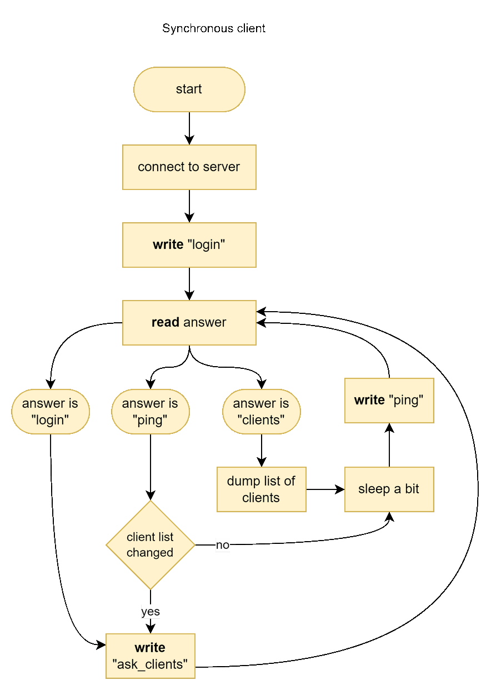
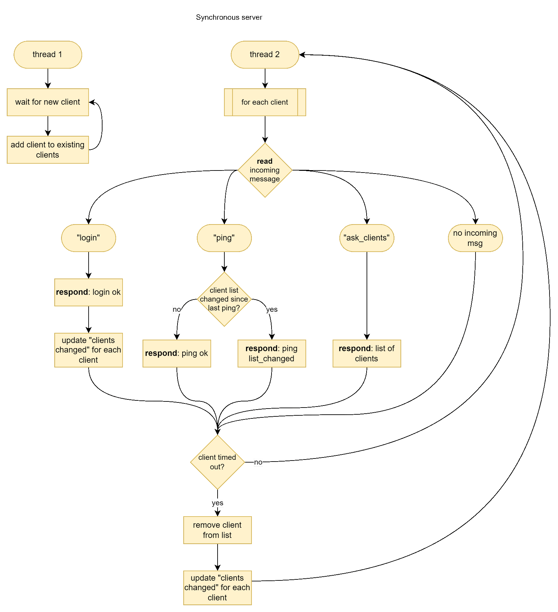
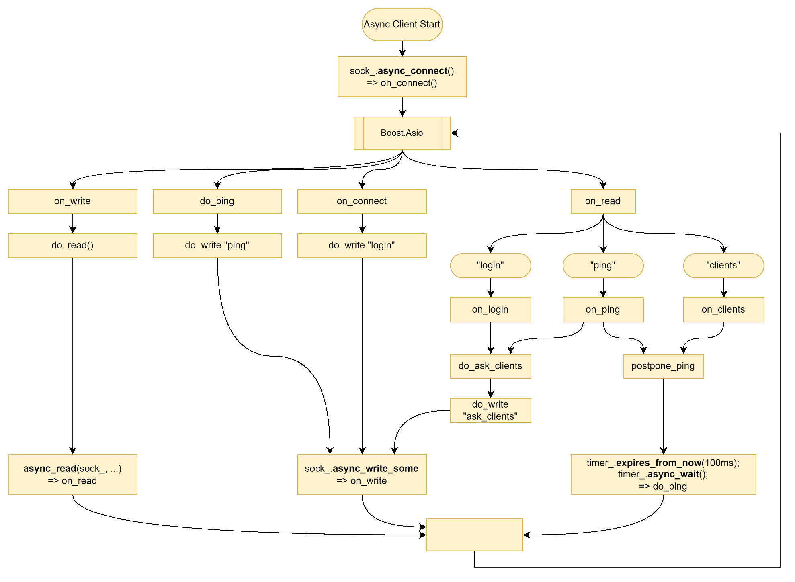
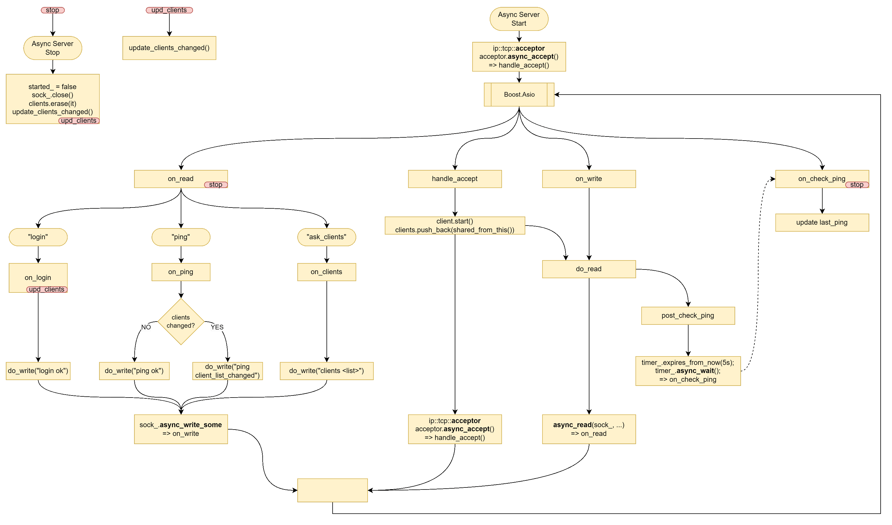

# Torjo - Boost.Asio C++ Network Programming

- [01. Getting started with Boost.Asio](#01-getting-started-with-boostasio)
- [02. Boost.Asio Fundamentals](#02-boostasio-fundamentals)
- [03. Echo Server/Clients](#03-echo-serverclients)
- [04. Client and Server](#04-client-and-server)
- [05. Synchronous Versus Asynchronous](#05-synchronous-versus-asynchronous)
- [06. Boost.Asio - Other Features](#06-boostasio---other-features)
- [07. Boost.Asio - Advanced Topics](#07-boostasio---advanced-topics)

### 01. Getting started with Boost.Asio

Boost Asio – это кроссплатформенная библиотека, предназначенная для сетевого программирования и управления операциями ввода-вывода. Она поддерживает как синхронное, так и асинхронное программирование и предоставляет API для работы с протоколами TCP и UDP. Асинхронное программирование управляется событиями и может выполняться в одном или нескольких потоках, без необходимости в дополнительных потоках для асинхронных операций. Важной концепцией является использование цепочек callback-ов, где по завершении одной асинхронной операции вызывается следующая.

Асинхронные функции возвращают error-коды, а синхронные функции могут выбрасывать исключения. Основным классом является `io_service`, который управляет выполнением операций. Этот класс может работать в нескольких режимах:
1. Один поток с одним `io_service` и одним обработчиком.
2. Множество потоков с одним `io_service` и несколькими обработчиками.
3. Множество потоков с несколькими экземплярами `io_service` для масштабируемости, что требуется при большом количестве одновременных подключений.

Работа в многопоточном режиме позволяет распределять обработку завершений операций по разным потокам, обеспечивая параллелизм и эффективность при высокой нагрузке. Чтобы поддерживать работу `io_service::run()`, необходимо добавлять новые операции в процессе выполнения, например, через callback-и предыдущих операций.

### 02. Boost.Asio Fundamentals

В главе 2 рассматриваются основные классы и функции пространства имен Boost Asio. Классы `io_service` и `streambuf` используются для работы с синхронными и асинхронными функциями, такими как `read`, `read_add`, `read_until`, и их асинхронные версии. Пространство имен `boost::asio::ip` включает классы `address`, `endpoint`, `tcp`, и `udp`. Основные функции для подключения – это `connect` и `async_connect`, где `endpoint` представляет собой комбинацию адреса и порта.

Сокеты могут быть типов `tcp`, `udp`, и `icmp` и поддерживают функции для работы с подключениями, такие как `assign`, `open`, `bind`, `connect`, `async_connect`, `close`, `shutdown`, и `cancel`. Для чтения и записи данных используются функции `async_receive`, `async_read_some`, `async_receive_from`, `async_send`, и `async_write`. Управление сокетами осуществляется с помощью функций `set_option` и `get_option`.

Для работы с сокетами необходим буфер, который хранит данные, и важно следить за временем жизни буфера при выполнении асинхронных операций. Часто используется паттерн `shared_from_this` для передачи указателя на объект в асинхронные функции. Буферы могут оборачивать указатели, строки, массивы и другие структуры данных. `async_connect` и `async_read` вызывают обработчики по завершении операций.

Функции `read_until` и `async_read_until` используются для чтения данных до тех пор, пока не выполнены определенные условия. Эти функции позволяют более гибко контролировать завершение операций чтения на основе содержимого данных.

С увеличением количества клиентов асинхронное программирование становится проще по сравнению с синхронным. Функция `io_service::run` продолжает работать до тех пор, пока есть ожидающие операции, или до вызова `io_service::stop`. Для асинхронного вызова своих функций можно использовать `io_service::post` или `io_service::dispatch`. Однако вызовы функций через `post` не обязательно будут выполняться в порядке их добавления. Чтобы сохранить порядок выполнения, можно использовать `io_service::strand`, который гарантирует последовательное выполнение асинхронных обработчиков. Для передачи объектов через цепочку коллбеков часто используется `shared_ptr`, чтобы гарантировать, что объект, например буфер, останется живым в процессе выполнения асинхронных операций.

### 03. Echo Server/Clients

В случае синхронного клиента вызов `io_service::run()` не требуется.

- [code/torjo_boost_asio/3/tcp_sync_echo_client.cpp](code/torjo_boost_asio/3/tcp_sync_echo_client.cpp)
- [code/torjo_boost_asio/3/tcp_sync_echo_server.cpp](code/torjo_boost_asio/3/tcp_sync_echo_server.cpp)

Клиентская часть в асинхронном программировании проще, чем серверная, поскольку сервер должен обрабатывать несколько клиентов одновременно. В TCP асинхронном клиенте каждая асинхронная операция запускает новую, что позволяет поддерживать работу `io_service::run()`. Для продления времени жизни объектов между цепочками вызовов используется `enable_shared_from_this` и `shared_from_this()`.

- [code/torjo_boost_asio/3/tcp_async_echo_client.cpp](code/torjo_boost_asio/3/tcp_async_echo_client.cpp)
- [code/torjo_boost_asio/3/tcp_async_echo_server.cpp](code/torjo_boost_asio/3/tcp_async_echo_server.cpp)

При работе с UDP, сервер, получив сообщение, просто выводит его на экран, не закрывая сокет.

- [code/torjo_boost_asio/3/udp_sync_echo_client.cpp](code/torjo_boost_asio/3/udp_sync_echo_client.cpp)
- [code/torjo_boost_asio/3/udp_sync_echo_server.cpp](code/torjo_boost_asio/3/udp_sync_echo_server.cpp)

### 04. Client and Server

Глава 4 посвящена созданию более сложных клиент-серверных приложений с использованием `Boost.Asio`. В этих примерах
- Клиенты подключаются к серверу с именем пользователя, но без пароля.
- Все соединения инициируются клиентами, которые запрашивают ответы у сервера.
- Запросы и ответы завершаются символом `\n`.
- Сервер разрывает соединение с клиентом, если тот не пингует сервер в течение 5 минут.

Клиенты могут выполнять следующие запросы:
- получение списка всех подключенных клиентов или пинг сервера.
- В ответ на пинг сервер отправляет либо "ping ok", либо "ping client list changed", после чего клиент повторно запрашивает список.
- Каждый клиент проверяет связь с сервером в случайные моменты времени в диапазоне от 1 до 7 секунд, что периодически приводит к разрыву соединений.

#### Synchronous Client and Server

Для синхронного клиента сетевая часть должна выполняться в отдельном потоке, так как сетевые вызовы блокируют выполнение программы.
Синхронный сервер требует двух потоков: один для прослушивания новых клиентов и другой для обработки уже подключенных.

- [code/torjo_boost_asio/4/sync_client.cpp](code/torjo_boost_asio/4/sync_client.cpp)
- [code/torjo_boost_asio/4/sync_server.cpp](code/torjo_boost_asio/4/sync_server.cpp)

#### Asynchronous Client and Server

- [code/torjo_boost_asio/4/async_client.cpp](code/torjo_boost_asio/4/async_client.cpp)
- [code/torjo_boost_asio/4/async_server.cpp](code/torjo_boost_asio/4/async_server.cpp)

### 05. Synchronous Versus Asynchronous

Глава 5 рассматривает разницу между синхронным и асинхронным подходами. Асинхронное программирование позволяет избежать блокировок, в то время как синхронное программирование предполагает линейное выполнение задач (сначала A, потом B, потом C). Синхронные клиенты бывают двух типов: `pull-like`, когда клиент инициирует запросы к серверу, и `push-like`, когда сервер отправляет события клиенту. Эти два подхода рекомендуется не смешивать, так как это может привести к проблемам.

Асинхронный ввод-вывод также может быть организован как `pull-like` или `push-like`. Асинхронный подход упрощает переход от однопоточного к многопоточному режиму, так как разные функции могут выполняться в разных потоках последовательно, что устраняет необходимость в мьютексах.

- [code/torjo_boost_asio/5/async_server_multi_threaded.cpp](code/torjo_boost_asio/5/async_server_multi_threaded.cpp)

В главе также рассматривается возможность вызова асинхронных пользовательских функций

- [code/torjo_boost_asio/5/async_op.cpp](code/torjo_boost_asio/5/async_op.cpp)

В главе также рассматривается реализация прокси-сервера, который работает между клиентом и сервером. Прокси обрабатывает два сокета (клиентский и серверный) и использует два буфера для передачи данных между ними, что добавляет сложности в реализацию. Прокси читает данные из клиентского сокета и записывает их в серверный, и наоборот.

- [code/torjo_boost_asio/5/proxy.cpp](code/torjo_boost_asio/5/proxy.cpp)

### 06. Boost.Asio - Other Features

Глава 6 описывает особенности `Boost Asio`. В `Boost Asio` существуют два типа буферов для работы с вводом-выводом. Один из них — `boost::asio::streambuf`, который может использоваться в качестве входных данных для `std::iostream`, позволяя реализовывать операции чтения и записи через перегрузку `операторов сдвига`.

Также в `Boost Asio` существуют функции, оканчивающиеся на "until", такие как `read_until`. Эти функции поддерживают не только обычные строки и символы, но также `регулярные выражения` и `предикаты` для гибкости обработки данных.

`Boost Asio` поддерживает использование сопрограмм (`coroutines`), которые позволяют приостанавливать и возобновлять выполнение в определенных точках функции. Это упрощает создание классов с интерфейсом `step`, где в бесконечном цикле можно выполнять операции, такие как `async_write`, `async_read`, и другие, упрощая архитектуру приложения.

- [code/torjo_boost_asio/6/coroutines.cpp](code/torjo_boost_asio/6/coroutines.cpp)

### 07. Boost.Asio - Advanced Topics

Глава 7 рассматривает дополнительные темы, связанные с Boost Asio. Существует две версии Asio: `независимый Asio` и `Boost Asio`. Эти версии не рекомендуется смешивать. Для отладки асинхронного кода в Boost Asio существует специальный макрос `BOOST_ASIO_ENABLE_HANDLER_TRACKING`, который позволяет отслеживать регистрацию и выполнение коллбеков в удобном формате.

`Boost Asio` также поддерживает `SSL`, однако для этого требуется сборка `OpenSSL`.

- [code/torjo_boost_asio/7/ssl_client_connect_to_yahoo.cpp](code/torjo_boost_asio/7/ssl_client_connect_to_yahoo.cpp)
