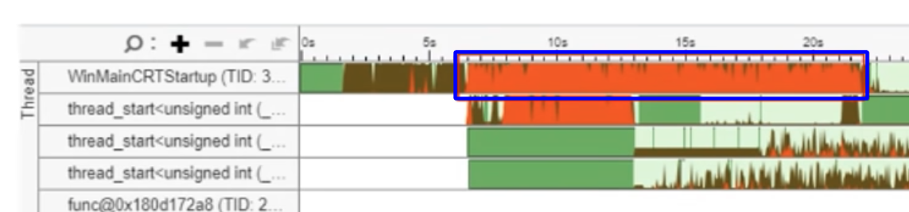

- [Memory Leak Detection:](#memory-leak-detection)
  - [valgrind - memory leak detection](#valgrind---memory-leak-detection)
- [David Faure and Timo Buske - KDAB - Profiling and Debugging Tools](#david-faure-and-timo-buske---kdab---profiling-and-debugging-tools)
  - [Overview of Debugging Tools for C/C++ applications](#overview-of-debugging-tools-for-cc-applications)
  - [Overview of Profiling Tools for C/C++ applications](#overview-of-profiling-tools-for-cc-applications)
  - [Overview of Graphics Optimization Tools for OpenGL applications](#overview-of-graphics-optimization-tools-for-opengl-applications)
  - [KDAB training course: Debugging and Profiling C/C++ applications on Linux](#kdab-training-course-debugging-and-profiling-cc-applications-on-linux)
- [Mathieu Ropert - The Basics of Profiling, CppCon 2021](#mathieu-ropert---the-basics-of-profiling-cppcon-2021)
  - [About this talk](#about-this-talk)
  - [1. Profiling](#1-profiling)
  - [\> Sampling Profiling (Профилирование методом выборки)](#-sampling-profiling-профилирование-методом-выборки)
  - [\> Instrumentation profiling (подход с добавлением хуков в код)](#-instrumentation-profiling-подход-с-добавлением-хуков-в-код)
  - [2. Profiling in Practice](#2-profiling-in-practice)
  - [\> Questions and Answers: `valgrind`, `Optick`, `perf`, `compilation time profiling`, `VTune`](#-questions-and-answers-valgrind-optick-perf-compilation-time-profiling-vtune)
  - [\> Live Demo of Optick](#-live-demo-of-optick)
  - [3. Profiling analysis](#3-profiling-analysis)
  - [\> Example of VTune output](#-example-of-vtune-output)
  - [\> Inefficient Data Structures](#-inefficient-data-structures)
  - [In conclusion](#in-conclusion)
- [Mathieu Ropert - Making Games Start Fast: A Story About Concurrency, CppCon - 2020](#mathieu-ropert---making-games-start-fast-a-story-about-concurrency-cppcon---2020)
  - [About this talk](#about-this-talk-1)
  - [1. Show case](#1-show-case)
  - [\> VTune: Light green color - thread waiting on the mutex](#-vtune-light-green-color---thread-waiting-on-the-mutex)
  - [\> VTune: Dark red color - thread is in spinlock](#-vtune-dark-red-color---thread-is-in-spinlock)
  - [\> Почему появляются спинлоки в коде](#-почему-появляются-спинлоки-в-коде)
  - [\> Когда стоит использовать спин-локи](#-когда-стоит-использовать-спин-локи)
  - [2. Locks](#2-locks)
  - [\> Различия между CAS, Lock-Free и Спин-локами:](#-различия-между-cas-lock-free-и-спин-локами)
  - [3. Threading Computations](#3-threading-computations)
  - [\> Redesigning for multithreading](#-redesigning-for-multithreading)
  - [\> Bottleneck mitigation example with splitting](#-bottleneck-mitigation-example-with-splitting)
  - [4. Going Asynchronous](#4-going-asynchronous)
  - [In conclusion](#in-conclusion-1)
- [Sergey Tyulenev - Profiling on practice](#sergey-tyulenev---profiling-on-practice)
  - [Мануалы по тулам для профилирования: `perf`, `VTune`, `Optick`](#мануалы-по-тулам-для-профилирования-perf-vtune-optick)

## Memory Leak Detection:

### valgrind - memory leak detection

- https://www.youtube.com/watch?v=A5Rc4AwdaOA

```bash
# -g: include debugging information
# -Og: optimization level
# -std=gnu99: use C99 standard
gcc -g -Og -std=gnu99 memory_leak.c -o memory_leak
./memory_leak # no any error
valgrind ./memory_leak #                                                    <=== memory leak detected
valgrind --leak-check=full ./memory_leak # more detailed information
# example of leak detection
# ==12345== 1 bytes in 1 blocks are definitely lost in loss record 1 of 1
# ==12345==    at 0x4C2E0F3: malloc (vg_replace_malloc.c:299)
# ==12345==    by 0x4005A1: main (memory_leak.c:5)                          <=== line number
```

## David Faure and Timo Buske - KDAB - Profiling and Debugging Tools

- https://www.youtube.com/watch?v=2cAHLFM6IU0&list=PL6CJYn40gN6hLwcJ2cgLNtsbr6zUMZSEJ

### Overview of Debugging Tools for C/C++ applications

- https://www.kdab.com/c-cpp-debugging-tools/

- **Automated testing**: `TDD`(write test first, then write code), `QTestLib`, `GTest`, `Catch` + Integration to CI/CD.
- **Code coverage**: `gcov` for GCC/Clang, `Visual Studio` or `OpenCppCoverage`[TODO] for MSVC, `Squish Coco`, `BullseyeCoverage`.
- **Static code analysis**: All warnings enabled, PVS-Studio, Coverity, Use different compilers.
- **Logging**: `printf`, `cout`, `qDebug`, categorized logging: `log4cxx`... Allowed to on/off logging categories.
- **Assertions**:
  - Runtime assertions (`assert`): stop the application and allowed to debug.
  - Compile-time assertions: `static_assert`.
- **Tracing**:
  - Investigate linking libraries: `ldd` (Linux), `depends.exe` (Windows), `otool` (macOS).
  - Trace system calls: `strace` (Linux), `procmon` or `apimonitor` (Windows), `dtruss` (macOS).
- **Debuggers**:
  - Linux: `gdb`, `RR` (recording. Allow forwards and backwards debugging).
  - Windows: `Visual Studio Debugger`, `WinDbg`.
  - macOS: `lldb`.
- **Gammaray**: Introspect Qt applications. Inspect and manipulate Qt applications at runtime.
- **valgrind**: Support Linux and Mac. Check memory leaks, invalid memory access. Other tools:
  - memcheck: find memory leaks and detect related errors.
  - helgrind: find race conditions and lock order violations (prefer Sanitizers).
  - massif: profile stack and heap memory usage (prefer Heaptrack).
  - callgrind: profile CPU usage, detect cache misses and count instructions, funcion calls (in general, prefer Hotspot).
- **Sanitizers**: Linux: GCC4.9+, Clang 3.1+. Windows: Clang 6+, MSVC-2019-16.4+. Ask compiler to inject code to check for errors:
  - `address`: memory error detector.
  - `thread`: detect data races.
  - `undefined`: check code for undefined behavior.

### Overview of Profiling Tools for C/C++ applications

#### Steps

- **1. Assessment**: `Which` aspects of performance are most important for my project?
- **2. Tool Selection**: `How` to measure, which one tool to use?
- **3. Benchmarking**: Creating a reliable, repeatable infrustracture for running benchmarks. Measuaring the performance of specific task.
- **4. Profiling**: Identifying hotspots and performance issues.
- **5. Updates**: Suggesting code changes and assessing their ourcome. Go back to step 4.

#### Tool selection (for steps 2 - 5):

- **Performance and CPU measurments**
  - **Intel VTune**:
    - Very powerful, good UI, Linux and Windows.
    - Free as part of Intel System Studio.
    - Requires Intel hardware.
  - **Perf**
    - Very powerful, part of Linux kernel.
    - Works on x86, ARM, PPC and SH processors.
    - No GUI, hard to use.
  - **Hotspot**
    - Free, Open-source GUI for perf, written by KDAB.
    - Eeasy to use, supports the most common use cases: CPU cyclesm, off-CPU time.
    - Example of the kind of issues Hotspot can find and to download it: https://www.kdab.com/hotspot-to-fix-string-copy/
    - Demo of Hotspot: https://www.kdab.com/hotspot-video/

- **Measure Memory allocations**: when application use too much memory.
  - **valgrind massif**: slow.
  - **Heaptrack**:
    - Heap memory profiler for Linux.
      - Count allocations and find temporary memory allocations.
      - Aggregates requests memory sizes.
      - Backtraces for every allocation.
    - Less overhead than valgrind's `massif`.
    - Supports runtime attach/detach.
    - Better GUI then `massif-visualizer`.
      - Can diff two executions.

### Overview of Graphics Optimization Tools for OpenGL applications

- How it works
  - Record trace.
  - Open trace in 3D profiling tool.

- Common profiling tools:
  - **RenderDoc** - Open-source, cross-platform, supports OpenGL, Vulkan, D3D11, D3D12.
  - **apitrace** - record and replay OpenGL calls.
  - **Visual Studio Graphics Debugger / DXCap** - inspect DirectX calls.
  - **XCode GPU tools**
  - **GAPID**
  - **WebGL Inspector**
  - **Qt3D Profiler**

- Vendor tools
  - Intel: `Graphics Performance Analyzers Framework` / `VTune` - profiling multiframe streams and inspect CPU/GPU usage.
  - NVidia: `Nsight` - tool for OpenGL, Vulkan, D3D11, D3D12. Usefull for CUDA.
  - AMD: `GPU PerfStudio`, `CodeXL` .
  - ARM: `Mali Graphics Debugger`.

### KDAB training course: Debugging and Profiling C/C++ applications on Linux

- https://training.kdab.com/portfolio/debugging-and-profiling-cpp-applications-on-linux/

- Debugging C++ Applications
  - Debug Symbols, Compiler Optimizations
  - Testing
  - Code Coverage
  - Tracing
  - Debugger
  - RenderDoc
  - Valgrind
  - Sanitizers
  - Assertions
  - Static Code Analysis
  - Crash Reporting

- Profiling C++ Applications
  - Introduction
  - Profiling Setup for C++ Applications
  - Manual Timing
  - Linux Perf
  - VTune
  - Valgrind Profiling Tools
  - Heaptrack
  - LTTng
  - OpenGL
  - Conclusion

- Appendix
  - Tracing
  - Instrumentation
  - Sampling
  - Performance Counters
  - Backtraces
  - Other Notes

## Mathieu Ropert - The Basics of Profiling, CppCon 2021

- https://www.youtube.com/watch?v=dToaepIXW4s
- Here's how I found what was slow

### About this talk

- Profiling
- Tools for profiling (profiling in practice)
- Building an intuition

### 1. Profiling

- The real problem is that programmers have spent far too much time worrying about efficiency in the wrong places and at the wrong times;
- premature optimization is the root of all evil (Donald Knuth).

#### Why profiling

- Figuring why a program is slow is hard.
- Reading the code can easily mislead you.
- Modern CPUs are complex and unpredictable.
- Measure, measure, measure! Don't guess.

#### Tools for profiling

- Tools to help programmers measure and reason about the performance.
- Profiler helps with measuring but may have observable impact on the program.


#### Profiling vs Optimizations

- Profilers are one of the tools that can be used during an optimization iteraion cycle.
- Better used to investigate where to optimize.
- Can be used to measure if an optimiation was effective, within limits.

#### Profile usage

- Indentify hotspots and bottlenecks.
- Visualize execution timeline.
- Collect and compute metrics.

### > Sampling Profiling (Профилирование методом выборки)

- Attach to program, periodically interrupt and record the stack trace.
- Sampling frequency is customizable.
- Results are `statistical averages`.
- => where is program spending most of its time?
- Example tool: `VTune`.
- Only needs to be able to read stack trace.
- Symbol table is needed. Minimal debug info is enough.
- Not need to recompile the program.
- Works out of the box on any executable.
- Inline funcions are usually invisible.

### > Instrumentation profiling (подход с добавлением хуков в код)

- Add code hooks to explicitly record metrics.
- Can provide both: `averages` and `exact breakdown` by execution frame.
- Not affected by inlining or statistical anomalies.
- Example tool: `Optick`. https://github.com/bombomby/optick
- Requires programmers to add collection macros in tactical places in the code.
- Support adding extra business metadata. You may `match the business data with the code`.
- Can fallback on sampling: You may switch between sampling and instrumentation.
- Build implications. You have to link with 3rd party profiler library.

### 2. Profiling in Practice

#### Setting up goals

- Set up a reproducible scenario.
- Measure its performance.
- Define an objective (target) - ones I reached it, I'm good.

#### Using the right tool

- Instumentation (+some sampling) is recommended way to go.
- Sampling alone is cheaper to start with.
- Consider adding instrumentation as an investment.

### > Questions and Answers: `valgrind`, `Optick`, `perf`, `compilation time profiling`, `VTune`

(Author is more focusing on Windows infra and tools then Linux)
- `valgrind` is a profiler?
  - No, it's a memory checker.
  - `Callgrind` is closer to a profiler.
- If you unaware of `Optick` how did you do `instrumentation(frame) profiling` in `VTune`?
  - With great difficulty.
  - VTune supports to annotate frame, but it is slow and very heavy. Visulalization is not very good.
  - I convert the data between VTune and Optick.
- `perf` is a sampling profiler?
  - Yes, it is. But I am not sure.
- Any recomentations to profile `compilation time`?
  - Most compilers have a flag to profile compilation time.

### > Live Demo of Optick

- https://youtu.be/dToaepIXW4s?t=1855

#### Finding the needle

- first time look at profile, you may be overwhelmed.
- Look at what sticks out.
- Domain knowlage is key.

#### Know the program

- A profiler can tell `what takes the most time`.
- It can explain why: using a lot of CPU cycles, cache misses or ...
- It can't tell if it should.

#### Hunting disprecencies (Поиск несоотвествий)

- Performance regressions become easy to spot once the normal profile outline is known.
- `What takes time` vs `what should take time`.
- Practice example: https://youtu.be/dToaepIXW4s?t=2368

#### Best work is no work

- Most efficient code does nothing.
- Profiling can highlight useless computation.
- No need to dive deep into metrics.

#### Profiling for the first time

- Access the big picture.
- Understanding the domain is key to fidure our where to start digging.
- Get quick wins out of the way before deling deeper.

### 3. Profiling analysis

#### Profiling Metrix

- CPU Time
- Wait Time
- (System Time)

#### High CPU Time

- Inefficient algorithm or data structure.
- Spin locks.
- Single-threaded code.
- Branch misprediction, cache misses.

#### High Wait Time

- Disk I/O.
- Network calls.
- Locks.
- Syncronization primitives.

### > Example of VTune output


В программе Intel VTune выделенные в рамку понятия относятся к различным временным показателям, которые помогают анализировать производительность приложения:

1. **Elapsed Time** (Общее время выполнения) — это общее время, которое прошло с начала выполнения программы до её завершения. Оно включает в себя все компоненты, такие как время работы процессора и время простоя.

2. **CPU Time** (Время процессора) — это время, в течение которого программа активно использовала процессор для выполнения задач. Здесь показано, сколько процентов от общего времени выполнения программы было потрачено на обработку данных процессором.

3. **Effective Time** (Эффективное время) — это время, когда процессор был реально занят выполнением полезных вычислений, в отличие от времени, которое могло быть потрачено впустую из-за блокировок или ожидания ресурсов.

4. **Spin Time** (Время ожидания) — это время, в течение которого потоки программы находятся в цикле ожидания (спинлоке), ожидая освобождения ресурса, не выполняя при этом никакой полезной работы.

5. **Overhead Time** (Накладные расходы) — это время, потраченное на дополнительные операции, не связанные с полезной работой программы, например, управление потоками или контекстные переключения.

#### Filtering Metrics

- Sampling views usually aggregate call stacks actoss threads.
- Consider filtering on main bottlenecks thread.
- 2D control flow view from instrumented prifilers helps a lot.

#### Inefficient Algorithms

- Time spent in loops and recursive calls.
- Check the Big O complexity.
- Can som computations be cached and reused?

### > Inefficient Data Structures

- Example: https://youtu.be/dToaepIXW4s?t=3097
- Time spent in `find`, `insert` or `operator[]`.
- Easier to spot without inlining. Легче заметить проблемы с производительностью, если не используются оптимизации компилятора, такие как инлайнинг.
- Know your data structures strengths and weaknesses. Необходимо хорошо понимать сильные и слабые стороны используемых структур данных. Например, одни структуры данных лучше подходят для быстрых вставок, другие — для быстрого поиска.

#### Spin Locks

- High spin time in profiler or equivalent tagget functions in instrumented profiler.
- Look at the bigger picture and threading model.
- Check out talks about concurrency.

#### Single-threaded Code

- Low core usage in timeline.
- Consider parallelizing.
- ... or a task scheduler.

#### Micro-arhitecture Usage

- High CPI (Cycles per Instruction) rate.
- More and more important on modern CPUs.
- Micro-optimization on large applications is tricky.
- Keep it for last. Don't start with it.

#### Blocking I/O

- High wait/system time in filesystem or network API.
- Can it be put in an async task instead?
- See CppCon talk: Making Games Start Fast - A Story About Concurrency.
- https://www.youtube.com/watch?v=TcuPIVKNSN0

#### Wait on Mutex or Semaphore

- High wait time or synchronization functions.
- Remember: "It should'n be called a mutex, it should be called a bottleneck".
- Consider changing concurrency model. Lock-Free?

#### Profiling Analysis (На что стоит обратить внимание в первую очередь)

- Profiling will show what stick out.
- Some filtering needs to be done by the deverloper to focus on the right part.
- Deal with inefficiencies algorithms, data structures and locks first.

### In conclusion

- Profilers help pinpointing performance bottlenecks.
- Domain knowledge can speed up the analisys by a lot.
- Add instrumentation support to your program.

## Mathieu Ropert - Making Games Start Fast: A Story About Concurrency, CppCon - 2020

### About this talk

- Threads.
- Locks.
- ... and how to avoid them.
- Investigating threading efficiency.

### 1. Show case

#### Some metrics

- He show the demo with boosting the game start time in 2 times.
- Same amount of work.
- Both rely on multithreading.
- Both on the same hardware.

### > VTune: Light green color - thread waiting on the mutex


### > VTune: Dark red color - thread is in spinlock



#### Startup Breakdown

- Enumerate asset files.
- Read localisation.
- Loading textures, models and audio.
- Load game rules and databases.

#### High CPU time

- Single-threaded code.
- (Inefficient algorithms.)
- (Branch misprediction, cache misses.)
- Spin locks.

### > Почему появляются спинлоки в коде

Спин-локи (spinlocks) — это механизм синхронизации, используемый для блокировки потоков в многопоточной программе. Они называются так потому, что поток, который пытается захватить спин-лок, "крутится" (spins) в цикле ожидания, пока ресурс не будет освобождён. При этом он постоянно проверяет, свободен ли ресурс, и не уходит в режим ожидания (например, не делает контекстный переключатель на другой поток).

1. **Низкие накладные расходы на блокировку**: В отличие от классических мьютексов, которые могут привести к контекстным переключениям и связанным с ними затратам, спин-локи избегают этого. Если `предполагается, что блокировка будет краткосрочной`, спин-лок может быть более эффективным, так как поток просто ожидает, не уступая управление.

2. **Эффективность на многопроцессорных системах**: В системах с большим количеством ядер или процессоров поток может ожидать освобождения ресурса без прерывания или перемещения на другой процессор. В таких случаях спин-локи могут быть быстрее, чем обычные механизмы блокировки, если ресурс скоро освободится.

3. **Простота реализации**: Спин-локи относительно просты в реализации по сравнению с мьютексами и другими блокировками, так как не требуют сложной логики для переключения контекста или взаимодействия с ядром операционной системы.

### > Когда стоит использовать спин-локи

1. **Краткосрочная блокировка**: Спин-локи подходят для ситуаций, когда предполагается, что ресурс будет заблокирован на очень короткое время. Если блокировка может занять больше времени, лучше использовать мьютексы или другие механизмы.

2. **Операции на низком уровне**: Спин-локи часто используются в низкоуровневых компонентах ОС или в драйверах, где критично минимизировать время, затрачиваемое на блокировки, и накладные расходы на переключение контекста могут быть недопустимы.

#### High Wait Time

- (Disk I/O.)
- Network calls.
- Locks.
- Syncronization primitives.

### 2. Locks

### > Различия между CAS, Lock-Free и Спин-локами:

1. **CAS** — это атомарная операция, которая проверяет и изменяет значение переменной. Она может использоваться для реализации безблокировочных алгоритмов, но сама по себе не является блокировкой.

2. **Lock-Free алгоритмы** основаны на атомарных операциях (таких как CAS) и `гарантируют прогресс хотя бы одного потока`. В отличие от спин-локов, Lock-Free алгоритмы не блокируют потоки полностью, но могут использовать циклы с повторяющимися попытками выполнить операцию.

3. **Спин-локи** заставляют поток ждать в цикле активного опроса до тех пор, пока ресурс не станет доступен, что может тратить процессорное время впустую. Спин-локи могут быть полезны в случаях, когда ожидается очень краткосрочная блокировка ресурса.

Lock-free означает, что `потоки не будут полностью остановлены`, как это происходит с мьютексами, и всегда гарантируется, что хотя бы один поток продвигается. Остальные потоки могут многократно повторять операции, но они `не находятся в состоянии ожидания` (блокировки).

#### Wait Times

- Filesystem access mutex costs 20 times the actual disk I/O time.
  - блокировка (mutex) при доступе к файловой системе значительно замедляет процесс по сравнению с реальной скоростью ввода-вывода (I/O) на диске. По сути, каждый раз, когда потоки пытаются синхронизировать доступ к файловой системе через mutex, задержка из-за ожидания блокировки оказывается в 20 раз больше, чем время, затраченное на саму операцию чтения или записи с диска.
- Would potentially be faster single-threaded.
- Why is it there in the first place?
  - Потому что нам нужен безопасный доступ к файловой системе.

#### What's a `PhysFS`?

- Open-source multiplatorm VFS library.
- Mount folders, drivers and archives.
- Intented for use in video games.
- Written in C.

```cpp
PHYSFS_mount("/assets", "C:\\game\\assets", 1);
PHYSFS_mount("/assets", "C:\\game\\dlcs\\dlc001.zip", 1);   // Overwrites the previous mount
PHYSFS_mount("/assets", "C:\\user\\mod\\modXY.zip", 1);     // Overwrites the previous mount
```

#### PhysFS Threading Model

- Designed in the early 2000s.
- Mostly concerned about thread safety.
- One global mutex to protect all state.
- Scales really badly if multiple threads do I/O.

#### PhysFS State

- Mount points/ library settings.
- Open files list.
- Per-thread last error code.
- Per-archive state.

#### Improving PhysFS locking

- Split the global mutex into multiple mutexes.
- Remove error code mutex entirely and use thread-local storage.
- Introduce toggle to disable configuration mutex at user request.

#### Thoughts about locks

- Locks may make code thread-safe but they also make it thread inefficient.
- Keeping a computation lock-free may require refactoring to use another approach.
- Adding a lock might look fine in profiler because another bottleneck exists upstream.

### 3. Threading Computations

#### Loading graphic assets

- Loading of both 2D and 3D assets was single-threaded.
- Huge speedup potential if we could spread it on all cores.
- Direct3D 9 does not default to thread safe.

### > Redesigning for multithreading

- Switching to DX11 allows for multithreading texture and model loaded.
- Loading algorithms needed to be rewritten.
- 2D and 3D assets loading needed a different approach.

before:

```cpp
for (const auto& Entry : _Pdx3DTypes)
{
    Entry._Value->InitForDevice(*this);
}
```

after:

```cpp
auto LoadFn = [&](auto pType)
{
    pType->InitForDevice(*this);
};

PdxParallelFor(_Pdx3DTypes, LoadFn);
```

#### Easy parallel computing

- Moving from serial to parallel doens't have to be hard.
- Some loops already fulfills all requirements to be replaced by a parallel_for loop.
  - Iterations do not write to any shared state.
  - Order of iterations isn't important.
  - No locks are being used.

#### Sometime you have to use locks then REFACTORING shared state

- Make copies of shared state.
- Split problematic iterations in 2 loops (`split/combine` or `map/reduce`).
  - Parallel apply using a private working set.
  - Serial loop to combine results.
- Lock "smart".

### > Bottleneck mitigation example with splitting

```cpp
int CTextureHandler::AddTexture(const string& Filename)
{
    scoped_lock Lock(_Mutex);                   // <=== Bottleneck
    int Idx = _Textures.Find(Filename);
    return Idx != -1 ? Idx : _Textures.Add(Load(Filename));
}
```

- Removing Bottleneck - Split sprite initialization in three phases:
  - Each sprite declares which textures it needs.
  - Load all requested textures.
  - Bind loaded textures to sprites.

```cpp
{
    scoped_lock Lock(_Mutex);
    int Idx = _Textures.Find(Filename);
    if (Idx != -1) return Idx;
}

auto Texture = Load(Filename); // Теперь загрузка происходит вне блокировки

{
    scoped_lock Lock(_Mutex);
    int Idx = _Textures.Find(Filename);
    retun Idx != -1
        ? Idx   // И если другой поток уже загрузил текстуру, то мы просто дропаем текущую
        : _Textures.Add(move(Texture)); // Это случается редко.
}
```

### 4. Going Asynchronous

- On the screenshot we are in spinlock with network call.


#### Suprise gains

- 5s were spent waiting on the network call.
- Initiallt put inside a future.
- ... until refactoting demonstrated that the results were never used.

#### Working Smart

- Data has to be loaded, but does it have to loaded now?
- Our goal is to display the main menu as fast as possible.
- We can continue loading in the background.

#### Loading Audio

- Most of the audio load CPU time was spent reading music tracks from zips.
- Can we optimize unzip() futher?
- PhysFS still has a lock per archive, so multithreading might be tricky.
- **How many music tracks do we need to display loading screen and main menu?**
  - One!
  - Others will not be needed until the player starts a new game or loads a save.
- **Solution**:
  - Load only main theme immediately.
  - Start a background thread to load the rest.
  - Wait on it when we are about to drop in game.
  - Could potentially be applied to other assets.

### In conclusion

- Locks solve thread safety at the cost of thread efficiency.
- If your algorithm requires locking to parallelize, consider another approach.
- Do not underestimate the potential gain of revisiting older code with threading in mind.

## Sergey Tyulenev - Profiling on practice

- `Sampling Profiling` - это процесс замера времени выполнения функций путем периодический записи стектрейсов с определенной частотой.
  - Тулы: `perf`, `VTune`.
- `Instrumentation profiling` - это процесс замера времени выполнения функций путем добавления хуков в код.
  - Записывает стектрейсы в момент, когда вызов доходит до хука.
  - Анализ получается более короткий и мепится на безнес домен.
  - Требует изменения кода и перекомпиляции программы.
  - Записывает точную информацию, в отличие от `sampling profiling`, который читает стек с какой-то частотой.
  - Тулы: `Optick`.

### Мануалы по тулам для профилирования: `perf`, `VTune`, `Optick`

- `perf` - profiling tool for Linux. Use `sampling profiling`.
  - https://dev.to/etcwilde/perf---perfect-profiling-of-cc-on-linux-of
  - Demo of Hotspot: https://www.kdab.com/hotspot-video/
- `VTune` - profiling tool for Intel hardware. Use `sampling profiling`.
- `Optick` - profiling tool for C++. Use `instrumentation profiling`.
  - https://www.youtube.com/watch?v=p57TV5342fo
