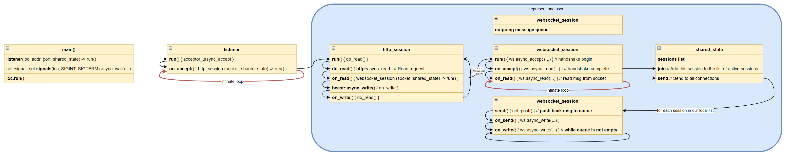

# Vinnie Falco - Get rich quick! Using Boost.Beast WebSockets and Networking TS, CppCon - 2018.pdf

- https://www.youtube.com/watch?v=7FQwAjELMek

## Theory

### Basics

```cpp
// Required for ALL I/O activities
net::io_context ioc;
// Declare a TCP/IP socket
net::ip::tcp::socket sock(ioc);
...
// Write some data
auto bytes_transferred = net::write(sock, b);
```

### Buffers

```cpp
string s = "Hello, world!";
net::write(sock, net::const_buffer(s.data(), s.size()));
// Better
net::write(sock, net::buffer(s));
```

### DynamicBuffer

```cpp
X a;

// Resize the write area and read into it
auto bytes_transferred = sock.read_some(a.prepare(128));

// Move bytes from the write area to the read area
a.commit(bytes_transferred);

// Process data in the read area
auto bytes_used = process(a.data()); // returns 40

// Remove bytes from the read area
a.consume(bytes_used);
```

### Class DynamicBuffer

```cpp
class DynamicBuffer
{
public:
using const_buffers_type = ...;     // The type representing the read area
using mutable_buffers_type = ...;   // The type representing the write area

size_t size() const;        // Returns the size of the read area
size_t max_size() const;    // Returns maximum sum of read and write area sizes
size_t capacity() const;    // Returns maximum sum of sizes without reallocating

// Returns the read area as a ConstBufferSequence
const_buffers_type data() const;

// Resize the write area and return it as a MutableBufferSequence
mutable_buffers_type prepare(size_t size);

// Move bytes from beginning of write area to end of read area
void commit(size_t size);

// Remove bytes from beginning of read area
void consume(size_t size);
};
```

### Asynchronous I/O

```cpp
// Perform a blocking read
auto bytes_transferred = sock.read_some(b);

// Start a non-blocking read. This call returns immediately
sock.async_read_some(buffers, handler);

// Example handler
sock.async_read_some(buffers,
    [&](error_code ec, size_t bytes_transferred)
    {
        // Called later when the read is complete
    });
```

### Examples of handlers

```cpp
// Lambda expression
[](error_code, size_t){}

// User-defined function object
struct my_handler
{
    void operator()(error_code, size_t);
};

// A call wrapper
bind(&connection::on_read, this, _1, _2); // gasp!
```

### Thread garantees for handlers

Completion handlers will only be called from threads that are currently calling `io_context::run()`.

### io_context::run

```cpp
// I/O context uses the current thread
ioc.run();

// I/O context uses a newly created thread
thread([&ioc]{ ioc.run(); }).detach();

// I/O context uses a group of N threads
assert(N > 0);
vector<thread> v;
v.reserve(N - 1);

while(N--)
    v.emplace_back([&ioc]{ ioc.run(); });

ioc.run(); // ...including the current thread!  <===
```

## Practice - chat server



### Main components

```cpp
// Creates and runs the server
int main(int argc, char* argv[]);

// Holds the server data
class shared_state;

// Accepts incoming connections
class listener;

// Handles HTTP requests on a connection
class http_session;

// Maintains an active WebSocket session
class websocket_session;
```

### Main method

```cpp
int main(int argc, char* argv[])
{
    auto address = net::ip::make_address(argv[1]);
    auto port = static_cast<unsigned short>(std::atoi(argv[2]));
    auto doc_root = argv[3];

    // ...

    // The io_context is required for all I/O
    net::io_context ioc;

    // Create and launch a listening port
    std::make_shared<listener>(
            ioc,
            tcp::endpoint{address, port},
            std::make_shared<shared_state>(doc_root)
        )->run();

    // Main thread will be blocked. Run the I/O service on the main thread
    ioc.run();

    return EXIT_SUCCESS;
}
```

### Process signals (SIGINT, SIGTERM) asynchronously

```cpp

// Capture SIGINT and SIGTERM to perform a clean shutdown
net::signal_set signals(ioc, SIGINT, SIGTERM);
signals.async_wait(
    [&ioc](boost::system::error_code const&, int)
    {
        // Stop the io_context. This will cause run()
        // to return immediately, eventually destroying the
        // io_context and any remaining handlers in it.
        ioc.stop();
    });
```

### On Accept - create http_session

```cpp
void listener::on_accept(error_code ec)
{
    if(ec)
        fail(ec, "accept");
    else
        // Launch a new session for this connection
        std::make_shared<http_session>(std::move(socket_), state_)->run();  // <===

    // Accept another connection
    acceptor_.async_accept(
        socket_,
        [self = shared_from_this()](error_code ec)
        {
            self->on_accept(ec);
        });
}
```

### http_session used to ask for a WebSocket session

```cpp
class http_session
    : public std::enable_shared_from_this<http_session>

void http_session::run()
{
    // Read a request
    http::async_read(socket_, buffer_, req_,
        [self = shared_from_this()]
        (error_code ec, std::size_t bytes)
        {
            self->on_read(ec, bytes);
        });
}

void http_session::on_read(error_code ec, std::size_t)
{
    // This means they closed the connection
    if(ec == http::error::end_of_stream)
    {
        socket_.shutdown(tcp::socket::shutdown_send, ec);
        return;                                         // <=== Destroy the session
    }

    if(ec)
        return fail(ec, "read");

    // Handle WebSocket Upgrade
    if(websocket::is_upgrade(req_))
    {
        // Create a WebSocket session by transferring the socket
        std::make_shared<websocket_session>(
            std::move(socket_), state_)->run(std::move(req_));
        return;
    }

    // If not a WebSocket Upgrade, handle an HTTP request
    handle_request(state_->doc_root(), std::move(req_),
        [this](auto&& response)
        {
            using response_type = typename
            std::decay<decltype(response)>::type;
            auto sp = std::make_shared<response_type>(std::move(response));

            http::async_write(this->socket_, *sp,
                [self = shared_from_this(), sp]
                (error_code ec, std::size_t bytes)
                {
                    self->on_write(ec, bytes, sp->need_eof());
                });
        });
}

void http_session::on_write(error_code ec, std::size_t, bool close)
{
    if(ec)
        return fail(ec, "write");

    if(close)
    {
        // This means we should close the connection,
        socket_.shutdown(tcp::socket::shutdown_send, ec);
        return;
    }

    // Clear contents of the request message,
    // otherwise the read behavior is undefined.
    req_ = {};

    // Read another request
    http::async_read(socket_, buffer_, req_,
        [self = shared_from_this()]
        (error_code ec, std::size_t bytes)
        {
            self->on_read(ec, bytes);
        });
}
```
