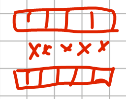

# CppCon and other conferences - good talks

- [Ben Deane - Deducing this Patterns, CppCon - 2021](#ben-deane---deducing-this-patterns-cppcon---2021)
- [Jonathan Boccara - 105 STL Algorithms in Less Than an Hour, ACCU - 2018](#jonathan-boccara---105-stl-algorithms-in-less-than-an-hour-accu---2018)
  - [HEAP(min/max) - Пирамиды](#heapminmax---пирамиды)
  - [SORT](#sort)
  - [PARTITION](#partition)
  - [PERMUTATION](#permutation)
  - [COMBINE PARTS](#combine-parts)
  - [NUMERICAL](#numerical)
  - [QUERING](#quering)
  - [SEARCHING WHEN NOT SORTED](#searching-when-not-sorted)
  - [SEARCH WHEN SORTED](#search-when-sorted)
  - [SEARCHING IN RANGE](#searching-in-range)
  - [SEARTHIN A RELATIVE VALUE](#searthin-a-relative-value)
  - [ALGOS ON SETS](#algos-on-sets)
  - [MOVERS](#movers)
  - [VALUE MODIFIERS](#value-modifiers)
  - [STRUCTURE CHANGERS](#structure-changers)
  - [TRANSFORMERS](#transformers)
  - [RAW MEMORY](#raw-memory)
  - [\*\_n ALGORITHMS](#_n-algorithms)
  - [Что дальше?](#что-дальше)

## Ben Deane - Deducing this Patterns, CppCon - 2021

- https://www.youtube.com/watch?v=jXf--bazhJw

В примере ниже показано, что CRTP техника может быть заменена на deducing this pattern.

```cpp
struct NumericalFunctions {
    template <typename Self>
    void scale(this Self&& self, double multiplicator) {    // <=== Тут происходид затаскивание ПРОИЗВОДНОГО
        self.setValue(self.getValue() * multiplicator);     //      класса под self. Это очень важно, и именно это
    }                                                       //      позволяет делать магию с CRTP. Это основная идея.
};

struct Sensitivity : NumericalFunctions {
    double getValue() const;
    void setValue(double value);
};
```

## Jonathan Boccara - 105 STL Algorithms in Less Than an Hour, ACCU - 2018

- Алгоритмы -> Ranges -> Iterators -> Containers
- Плюсы алгоритмов: понятные абстрации, общий словарь.
- Технические аспекты алгоритмов: сложность алгоритмов, пре/пост условия.
- Алгоритмы стандартной библиотеки в случае проблем кидают исключения.

### HEAP(min/max) - Пирамиды

- `std::make_heap()` - трансформация дерева в проский массив.
- `std::push_heap()` - добавление элемента в пирамиду.
- `std::pop_heap()` - удаление элемента из пирамиды.
- `std::sort_heap()` - сортировка пирамиды.

### SORT

- `std::partial_sort()` - частичная сортировка только куска контейнера.
- `std::nth_element()` - находит n-ый элемент в контейнере.
- `std::sort()` - сортировка контейнера.
- `std::sort_heap()` - сортировка пирамиды.
- `std::inplace_merge()` - слияние двух отсортированных контейнеров.

### PARTITION

- `std::partition()` - разделение контейнера на две части.

### PERMUTATION

- `std::rotate()` - поворот контейнера.
- `std::next_permutation()` - следующая перестановка.
- `std::prev_permutation()` - предыдущая перестановка.
- `std::shuffle()` - перемешивание контейнера.
- `std::random_shuffle()` - перемешивание контейнера.

### COMBINE PARTS

- `std::stable_*` - стабильные алгоритмы, сохраняющие порядок элементов.
- `std::is_*` - алгоритмы проверки условий.
- `std::*_until` - алгоритмы с условием (вернуть элементы, до которого условие выполняется).

### NUMERICAL

- `std::count()` - подсчет элементов.
- `std::accumulate()` - суммирование элементов.
  - `std::reduce()` - суммирование элементов.
  - `std::transform_reduce()` - суммирование элементов с преобразованием.
- `std::inner_product()` - внутреннее произведение.



- `std::adjacent_difference()` - разница между соседними элементами.


- `std::partial_sum()` - частичная сумма.
- `std::sample()` - выборка из контейнера.

### QUERING

- `std::equal` - проверка на равенство.
- `std::lexicographical_compare` - лексикографическое сравнение.
- `std::mismatch` - поиск первого несовпадения.

### SEARCHING WHEN NOT SORTED

- `std::find` - поиск элемента.
- `std::adjacent_find` - поиск соседних элементов.

### SEARCH WHEN SORTED

- `std::eqqual_range` - диапазон элементов с одинаковым значением.
- `std::lower_bound` - нижняя граница.
- `std::upper_bound` - верхняя граница.
- `std::binary_search` - бинарный поиск.

### SEARCHING IN RANGE

- `std::search` - поиск подпоследовательности.
- `std::search_end` - поиск конца подпоследовательности.
- `std::search_first_of` - поиск первого вхождения одного из элементов.

### SEARTHIN A RELATIVE VALUE

- `std::max_element` - максимальный элемент.
- `std::min_element` - минимальный элемент.
- `std::minmax_element` - минимальный и максимальный элементы.

### ALGOS ON SETS

- `std::includes` - проверка включения.
- `std::set_difference` - разность множеств.
- `std::set_intersection` - пересечение множеств.
- `std::set_symmetric_difference` - симметрическая разность множеств.
- `std::set_union` - объединение множеств.

### MOVERS

- `std::copy` - копирование.
- `std::move` - перемещение.
- `std::swap` - обмен.
- `std::swap_ranges` - обмен диапазонов.
- `std::copy_backward` - копирование в обратном порядке.
- `std::move_backward` - перемещение в обратном порядке.

### VALUE MODIFIERS

- `std::fill` - заполнение.
- `std::generate` - генерация.
- `std::iota` - заполнение последовательностью.
- `std::replace` - замена.

### STRUCTURE CHANGERS

- `std::remove` - удаление* (не физическое удаление, а лишь перемещение элементов).
- `std::unique` - уникальные элементы.
- `cont::erase` - удаление элементов (физическое удаление).
- `std::*_copy` - копирование с изменением.
- `std::*_if` - копирование с условием.

### TRANSFORMERS

- `std::transform` - преобразование.
- `std::for_each` - применение функции к каждому элементу.

### RAW MEMORY

- `std::uninitialized_copy` - копирование в неинициализированную память.
- `std::uninitialized_fill` - заполнение неинициализированной памяти.
- `std::uninitialized_move` - перемещение в неинициализированную память.
- `std::uninitialized_value_construct` - конструирование значения в неинициализированной памяти.
- `std::uninitialized_default_construct` - конструирование значения в неинициализированной памяти.

### *_n ALGORITHMS

- `std::fill_n` - заполнение n элементов.
- `std::copy_n` - копирование n элементов.

### Что дальше?

- Boost.Algorithm
- Ranges
- Own algorithms
