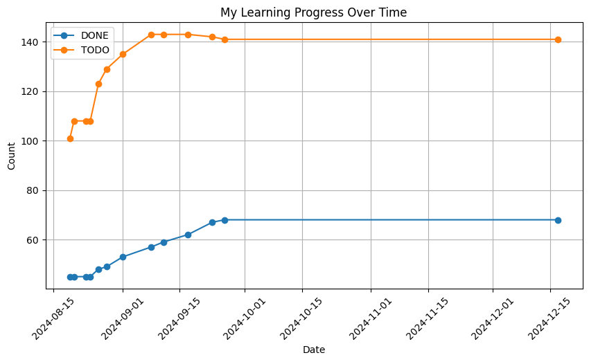

# C++ notes

- This repository includes my notes about C++, taken after watching presentations from CppCon and other conferences, as well as reading books.
- The complete list of references is available in this file [LINKS.md](/LINKS.md).
- In the [code](/code) and [submodules](/submodules) folders, there are examples of my programs illustrating the intricacies of the C++ language.
- Read the [BUILD.md](/BUILD.md) file to learn how to build examples. Manual build and VSCode build automation are described there.

## Topics

### CppCon and other conferences - good talks

- [CppCon and other conferences - good talks](2024-09-23_0319_cppcon_good_talks.md)
  - Ben Deane - Deducing this Patterns, CppCon - 2021

### C++ Basics

- [Jason Gregory - Game Engine Architecture](2024-09-22_0203_gregory_game_engine_arch.md)

### Advanced C++

- [Fluent {C++} - Jonathan Boccara's blog](2024-09-23_0209_fluent_cpp_blog_notes.md)
- [Konstantin Vladimirov - "C++ базовый курс, MIPT" - 2021-2022](2024-07-18_0010_TILIR_BASICS_FULL.md)
- [Konstantin Vladimirov - "Магистерский курс C++, MIPT" - 2022-2023](2024-08-09_0010_TILIR_MASTERS_FULL.md)
- [HolyBlackCat - Game Engine Architector, Guru C++](2024-08-08_0010_HolyBlackCat.md)
- [Antony Polukhin - Guru C++](2024-08-10_0010_POLUKHIN.md)
- [Sergey Slotin - CPU Cache and Memory Latency](2024-08-12_0010_SERGEY_SLOTIN_FULL.md)

### Profiling and Optimization

- [Debugging and Profiling C/C++ applications](2024-09-10_1558_Profiling_Stuff.md)

### Network Programming

- [John Torjo - Boost.Asio C++ Network Programming](2024-09-04_0300_Torjo_Boost_Asio.md)
- [Vinnie Falco - Boost.Beast - Chat via WebSockets](2024-09-16_0230_vinnie_falco_boost_beast.md)

### Soft Skills

- [John Sonmez - Soft Skills: The software developer's life manual](2024-09-09_0046_Sonmez_Soft_Skills.md)

### Software Architecture

- [Robert C. Martin - Clean Architecture](2024-09-21_2314_robert_martin_clean_architecture.md)

### Need to be refactored (new notes)

- [Fedr - C++ Quiz Master](2024-08-08_0020_Fedr.md)

## My progress

