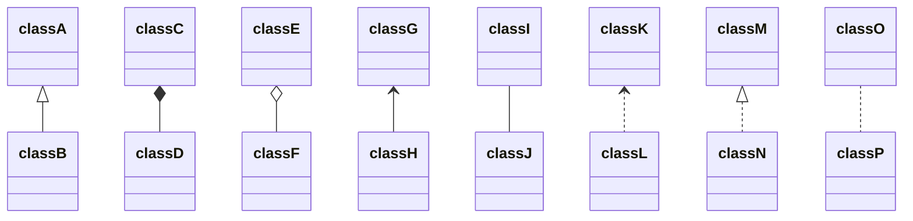
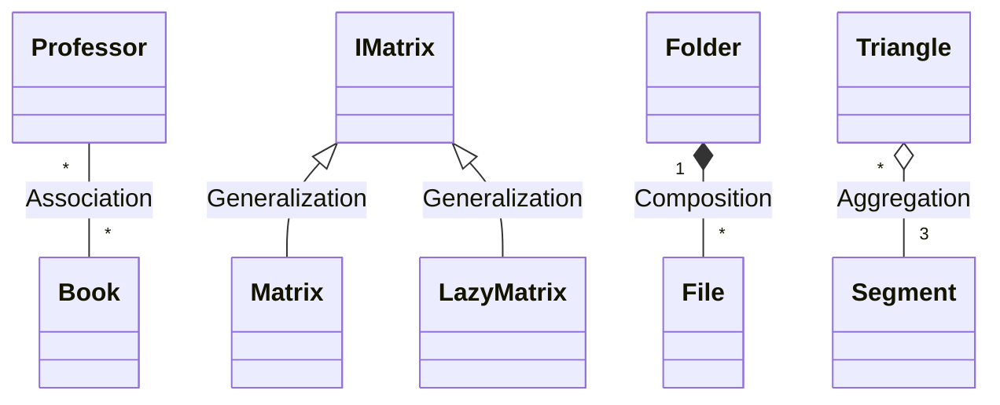
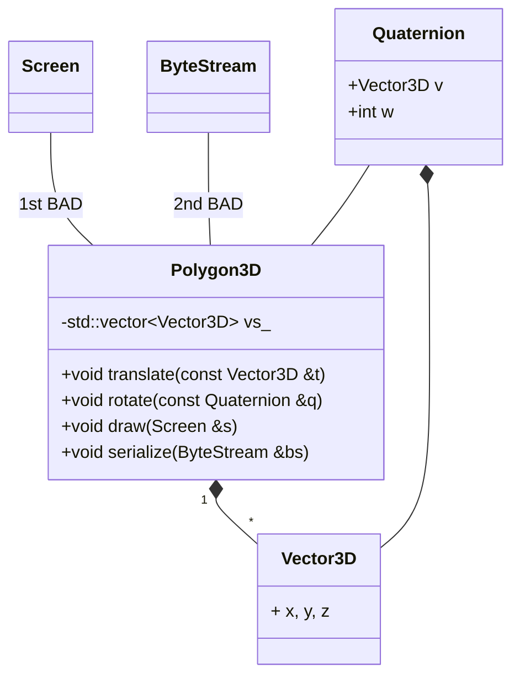
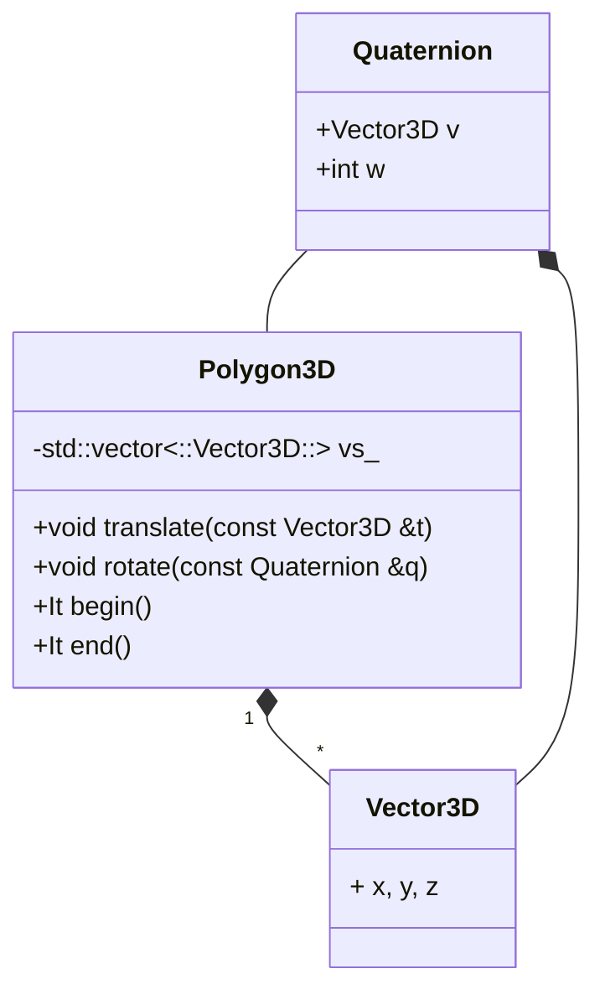
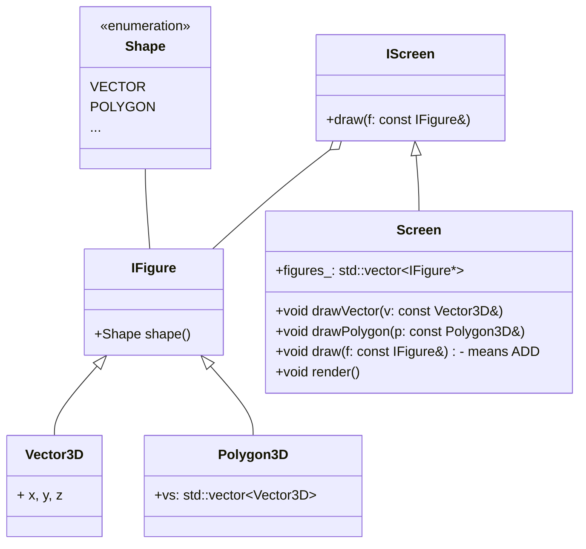
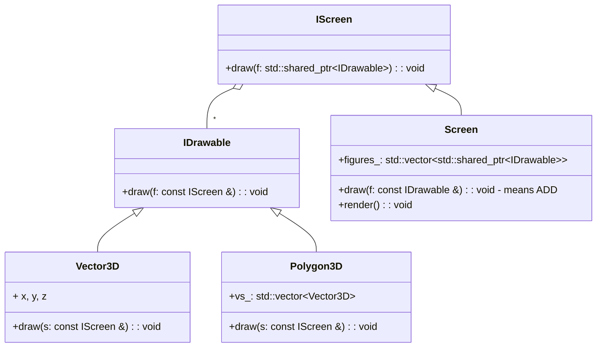
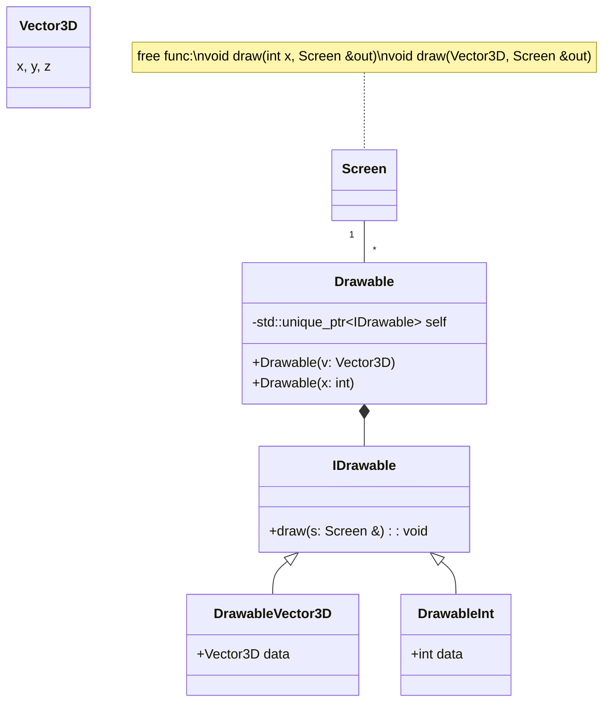
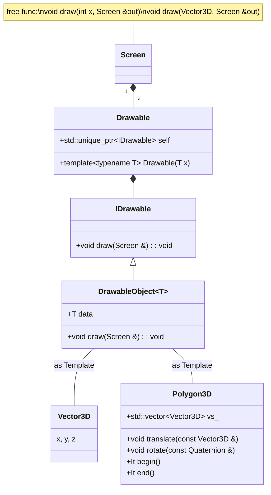

- [Not Sorted Notes](#not-sorted-notes)
- [Basics](#basics)
  - [RVO and copy constructors](#rvo-and-copy-constructors)
  - [volatile](#volatile)
  - [`operator->`](#operator-)
  - [R-Value и L-Value ссылки и выражения. `std::move`](#r-value-и-l-value-ссылки-и-выражения-stdmove)
  - [Move Semantics and `std::exchange`](#move-semantics-and-stdexchange)
  - [Move Assignment Operator Implementation](#move-assignment-operator-implementation)
  - [Why Self-assignment Check is Not Required for Move Assignment Operator](#why-self-assignment-check-is-not-required-for-move-assignment-operator)
  - [Default Special Member Functions Generation](#default-special-member-functions-generation)
  - [Правило Нуля и Правило Пяти](#правило-нуля-и-правило-пяти)
  - [Forwarding References and Perfect Forwarding](#forwarding-references-and-perfect-forwarding)
  - [Forwarding References Example](#forwarding-references-example)
  - [Как устроен `std::move`](#как-устроен-stdmove)
  - [Опасности Forwarding References](#опасности-forwarding-references)
  - [Overloading set using Forwarding References](#overloading-set-using-forwarding-references)
  - [`std::move` may prevent Return Value Optimization (RVO)](#stdmove-may-prevent-return-value-optimization-rvo)
  - [Copy-and-Swap to the Rescue!](#copy-and-swap-to-the-rescue)
  - [Copy-and-Swap приводит к дублированию](#copy-and-swap-приводит-к-дублированию)
  - [By-Value Assignment Operator](#by-value-assignment-operator)
  - [Правило четырех с половиной (Rule of Four and a Half)](#правило-четырех-с-половиной-rule-of-four-and-a-half)
  - [Complete Vector Implementation with Comments](#complete-vector-implementation-with-comments)
  - [Perfect Forwarding and Universal References (Josuttis Explanation)](#perfect-forwarding-and-universal-references-josuttis-explanation)
  - [Explanation of the Slide with `enable_if` and SFINAE in C++17](#explanation-of-the-slide-with-enable_if-and-sfinae-in-c17)
  - [Функторы и лямбда выражения быстрее указателей функциях сортировки (inlining)](#функторы-и-лямбда-выражения-быстрее-указателей-функциях-сортировки-inlining)
  - [Указатели на методы классов](#указатели-на-методы-классов)
  - [Fold Expressions](#fold-expressions)
  - [chrono DATES](#chrono-dates)
- [Virtual Functions and Polymorphism](#virtual-functions-and-polymorphism)
  - [Таблица виртуальных функций (vtable)](#таблица-виртуальных-функций-vtable)
  - [Empty Base Class Optimizations (EBCO)](#empty-base-class-optimizations-ebco)
  - [EBCO и unique\_pointer](#ebco-и-unique_pointer)
  - [Аргументы по умолчанию связываются статически (важно для виртуальных методов)](#аргументы-по-умолчанию-связываются-статически-важно-для-виртуальных-методов)
  - [Non-Virtual Interface (NVI) Pattern for Default Arguments](#non-virtual-interface-nvi-pattern-for-default-arguments)
  - [Pure Virtual Call](#pure-virtual-call)
  - [Два полиморфизма](#два-полиморфизма)
  - [Перегрузка виртуальных функций](#перегрузка-виртуальных-функций)
  - [static\_cast and Virtual Inheritance](#static_cast-and-virtual-inheritance)
- [Very expensive stuff in C++ (RTTI, Exceptions)](#very-expensive-stuff-in-c-rtti-exceptions)
  - [Runtime Type Information](#runtime-type-information)
  - [typeid and typeinfo](#typeid-and-typeinfo)
  - [RTTI and dynamic\_cast](#rtti-and-dynamic_cast)
  - [Exceptions](#exceptions)
  - [Гарантии безопасности исключений](#гарантии-безопасности-исключений)
  - [Документировать методы static\_assert очень полезно](#документировать-методы-static_assert-очень-полезно)
  - [Вызывает ли вектор конструторы объектов при создании вектора заданного размера без инициализации?](#вызывает-ли-вектор-конструторы-объектов-при-создании-вектора-заданного-размера-без-инициализации)
  - [Оператор noexcept, аннотация noexcept и условный noexcept](#оператор-noexcept-аннотация-noexcept-и-условный-noexcept)
  - [`std::uncaught_exceptions()` - определение, просиходит ли размотка стека в данный момент](#stduncaught_exceptions---определение-просиходит-ли-размотка-стека-в-данный-момент)
  - [Vector top and pop - правильное проектирование для защиты от исключений](#vector-top-and-pop---правильное-проектирование-для-защиты-от-исключений)
  - [Три основные формы оператора `new`, которые нужно знать](#три-основные-формы-оператора-new-которые-нужно-знать)
- [Проектирование](#проектирование)
  - [Контексты и интерфейсы](#контексты-и-интерфейсы)
  - [UML Basics](#uml-basics)
  - [Принципы SOLID](#принципы-solid)
  - [Проектирование: важность минимизации зависимости между модулями](#проектирование-важность-минимизации-зависимости-между-модулями)
  - [SOLID: 2. Open/Closed Principle (OCP)](#solid-2-openclosed-principle-ocp)
  - [SRP and OCP Conflict and Resolution](#srp-and-ocp-conflict-and-resolution)
  - [SOLID: 3. Liskov Substitution Principle (LSP)](#solid-3-liskov-substitution-principle-lsp)
  - [SOLID: 4. Interface Segregation Principle (ISP)](#solid-4-interface-segregation-principle-isp)
  - [SOLID: 5. Dependency Inversion Principle (DIP)](#solid-5-dependency-inversion-principle-dip)
- [Шаблоны](#шаблоны)
  - [C Api Wrapper](#c-api-wrapper)
  - [Type traits для единого интерфейса вокруг разногодного API или возврат разных типов в зависимости от входного non-type параметра](#type-traits-для-единого-интерфейса-вокруг-разногодного-api-или-возврат-разных-типов-в-зависимости-от-входного-non-type-параметра)
  - [Специализация и инстанцирование](#специализация-и-инстанцирование)
  - [Частичная специализация классов](#частичная-специализация-классов)
  - [Специализация по non-type параметрам](#специализация-по-non-type-параметрам)
  - [Специализация по семейству похожих типов](#специализация-по-семейству-похожих-типов)
  - [Специализация для всех фукнций](#специализация-для-всех-фукнций)
  - [Пример частичной специализации для массивов](#пример-частичной-специализации-для-массивов)
- [Разрешение имен в шаблонах](#разрешение-имен-в-шаблонах)
  - [Двухфазное разрешение имен в шаблонах](#двухфазное-разрешение-имен-в-шаблонах)
  - [Disambiguation #1: use `this->`](#disambiguation-1-use-this-)
  - [Disambiguation #2: use `typename`](#disambiguation-2-use-typename)
  - [Disambiguation #3: use `template`](#disambiguation-3-use-template)
- [Вывод типов](#вывод-типов)
  - [Вывод неуточнённого типа режет ссылки и константность](#вывод-неуточнённого-типа-режет-ссылки-и-константность)
  - [Уточненные типы](#уточненные-типы)
  - [Хинты для вывода через `->` (C++17)](#хинты-для-вывода-через---c17)
  - [Хинты для вывода можно применять для агрегатов](#хинты-для-вывода-можно-применять-для-агрегатов)
  - [`decltype` не режет типы, как `auto`](#decltype-не-режет-типы-как-auto)
  - [`decltype` может добавлять ссылки (Четыре формы decltype)](#decltype-может-добавлять-ссылки-четыре-формы-decltype)
  - [Расширенный синтаксис объявления фукнции для вывода типа возращаемого значения](#расширенный-синтаксис-объявления-фукнции-для-вывода-типа-возращаемого-значения)
  - [Идиома `for-auto` режет типы](#идиома-for-auto-режет-типы)
  - [Идиома `AAA initializers` (Almost Always Auto). `prvalue` elision](#идиома-aaa-initializers-almost-always-auto-prvalue-elision)
  - [Правила светки ссылок `&&` и `&`](#правила-светки-ссылок--и-)
  - [Универсальные ссылки `auto &&` (forwarding references or universal references)](#универсальные-ссылки-auto--forwarding-references-or-universal-references)
  - [Идиома `for-loop&&` и AAARR (Almost Always Auto Ref Ref)](#идиома-for-loop-и-aaarr-almost-always-auto-ref-ref)
  - [`decltype(auto)` - точный вывод типа из правой части](#decltypeauto---точный-вывод-типа-из-правой-части)
  - [Perfect Forwarding and `std::forward`](#perfect-forwarding-and-stdforward)
- [Определители типов и SFINAE](#определители-типов-и-sfinae)
  - [Правило для `{}`](#правило-для-)
  - [Проблема при конструировании из итераторов (для написания своего `std::vector`)](#проблема-при-конструировании-из-итераторов-для-написания-своего-stdvector)
  - [SFINAE - Substitution Failure Is Not An Error (провал подстановки не является ошибкой)](#sfinae---substitution-failure-is-not-an-error-провал-подстановки-не-является-ошибкой)
  - [SFINAE описатель состоит из трех компонентов](#sfinae-описатель-состоит-из-трех-компонентов)
  - [Пишем свои `is_same`, `is_reference`, `remove_reference`, `integral_constant`, `true_type`, `false_type`](#пишем-свои-is_same-is_reference-remove_reference-integral_constant-true_type-false_type)
  - [Проблемы и решения std::copy](#проблемы-и-решения-stdcopy)
- [Вариабельные шаблоны](#вариабельные-шаблоны)
  - [Возможные значения `...` до С++11](#возможные-значения--до-с11)
  - [Пачки аргументов в шаблонах `...` в современном C++](#пачки-аргументов-в-шаблонах--в-современном-c)
  - [Прозрачная оболочка для вариабельных шаблонов](#прозрачная-оболочка-для-вариабельных-шаблонов)
  - [Шаблонные методы в классах - это зло - они нарушают инкапсуляцию](#шаблонные-методы-в-классах---это-зло---они-нарушают-инкапсуляцию)
  - [`void_t` как логическая коньюнкция(AND) SFINAE характеристик](#void_t-как-логическая-коньюнкцияand-sfinae-характеристик)
  - [Использование `declval` для абстракции значения без необходимости создания объекта](#использование-declval-для-абстракции-значения-без-необходимости-создания-объекта)
  - [Создание "концептов" с помощью SFINAE (конструирования объекта из итераторов с использованием SFINAE)](#создание-концептов-с-помощью-sfinae-конструирования-объекта-из-итераторов-с-использованием-sfinae)
  - [Свертка (fold) — это техника, используемая для обработки наборов значений во время компиляции](#свертка-fold--это-техника-используемая-для-обработки-наборов-значений-во-время-компиляции)
  - [Шаблон для перемещения по дереву, указывая левый или правый указатель, как вариабельные аргументы](#шаблон-для-перемещения-по-дереву-указывая-левый-или-правый-указатель-как-вариабельные-аргументы)
- [Итераторы](#итераторы)
  - [Как препроцессор разворачивает range-based for loop](#как-препроцессор-разворачивает-range-based-for-loop)
  - [Cтратегия компилятора для поиска функций `begin` и `end`](#cтратегия-компилятора-для-поиска-функций-begin-и-end)
  - [Функции `std::advance` и `std::distance` лучше, чем операторы `+` и `-` для итераторов](#функции-stdadvance-и-stddistance-лучше-чем-операторы--и---для-итераторов)
  - [Используйте итераторы вместо контейнеров для передачи функции](#используйте-итераторы-вместо-контейнеров-для-передачи-функции)
  - [Категории итераторов и `iterator_traits<iter>::iterator_category`](#категории-итераторов-и-iterator_traitsiteriterator_category)
  - [Разные категории итераторов с примерами](#разные-категории-итераторов-с-примерами)
  - [Пишем свой итератор](#пишем-свой-итератор)

## Not Sorted Notes

- Если добавить 1 к указателю на массив, то у нас произойдет **скачок равный размеру массива**.
- **Манглирование**, которое существует в языке C++, позволяет делать перегрузку функций, добавлять методы к классам, и создавать семейство шаблонных функций. Язык C, в отличие от C++, не имеет манглирования, но он имеет **строгую гарантию по именам**. Поэтому язык C используется для создания согласованных API.
- Использование **анонимных пространств имён** позволяет определять методы, которые видны только внутри данного CPP файла. Это делает их как бы статическими методами.
- **Список инициализации** выполняется в том порядке, в котором вы написали поля класса.
- Если мы **самостоятельно управляем ресурсами**, которые не управляются автоматически (например, голые указатели в классе), то необходимо правильно реализовать **конструктор копирования и оператор присваивания**. Самый простой способ реализовать эти конструкторы – это **запретить их через ключевое слово `delete`**.

```cpp

class MyClass {
public:
    MyClass(const MyClass&) = delete;
    MyClass& operator=(const MyClass&) = delete;

    // Остальная реализация класса...
};

```

- Класс в C++ можно рассматривать как набор методов для работы с инкапсулированными данными. Если мы говорим о **RAII-классе**, то этот набор методов не влияет на состояние объекта, а лишь **предоставляет правильный интерфейс к ресурсу**, доступ к которому мы защищаем.
- **Default move constructor also noexcept**.

```cpp

class Widget {
private:
    int i{0};
    std::string s{};
    std::unique_ptr<int> p{};

public:
    // Move constructor
    Widget(Widget&&) = default; // Note: also noexcept!
};

```

## Basics

### RVO and copy constructors

- Конструктор копирования может быть выброшен на уровне фронтенда языка. На этом основана специальная семантика копирования (**RVO, Return Value Optimization**).

RVO (Return Value Optimization) основана на том, что операторы копирования и присваивания должны всегда создавать **эквивалентный объект**. Если в операторах копирования или присваивания добавлена логика, например, форматирование диска, которая не должна пропускаться при RVO, это становится проблемой разработчика. **Компилятор имеет право выбрасывать эти методы для оптимизации кода.**

Пример кода, показывающий выбрасывание конструктора копирования:
- В этом примере может быть вызван только конструктор, а не конструктор копирования, благодаря RVO.
- Важно помнить, что если в вашем операторе копирования или присваивания содержится дополнительная логика, которая должна быть выполнена, вы не можете полагаться на то, что компилятор не выбросит эти методы.

```cpp

MyClass CreateMyClass() {
    return MyClass();  // Здесь компилятор может выбросить вызов конструктора копирования благодаря RVO
}

int main() {
    MyClass obj = CreateMyClass();
    return 0;
}

```

### volatile

Слово `volatile` в языке C++ означает, что объект может измениться непредсказуемым образом, независимо от вашего кода. Это может произойти, например, из-за воздействия внешних процессов, прерываний, или аппаратных устройств.

Использование `volatile` говорит компилятору не оптимизировать доступ к этому объекту, поскольку он может измениться в любое время.

Пример:

```cpp
volatile int sensorValue;

// Ожидание изменения значения сенсора
while (sensorValue == 0) {
    // Здесь не будет оптимизации цикла, потому что sensorValue может измениться вне кода
}
```

В этом примере компилятор не будет оптимизировать цикл, полагая, что значение `sensorValue` не изменится, поскольку оно помечено как `volatile`.

### `operator->`

- **Оператор «стрелочка» не позволяет получать доступ к указателю, который она возвращает, но дает доступ к полям данного объекта по указателю.**

Оператор стрелочка (`operator->`) действительно позволяет предоставить доступ к полям или методам объекта, на который указывает возвращаемый указатель. Это используется, чтобы предоставить доступ к внутренним объектам класса.

Вот пример, демонстрирующий использование оператора стрелочка для доступа к полям внутреннего объекта:

```cpp
#include <iostream>

class Inner {
public:
    int value;

    Inner(int v) : value(v) {}

    void Display() const {
        std::cout << "Inner value: " << value << std::endl;
    }
};

class Outer {
private:
    Inner* inner;

public:
    Outer(int v) : inner(new Inner(v)) {}

    ~Outer() {
        delete inner;
    }

    // Определение пользовательского оператора `->`
    Inner* operator->() {
        return inner;
    }

    const Inner* operator->() const {
        return inner;
    }
};

int main() {
    Outer outer(42);
    outer->Display(); // Использование пользовательского оператора `->` для доступа к методу Display
    std::cout << "Inner value accessed through operator->: " << outer->value << std::endl;

    const Outer constOuter(100);
    constOuter->Display(); // Использование константного пользовательского оператора `->`

    return 0;
}
```

### R-Value и L-Value ссылки и выражения. `std::move`

- **L-value** в C++ означает Location Value, т.е. значение, которое имеет локацию.
- "Операция «Взятие выражения», «Связывание выражения с ссылкой» и в этот момент **материализация этого выражения называется R-value ссылкой**."

```cpp

int&& y = x + 1;

```

- **Const L-value reference продляет жизнь временного объекта**, позволяя нам ссылаться на него до конца его существования.
- **Const R-value reference, по сути, создает временный объект и дает ему жизнь**, связываясь с этим временным объектом и продлевая его срок жизни до конца блока, где эта ссылка используется.

```cpp

int x = 5;
const int& lRef = x + 1; // L-value reference продляет жизнь временного объекта (x + 1)
const int&& rRef = x + 1; // R-value reference создаёт временный объект и продлевает его жизнь

```

- **`std::move`** – это, по сути, приведение ссылки `T&` (L-value reference) к ссылке `T&&` (R-value reference).

```cpp
int x = 5;
int&& rRef = std::move(x); // std::move привел int& к int&&
```

```cpp
#include <iostream>
#include <utility>

void PrintAndReset(int&& value)
{
    std::cout << "Value: " << value << std::endl;
    value = 0;
}

int main()
{
    int x = 5;
    PrintAndReset(std::move(x)); // Приводим int& к int&&, используя std::move
    std::cout << "x after move: " << x << std::endl;
    return 0;
}
```

- Правые ссылки (R-value references) дают нам возможность отличать объекты, которые мы не готовы перемещать или модифицировать (L-value references), от объектов, которые мы можем безопасно перемещать или временно использовать (R-value references). При этом **правая ссылка сама по себе задает имя и адрес и является L-value**.
- После применения `std::move` объект переходит в **неконсистентное, но предсказуемое состояние**. В этом состоянии объект может корректно завершить свою жизнь. Либо этот объект можно переиспользовать.

### Move Semantics and `std::exchange`

- `std::exchange` удобно применять к сырым указателям.
- В контексте move-семантики удобно использовать **`std::exchange`, чтобы обмениваться значениями**,
- и желательно указывать атрибут **`noexcept`** для move функций, если они не выкидывают исключений. Это **ускорит работу библиотечными контейнерами**

In the context of move semantics, it is convenient to use `std::exchange` to swap values. It is also recommended to mark move functions with the `noexcept` attribute if they do not throw exceptions. This can improve the performance when using standard library containers.

```cpp

#include <utility> // for std::exchange
#include <string>

class MyClass {
public:
    MyClass(std::string data) : data_(std::move(data)) {}

    // Move constructor
    MyClass(MyClass&& other) noexcept
        : data_(std::exchange(other.data_, "")) {}

    // Move assignment operator
    MyClass& operator=(MyClass&& other) noexcept {
        if (this != &other) {
            data_ = std::exchange(other.data_, "");
        }
        return *this;
    }

private:
    std::string data_;
};

```

In this example, `std::exchange` is used to swap the internal state of the objects during the move operations. The `noexcept` specifier is added to indicate that these move operations do not throw exceptions, which can enhance performance with standard library containers.

The slide in question shows an implementation of the move assignment operator without an explicit self-assignment check. Let's break down why this might be the case and the general approach to implementing such an operator.

### Move Assignment Operator Implementation

**Goal**

- Clean up all visible resources.
- Transfer the content of `w` into `this`.
- Leave `w` in a valid but undefined state.

**Example**

```cpp
class Widget {
private:
    int i{0};
    std::string s{};
    int* pi{nullptr};

public:
    // Move assignment operator
    Widget& operator=(Widget&& w) noexcept {
        delete pi; // Phase 1: Cleanup

        i = std::move(w.i); // Phase 2: Member-wise move
        s = std::move(w.s);
        pi = std::move(w.pi);

        w.pi = nullptr; // Phase 3: Reset

        return *this;
    }

    // Other member functions...
};
```

### Why Self-assignment Check is Not Required for Move Assignment Operator

ENG: Move semantics are designed to transfer ownership of resources from one object to another, effectively leaving the source object in a valid but unspecified state. **This transfer does not require any action if an object is moved into itself**.

```cpp

// Move assignment operator
Widget& operator=(Widget&& w) noexcept {
    delete pi; // Phase 1: Cleanup

    i = std::move(w.i); // Phase 2: Member-wise move
    s = std::move(w.s);
    pi = std::move(w.pi);

    w.pi = nullptr; // Phase 3: Reset

    return *this;
}

```

In the case of a move assignment operator, self-assignment checks are generally not needed because:
01. **Move Semantics:** If `w` is an rvalue, it should generally be a temporary object, making self-assignment unlikely. However, if `w` is an lvalue (which can happen), the move assignment typically leaves `w` in an unspecified state, but still valid.
02. **Standard Library Compliance:** The use of `std::move` and reset of `w` ensure that resources are correctly transferred and that `w` is left in a safe state, preventing issues even if self-assignment were to occur.

However, it is important to note that including a self-assignment check can sometimes be beneficial, especially in more complex classes or to follow best practices in defensive programming.

```cpp

Widget& operator=(Widget&& w) noexcept {
    if (this != &w) {
        delete pi; // Phase 1: Cleanup

        i = std::move(w.i); // Phase 2: Member-wise move
        s = std::move(w.s);
        pi = std::move(w.pi);

        w.pi = nullptr; // Phase 3: Reset
    }
    return *this;
}
```

This approach is generally safe and ensures that the object is correctly handled even in the unlikely event of self-assignment.

### Default Special Member Functions Generation

01. **Default Move Operations Generation:**
   - The default move operations (move constructor and move assignment operator) are automatically generated by the compiler **if no copy operation** (copy constructor or copy assignment operator) **or destructor** is user-defined.

02. **Default Copy Operations Generation:**
   - The default copy operations (copy constructor and copy assignment operator) are automatically generated by the compiler **if no move operation** (move constructor or move assignment operator) is user-defined.

03. **User-defined Count:**
   - Using `=default` or `=delete` in the definition of these operations counts as user-defined. This affects the automatic generation of other special member functions.

### Правило Нуля и Правило Пяти

**Правило Нуля:**
- Вы не определяете никаких специальных методов (конструкторов, деструкторов, конструкторов копирования, операторов копирования/перемещения).
- Компилятор генерирует все необходимые функции за вас, обеспечивая эффективное и безопасное управление ресурсами.

**Правило Пяти:**
- Если вы определяете один из следующих методов: деструктор, конструктор копирования, оператор копирования, конструктор перемещения, или оператор перемещения, то следует определить все пять.
- Это гарантирует корректное и консистентное управление ресурсами вашего класса, избегая проблем с утечками ресурсов или двойным удалением.

```cpp
class MyClass {
public:
    ~MyClass(); // Деструктор
    MyClass(const MyClass&); // Конструктор копирования
    MyClass& operator=(const MyClass&); // Оператор копирования

    MyClass(MyClass&&); // Конструктор перемещения
    MyClass& operator=(MyClass&&); // Оператор перемещения
};
```

### Forwarding References and Perfect Forwarding

Forwarding References позволяет передавать параметры в функции шаблонов без потери их типа и категорийности (lvalue или rvalue). Это особенно полезно при написании оберток вокруг конструкторов или других функций, принимающих параметры по ссылке. Это достигается путем использования синтаксиса T&& или auto&&.

**Perfect Forwarding** можно рассматривать как **условное перемещение (Conditional Move)**. В отличие от безусловного перемещения (Unconditional Move), идеальная пересылка позволяет избежать непредвиденного "украдения" владения переменной из контекста, где это не предполагается. Безусловное перемещение может привести к неожиданным проблемам с владением ресурсами, поэтому в таких случаях предпочтительнее использовать идеальную пересылку.

```cpp
template<typename T>
void f(T&& x); // Forwarding Reference

auto&& var2 = var1; // Forwarding Reference
```

Пересылающие ссылки представляют:
- **Lvalue-ссылку**, если они инициализируются lvalue.
- **Rvalue-ссылку**, если они инициализируются rvalue.

Rvalue-ссылки являются пересылающими ссылками, если:
- **Включают вывод типа**.
- **Используются в форме T&& или auto&&**.

Использование пересылающих ссылок позволяет писать обобщённый код, который может работать с любыми типами аргументов, сохраняя их значимость и избегая ненужных копирований.

### Forwarding References Example

- `Arg&&` - это форвардинг-ссылка (forwarding reference), которая может принимать как lvalue, так и rvalue.
- `std::forward<Arg>(arg)` - это функция, которая сохраняет тип аргумента при пересылке, обеспечивая корректную передачу как lvalue, так и rvalue.

**Детали**

`std::forward` условно преобразует свой вход в rvalue ссылку:
- Если переданное значение является lvalue, оно преобразуется в lvalue ссылку.
- Если переданное значение является rvalue, оно преобразуется в rvalue ссылку.

`std::forward` сам по себе ничего не пересылает.

```cpp
template <typename T>
T&& forward(std::remove_reference_t<T>& t) noexcept {
    return static_cast<T&&>(t);
}
```

**Пример без идеальной пересылки**

Пример кода без идеальной пересылки приводит к ошибке компиляции при передаче rvalue:

```cpp
namespace std {

template<typename T, typename Arg>
unique_ptr<T> make_unique(Arg& arg) {
    return unique_ptr<T>(new T(arg));
}

} // namespace std

std::make_unique<int>(1); // Compilation error, rvalue
```

Ошибка компиляции возникает потому, что `Arg&` не может принять rvalue (например, `1`).

**Решение: Forwarding References**

Forwarding References решает эту проблему, позволяя шаблонным функциям принимать как lvalue, так и rvalue:

```cpp
namespace std {

template<typename T, typename Arg>
unique_ptr<T> make_unique(Arg&& arg) {
    return unique_ptr<T>(new T(std::forward<Arg>(arg)));
}

} // namespace std

std::make_unique<int>(1); // Работает корректно
```

Использование `Arg&&` и `std::forward<Arg>(arg)` позволяет корректно передавать и lvalue, и rvalue, обеспечивая правильное поведение и избежание ошибок компиляции.

### Как устроен `std::move`

`std::move` безусловно приводит свой входной параметр к rvalue ссылке. Само `std::move` ничего не перемещает, оно просто преобразует тип.

Пример реализации `std::move`:

```cpp

template <typename T>
std::remove_reference_t<T>&& move(T&& t) noexcept {
    return static_cast<std::remove_reference_t<T>&&>(t);
}

```

Эта реализация показывает, что `std::move` просто преобразует ссылку на объект в rvalue ссылку, что позволяет вызвать соответствующий перемещающий конструктор или перемещающий оператор присваивания.

### Опасности Forwarding References

Пример ниже показывает, как использование forwarding ссылок может вызвать неожиданное поведение.

```cpp
struct Person {
    Person(const std::string& name); // Конструктор (1)

    template <typename T>
    Person(T&& x); // Конструктор (2)
};

int main() {
    Person p1("Bjarne"); // Вызовет конструктор (2), тип аргумента char[7]
    std::string name("Herb");
    Person p2(name); // Вызовет конструктор (2), тип аргумента не const
    Person p3(p1); // Вызовет конструктор (2), тип аргумента не const, не вызовется конструктор копирования
}
```

- `Person p1("Bjarne");` вызовет конструктор (2), так как тип аргумента `char[7]`.
- `Person p2(name);` вызовет конструктор (2), потому что тип аргумента `std::string`, который не является const.
- `Person p3(p1);` вызовет конструктор (2), так как тип аргумента `Person`, который не является const, и не вызовет конструктор копирования.

### Overloading set using Forwarding References

Пример ниже показывает, как перегрузка функций с использованием forwarding ссылок может привести к вызову различных функций в зависимости от типа передаваемого аргумента.

```cpp
// Функция с lvalue ссылкой (1)
void f(Widget&);

// Функция с lvalue ссылкой на const (2)
void f(const Widget&);

// Функция с rvalue ссылкой (3)
void f(Widget&&);

// Функция с rvalue ссылкой на const (4)
void f(const Widget&&);

// Шаблон функции с forwarding ссылкой (5)
template <typename T>
void f(T&&);

// Шаблон функции с rvalue ссылкой на const (6)
template <typename T>
void f(const T&&);

Widget getWidget();

void g() {
    f(getWidget()); // Вызовет функцию в зависимости от типа возвращаемого значения getWidget().
}
```

### `std::move` may prevent Return Value Optimization (RVO)

В этом примере показано, как избыточный вызов `std::move` может предотвратить оптимизацию возврата значений (RVO).

```cpp
template <typename... Args>
std::unique_ptr<Widget> create(Args&&... args) {
    auto uptr = std::make_unique<Widget>(std::forward<Args>(args)...);
    return std::move(uptr); // Предотвращает RVO
}
```

**Объяснение**

- Внутри функции `create` мы создаем уникальный указатель `uptr` с помощью `std::make_unique`.
- Затем мы вызываем `std::move(uptr)` при возврате значения, что приводит к предотвращению RVO.
- В результате создается лишний объект, так как компилятор не сможет применить оптимизацию возврата значений.

**Решение**

Чтобы избежать этой проблемы и позволить компилятору использовать RVO, просто верните `uptr` без вызова `std::move`:

```cpp
template <typename... Args>
std::unique_ptr<Widget> create(Args&&... args) {
    auto uptr = std::make_unique<Widget>(std::forward<Args>(args)...);
    return uptr; // Позволяет RVO
}
```

### Copy-and-Swap to the Rescue!

```cpp
NaiveVector& NaiveVector::operator=(const NaiveVector& rhs) {
    NaiveVector copy(rhs);
    copy.swap(*this);
    return *this;
}
```

- **Explanation**:
  - **Complete Copy**: We create a complete copy of `rhs` before making any modifications to `*this`.
  - **Safe Swapping**: This ensures that any aliasing relationship between `rhs` and `*this` cannot cause issues.
  - **Strong Exception Guarantee**: The copy-and-swap idiom provides a strong exception guarantee, as the swap is noexcept.

**Benefits of Copy-and-Swap**

- **Safety**: Guarantees that `*this` will be in a valid state even if an exception is thrown.
- **Simplicity**: Simplifies the implementation of the copy assignment operator.
- **Reuse**: Reuses the copy constructor, reducing code duplication.

### Copy-and-Swap приводит к дублированию

Вместо написания двух операторов присваивания, код которых почти идентичен:

```cpp
// Оператор присваивания для копирования
NaiveVector& NaiveVector::operator=(const NaiveVector& rhs) {
    NaiveVector copy(rhs);
    copy.swap(*this);
    return *this;
}

// Оператор присваивания для перемещения
NaiveVector& NaiveVector::operator=(NaiveVector&& rhs) {
    NaiveVector copy(std::move(rhs));
    copy.swap(*this);
    return *this;
}
```

### By-Value Assignment Operator

Ниже представлен пример, как можно заменить дублирование кода в операторах copy-and-swap для копирования и перемещения, используя один оператор присваивания, который принимает объект по значению:

```cpp
NaiveVector& NaiveVector::operator=(NaiveVector copy) {
    copy.swap(*this);
    return *this;
}
```

01. **Идея**: Вместо двух отдельных операторов присваивания (для копирования и перемещения) мы используем один, который принимает объект по значению. Это позволяет избежать дублирования кода.

02. **Проблемы**: Такое решение редко используется, так как STL обычно реализует операторы копирования и перемещения отдельно. Это может привести к ошибкам, если не будет правильно применяться.

### Правило четырех с половиной (Rule of Four and a Half)

Если ваш класс напрямую управляет каким-либо ресурсом (например, указателем), то для корректности и производительности вам, возможно, придется вручную написать четыре специальные функции-члена:

01. **Деструктор** для освобождения ресурса.
02. **Конструктор копирования** для копирования ресурса.
03. **Конструктор перемещения** для передачи владения ресурсом.
04. **Оператор присваивания по значению** для освобождения ресурса у объекта слева и передачи владения от объекта справа.

Плюс дополнительная половина:

05. **Функция swap** (не член класса, и желательно также версия-член класса) для обмена содержимым объектов.

```cpp

class ResourceManagingClass {
    int* ptr_;
    size_t size_;

public:
    // Деструктор
    ~ResourceManagingClass() {
        delete[] ptr_;
    }

    // Конструктор копирования
    ResourceManagingClass(const ResourceManagingClass& other)
        : ptr_(new int[other.size_]), size_(other.size_) {
        std::copy(other.ptr_, other.ptr_ + size_, ptr_);
    }

    // Конструктор перемещения
    ResourceManagingClass(ResourceManagingClass&& other) noexcept
        : ptr_(other.ptr_), size_(other.size_) {
        other.ptr_ = nullptr;
        other.size_ = 0;
    }

    // Оператор присваивания по значению
    ResourceManagingClass& operator=(ResourceManagingClass other) {
        other.swap(*this);
        return *this;
    }

    // Функция swap
    friend void swap(ResourceManagingClass& first, ResourceManagingClass& second) noexcept {
        using std::swap;
        swap(first.ptr_, second.ptr_);
        swap(first.size_, second.size_);
    }
};
```

Эти функции обеспечивают правильное управление ресурсами, избегая утечек памяти и обеспечивая эффективное перемещение и копирование объектов.

### Complete Vector Implementation with Comments

```cpp
class Vec {
    int* ptr_;
    size_t size_;

public:
    // Copy constructor to copy the resource and avoid double-frees
    Vec(const Vec& rhs)
        : ptr_(new int[rhs.size_]), size_(rhs.size_) {
        std::copy(rhs.ptr_, rhs.ptr_ + size_, ptr_);
    }

    // Move constructor to transfer ownership of the resource, cheaper than copying
    Vec(Vec&& rhs) noexcept
        : ptr_(std::exchange(rhs.ptr_, nullptr)), size_(std::exchange(rhs.size_, 0)) {}

    // Destructor to free the resource and avoid leaks
    ~Vec() {
        delete[] ptr_;
    }

    // Copy-and-swap idiom for the assignment operator
    Vec& operator=(Vec copy) {
        copy.swap(*this);
        return *this;
    }

    // Non-member swap function to make your type swappable efficiently
    friend void swap(Vec& a, Vec& b) noexcept {
        using std::swap;
        swap(a.ptr_, b.ptr_);
        swap(a.size_, b.size_);
    }

    // Member swap function for simplicity
    void swap(Vec& rhs) noexcept {
        using std::swap;
        swap(ptr_, rhs.ptr_);
        swap(size_, rhs.size_);
    }
};
```

01. **Copy Constructor**:
   - Copies the resource from another instance, allocating new memory and copying the elements.
   - Ensures that each `Vec` instance manages its own copy of the data to avoid double-frees.

02. **Move Constructor**:
   - Transfers ownership of the resource from another instance, leaving the source in a valid, but unspecified state.
   - This is more efficient than copying since it only involves pointer manipulation.

03. **Destructor**:
   - Frees the allocated memory to avoid memory leaks.
   - Ensures that the resource is properly cleaned up when the instance is destroyed.

04. **Assignment Operator (Copy-and-Swap Idiom)**:
   - Uses the copy-and-swap idiom to implement the assignment operator.
   - This approach is safe and ensures strong exception safety by creating a copy first and then swapping.

05. **Non-Member Swap Function**:
   - Provides a non-member `swap` function to make `Vec` efficiently swappable.
   - Utilizes `std::swap` to exchange the resources of two `Vec` instances.

06. **Member Swap Function**:
   - Implements a member `swap` function for convenience and efficiency.
   - Swaps the internal pointers and sizes of the two instances using `std::swap`.

### Perfect Forwarding and Universal References (Josuttis Explanation)

```cpp
class Cust {
private:
    std::string first;
    std::string last;
    int id;

public:
    template <typename S1, typename S2>
    Cust(S1&& f, S2&& l = "", int i = 0)
        : first(std::forward<S1>(f)), last(std::forward<S2>(l)), id(i) {}

    // Other members...
};
```

01. **Universal/Forwarding References**:
   - `S1&&` and `S2&&` are universal references in the context of a template. They can bind to both lvalues and rvalues.
   - They are used to implement perfect forwarding, allowing the constructor to forward arguments to member initializers without unnecessary copies.

02. **Perfect Forwarding with `std::forward`**:
   - `std::forward<S1>(f)` and `std::forward<S2>(l)` are used to perfectly forward the arguments `f` and `l` to the member initializers `first` and `last`.
   - `std::forward` is a conditional cast that preserves the value category (lvalue or rvalue) of the arguments.

03. **Constructor Template**:
   - The constructor template accepts two parameters of types `S1` and `S2`. These parameters are forwarded to the `first` and `last` member initializers.
   - The default value for `S2` is an empty string, allowing the constructor to be called with one or two string arguments.

04. **Covers Multiple Constructor Scenarios**:
   - This single constructor template can cover various combinations of `std::string`, `const std::string&`, `std::string&&`, `const char*`, etc., without explicitly defining multiple overloaded constructors.

**Benefits**

- Reduces code duplication by combining multiple constructors into a single template.
- Ensures efficient and correct forwarding of arguments, avoiding unnecessary copies.
- Simplifies the class interface by handling various input types seamlessly.

This example illustrates the power and flexibility of perfect forwarding and universal references in modern C++. By using templates and `std::forward`, we can create constructors that handle a wide range of argument types efficiently and correctly.

### Explanation of the Slide with `enable_if` and SFINAE in C++17

- The slide demonstrates how to use SFINAE and `std::enable_if` to selectively enable a template constructor based on the type of the arguments.
- This technique is useful for avoiding ambiguous constructor calls and ensuring that certain constructors are only used with specific types.
- The C++17 feature `std::enable_if_t` provides a cleaner syntax compared to the earlier standards.

```cpp
class Cust {
private:
    std::string first;
    std::string last;
    int id;

public:
    // Template constructor with SFINAE to enable only if S1 is not Cust
    template <typename S1, typename S2 = std::string,
              typename = std::enable_if_t<!std::is_same_v<S1, Cust>>>
    Cust(S1&& f, S2&& l = "", int i = 0)
        : first(std::forward<S1>(f)), last(std::forward<S2>(l)), id(i) {}
};
```

**Key Points**

01. **SFINAE with `std::enable_if`**:
   - `std::enable_if` is used to conditionally enable the template constructor.
   - `std::enable_if_t<!std::is_same_v<S1, Cust>>` ensures that the constructor is enabled only if `S1` is not `Cust`.
   - `std::is_same_v<S1, Cust>` is a shorthand for `std::is_same<S1, Cust>::value`, which checks if `S1` is the same type as `Cust`. The `!` negates the result, so the constructor is enabled if `S1` is **not** `Cust`.

02. **Perfect Forwarding**:
   - `S1&&` and `S2&&` are universal/forwarding references, allowing the constructor to accept both lvalues and rvalues.
   - `std::forward<S1>(f)` and `std::forward<S2>(l)` are used to forward the arguments `f` and `l` to the member initializers `first` and `last`.

03. **Constructor Definition**:
   - The constructor template can take any type `S1` for the first parameter and `S2` (defaulting to `std::string`) for the second parameter.
   - The default value for `S2` is an empty string, allowing the constructor to be called with one or two string arguments.

**Example Usage**

```cpp
Cust c("Joe", "Fix", 42);  // Uses the template constructor with S1 = const char*
Cust f("Nico");            // Uses the template constructor with S1 = const char*, S2 defaults to std::string

Cust g(f);                 // Error: The constructor is not enabled for S1 = Cust
const Cust cc("Jim");      // Uses the template constructor with S1 = const char*, S2 defaults to std::string
Cust h(cc);                // Error: The constructor is not enabled for S1 = Cust
```

### Функторы и лямбда выражения быстрее указателей функциях сортировки (inlining)

01. **Инлайн-функции и оптимизация**:
   - **Функторы**: Поскольку функторы представляют собой объекты с перегруженным оператором `operator()`, компилятор может инлайнить вызовы этого оператора. Это устраняет накладные расходы на вызов функции и позволяет компилятору оптимизировать код лучше.
   - **Указатели на функции**: Указатели на функции вызывают накладные расходы, связанные с вызовом через указатель, что предотвращает инлайнинг и, как следствие, уменьшает возможность компилятора оптимизировать код.

02. **Кэширование и предсказание ветвлений**:
   - **Функторы**: Код вызова функтора находится в одном месте, и это помогает процессору предсказывать ветвления более эффективно. Также это уменьшает вероятность кэш-промахов.
   - **Указатели на функции**: Вызовы через указатель на функцию могут ухудшить предсказание ветвлений процессором, так как адрес вызываемой функции может меняться.

03. **Типизация и специализация**:
   - **Функторы**: Поскольку тип функтора известен на этапе компиляции, компилятор может генерировать специализированный код для конкретного типа функтора, что улучшает производительность.
   - **Указатели на функции**: В случае указателей на функции компилятор не может провести такую же специализацию, так как указатель может указывать на любую функцию с соответствующей сигнатурой.

04. **Передача параметров**:
   - **Функторы**: Функторы могут быть оптимально переданы по ссылке или значению, что позволяет избежать лишних копирований.
   - **Указатели на функции**: Передача указателя на функцию всегда требует разыменования указателя, что добавляет дополнительные операции.

```cpp
#include <vector>
#include <algorithm>

// Функтор
struct Less {
    bool operator()(int a, int b) const {
        return a < b;
    }
};

// Указатель на функцию
bool lessFunction(int a, int b) {
    return a < b;
}

int main() {
    std::vector<int> vec = {4, 2, 3, 1, 5};

    // Использование функтора
    std::sort(vec.begin(), vec.end(), Less());

    // Использование указателя на функцию
    std::sort(vec.begin(), vec.end(), lessFunction);

    return 0;
}
```

### Указатели на методы классов

```cpp
struct MyClass {
    int DoIt(float a, int b) const;
};

using constif_t = int (MyClass::*)(float, int) const;

// Поддерживается два синтаксиса вызова
constif_t ptr = &MyClass::DoIt;

MyClass c;
(c.*ptr)(1.0, 1);  // Вызов через объект

MyClass* pc = &c;
(pc->*ptr)(1.0, 1);  // Вызов через указатель на объект
```

### Fold Expressions

Свёртка выражений позволяет компактно записывать операции над вариативным числом аргументов шаблонов, применяя заданную операцию ко всем аргументам.

01. **Fold Expressions (Свёртка выражений)**
   - Свёртка выражений помогает упростить код, когда необходимо применить одну и ту же операцию ко всем элементам набора аргументов шаблона.
   - В C++17 были добавлены два вида свёртки: свёртка влево (left fold) и свёртка вправо (right fold).

02. **Коммутативность и ассоциативность**
   - При выборе между левосторонней и правосторонней свёрткой, важным фактором является коммутативность операций, а не ассоциативность.
   - Коммутативность означает, что порядок операндов не влияет на результат операции, тогда как ассоциативность указывает, что порядок выполнения операций не изменяет результат.

03. **Примеры кода**
   - В слайде показаны два шаблона функции, которые демонстрируют, как применять свёртку выражений для умножения матриц:
   - `multiply_on_right`: выполняет правостороннюю свёртку, начиная с первого аргумента и умножая его на остальные аргументы справа налево.
   - `multiply_on_left`: выполняет левостороннюю свёртку, начиная с последнего аргумента и умножая его на остальные аргументы слева направо.

```cpp

template<typename Matrix, typename... Args>
auto multiply_on_right(Matrix&& m, Args&&... args) {
    return (m * ... * args); // Правосторонняя свёртка
}

template<typename Matrix, typename... Args>
auto multiply_on_left(Matrix&& m, Args&&... args) {
    return (args * ... * m); // Левосторонняя свёртка
}

```

В обоих случаях результат умножения будет одинаковым (24), но порядок выполнения операций разный:
- **Правосторонняя свёртка:** `(a * b) * c`
- **Левосторонняя свёртка:** `a * (b * c)`

Это важно учитывать в случае, если операция не коммутативна и не ассоциативна, так как результат может отличаться в зависимости от порядка выполнения операций.

### chrono DATES

```cpp

using namespace std::chrono;

constexpr auto today_us = September/25/2018;
constexpr auto today_uk = 25d/September/2018;
constexpr auto today = 2018y/September/25;

```

In this example, the `std::chrono` namespace is used to define date literals in different formats. The DSL (Domain-Specific Language) allows for clear and concise date definitions using user-defined literals (UDLs) and the `/` operator to separate day, month, and year.

## Virtual Functions and Polymorphism

### Таблица виртуальных функций (vtable)

- При создании класса с хотя бы одним виртуальным методом в него добавляется vptr.
- Конструктор базового класса динамически выделяет память для таблицы виртуальных функций.
- Конструктор каждого потомка производит инициализацию её своими методами. В итоге там всегда оказываются нужные указатели.

### Empty Base Class Optimizations (EBCO)

- Оптимизация пустого базового класса (EBCO) применяется когда базовый класс хм... пустой.

```cpp

class A {};
class B : public A {};
A a; assert(sizeof(a) == 1);
B b; assert(sizeof(b) == 1);

```

- Заметьте, класс с хотя бы одним виртуальным методом точно не пустой.
- Пока неясно зачем нам вообще такие ребята. Они сыграют позже, так как нужны для так называемых миксинов.

### EBCO и unique_pointer

- Если делетер в unique_pointer это класс, то:

```cpp

template <typename T, typename Deleter = default_delete<T>>
class unique_ptr : public Deleter {
  T *ptr_;

public:
  unique_ptr(T *ptr = nullptr, Deleter del = Deleter()) :
    Deleter(del), ptr_(ptr), del_(del) {}

  ~unique_ptr() { Deleter::operator()(ptr_); }
};

```

- Учти это невозможно если делетер функция (см. пример)

**Пример использования**

```cpp
#include <iostream>
#include <memory>

enum { SZ = 1000 };

struct CDeleter {
    void operator()(int *t) { delete[] t; }
};

auto LDeleter = [](int *t) { delete[] t; };
using LDeleterTy = decltype(LDeleter);

void FDeleter(int *t) { delete[] t; }
using FDeleterTy = decltype(&FDeleter);

int main() {
    int *Uip = new int[SZ]();
    std::unique_ptr<int, CDeleter> Uic(new int[SZ]());
    std::unique_ptr<int, LDeleterTy> Uil(new int[SZ](), LDeleter);
    std::unique_ptr<int, FDeleterTy> Uif(new int[SZ](), FDeleter);

    std::cout
        << "Uip: " << sizeof(Uip)       // 8
        << ", Uic: " << sizeof(Uic)     // 8
        << ", Uil: " << sizeof(Uil)     // 8 ???
        << ", Uif: " << sizeof(Uif)     // 16
        << std::endl;

    delete[] Uip;
}
```

### Аргументы по умолчанию связываются статически (важно для виртуальных методов)

Аргументы по умолчанию в C++ связываются статически и зависят от статического типа указателя или ссылки, используемой для вызова функции, а не от динамического типа объекта. В приведенном примере, несмотря на то, что объект, на который указывает указатель `pb`, является экземпляром `Derived`, значение аргумента по умолчанию берется из базового класса `Base`, так как тип указателя — `Base*`.

```cpp
struct Base {
    virtual int foo(int a = 14) { return a; }
};

struct Derived : public Base {
    int foo(int a = 42) override { return a; }
};

Base *pb = new Derived();
std::cout << pb->foo() << std::endl; // на экране 14
```

### Non-Virtual Interface (NVI) Pattern for Default Arguments

Использование идиомы NVI (Non-Virtual Interface) позволяет избежать проблем с аргументами по умолчанию в виртуальных функциях. В этом примере интерфейс `foo` с аргументом по умолчанию невиртуальный, а внутренняя реализация `foo_impl` виртуальная и может быть переопределена в производных классах.
- Закрытая виртуальная функция открыто переопределена. Это нормально

```cpp
struct BaseNVI {
    int foo(int x = 14) { return foo_impl(x); }

private:
    virtual int foo_impl(int a) { return a; }
};

struct Derived : public Base {
    int foo_impl(int a) override { return a; }
};
```

### Pure Virtual Call

- Чтобы сделать PVC (Pure Virtual Call) и избежать предупреждения компилятора и ошибки линковки, можно использовать функцию-посредника, вызываемую в конструкторе. Это приведет к ошибке выполнения.
- Если вызывать виртуальный метод из конструктора, то будет варнинг компилятора и вызов девиртуализуется.
- То же самое касается и деструктора. Потому что в деструкторе виртуальной таблицы уже нет, а в конструкторе все еще нет.

```cpp
#include <iostream>

struct Base {
    Base() { callDoIt(); } // Вызов посредника в конструкторе
    virtual void doIt() = 0;
    void callDoIt() { doIt(); } // Посредник для вызова виртуальной функции
};

struct Derived : public Base {
    void doIt() override { std::cout << "Derived::doIt()" << std::endl; }
};

int main() {
    Derived d; // Здесь произойдет ошибка выполнения, так как вызовется чисто виртуальная функция
}
```

### Два полиморфизма

Полиморфизм в программировании позволяет создавать функции, которые могут обрабатывать данные разных типов, используя один и тот же интерфейс. Статический полиморфизм разрешается во время компиляции, а динамический — во время выполнения программы.

- Полиморфной (по данному аргументу) называется функция, которая ведет себя по-разному в зависимости от типа этого аргумента
- Полиморфизм бывает статический, когда функция управляется известными на этапе компиляции типами и динамический, когда типы известны только на этапе выполнения
- Примеры:
  - **Множество перегрузок** можно рассматривать как одну **статическую** полиморфную функцию (по любому аргументу)
  - **Шаблон функции** это **статическая** полиморфная функция (по любому аргументу)
  - **Виртуальная функция** это **динамическая** полиморфная функция (по первому невидимому аргументу this)

### Перегрузка виртуальных функций

- Предположим, что мы умеем эффективно возводить разреженные матрицы в целые степени и хотим просто переиспользовать возведение в дробные.
- Перегрузка виртуальных функций возможна, однако она может привести к неоднозначностям в коде, как это продемонстрировано в примере на слайде.

```cpp

struct Matrix {
    virtual void pow(double x); // 1. обычный алгоритм для double
    virtual void pow(int x);    // 2. эффективный алгоритм
};

struct SparseMatrix : public Matrix {
    void pow(int x) override;   // 3. крайне эффективный алгоритм
};

SparseMatrix d;
d.pow(1.5); // какой метод будет вызван?

```

- Будет вызван метод 3, т.к. overload set берется из класса SparseMatrix, а не из базового класса Matrix.
- Для исправления этой ситуации можно использовать using:

```cpp

struct Matrix {
    virtual void pow(double x); // 4. обычный алгоритм для double
    virtual void pow(int x);    // 5. эффективный алгоритм
};

struct SparseMatrix : public Matrix {
    using Matrix::pow;          // Втаскиваем оба метода из базового класса
    void pow(int x) override;   // 6. крайне эффективный алгоритм
};

SparseMatrix d;
d.pow(1.5); // какой метод будет вызван?

```

- Теперь будет вызван метод 1, т.к. overload set из класса SparseMatrix включает в себя оба метода из базового класса Matrix.

### static_cast and Virtual Inheritance

- `static_cast` может менять битовое представление объекта
- `static_cast` может менять указатель при использовании множественного наследования
- `static_cast` работает и вверх по иерархии, и вниз
- При витуальном наследовании из за смердженных таблиц виртуальных функций `static_cast` не работает вниз.
  - Т.к. в нижнем объекте лежит оторванный кусок виртуально наследованного объекта.
  - Разный адрес по разным веткам иерархии ведет к одному и тому же объекту - поэтому `static_cast` не работает.
  - Тут поможет `dynamic_cast` and RTTI, хотя это уже overkill.

## Very expensive stuff in C++ (RTTI, Exceptions)

### Runtime Type Information

- Для разрешения насущных вопросов (например "какой у меня динамический тип") и свободного хождения вниз-вверх по иерархиям классов, программа на C++ должна во время исполнения поддерживать особые невидимые программисту структуры данных
- Это очень странное решение для C++ потому что оно противоречит идеологии языка
- В языке ровно два таких сомнительных механизма: RTTI и исключения
- Много раз делались попытки завести к ним какой-нибудь третий, но других ошибок с 1998 года комитет ни разу не делал
- И конечно основа RTTI это typeinfo

### typeid and typeinfo

typeid не запускает вычислений, а только тип достает тип во время компиляции (если может).
А если тип полиморфный, то тогда бросает исключение, потому что ему нужна виртуальная таблица, чтобы понять, что там за объект.
Похожий пример есть тут https://en.cppreference.com/w/cpp/types/bad_typeid.

- **typeinfo** нода лежит в каждом объекте, и в ней лежит информация о типе объекта.
- Оператор `typeid` возвращает ссылку на эту ноду.
- `typeid` выводит рантайм тип объекта, если в нем есть хотя бы одна виртуальная функция.
- `typeid` может выводить статический и династический тип объекта.
  - `typeid(pointer).name()` выводит статический тип (разрешается на этапе компиляции).
  - `typeid(*pointer).name()` выводит динамический тип

```cpp

DCBA* d = new DCBA();
std::cout << "ba: " << ba << " | dynamic typeid: " << typeid( *ba ).name()
            << " | static typeid: " << typeid( ba ).name() << std::endl;
// ba: 000001EE23F2E7F0 | dynamic typeid: struct DCBA | static typeid: struct BA * __ptr64

```

**LINKS**

- [code/diamond_problem_and_virtual_inheritance_and_typeid.cpp](code/diamond_problem_and_virtual_inheritance_and_typeid.cpp)
- [code/typeid_nullptr.cpp](code/typeid_nullptr.cpp)

### RTTI and dynamic_cast

- `dynamic_cast` - это самый распространенный способ использования RTTI. Он может **приводить типы внутри иерархий**.
- Т.е. `dynamic_cast` умеет двигаться между веткаими иерархии и виртуальными базами.
- Это очень дорогая операция и зависит от **O(n)** от глубины иерархии.
- `dynamic_cast` ведет себя как `static_cast` при отсутствии виртуальных таблиц.
- `dynamic_cast` работает для указателей и для ссылок.
  - При ошибки приведения **для указателей** возвращает **`nullptr`**,
  - При ошибки приведения **для ссылок** бросает исключение **`std::bad_cast`**.

### Exceptions

Исключения не имеют смысла в языке C, так как там нет деструкторов и выплнение "нормально" прервать через `abort`. Такое нельзя делать в C++, потому что деструкторы не вызовутся и не произойдет корректное освобождение ресурсов.

01. В качестве исключения можно выбрасывать любой объект.
02. В блоке `catch` можно изменять/удалять перехваченный объект.
03. В блоках `catch` разрешено лишь преобразование от производного класса к базовому. Это работает при передаче по значению, указателю и по ссылке. При передаче по значению происходит срезка.
04. Аннотация `noexcept` позволяет указать, что функция не бросает исключений. Это помогает компилятору оптимизировать код и помогает документировать код.
05. Если мы даем обещание `noexcept` к виртуальной функции, то все переопределения этой функции также должны его выполнять (быть `noexcept`).
06. Деструкторы всегда `noexcept`, просто они не аннотированы.
07. В `try` блок можно поместить также функцию целиком и даже список инициализации конструктора [example](code/try_block_for_ctor_init_list.cpp).
08. Catch block как бы расширяет область видимости try блока, поэтому переменные из try блока видны в catch блоке.
09. Выброшенный объект живет до конца блока catch, который его перехватил. #TODO: read more about it.
10. Если в функции `noexcept` произошло исключение, то программа завершается вызовом `std::terminate` (abort).

**Преимущества**:
- Текст не замусоривается обработкой кодов возврата или `errno`, вся обработка ошибок отделена от логики приложения.
- Ошибки не игнорируются по умолчанию. Собственно, они не могут быть проигнорированы.

**Недостатки**:
- **Code path disruption** (Нарушение пути выполнения кода) — появление в коде неожиданных выходных дуг.
  - Это вынуждает программиста анализировать весь код функции на предмет того, что возврат из функции может произойти в неожиданных местах.
- Некоторый оверхед на исключения.

**LINKS**

- https://en.cppreference.com/w/cpp/error/exception
- [code/exceptions_by_value.cpp](code/exceptions_by_value.cpp)
- [code/exception_with_multiple_inheritance.cpp](code/exception_with_multiple_inheritance.cpp)
- [code/try_block_for_ctor_init_list.cpp](code/try_block_for_ctor_init_list.cpp)

### Гарантии безопасности исключений

- **Базовая гарантия** (basic guarantee): гарантия, что объекты не будут утекать, но состояние программы может быть изменено.
- **Строгая гарантия** (strong guarantee): Commit/rollback семантика. Гарантия, что если исключение возникнет, состояние программы не изменится.
- **Гарантия бессбойности** (no-throw guarantee): гарантия, что функция не бросит исключение.

#### Deducing THIS `foo(this Self&& self)` (C++23)

Использование явного параметра объекта `foo(this Self&& self)` позволяет избежать дублирования кода при реализации перегрузок методов для константных и неконстантных объектов. Это делает код более компактным и поддерживаемым.

В **традиционном подходе** метод `operator->` перегружен для константных и неконстантных объектов:

```cpp
template <typename T>
class OptionalNotDeducingThis {
  // ...
  constexpr T* operator->() {
    return std::addressof(this->m_value);
  }

  constexpr T const* operator->() const {
    return std::addressof(this->m_value);
  }
  // ...
};
```

Здесь у нас есть две перегрузки для `operator->`:
01. Одна для неконстантных объектов, возвращающая указатель на `T`.
02. Вторая для константных объектов, возвращающая указатель на `const T`.

В **С++23** класс использует **новый подход с явным параметром объекта**, чтобы избежать дублирования кода:

```cpp
template <typename T>
class OptionalDeducingThis {
  // ...
  template <typename Self>
  constexpr auto operator->(this Self&& self) {
    return std::addressof(self.m_value);
  }
  // ...
};
```

Здесь мы используем шаблонный метод с явным параметром объекта `this Self&& self`:
- `Self` выводится компилятором, и метод может быть вызван как на константных, так и на неконстантных объектах.
- Этот метод автоматически выводит тип объекта (константный или неконстантный) и использует одну и ту же реализацию для обоих случаев.

**LINKS**

- https://www.sandordargo.com/blog/2022/02/16/deducing-this-cpp23

### Документировать методы static_assert очень полезно

Этот код использует `static_assert` для проверки, что тип `T` является безопасно перемещаемым (notthrow move constructible и notthrow move assignable). Эти проверки выполняются на этапе компиляции и гарантируют, что только типы, удовлетворяющие этим требованиям, могут быть использованы с данным методом `push`.

```cpp
void push(T &&t) {
    assert(used_ <= size_);
    static_assert(std::is_nothrow_move_constructible<T>::value);
    static_assert(std::is_nothrow_move_assignable<T>::value);
    if (used_ == size_) {
        std::cout << "Realloc\n";
        MyVector tmp(size_ * 2 + 1);
        while (tmp.size() < used_)
            tmp.push(std::move(arr_[tmp.size()]));
        tmp.push(std::move(t));
        std::swap(*this, tmp);
    } else {
        construct(arr_ + used_, std::move(t));
        used_ += 1;
    }
}
```

### Вызывает ли вектор конструторы объектов при создании вектора заданного размера без инициализации?

При создании вектора с указанным количеством элементов, вектор выделяет память и конструирует в этой памяти элементы, используя конструктор по умолчанию.

Механизм DefaultInsertable позволяет контейнерам создавать и инициализировать элементы непосредственно в выделенной памяти без необходимости их копирования, что улучшает производительность и эффективность управления памятью. Это особенно полезно для контейнеров, таких как `std::vector`, которые могут увеличивать свою емкость и перемещать элементы в новую память, сохраняя при этом корректную инициализацию всех элементов.

### Оператор noexcept, аннотация noexcept и условный noexcept

**Аннотация noexcept**

- Некоторые функции можно различить простыми определителями

```cpp
template <class T>
T copy(T const& orig) noexcept(is_fundamental<T>::value) {
    return orig;
}
```

- `noexcept(true)` это всё равно что просто noexcept.
- `noexcept(false)` это его отсутствие и не обещание что функция точно что-то бросит.

**Оператор noexcept**

- Как использовать оператор `noexcept` для проверки того, выбрасывает ли определенное выражение исключения.
- Оператор `noexcept` возвращает `true` или `false` в зависимости от вычисления выражения под ним на этапе компиляции.
- Оператор noexcept оценивает выражение под ним но не вычисляет его.

```cpp
template <class T>
T copy(T const& orig) noexcept(noexcept(T(orig))) {
    return orig;
}
```

### `std::uncaught_exceptions()` - определение, просиходит ли размотка стека в данный момент

- Любой деструктор по умолчанию noexcept
- Одним из способов позволить исключениям покидать деструктор является его пометка как noexcept(false)
- Вы должны быть осторожны, помечая так деструкторы, потому что деструктор сам по себе используется в процессе размотки (см. пример)
- Вы можете проверить внутри деструктора, идёт ли размотка посредством вызова `std::uncaught_exceptions()`.
- `std::uncaught_exceptions()` возвращает количество активных непойманных исключений. Если она возвращает значение больше 0, это значит, что происходит размотка стека из-за исключения.

```cpp
void test0() {
    try {
        throw std::runtime_error("r");
    } catch (std::runtime_error &e) {
        std::cerr << "Exception catched\n";
    }
    std::cerr << "Success\n";
}

struct S {
    ~S() noexcept(false) {
        if (std::uncaught_exceptions()) {
            std::cerr << "Dtor called in unwinding\n";
            throw std::runtime_error("d");
        }
    }
};

void test() {
    try {
        S s;
        throw std::runtime_error("a");
    } catch (std::runtime_error &e) {
        std::cerr << "Exception catched\n";
    }
    std::cerr << "Success\n";
}
```

### Vector top and pop - правильное проектирование для защиты от исключений

- Разделение этих операций на две функции (`top` и `pop`) позволяет повысить безопасность работы с исключениями.
- Одна функция проверяет состояние и может выбросить исключение, но не изменяет состояние объекта.
- Другая функция изменяет состояние, но не выбрасывает исключения после проверки.
- Это разделение упрощает обеспечение безопасности инварианта класса.

```cpp
template <typename T>
class MyVector {
    T *arr_ = nullptr;
    size_t size_, used_ = 0;
public:
    T top() const {
        if (used_ <= 0) throw outofbounds{};
        return arr_[used_ - 1];
    }

    void pop() {
        if (used_ <= 0) throw underflow{};
        used_ -= 1;
    }
};
```

### Три основные формы оператора `new`, которые нужно знать

01. **`new` с исключением при исчерпании памяти**:
   - Эта форма оператора `new` выделяет память для объекта и вызывает его конструктор.
   - Если памяти недостаточно, бросается исключение `std::bad_alloc`.

```cpp
   Widget *w = new Widget; // возможно bad_alloc
```

02. **`new` с возвратом нулевого указателя**:
   - Эта форма оператора `new` также выделяет память для объекта и вызывает его конструктор.
   - Однако, если памяти недостаточно, вместо выброса исключения возвращается `nullptr`.

```cpp
   Widget *w = new (std::nothrow) Widget;
   if (!w) { /* обработка */ }
```

03. **Размещающий `new` (placement new)**:
   - Размещающий оператор `new` используется для создания объекта в заранее выделенной памяти.
   - Сначала выделяется сырой блок памяти с помощью `::operator new`.
   - Затем объект создается в этой памяти с использованием размещающего `new`.

```cpp
   void *raw = ::operator new(sizeof(Widget)); // возможно bad_alloc
   // только конструирование в готовой памяти
   Widget *w = new (raw) Widget;
```

## Проектирование

### Контексты и интерфейсы

- Контекст нужен чтобы сохранять инвариант.

**Контекст (C-style): matrix.h**

- Используем forward declaration для указателя на структуру `M`, чтобы не раскрывать внутреннюю реализацию.
- Так устроеные многие С-API, например OpenGL.

```c
struct M;
M* create_diag(size_t);
M* prod(const M*, const M*);
double det(const M*);
void destroy(M*);
// .....
```

**Контекст (C-style): matrix.c**

```cpp
struct M {
    double *contents;
    size_t x, y;
};

#define Msz sizeof(M);

M* create_diag(size_t w) {
    M* ret = malloc(Msz);
    // .....
}
```

**Интерфейс (C++ style): imatrix.h**

- Метод `clone` является по сути виртуальным конструктором. Потому что в базовом классе вы не знаете, как правильно скопировать наследника.
- Обратите внимание, что шаблон появляется только в реализации, а не в интерфейсе. Потому что конретное содержимое не важно для интерфейса.

```cpp
struct IM {
    virtual IM& clone(const IM&) = 0;
    virtual ~IM() = 0;
// .....
};
```

**Контекст (C++ style): matrix.hpp**

```cpp
template <typename T>
class M : public IM {
    T *contents;
    size_t x, y;

public:
    M(M& rhs);
    M& clone(const IM&) override;
    // все реализации в том же файле
};
```

### UML Basics

**MERMAID TOOL**

https://mermaid.js.org/syntax/classDiagram.html



**RELATIONSHIPS**



### Принципы SOLID

- **SRP** – single responsibility principle
  - каждый контекст должен иметь одну ответственность

- **OCP** – open-close principle
  - каждый контекст должен быть закрыт для изменения и открыт для расширения

- **LSP** – Liskov substitution principle
  - частный класс должен иметь возможность свободно заменять общий

- **ISP** – interface separation principle
  - Тип не должен зависеть от тех интерфейсов, которые он не использует

- **DIP** – dependency inversion principle
  - Высокоуровневые классы не должны зависеть от низкоуровневых

### Проектирование: важность минимизации зависимости между модулями

- Ваши сущности должны быть внутренне связаны (cohesive) и внешне разделены.
- Разделяйте всё, что может быть разделено без создания жёстких внешних связей. Пример: отделение алгоритмов от контейнеров.

> "Связанность - это мера силы ассоциации элементов внутри модуля. Высокосвязанный модуль - это набор операторов и данных, которые должны рассматриваться как единое целое, потому что они тесно связаны между собой."
> - Том ДеМарко

### SOLID: 2. Open/Closed Principle (OCP)

Хороший класс открыт для расширения и закрыт для модификации. То есть это значит то, что если ты хочешь поддержать какой-то новый набор геометрических примитивов для рисования, тебе для этого не нужно лезть внутрь класса и менять его там, а достаточно добавить снаружи какой-то код, который добавит функциональность к этому классу.

### SRP and OCP Conflict and Resolution

**01. Bad SRP: Polygon3D has 3 reasons to change: geometry, screen, serialization**
- [code/kv/ocp-bad.cc](code/kv/ocp-bad.cc)



**02. Good SRP: Add methods begin() and end() to Polygon3D**
- [code/kv/ocp-good.cc](code/kv/ocp-good.cc)
- Теперь эти методы позволяют итерироваться по вершинам многоугольника извне.
- Но не дают менять его внутреннее состояние.
- Таким образом мы убрали дополнительные причины менять класс.



**03. Bad OCP**
- [code/kv/ocp-bad.cc](code/kv/ocp-bad.cc)
- Проблема 1: Класс закрыт для расширения - приходится изменять метод `render` при добавлении новых фигур. Открыт только для модификации. Должно быть наоборот.
- Проблема 2: `Vector3D` при наследовании от `IFigure` перестает быть агрегатом. Приходится писать для него конструкторы и деструкторы.
  - **Агрегаты** хороши тем, что их можно передавать в C-интерфейсы.



**04. Good OCP (but conflict with SRP)**
- [code/kv/ocp-good.cc](code/kv/ocp-good.cc)
- Используем виртуальные функции вместо switch-case. Интерфейс `IDrawable`. По сути заменяем `IFigure` на `IDrawable`.
- Используем `std::shared_ptr` для хранения фигур в `Screen`, чтобы избежать утечек памяти.
- Проблема 1: Класс `Vector3D` теперь вынужден не просто хранить данные, но и знать, как себя рисовать. Это нарушает принцип единственной ответственности (SRP). **Мы пришли к конфликту между OCP и SRP.** Эту проблему годами не видел Мартин Фаулер. Первый доклад, в котором это противоречение было замечено - это CppCon 2017: Klaus Iglberger - Breaking Dependencies: The SOLID Principles.
- Хотя на wiki учебниках данный пример считается хорошим, на самом деле он плохой. Потому что нарушает SRP.



**05. Good OCP and SRP**
- [code/kv/str-model.cc](code/kv/str-model.cc)
- **Sean Parent (Adobe)** - придумал **модель с нормальной value semantics**. Чтобы избежать проблемы хранения указателей на данные и incedental data structures (когда возникают циклы и кросс ссылки между данными). Наследование и динамический полиморфизм не должны быть частью интерфеса, они должны быть частью реализации.
  - У него есть цель в проектировании: **no sinchronization primitives** TODO (watch later).
  - Выражение: **Inheritance is the base class of evil**.
- **Tony Van Eerd** TODO(watch later): **When choosing a container, remember vector is best; leave a comment to explain if you choose from the rest!**
- Фишка подхода
  - Наследование теперь деталь реализации (виртуальный метод Draw).
  - Он **делеагирует рисование внешним фукциям** - за счет этого происходит разрешение проблемы (OCR) прошлой дигараммы.
  - Мы внутри храним unique_ptr на интерфейс, за которым скрывается реализация (не доступна извне).
  - Осталось только решить проблему необходимости писать конструкторы с конкретными объектами - это **решается через шаблонны**.
  - **Мы сделаем шаблонный наследник от общего нешаблонного интерфейса.**

```cpp
    Drawable(int x) : self_(std::make_unique<DrawableInt>(std::move(x))) {}
    Drawable(Vector3D x) : self_(std::make_unique<DrawableVector3D>(std::move(x))) {}
```



**06. Good OCP and SRP (add template)**
- [code/kv/common-model.cc](code/kv/common-model.cc)
- Добавили шаблонный конструктор в Drawable.
- Итого: у нас реализована value semantics.
- Мы можем добавлять значения в документ по значению и не боятся реккурсивной вложенности - побороли проблему incedental data structures.
- Единственное ограничение на тип, которые может быть добавлен в документ это наличие для него внешней фукнции draw. Это прекрасно!
- Техника **Parent Reversal** - когда конкретное уточнение выносится в шаблонный параметр. Первым ее ввел Sean Parent.

```cpp
int main()
{
    Model document;
    document.push_back(0);
    document.push_back(Polygon3D{{2, 1, 6}, {-3, 7, 4}});
    document.push_back(document);
    document.push_back(Vector3D{-3, 7, 4});
    draw(document, std::cout, 0);
}
```



### SOLID: 3. Liskov Substitution Principle (LSP)

- Более общие классы должны быть более общими и по составу и по поведению.

class Polygon3D : public Polygon2D;

- Это читается как: трёхмерный полигон может быть использован во всех контекстах, где нам нужен двумерный полигон. Если это некорректно, наследовать нельзя.
- **Предусловия алгоритмов не могут быть усилены производным классом**.
- **Постусловия алгоритмов не могут быть ослаблены производным классом**.
- Важной концепцией для LSP является ковариантность.

### SOLID: 4. Interface Segregation Principle (ISP)

**Пример плохого проектирования**
- Здесь менеджер зависит от интерфейса eat. В итоге его должны реализовать роботы.
- Как только мы где то видим виртуальный метод, который ничего не делает, это означает, что нам надо разбить интерфейс.

```cpp
struct IWorker {
    virtual void work() = 0;
    virtual void eat() = 0;
    // .....
};

class Robot : public IWorker {
    void work() override;
    void eat() override {
        // do nothing
    }
};

class Manager {
    IWorker *subdue;
public:
    void manage() {
        subdue->work();
    }
};
```

**Пример хорошего проектирования**
- Более общие классы должны быть более общими
- Такое чувство, что это SRP restated

```cpp
struct IWorkable {
    virtual void work() = 0;
    // .....
};

class Robot : public IWorkable {
    void work() override;
};
```

### SOLID: 5. Dependency Inversion Principle (DIP)

- Kent Beck: "Dependency is the key problem in software development at all scales."
- Высокоуровневые классы не должны зависеть от низкоуровневых. Оба должны зависеть от абстракций.
- Все зависимости вида композиции, агрегации и т.д. (кроме последнего узла наследования) должны идти на уровне абстрактных классов.
- Пример: розетка и штекер.

## Шаблоны

### C Api Wrapper

- [code/template_specialisation_for_c_api.cpp](code/template_specialisation_for_c_api.cpp)

```cpp

// STEP I - REFERENCE HANDLER WITH SPECIALISATION's
template <typename T>
struct ReferenceHandler
{};

template <>
struct ReferenceHandler<c_api::A>
{
    static int retain(c_api::A a) { return c_api::retainA(a); }
    static int release(c_api::A a) { return c_api::releaseA(a); }
    static int alive(c_api::A a) { return c_api::aliveA(a); }
};

// STEP II - WRAPPER
template <typename CApiType>
class Wrapper
{
    CApiType obj_;
public:
    Wrapper(CApiType obj) : obj_(obj) {}
    ~Wrapper()
    {
        if (ReferenceHandler<CApiType>::alive(obj_))
            release();
    }

    Wrapper(const Wrapper& other)
    {
        obj_ = other.obj_;
        retain();
    }

    // ...
}

// STEP III - DEVICE
// Hide the hadles from the c api and wrapper internals
// TODO. До конца не понял зачем нам этот класс.
template <typename CApiType>
class Device : public details::Wrapper<c_api::A>
{
    // Device is a wrapper. This means we can create base class with the same type as Device.
    Device(const Device& other) : details::Wrapper<CApiType>(other) {}

    Device& operator=(const Device& other)
    {
        details::Wrapper<CApiType>::operator=(other);
        return *this;
    }
};

```

### Type traits для единого интерфейса вокруг разногодного API или возврат разных типов в зависимости от входного non-type параметра

**Возможная проблема**

```cpp
// У нас есть возможность запросить информацию о девайсе уродливым способом:
char buf[STRING_BUFSIZE];
::clGetPlatformInfo(pid, CL_PLATFORM_NAME, sizeof(buf), buf, NULL);

cl_uint ubuf;
::clGetDeviceInfo(devid, CL_DEVICE_MAX_WORK_ITEM_DIMENSIONS, sizeof(ubuf), &ubuf, NULL);

// Мы бы хотели:

std::string pname = p.getInfo<CL_PLATFORM_NAME>();
unsigned md = d.getInfo<CL_DEVICE_MAX_WORK_ITEM_DIMENSIONS>();
```

**Решение (упрощенный пример)**

- [code/template_type_traits.cpp](code/template_type_traits.cpp)

```cpp

enum class ReturnTypeTag { String, Int, Double };

// Empty primary template to generate an error by default
template <ReturnTypeTag tag> struct TypeTraits {};

// Specialization #1 for ReturnTypeTag::String returns std::string.
template<> struct TypeTraits<ReturnTypeTag::String>
{
    ReturnTypeTag tag = ReturnTypeTag::String;
    using type = std::string;
};

// Specialization #2 for ReturnTypeTag::Int returns int.
template<> struct TypeTraits<ReturnTypeTag::Int>
{
    ReturnTypeTag tag = ReturnTypeTag::Int;
    using type = int;
};

// Return type of method depeds on templates non-type parameter.
template<ReturnTypeTag tag>
typename TypeTraits<tag>::type getType() { return {}; }

int main()
{
    auto shouldBeStdString = getType<ReturnTypeTag::String>();
    std::cout << typeid(shouldBeStdString).name() << std::endl; // std::string

    auto shouldBeInt = getType<ReturnTypeTag::Int>();
    std::cout << typeid(shouldBeInt).name() << std::endl; // int
}
```

### Специализация и инстанцирование

- **Шаблон** - это чертеж финального кода, но не сам код.
  - **Шаблон класса**
  - **Шаблон функции**
  - **Шаблон переменной**
  - **Шаблон алиаса** (using)
  - **Шаблон лямбда-функции**

- **Primary template** - это шаблон класса или функции, который определяет общий случай.
- **Специализация** - шаблон класса может быть специализирован, т.е. его частный случай для конретного типа может быть указан непосредственно.
  - **Явная специализация** - это когда мы указываем компилятору, что для конкретного типа надо использовать другую реализацию.
  - **Специализации можно удалять** `template <> void foo<int>(int t) = delete;`.
  - Потобным образом можно удалять и перегрузки функций: `void foo(int) = delete;`.
  - **Частичная специализация** - Доступна только для шаблонов классов.

- **Инстанцирование (экземплифицирование)** - это процесс порождения специализации (по чертежу гайки делаем гайку).
  - **Явное инстанцирование** - это когда мы явно указываем компилятору, что надо сгенерировать функцию для конкретного типа.
    - **Шаблоны инстанцируются лениво** https://youtu.be/UrL5gdW2JOM?t=2330
  - **Неявное инстанцирование** - компилятор порождает экземпляр через **подтановку** указанного типа в шаблон. Тело ровно такое же, как указано в шаблоне. У каждой инстанцированной функции уникальное манглированное имя.
  - **Явно блокировать неявное инстанцирование** можно через `extern template void foo<int>(int t);`. Это говорит компилятору, что инстанцировать эту функцию не надо, потому что она уже инстанцирована в другом модуле и надо использовать её оттуда.

```cpp
template <typename T> void foo(T t) { std::cout << t; } // primary template
template <> void foo<int>(int t) { std::cout << "int: " << t; } // явная специализация
foo<double>(3.14); // неявное инстанцирование
template <> void foo<double>(double t) { std::cout << "double: " << t; } // Явная специализация. Ошибка: ODR violation. Неявное инстанцирование уже было на предыдущей строке.
// Если поменять строки 3 и 4 местами, то все будет хорошо. Потому что сначала пройдет явное инстанцирование, а неявного не будет, будет переиспользование явного.
// https://godbolt.org/z/Y8zc7xdsd
```

### Частичная специализация классов

```cpp
template <typename T, typename U>
class Foo {};  // primary template

template <typename T>
class Foo<T, T> {};  // case T == U

template <typename T>
class Foo<T, int> {};  // case U == int

template <typename T, typename U>
class Foo<T*, U*> {};  // case pointers
```

### Специализация по non-type параметрам

```cpp
template <typename T, int N> class Array {};  // primary template
template <typename T> class Array<T, 3> {};   // case N == 3
```

### Специализация по семейству похожих типов

```cpp
template <typename T> class X;
template <typename T> class X<std::vector<T>>;

X<int> x1; // Foo<int>
X<std::vector<int>> x2; // Foo<std::vector<int>>
```

### Специализация для всех фукнций

```cpp
template <typename R, typename T> struct Y;
template <typename R, typename T> struct Y<R(T)>; // Специализация для функции, которая принимает T и возвращает R. Именно так устроен std::function.
```

### Пример частичной специализации для массивов

```cpp

template <typename T> struct default_delete {
    void operator()(T *ptr) { delete ptr; }
};
template <typename T> struct default_delete<T[]> {
    void operator()(T *ptr) { delete [] ptr; }
};

int main()
{
    std::unique_ptr<int> ui{new int()};
    std::unique_ptr<int[]> ui2{new int[1000]()};
}
```

## Разрешение имен в шаблонах

### Двухфазное разрешение имен в шаблонах

- **Первая фаза** - до инстанцирования. Общая синтаксическая проверка и разрешение **независимых** имен.
- **Вторая фаза** - во время инстанцирования. Специальная синтаксическая проверка и разрешение **зависимых** имен.
- **Зависимые имена** - это имена, которые зависят от параметров шаблона.
- **Разрешение зависимых имен откладывается до подстановки шаблонного параметра**.

```cpp

template <typename T> struct Foo
{
    int use() { return illegal_name; } // Первая фаза разрешения имен
};

template <typename T> struct Foo
{
    int use() { return T::illegal_name; } // Вторая фаза разрешения имен
};

```

### Disambiguation #1: use `this->`

- [code/template_ambiguity_001.cpp](code/template_ambiguity_001.cpp)
- Если на первой фазе компилятор находит имя, то он связывает его.
- Поэтому если имя валиндно на первой фазе и на второй фазе, то связано будет на первой фазе.
- Для указания компилятору, что имя зависимое он базового класса, используется `this->`. Это единственный случай, когда **разумно использовать явный `this->`**.

```cpp
template <typename T> struct Base {
    void exit(int i) {}
};

template<typename T> struct Derived : Base<T> {
    void foo() {
        exit(1); // Произойдет связывание с внешней функцией exit, т.к. оно не зависимое но было найдено на первой фазе.
    }
};

template<typename T> struct Derived2 : Base<T> {
    void foo() {
        this->exit(1); // Произойдет связывание с методом Base::exit, т.к. оно зависимое благодаря this->.
    }
};
```

### Disambiguation #2: use `typename`

- [code/template_ambiguity_002.cpp](code/template_ambiguity_002.cpp)
- **Все что может трактоваться как поле класса, по умолчанию тракуется как поле класса**.
- Чтобы указать, что это тип (который мы пока не знаем), используется `typename`.

```cpp
struct S { struct subtype {}; };

template<typename T>
void foo1 (const T& x) {
    T::subtype *y; // Ошибка: компилятор не знает, что T::subtype - это тип. Трактуется как умножение.
}

template<typename T>
void foo2 (const T& x) {
    typename T::subtype *y; // Используем `typename`, чтобы явно указать компилятору, что T::subtype - это тип.
}

int main()
{
    foo1<S>(S{});
    foo2<S>(S{});
}
```

### Disambiguation #3: use `template`

- [code/template_ambiguity_003.cpp](code/template_ambiguity_003.cpp)
- **Все что может трактоваться как поле класса, по умолчанию тракуется как поле класса**.
- Поэтому в примере `s.foo<T>()` знак `<` трактуется как оператор сравнения.
- Чтобы помочь компилятору догадаться, что это шаблонный метод, используется `template`.

```cpp
template<typename T> struct S {
    template<typename U> void foo() {}
};

template<typename T> void bar1() {
    S<T> s;
    s.foo<T>(); // error: use 'template' keyword to treat 'foo' as a dependent template name [-Werror]
}

template<typename T> void bar2() {
    S<T> s;
    s.template foo<T>(); // OK. Use 'template' keyword to treat 'foo' as a dependent template name
}

int main()
{
    bar1<int>();
    bar2<int>();
}
```

## Вывод типов

### Вывод неуточнённого типа режет ссылки и константность

- Это сделано, чтобы уменьшить число неоднозначностей.

```cpp
template <typename T>
T max(T x, T y) { return x > y ? x : y; }

int main()
{
    int e = 5; const int& d = e; // Типы разные, но вывод работает. T = int.
    int a = max(d, e); // -> template<> int max<int>(int, int).
}
```

### Уточненные типы

- Всё меняется когда мы уточняем тип левой ссылкой или указателем.
- Особая статья это уточнение правой ссылкой (универсальная ссылка), это мы пока отложим.

```cpp
template <typename T> void foo(T& x);
const int x = 42; // T = const int
foo(x); // -> template<> void foo<const int>(const int& x)
```

### Хинты для вывода через `->` (C++17)

- Пользователь может помочь выводу в сложных случаях.
- Например, когда тип закопан в недрах итератора.

```cpp
template<typename T> struct container {
    template<typename Iter> container(Iter beg, Iter end); // ПРОБЛЕМА
};

template<typename Iter> container(Iter b, Iter e) ->
    container<typename iterator_traits<Iter>::value_type>; // ХИНТ

std::vector<double> v;
auto d = container(v.begin(), v.end()); // -> container<double>
```

### Хинты для вывода можно применять для агрегатов

- Агрегатное значение может и не иметь конструктора (вывод без конструктора).

```cpp
template <typename T> struct NamedValue {
    T value;
    std::string name;
};

NamedValue(const char*, const char*) -> NamedValue<std::string>; // ХИНТ

NamedValue n{"hello", "world"}; // ПРИМЕНЕНИЕ: T = std::string
```

### `decltype` не режет типы, как `auto`

- Для локальных переменных ключевое слово `auto` работает по правилам вывода типов шаблонами.
- `auto` делает `decay` типа.
- Для точного вывода существует `decltype`.

```cpp
template <typename T> foo(T x);
const int &t;

foo(t); // -> foo<int>(int x)           - СРЕЗАЕТСЯ ССЫЛКА
auto s = t; // -> int s                 - СРЕЗАЕТСЯ ССЫЛКА

// Для точного вывода существует decltype
decltype(t) u = 1; // -> const int& u   - НЕТ СРЕЗКИ
```

### `decltype` может добавлять ссылки (Четыре формы decltype)

- `decltype` может добавлять ссылку при выводе типа.

- decltype существует в двух основных видах:
  - 1) для имени
    - `decltype(name)` выводит тип, с которым было объявлено имя.
  - 2) для выражения `decltype(expression)` - работает чуточку сложнее:
    - `decltype(lvalue)` это тип выражения + левая ссылка
    - `decltype(xvalue)` это тип выражения + правая ссылка
    - `decltype(prvalue)` это тип выражения

- В итоге левые или правые ссылки встречаются в неожиданных местах:

```cpp
  int a[10];
  decltype(a[0]) b = a[0]; // -> int& b
```

- Это может выглядеть странно, но это логично - ссылка определяет lvalueness

### Расширенный синтаксис объявления фукнции для вывода типа возращаемого значения

```cpp
int foo(); // обычный синтаксис
auto foo() -> int; // расширенный синтаксис
template <typename T>

// ПРИМЕР ИСПОЛЬЗОВАНИЯ
auto makeAndProcessObject(const T& builder) -> decltype(builder.makeObject())
{
    auto val = builder.makeObject();
    // ... что-то делаем с val
    return val;
}
```

### Идиома `for-auto` режет типы

- Обход итератором начиная с C++11 скрыт за for-auto идиомой.
- Что если use берет ссылку?
  - Первый вариант отдаст ссылку перевязав её.
  - Второй вариант, увы, срежет тип и, значит, скопирует значение.

```cpp
// (1)
for (auto it = v.begin(), ite = v.end(); it != ite; ++it)
    use(*it);

// (2)
for (auto elt : v)
    use(elt);
```

### Идиома `AAA initializers` (Almost Always Auto). `prvalue` elision

- Аналогично работает `AAA initializers` (Almost Always Auto) идиома.
- Предложенный Гербом Саттером принцип AAA состоит в том, чтобы делать любую инициализацию через auto.
- Начиная с C++17 он действительно работает (вспоминаем prvalue elision).

```cpp
auto x = 1;
auto y = 1u;
auto c = Customer{"Jim", 42};
auto p = v.cbegin();

auto a = std::atomic<int>{}; // ок только в C++17
auto arr = std::array<int, 10>{}; // быстро с C++17
```

**ПРОБЛЕМЫ с AAA**

- Проблема 1: **Non-fixed ABI** - не следует тянуть AAA в нестатические функции. Эта идиома только для инициализации локальных переменных.

```cpp
auto foo(int x); // non-fixed ABI (from C++14)
int foo(auto x); // non-fixed ABI (from C++20)
```

- Проблема 2: Использование `auto` с левой стороны **всегда срезает нам тип**. Не важно, что мы делаем с правой стороны. Даже `static_cast` в этом случае не помогает. Происходит **decays**.

```cpp
auto x = long long {42}; // FAIL
auto x = static_cast<long long>(42); // ok, but...

const int& foo();
auto x = foo(); // decays
auto x = static_cast<const int&>(foo()); // still decays
```

### Правила светки ссылок `&&` и `&`

- Зачем это нужно:
  - `auto&` - всегда `lvalue ref`.
  - `auto&&` - либо `lvalue ref`, либо `rvalue ref` (зависит от контекста).

- Правила свертки (Левая ссылка выигрывает, если она есть):
  - `T&  & ` -> `T& `
  - `T&  &&` -> `T& `
  - `T&& & ` -> `T& `
  - `T&& &&` -> `T&&`

### Универсальные ссылки `auto &&` (forwarding references or universal references)

```cpp
int x;
auto &&y = x; // --> int & && y = x; -> int & y = x;

decltype(x) && z = x; // int & && z -> int & z;

// foo<int&>(int& t) Как вы думаете, чему равен T?
template <typename T> void foo(T&& t);
foo(x);

```

- Это в целом работает и для `decltype` и для шаблонов (**но для шаблонов есть одна техническая трудность**).
- При сворачивании типов шаблонами мы должны также вывести тип шаблонного параметра.
  - В шаблонах тип **выводится по правилам `decltype`** - в некоторых случаях добавляется левая ссылка.
  - Для консистентности он выводится в ссылку для `lvalue`, но не для `rvalue`.

```cpp
template <typename T> int foo(T&&);

int x;
const int y = 5;

foo(x); // --> int foo<int&>(int&)
foo(y); // --> int foo<const int&>(const int&)
foo(5); // --> int foo<int>(int&&)
```

### Идиома `for-loop&&` и AAARR (Almost Always Auto Ref Ref)

- **Almost Always Auto Ref Ref (AAARR)** это расширение идиомы AAA, отлично справляющееся с большинством случаев.
- `auto&&` можно использовать везде, где мы передаём по ссылке.
- Только если нужно копирование по значению, то можно использовать `auto` без имперсантов.

```cpp
// Допустимый вариант:
for (auto elt : v)
    use(elt);

// Куда лучший вариант:
for (auto &&elt : v) // elt это T& или T&&
    use(elt);

auto&& y = 1u;
auto&& c = Customer("Jim", 42);
auto&& p = v.cbegin();

const int& foo();
auto&& f = foo(); // ok, const int& inferred
```

### `decltype(auto)` - точный вывод типа из правой части

- [code/template_decltype_auto.cpp](code/template_decltype_auto.cpp)
- `decltype(auto)` - совмещает преимущества `auto` и `decltype`.
- `decltype(auto)` - выводит по правилам `decltype`, но при этом пользуется **правой частью** выражения.
- `decltype(auto)` - очень опасная штука.

```cpp
    double x = 1.0;
    decltype(x) tmp1 = x;       // -> double
    decltype(auto) tmp2 = x;    // -> double (without code duplication)
    decltype(auto) tmp3 = (x);  // -> double&
```

### Perfect Forwarding and `std::forward`

- [code/template_forward.cpp](code/template_forward.cpp)
- `std::forward` - это условный move, который управляется типом аргумента.
- Пример внизу называетя **perfect forwarding**. Для него нужно 3 вещи:
  - (1) Контекст вывода: `typename Arg`.
  - (2) Учтонение только правой ссылкой: `Arg&&`.
  - (3) Использование `std::forward`: `std::forward<Arg>(arg)`.

```cpp

template <typename Fun, typename Arg>
decltype(auto)                          // Добавляет ссылку, если она нужна.
transparent(Fun fun, Arg&& arg)         // && - универсальная ссылка.
{
    return fun(std::forward<Arg>(arg)); // Вызывает move, если rvalue, иначе copy.
}

```

## Определители типов и SFINAE

### Правило для `{}`

```cpp
struct S { int x, y; };
S s = {1, 2}; // aggregate

struct S {
    int x, y;
    S(std::initializer_list<int> v) { /* ... */ }
};
// S s = {1, 2}; // calls initializer_list constructor

struct S {
    int x, y;
    S(int n) : x(n), y(n) {}
};
S s = {3}; // calls constructor S(int)
```

Таким образом, порядок приоритета для выбора конструктора следующий:
01. Если нет конструкторов, используется агрегатная инициализация.
02. Если есть конструктор из `initializer_list`, используется он.
03. Если есть любой другой конструктор, используется он.

### Проблема при конструировании из итераторов (для написания своего `std::vector`)

```cpp
template <typename T>
class MyVector {
    // ....
public:
    MyVector(size_t nelts, T value);  // 1
    template <typename Iter>
    MyVector(Iter fst, Iter lst);     // 2
    // ....
};

MyVector<int> mvec(2, 2); // ошибка, выбран 2
```

В данном примере, при попытке создать вектор `MyVector<int> mvec(2, 2);` возникает ошибка, так как компилятор выбирает второй конструктор (шаблонный) вместо первого, что приводит к неверной интерпретации параметров.

Проблема заключается в том, что компилятор не может правильно различить вызов конструктора для задания размера и значения по умолчанию (конструктор 1) и конструктора для копирования элементов из диапазона, задаваемого итераторами (конструктор 2).

### SFINAE - Substitution Failure Is Not An Error (провал подстановки не является ошибкой)

- Если в результате подстановки в непосредственном контексте класса (функции, alias, переменной) возникает невидимая конструкция, эта подстановка неуспешна, но не ошибочна.
- В этом случае второй фазы поиска имён просто не выполняется.

```cpp
template <typename T> T max(T a, T b);
template <typename T, typename U> auto max(T a, U b);

int g = max(1, 1.0); // подстановка в 1 провалена
                     // подстановка в 2 успешна
```

**SFINAE и ошибки**

- Не любая ошибочная конструкция это SFINAE. Важен контекст подстановки.
- Здесь в контексте сигнатуры и шаблонных параметров нет никакой невалидности.

```cpp
int negate (int i) { return -i; }

template <typename T> T negate(const T& t) {
    typename T::value_type n = -t();
    // тут используем n
}

negate(2.0); // ошибка второй фазы
```

### SFINAE описатель состоит из трех компонентов

01. Primary template - основной шаблон, который описывает общий случай.
02. Partial specialization - частичная специализация, которая описывает частный случай.
03. Удобный type alias - для удобства использования.

```cpp
template<typename T, typename U>
struct is_same : std::false_type {};        // primary template

template<typename T>
struct is_same<T, T> : std::true_type {};   // partial specialization

template<typename T, typename U>
using is_same_t = typename is_same<T, U>::type; // type alias
```

### Пишем свои `is_same`, `is_reference`, `remove_reference`, `integral_constant`, `true_type`, `false_type`

- [code/sfinae_is_same.cpp](code/sfinae_is_same.cpp)
- Набор type_traits предопределенных в библиотеке: https://en.cppreference.com/w/cpp/header/type_traits

```cpp

template <typename T, T v> struct integral_constant
{
    static const T value = v;
    using value_type = T;
    using type = integral_constant;
    operator value_type() const noexcept { return value; }
};

using true_type = integral_constant<bool, true>;
using false_type = integral_constant<bool, false>;

template <typename T, typename U>
struct is_same : false_type {};

template<typename T>
struct is_same<T, T> : true_type {};    // for T == T

template<typename T, typename U>
using is_same_t = typename is_same<T, U>::type;

// *** is_reference (определитель) ***

template<typename T> struct is_reference : false_type {};
template<typename T> struct is_reference<T&> : true_type {};
template<typename T> struct is_reference<T&&> : true_type {};

// *** remove_reference (модификатор) ***

template <typename T> struct remove_reference { using type = T; };
template <typename T> struct remove_reference<T&> { using type = T; };
template <typename T> struct remove_reference<T&&> { using type = T; };

template <typename T>
using remove_reference_t = typename remove_reference<T>::type;

int main()
{
    assert(!(is_same<char, double>::value));
    assert((is_same<char, char>::value));

    assert(is_reference<int&>::value == true);
    assert(is_reference<int&&>::value == true);
    assert(is_reference<int>::value == false);

    remove_reference_t<int&> r = 5;
    (void)r;
}
```

### Проблемы и решения std::copy

- [code/kv/13-sfinae/benchcopy-2.cc](code/kv/13-sfinae/benchcopy-2.cc)
- https://quick-bench.com

```cpp

template <typename In, typename Out>
Out nonnaive_copy(In begin, In end, Out out) {
  using in_type = typename std::iterator_traits<In>::value_type;
  using out_type = typename std::iterator_traits<Out>::value_type;
  enum {
    Sel = std::is_trivially_copyable<in_type>::value &&             // enum можно заменить на constexpr. Но он так же известен на этапе компиляции.
          std::is_trivially_copyable<out_type>::value &&
          std::is_same<in_type, out_type>::value
  };
  return CpSel<Sel, In, Out>::select(begin, end, out);
}

template <typename InputIt, typename OutputIt>
OutputIt long_copy(InputIt first, InputIt last, OutputIt d_first) {
  while (first != last)
    *d_first++ = *first++;
  return d_first;
}

template <bool Type, typename In, typename Out> struct CpSel {      // SLOW COPY
  static Out select(In begin, In end, Out out) {
    return long_copy(begin, end, out);
  }
};

template <typename In, typename Out> struct CpSel<true, In, Out> {  // FAST COPY
  static Out select(In begin, In end, Out out) {
    using in_type = typename std::iterator_traits<In>::value_type;
    auto sz = (end - begin) * sizeof(in_type);
    memcpy(&*out, &*begin, sz);                                     // &* - сначала разыменовываем итератор, получая ссылку, а потом берем адрес.
    return out;
  }
};

```

## Вариабельные шаблоны

### Возможные значения `...` до С++11

- Какие возможные значения `...` мы уже знаем
  - vararg in C: `int printf(const char* fmt, ...);`
  - in macros: `#define LOG(fmt, ...) printf(fmt, __VA_ARGS__);`
  - До С++11 `catch ...`

### Пачки аргументов в шаблонах `...` в современном C++

- Введение пачки: `template <typename... Args> void foo(Args... args);`
  - `typename ... Args` - это пачка типов.
  - `Args... args` - это пачка аргументов с праивльными типами.
- `sizeof...(Args)` - количество аргументов в пачке в штуках, не в байтах.
- Раскрытие пачки: `foo(args...);` - перечесление агрументов через запятую. **`...` Применяется к максимальному синтаксически корректному полному выражению слева от себя.**
  - `foo(args...)` - раскрывает пачку аргументов в список аргументов.
  - `foo(&args...)` - **составной паттерн раскрытия**. Раскрывает пачку аргументов в список аргументов с **взятием адреса**.
  - `foo(f(args)...)` - **составной паттерн раскрытия**. Раскрывает пачку аргументов в список аргументов с **применением функции**.

```cpp
template <typename... Types> void g(Types... args) {
    f(args...);                             // -> f(a1, a2, a3, ...)
    f(&args...);                            // -> f(&a1, &a2, &a3, ...)
    f(f(args)...);                          // -> f(f(a1), f(a2), f(a3), ...)
    f(const_cast<const Types*>(&args)...);  // -> f(const_cast<const T1*>(&a1), const_cast<const T2*>(&a2), ...)
}
```

**Задача: раскрытие пачек**

```cpp
f(h(args...) + h(args)...); // f(h(x,y,z) + h(x), h(x,y,z) + h(y), h(x,y,z) + h(z))
f(h(args, args...)...);     // f(h(x,x,y,z),
                            //   h(y,x,y,z),
                            //   h(z,x,y,z));
```

### Прозрачная оболочка для вариабельных шаблонов

```cpp

template <typename Fun, typename... Arg>
decltype(auto) transparent_variadic(Fun&& fun, Arg&&... arg)
{
    return std::forward<Fun>(fun)(std::forward<Arg>(arg)...);
}

```

### Шаблонные методы в классах - это зло - они нарушают инкапсуляцию

- https://godbolt.org/z/dbsPj593f
- Такие методы нарушают инкасуляцию. И позволяют любому коду извне менять внутреннее состояние объекта.

```cpp
#include <iostream>

class Foo {
  int donottouch_ = 42;

public:
  template <typename T> void foo() {
    std::cout << donottouch_ << std::endl;
  }
};

struct MyTag {};

template <>
void Foo::foo<MyTag>() {
  donottouch_ = 14;
}

int main() {
  Foo f;
  f.foo<MyTag>(); // change private data
  f.foo<int>();
}
```

### `void_t` как логическая коньюнкция(AND) SFINAE характеристик

- `void_t` появилась в C++17 как `std::void_t`, но вообще-то довольно простая.
- `template <typename ...> using void_t = void;`
- Интуитивно, `void_t<T, U, V>` означает `void`, если все типы легальны, и нелегален, если нелегален хоть один.
- Думайте о нём как о логической конъюнкции SFINAE характеристик.

Это означает, что `void_t` позволяет проверять, корректны ли все переданные типы, и, если хотя бы один из них некорректен, происходит ошибка подстановки, что позволяет использовать SFINAE для более сложных проверок типов.

### Использование `declval` для абстракции значения без необходимости создания объекта

- `declval()` - шаблон функции(который выводит типы) без тела (чтобы его нельзя было по ошибке вызвать).
- `declval` позволяет работать с типами и методами объектов, не создавая их экземпляры.
- `declval` выводит rvalue ref, потому что это удобно и позволит так же проверять `&&` аннотированные методы.
- `decltype(declval<Tricky<int>>().foo())` позволяет получить тип результата вызова метода `foo()` без создания объекта `Tricky`.

```cpp
  template <typename T> add_rvalue_reference_t<T> declval();

  template <typename T>
  struct Tricky {
      Tricky() = delete;
      const volatile T foo() const;
  };

  decltype(declval<Tricky<int>>().foo()) t;  // корректно
  ```

### Создание "концептов" с помощью SFINAE (конструирования объекта из итераторов с использованием SFINAE)

- Такое решение позволяет корректно выбирать конструктор в зависимости от типов аргументов, избегая неоднозначностей и ошибок.
- TODO: Добавить похожую реализацию в мой класс `MyVector`.

```cpp
MyVector(size_t nelts, T value);

template <typename Iter,
            typename = void_t<decltype(*std::declval<Iter&>()),
                              decltype(++std::declval<Iter&>())>>
MyVector(Iter fst, Iter lst);

MyVector v1(10, 3);                 // Вызывает первый конструктор, так как второй не применим
MyVector v2(v1.begin(), v1.end());  // Вызывает второй конструктор
```

### Свертка (fold) — это техника, используемая для обработки наборов значений во время компиляции

- Эта техника позволяет писать компактный и эффективный код для обработки произвольного числа аргументов.
- https://en.cppreference.com/w/cpp/language/fold
- [code/fold_examples.cpp](code/fold_examples.cpp)
- Note that the opening and closing parentheses are a required part of the fold expression.

- `( pack op ... )` - Unary right fold. Expands to `pack1 op (pack2 op (... op packN))`.
- `( ... op pack )` - Unary left fold. Expands to `((pack1 op pack2) op pack3) op ...`.
- `( pack op ... op init )` - Binary right fold. Expands to `pack1 op (pack2 op (... op packN-1 op init))`.
- `( init op ... op pack )` - Binary left fold. Expands to `((init op pack1) op pack2...) op packN`.

```cpp
// 01. Суммирование всех аргументов:
template <typename ... T>
auto sum_all (T ... args) { return (args + ...); }

// 02.  Печать всех аргументов:
template <typename ... T>
void print_all (T ... args) { (cout << ... << args) << endl; }
```

### Шаблон для перемещения по дереву, указывая левый или правый указатель, как вариабельные аргументы

- [code/fold_examples.cpp](code/fold_examples.cpp)
- `->*` - оператор указателя на член класса.

```cpp
template <typename T>
struct Node
{
    T data;
    Node* left;
    Node* right;
};

template <typename Node, typename First>
Node* get_tree(Node* node, First first)
{
    return node->*first;
}

template <typename Node, typename First, typename... Rest>
Node* get_tree(Node* node, First first, Rest... rest)
{
    return get_tree(node->*first, rest...);
}

int main()
{
    Node<int>* root = createTree();
    auto subTree = get_tree(root, &Node<int>::left, &Node<int>::right);
}
```

## Итераторы

### Как препроцессор разворачивает range-based for loop

- https://cppinsights.io/ - Сайт для просмотра того, как препроцессор разворачивает код.
- Пример написания итератора для чисел фибоначчи: [code/my_iterator_fibonachi.cpp](code/my_iterator_fibonachi.cpp)

```cpp
// RANGE BASE LOOP FOR STD::VECTOR use (https://cppinsights.io):
//   range.begin()
//   range.end()
//   operator!=(it1, it2)
//   operator++()
//   operator*()
// -----------------------------------------------------------------------
// std::vector<int, std::allocator<int> > & __range1 = arr;
// auto __begin1 = __range1.begin();
// auto __end1 = __range1.end();
// for(; __gnu_cxx::operator!=(__begin1, __end1); __begin1.operator++()) {
//   const char & c = static_cast<const char>(__begin1.operator*());
// }

// clang-format off

struct fibit
{
    int prev = 0, cur = 1;
    fibit& operator++() { prev = std::exchange(cur, prev+cur); return *this; }
    int operator*() { return cur; }
    auto operator<=>(const fibit&) const = default;
};

struct fibonachi {};
fibit begin(fibonachi) { return{}; }
fibit end(fibonachi) { return{144, 233}; }

// clang-format on

int main()
{
    for (auto&& value : fibonachi{})
        std::cout << value << " ";

    std::cout << std::endl;
}
```

### Cтратегия компилятора для поиска функций `begin` и `end`

- В C++ для определения диапазонов в range-based for loop компилятор использует несколько стратегий для поиска функций `begin` и `end`.
- Компилятор проверяет это через SFINAE определители.

01. **Проверка на массив**:
   - Если диапазон является массивом, компилятор использует указатели на первый элемент (`begin`) и на элемент, следующий за последним (`end`).

02. **Проверка наличия методов-членов**:
   - Если у типа есть методы-члены `begin` и `end`, компилятор будет использовать их. Это может быть определено с помощью SFINAE (Substitution Failure Is Not An Error) для проверки наличия этих методов.

03. **Проверка свободных функций**:
   - Если методы-члены не найдены, компилятор ищет свободные функции `begin` и `end`, которые принимают данный тип в качестве аргумента. В этом процессе также участвует **ADL (Argument-Dependent Lookup)**, что позволяет найти соответствующие функции в пространстве имен аргумента.

### Функции `std::advance` и `std::distance` лучше, чем операторы `+` и `-` для итераторов

Работают с различными категориями итераторов и оптимизируют свои операции в зависимости от типа итератора. Вот как они работают:

**Функция `std::advance`** перемещает итератор на заданное количество шагов. Она может работать с различными категориями итераторов, и ее поведение оптимизируется в зависимости от типа итератора:
- **Random Access Iterators**: Перемещение выполняется в константное время \(O(1)\) путем простого прибавления смещения.
- **Forward и Bidirectional Iterators**: Перемещение выполняется за линейное время \(O(N)\), где \(N\) — количество шагов, так как итератор продвигается по одному шагу за раз.

**Функция `std::distance` **вычисляет количество шагов между двумя итераторами. Ее поведение также зависит от категории итераторов:
- **Random Access Iterators**: Расстояние вычисляется в константное время \(O(1)\) путем вычитания одного итератора из другого.
- **Forward и Bidirectional Iterators**: Расстояние вычисляется за линейное время \(O(N)\), где \(N\) — количество шагов между итераторами, путем пошагового перемещения от одного итератора к другому.

### Используйте итераторы вместо контейнеров для передачи функции

Да, использование итераторов вместо контейнеров для передачи функции позволяет избежать дополнительного уровня косвенности и может улучшить производительность.

```cpp
template <typename It, typename F>
size_t traverse(It start, It fin, F func) {
    auto it = std::find_if_not(start, fin, func);
    return std::distance(start, it);
}
```

Этот подход имеет несколько преимуществ:

01. **Простота и гибкость**:
   - Функция может работать с любыми контейнерами, которые поддерживают итераторы, такими как векторы, списки и массивы.

02. **Улучшенная производительность**:
   - Передача итераторов напрямую может избежать лишних вызовов функций, что может быть важно для производительности.

03. **Уменьшение зависимости от конкретного типа контейнера**:
   - Функция становится более универсальной и может работать с любыми тип

### Категории итераторов и `iterator_traits<iter>::iterator_category`

- [code/kv/14-iterators/categories.cc](code/kv/14-iterators/categories.cc)

**Свойства указателей**, как база для категорий итераторов:
01. Создание по умолчанию, копирование, копирующее присваивание
02. Разыменование как rvalue и доступ к полям по разыменованию
03. Разыменование как lvalue и присваивание значения элементу под ним
04. Инкремент и постинкремент за O(1)
05. Сравнимость на равенство и неравенство за O(1)
06. Декремент и постдекремент за O(1)
07. Индексирование квадратными скобками, сложение с целыми, сравнение на больше и меньше за O(1)
08. Многократный проход по одной и той же последовательности (возвращает одни и те же данные, например псевдослучайные числа).

iterator_traits<iter>::iterator_category                           |  1 |  2 |  3 |  4 |  5 |  6 |  7 |  8 |
-------------------------------------------------------------------|----|----|----|----|----|----|----|----|
_raw pointers_                                                     |  X |  X |  X |  X |  X |  X |  X |  X |
input_iterator_tag                                                 |  X |  X |    |  X |  X |    |    |    |
output_iterator_tag                                                |  X |    |  X |  X |    |    |    |    |
forward_iterator_tag : public input_iterator_tag                   |  X |  X |    |  X |  X |    |    |  X |
bidirectional_iterator_tag : public forward_iterator_tag           |  X |  X |    |  X |  X |  X |    |  X |
random_access_iterator_tag : public bidirectional_iterator_tag     |  X |  X |    |  X |  X |  X |  X |  X |

Теги нарушают правила ООП, потому что мы наследуемся без виртуального деструктора.
Но ведь никто и не собирается удалять итераторы через указатель на базовый класс.

### Разные категории итераторов с примерами

#### 1. **Raw Pointers**

- **Описание**: Сырые указатели (`T*`) являются основой для всех итераторов и поддерживают все возможные операции над итераторами.

- **Поддерживаемые операции**:
  - Разыменование
  - Арифметика указателей
  - Сравнение
  - Инкремент/декремент
  - Сложение и вычитание
  - Индексирование

- **Контейнеры**:
  - Массивы (`T[]`)
  - Используются как итераторы в структурах данных, реализующих динамические массивы (например, `std::vector`).

- **Примеры задач**:
  - Обход массивов и динамических массивов.
  - Прямой доступ к элементам и их модификация.
  - Выполнение арифметических операций на указателях для быстрого доступа и модификации данных.

---

#### 2. **Input Iterator**

- **Описание**: Используется для однонаправленного чтения данных из потока или контейнера. Может быть продвинут вперед, но не назад.

- **Поддерживаемые операции**:
  - Разыменование
  - Инкремент
  - Сравнение на равенство

- **Контейнеры**:
  - Потоки ввода (например, `std::istream_iterator`)
  - Контейнеры, поддерживающие однонаправленный обход (например, `std::forward_list`).

- **Примеры задач**:
  - Чтение данных из файла или другого потока.
  - Обход элементов в однонаправленных структурах данных.
  - Выполнение операций над элементами при обходе.

---

#### 3. **Output Iterator**

- **Описание**: Используется для однонаправленной записи данных в контейнер или поток.

- **Поддерживаемые операции**:
  - Разыменование (для записи)
  - Инкремент

- **Контейнеры**:
  - Потоки вывода (например, `std::ostream_iterator`)
  - Контейнеры, поддерживающие однонаправленную запись (например, запись в `std::back_insert_iterator`).

- **Примеры задач**:
  - Запись данных в файл или поток вывода.
  - Генерация данных и запись их в контейнер.
  - Использование вместе с алгоритмами STL для вставки элементов в контейнер.

---

#### 4. **Forward Iterator**

- **Описание**: Унаследован от `input_iterator` и поддерживает все его функции. Может быть использован для многократного обхода.

- **Поддерживаемые операции**:
  - Все операции `input_iterator`
  - Возможность многократного обхода

- **Контейнеры**:
  - `std::forward_list`
  - `std::unordered_map`, `std::unordered_set`

- **Примеры задач**:
  - Обход и модификация контейнеров, где поддерживается однонаправленное движение.
  - Итерирование по элементам, которые не требуют обратного доступа.
  - Выполнение однонаправленных операций на множестве или карте.

---

#### 5. **Bidirectional Iterator**

- **Описание**: Унаследован от `forward_iterator` и позволяет перемещаться в обоих направлениях.

- **Поддерживаемые операции**:
  - Все операции `forward_iterator`
  - Декремент (обратное перемещение)

- **Контейнеры**:
  - `std::list`
  - `std::set`, `std::map`

- **Примеры задач**:
  - Обход и модификация элементов в двусвязном списке.
  - Доступ к предыдущим элементам в контейнерах, поддерживающих двусторонний доступ.
  - Реверсивный обход структуры данных.

---

#### 6. **Random Access Iterator**

- **Описание**: Унаследован от `bidirectional_iterator` и позволяет произвольный доступ к элементам.

- **Поддерживаемые операции**:
  - Все операции `bidirectional_iterator`
  - Арифметика указателей (сложение, вычитание)
  - Индексирование

- **Контейнеры**:
  - `std::vector`
  - `std::deque`
  - `std::array`

- **Примеры задач**:
  - Быстрый доступ и модификация элементов по индексу.
  - Поддержка алгоритмов, требующих произвольного доступа, таких как бинарный поиск.
  - Упрощение работы с динамическими массивами и кольцевыми буферами.

---

#### Примеры использования итераторов в контейнерах STL

01. **`std::vector`**
   - **Итераторы**: Random Access Iterator
   - **Пример задачи**: Сортировка элементов с использованием `std::sort`.

02. **`std::list`**
   - **Итераторы**: Bidirectional Iterator
   - **Пример задачи**: Обход списка с возможностью добавления и удаления элементов в процессе.

03. **`std::map`**
   - **Итераторы**: Bidirectional Iterator
   - **Пример задачи**: Поиск и обновление ключей и значений.

04. **`std::forward_list`**
   - **Итераторы**: Forward Iterator
   - **Пример задачи**: Поиск первого элемента, удовлетворяющего определенному условию.

05. **`std::istream_iterator`**
   - **Итераторы**: Input Iterator
   - **Пример задачи**: Чтение и обработка данных из файла.

06. **`std::ostream_iterator`**
   - **Итераторы**: Output Iterator
   - **Пример задачи**: Вывод элементов контейнера в стандартный вывод.

### Пишем свой итератор

- Первым делом:
  - `using iterator_category = std::forward_iterator_tag;`
  - `using value_type = T;`
  - `using difference_type = std::ptrdiff_t;`
  - `using pointer = T*;`
  - `using reference = T&;`
- Далее (https://youtu.be/avnte_HqBKQ?t=3950)
  - `const_iterator` - снятие константности с итератора очень сложная задача.
    - Майрс предложил: `std::advance(i, std::distance<decltype(ci)>(i, ci));`
    - Трюк Хинанта: `std::erase(it, it);` - ничего не делает, так как диапазон пустой, но возвращает не константный итератор.
  - `reverse_iterator`
- На закуску:
  - `++  --  *  ==  !=  ->`
  - `default-ctor`, `copy-ctor`, `copy-assignment`, `dtor`.

- Пример студента [code/kv/14-iterators/wrongit.cc](code/kv/14-iterators/wrongit.cc)
- TODO: Написать свой контейнер по такому же принципу.
  - Можно попытаться написать zip_iterator, который будет выводить iterator_category общую для обеих итераторов.
    - Пример Arthur O'Dwyer: [code/kv/14-iterators/ziprange.hpp](code/kv/14-iterators/ziprange.hpp)
    - `value_type = std::pair<T1, T2>`
    - `reference = std::pair<T1&, T2&>`
    - `pointer = void` - чтобы сказать компилятору, что у нас нет указателя на пару.
    - `pointer = std::pair<T1*, T2*>` - плохая затея, потому что у указателя нет `operator->`.
    - `pointer = proxy_object` - объект, который возвращает `operator->` и `operator*`.
  - Добавить какую нибудь фишку в поведение:
    - Нестандартный путь обхода.
  - Информация:
    - 14-iterators.pdf page 29.
    - https://youtu.be/avnte_HqBKQ?t=2781
