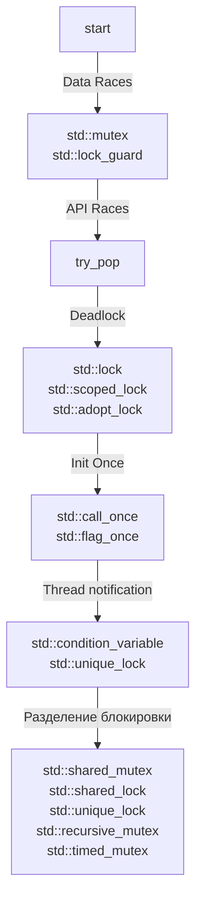
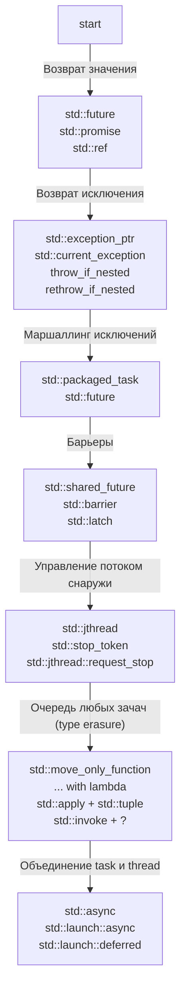

# Konstantin Vladimirov - "Магистерский курс C++, MIPT" - 2022-2023 (Short Notes)

- [My Full Notes](2024-08-09_0010_TILIR_MASTERS_FULL.md)

### 01. Строки

- `SSO` (Small String Optimazations) делает так, что `data` ссылается на память на `стеке`, где находится короткая строка.

### 02. Functions template

- Статический полиморфизм: множество перегрузок и шаблон функции. Динамический полиморфизм: виртуальная фукнция.
- Вместо слова `typename` можно использовать `имя концепта`: `template <std::integral T> void foo(T t)`.
- `Инстанцирование` - это процесс порождения экземпляра специализации. Может быть `явным` или `неявным`.
- `non-type template parameter` можно также **параметризовать указателями** на `nullptr`, на `глобальную память` или `статические объекты`.
- **Выбор пользовательского преобразования зависит от длины хвоста стандартных преобразований**. Голова не участвует в конкурсе.

### 03. Class template

- Переходник типов `Type2Type<T1>` - позволяет решить проблему специализации метода класса по параметру шаблона класса
- Можно использовать `iterator_traits<Iter>::value_type`, а можно написать просто `Iter::value_type`. Однако `iterator_traits` предпочтительнее, потому что он умеет выводить типы для указателей, у которых нет вложенного типа `value_type`.
- **Конструкторы** классов могут использоваться для **вывода типов шаблона класса**.
- `Deduction Hints` - хинты вывода типов могут быть использованы для вывода типов `конструкторами классов` и `агрегатами` (С++17).

### 04. Modules

- `inline` - НОВОЕ ЗНАЧЕНИЕ: означает исключение из ODR. Т.е. чтобы она была в header файле, но одна на все единицы трансляции.
- `inline` нужно использовать в **специализациях шаблонов**, которые специализированы **в header файле**.
- `inline` не влияет на связывание. Функция одна все все единицы трансляции. Это weak функция, и линковщик берет первую попавшуюся.
- `if constexpr` влияет на инстанцирование и на ODR. `if constexpr(false)` - внутренности не попадают под `ODR`.
- `namespaces` ортогональны модулям.

### 05. SFINAE

- Настоящее место SFINAE - выкрутится там, где не хватает средств языка.
- SFINAE - применяется как костыль для создания более явного интерфейса в шаблонах через `enable_if`.

### 06. Constexpr

- `constexpr` - не входит в cdecl.
- `if constexpr` - выкидывает ветки шаблонных инстанцирований. Дурной тон - использовать `if constexpr` вне процесса инстанцирования.
- `if constexpr` + `static_assert` - позволяет делать `SFINAE` внутри функции. Хорошие сообщения об ошибке, но приходится лезть внутрь функции.
- `constexpr переменная` - всегда на этапе компиляции. `constexpr функция` - может быть вызывана во время компиляции и во время выполнения.
- Невозможно создать локальную `constinit` переменную.
- `if consteval` (C++23) - помогает узнать внутри функции, находимся мы на этапе компиляции или на этапе выполнения.
- В `C++14` добавился процесс `constexpr-evaluation` к таким процессам, как инстанцирование вывод типов и подобное.
- Constexpr SFINAE характеристик - является концептом.
- В `constexpr-функциях` на этапе компиляции запрещено UB. Возникает `compile-time error`. Поэтому их можно использовать как санитайзеры.

### 07. Concepts

- `devlal<T>()` - позволяет создать ссылку на объект, даже если у него запрещен конструктор.
- Костыль: Используем `SFINAE`, чтобы сделать более `явным интерфейс`. Способы:
  - (1) Ввести шаблонный параметр без имени (потому что не используем): `typename = std::enable_if_t <is_equality_comparable<T, U>::value>>`
  - (2) Испортить возвращаемый тип (усложняется перегрузка, потому что по возвращаемому значению перегружать нельзя).
  - (3) Испортить один из параметров функции (получаем испорченный вывод типов).
- Constrains (`requires`) не определяют частичный порядок.
- Концепты (`requires requires` и `concept`) определяют над собой частичный порядок (частное-общее).

### 08. Type Inference (Вывод типов)

- Категории характеризуют выражения, но не типы.

- Категории выражений:
  - `prvalue`- это рецепт для построения объекта, но не сам объект. **Не имеет локации в памяти**, но может быть преобразовано в `xvalue`.
  - `xvalue` - (Expiring Value) образуется, когда мы вызываем `std::move` на объекте, что означает, что объект **имеет локацию** в памяти и **может быть перемещен**.
  - `lvalue` - (Locator Value) - это объект, который **имеет локацию** в памяти и **не может быть перемещен**.

- У `rvalue` всегда есть дефолтный конструктор, даже если у объекта удалён конструктор.
  - Это позволяет использовать `declval` для создания выражений, которые можно использовать в `decltype`, чтобы получить нужный тип, не создавая реальный объект.
- Надо различать вызван ли `decltype` от `имени` или от `выражения`.
  - Для `имени` он выводит тип переменной, как она была объявлена.
  - Для `lvalue выражений` он добавляет `&`.
  - Для `xvalue выражений` он добавляет `&&`.
  - Для `prvalue выражений` он ничего не добавляет.

- `auto` режет ссылки и константность.
- `decltype(auto)` ведет себя как `decltype`, но при этом выводится из всей правой части.
  - Если правая часть — это имя, то `decltype` работает по правилам работы с именами,
  - а если правая часть — это выражение, то `decltype` работает по правилам работы с выражениями.
- `auto` можно уточнять концептами: `void sort(Sortable auto&);`
- Никогда не используйте `негативные ограничения` для шаблонов. Негативные ограничения ограничивают типы, которые "дурно пахнут", но могут зацепить другие типы, которые вы не хотите пропускать в функцию.

### 09. Variadics

- `std::conjunction` — это логическое "и" для типов, которое используется в работе с вариативными шаблонами (variadic templates).
- Каррирование: `template <ConvertibleTo<int> ... Ts> void f(Ts ... ts);` - типы подставляются перед int: `ConvertibleTo<Ts, int>`
- Откусывание пачки запрещено в концептах, поэтому если мы пишем концепт для пачки, то мы можем использовать только свертку.
- Пачка параметров обычно должна идти последним аргументом, т.к. из за жадности она заберет все последующие аргументы.

### 10. Lambdas

- `Lambda-выражение` без захвата - это объект `closure` с перегруженным `оператором приведения` к указателю на функцию.
- Вместо вызова `obj()` можно использовать `std::invoke(obj)`. Позволяет вызывать поля!
- `Positive Lambda Hack` заключается в использовании оператора `+` перед лямбда-функцией для явного вызова приведения кложуры к типу указателя на функцию.
- `decltype( { return 2 * x; })` - лучший способ запомнить lambda тип (С++20).
- Явные шаблонные аргументы (С++20) в лямбдах: `auto f = []<typename T>(T x) { return 2 * x; };`
- Захват по константной ссылке: `auto l = [&x = std::as_const(x)]() { x = 2; };`.
- Захват c переименованием дает возможно сделать move: `auto l = [y = std::move(x)]() { x = 2; };`.
- Захват пачки параметров:
  - `auto lm1 = [args...] { return sizeof...(args); };                 // возможность раскрыть пачку в списке инициализации`.
  - `auto lm2 = [...xs = args] { return sizeof...(xs); };              // перекладывание пачки в пачку`.
  - `auto lm3 = [&...xs = args] { return sizeof...(xs); };             // захват пачки с capture reference (сделали все ссылками)`.
  - `auto lm4 = [...xs = std::move(args)] { return sizeof...(xs); };   // захват пачки с переименованием (move каждого элемента)`.
- `Карирование функции` - это частичная подстановка ее аргументов
- `std::tuple` - прекрасные хранилища аргументов.
- Несколько способов создать `std::tuple`:
  1. конструктор
  2. `tuple<VTypes...> make_tuple(Types&&...)` - создает tuple с автовыводом типов. Похож на захват по значению.
  3. `tuple<CTypes...> tuple_cat(Tuples&&...)` - конкатенация - рассыпаем и захватываем.
  4. `tuple<Types&...> tie(Types&...)` - создает ссылки на переменные.
  5. `tuple<T&&...> forward_as_tuple(T&&...)` - берет T&& и форвардит его в T&&. Форвардим каждый элемент пачки.
- `std::apply` - для применения функции к каждому агрументу.
- `std::any` - стирает типы. Превращает С++ в Python.
- `std::variant` - альтернатива `std::any`, которая хранит только один из заданных типов.
- Своя перегрузка методов на `std::variant`: `template<typename ... F> struct overloaded : F... { using F::operator()...; };`.
- `std::function` - это аналог `std::any`, но для функций. По сути это красиво обернутый `void*`. Использует кучу в отличие от лямбда функций.
- `deducing this`: `auto func = [y](this auto&& self, int x) { .... };`  // <=== сделать `move` захвата (`y`) в зависимости от свойств `self`.

### 11. Ranges

### 12. Allocators

- `union` сам по себе не вызывает конструкторы по умолчанию для своих членов.
- `Сторожевой узел` - может присутствовать в классе листа, чтобы упростить алгоритмы для работы со списком.

### 13. Smart Pointers

- `std::tuple` используется для оптимизации хранения указателя и делитера в классе `unique_ptr`.
- Контрольный блок убивает данные, которые он охраняет, когда заканчивается `счетчик сильных ссылок`.
- Контрольный блок убивает себя сам, когда заканчивается `счетчик слабых ссылок`.

### 14. Dynamic Polymorphism

- Виртуальными таблицами управляет most derived тип, но положение виртуальных таблиц фиксировано. Это известно на этапе компиляции.
- `static_cast` может кастовать в обычных иерархиях даже вниз.
- Через RTTI не видимы неоднозначные базовые классы.
- Через RTTI не видимы недоступные (protected inheritance) базовые классы.
- CRTP наоборот - шаблонный класс наследуем от нешаблонного, чтобы унифицировать type erasure.

### 15. Concurrency

- `логическая многопоточность` - это когда один поток выполняет несколько задач поочередно.
- `аппаратная многопоточность` - это когда несколько потоков выполняются одновременно на разных ядрах процессора.
- Если вы не сделали `join` или `detach` на `std::thread`, то это UB.
- `volatile` - это обещание компилятору, что значение переменной может измениться вне текущего потока выполнения.
- `std::scoped_lock` (C++17) - RAII, который лочит сразу несколько мьютексов в правильном порядке. Отпускает в деструкторе. Заменяет `std::lock` + `std::lock_guard`.
- `new` - thread-safe. Это глобальный синхронизируемый ресурс. Когда вы вызываете `new`, то внутри `new` есть `mutex`. Это означает, что на любом `new` у вас начинают сериализоваться потоки.
- `std::call_once` берет в себя `std::flag_once`, что-то делает и потом если этот флаг не инициализирован, то вызывает функцию, переданную ей вторым аргументом.
- `std::this_thread::yeild` - делает spin-lock довольно дешевым `while (!resready) { std::this_thread::yield(); }`.
- `std::unique_lock` - введен для работы с `std::condition_variable`. Помимо RAII его можно `unlock` и `lock` в любой момент. Он тяжелее `std::lock_guard`, потому что в нем лежит флаг, который показывает, залочен ли мьютекс.
- Ожидание `std::condition_variable::wait(...)` может закончиться само по себе (`spurious wake up`)
- `strace -f` - утилита для отслеживания системных вызовов. Помогает отладить потоки. `procmon` - аналог для Windows.
- `futex` - это user-space мьютекс. Он используется в `std::mutex` и `std::condition_variable`. Он не хочет быть тяжелым.
- `perf` - утилита для профилирования. Помогает понять, что происходит внутри программы на уровне ассемблера.
- `perf` - отсутствует на WSL. Аналог perf под Windows это `VTune`.
- `std::shared_mutex` - умеет работать с `std::shared_lock` и `std::unique_lock`.
- `std::shared_lock` - если `std::unique_lock` захвачен, тогда захвати тоже и остановись. А если `std::unique_lock` не захвачен, то проскочи насквозь.
- Хотя потоки не толкаются локтями, но сам по себе `std::shared_mutex` дороже, чем `std::mutex`.
  - `std::unique_lock` вызывает ptherad_mutex_lock и ptherad_mutex_unlock, которые **не входят в kernal space**. Он работает в user space с помощью futex.
  - `std::shared_lock` вызывает ptherad_rwlock_rdlock и ptherad_rwlock_unlock, которые **входят в kernal space**. Поэтому он дороже.
`std::recursive_mutex` - АНТИПАТТЕРН - внутри себя ведет счетчик расщелкиваний и защелкиваний.

## 16. Многопоточные очеререди (multithreaded queues)

- Ментальная модель `mutex` - это очередь. Три котенка забегают в трубу за лягушкой.
`std::future` и `std::promise` - используются для возврата значения из потока.
- `std::promise::set_exception` - устанавливает исключение в `std::future`. Встроенный механизм для передачи исключений между потоками. Выбрасывается в момент `std::future::get`.
- `std::packaged_task`  - это функтор (т.е. его можно исполнить на thread), который уже содержит `std::promise` внутри себя.
- `std::jthread` (C++20) умеет принимать `std::stop_token` и умеет вызывать `join` в деструкторе.
- `std::shared_future` - это `std::future`, который можно копировать. Делается из обычного `std::future`. Чем-то похожа на `std::shared_ptr`.

## 17. Atomics

- `std::sig_atomic_t` - это атомарный тип, который гарантирует, что его можно безопасно использовать в сигналах. Обработчики сигналов могут быть вызваны асинхронно.

## 18. Parallelism

- `std::async` - это `std::packaged_task` + `std::thread`. Он возвращает `std::future`.
