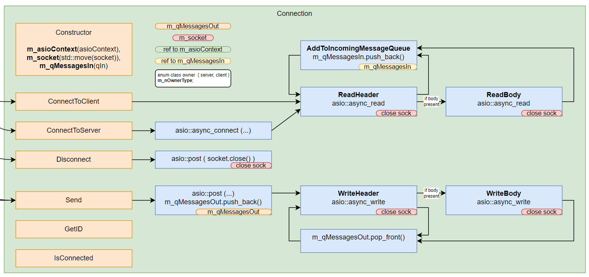
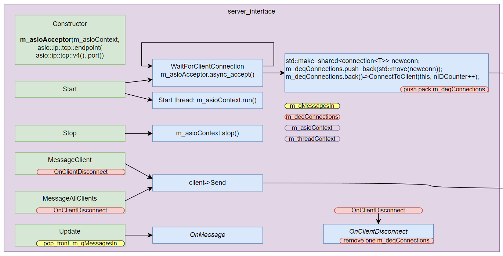
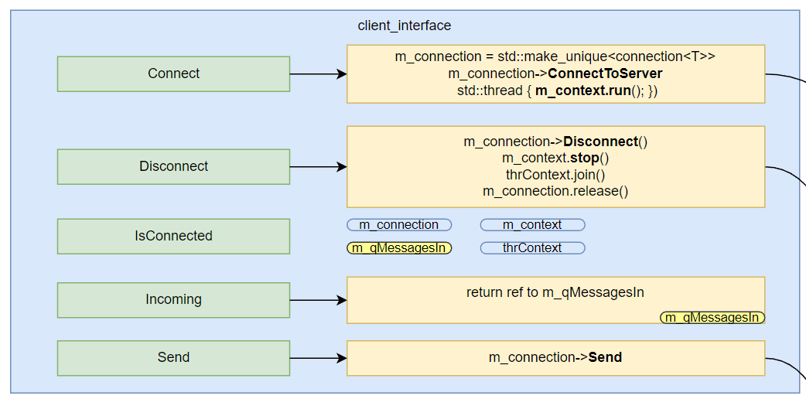
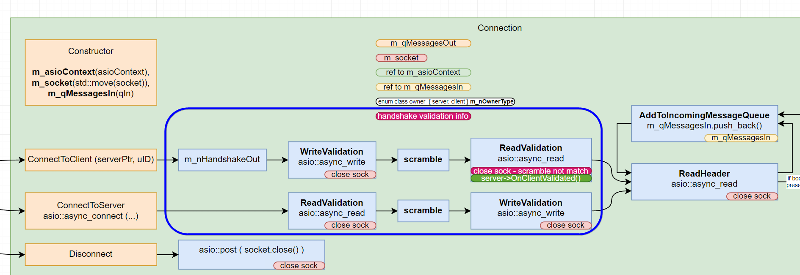
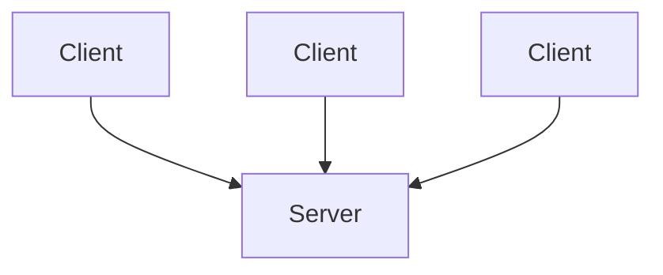

# javidx9 - Networking in C++: MMO Client/Server, ASIO & Framework Basics - 2020

- [About the course](#about-the-course)
- [Networking in C++ Part #1](#networking-in-c-part-1)
  - [`message_header<T>` - заголовок сообщения](#message_headert---заголовок-сообщения)
  - [`message<T>` - cтруктура для передачи по сети](#messaget---cтруктура-для-передачи-по-сети)
  - [`owned_message<T>` - сообщение с данными об отправителе](#owned_messaget---сообщение-с-данными-об-отправителе)
  - [`thread_safe_queue` - класс для безопасной много поточной работы с очередью](#thread_safe_queue---класс-для-безопасной-много-поточной-работы-с-очередью)
  - [Общая структура клиента и сервера](#общая-структура-клиента-и-сервера)
  - [Архитектура класса `connection<T>`](#архитектура-класса-connectiont)
- [Networking in C++ Part #2](#networking-in-c-part-2)
  - [Server responsibilities](#server-responsibilities)
  - [ASIO context](#asio-context)
  - [Асинхронные задачи сервера](#асинхронные-задачи-сервера)
  - [Архитектура интерфейса сервера `server_interface<T>`](#архитектура-интерфейса-сервера-server_interfacet)
  - [Создание конректного сервера, который использует `server_interface<T>`](#создание-конректного-сервера-который-использует-server_interfacet)
  - [Архитектура клиентского интерфейса `client_interface<T>`](#архитектура-клиентского-интерфейса-client_interfacet)
  - [Putty - тулза для тестирования сетевых приложений](#putty---тулза-для-тестирования-сетевых-приложений)
  - [`connection<T>` - класс, который абстрагирует детали и зависимость от ASIO](#connectiont---класс-который-абстрагирует-детали-и-зависимость-от-asio)
- [Networking in C++ Part #3](#networking-in-c-part-3)
  - [Handshake validation architecture](#handshake-validation-architecture)
- [Networking in C++ Part #4 - Game design utilizing the networking framework](#networking-in-c-part-4---game-design-utilizing-the-networking-framework)
  - [Базовые понятия](#базовые-понятия)
  - [Variant 1 - When client applications very passive](#variant-1---when-client-applications-very-passive)
  - [Variant 2 - When client applications very active but server keep load down](#variant-2---when-client-applications-very-active-but-server-keep-load-down)

## About the course

- Author: [javidx9](https://www.github.com/OneLoneCoder)
- [https://github.com/marleeeeeey/network_asio_experience](https://github.com/marleeeeeey/network_asio_experience)

## Networking in C++ Part #1

- https://www.youtube.com/watch?v=2hNdkYInj4g

### `message_header<T>` - заголовок сообщения

- `message_header` - известного размера заголовок с типом сообщения и длиной сообщения.
  - Тип сообщения `T` - это перечисление, которое определяет тип сообщения.
  - Так как это шаблон, пользователь либы может настроить тип сообщения на свой.

```cpp
template <typename T>
struct message_header
{
    T id{};
    uint32_t size = 0; // size_t is not used because it is platform dependent.
};
```

### `message<T>` - cтруктура для передачи по сети

- Стурктура `message<T>` содержит
  - `message_header`
  - Тело сообщения `body` - это массив байтов, который содержит данные сообщения.
  - Вспомогательные методы для удобной сериализации и десериализации данных в сообщение.

```cpp
template <typename T>
struct message
{
    message_header<T> header{};
    std::vector<uint8_t> body; // bytes
    // ... methods
    template <typename DataType>
    friend message<T>& operator<<(message<T>& msg, const DataType& data);
    template <typename DataType>
    friend message<T>& operator>>(message<T>& msg, DataType& data)
}
```

### `owned_message<T>` - сообщение с данными об отправителе

- Сервер должен понимать, от какого клиента пришло сообщение.
- `owned_message<T>` помимо сообщения содержит указатель на соединение, от которого пришло сообщение.

```cpp
template <typename T>
struct owned_message
{
    std::shared_ptr<connection<T>> remote = nullptr; // Server needs to identify which client sent the message.
    message<T> msg;

    // Overload the << operator for std::cout compatibility.
    friend std::ostream& operator<<(std::ostream& os, const owned_message<T>& msg)
    {
        os << msg.msg;
        return os;
    }
};
```

### `thread_safe_queue` - класс для безопасной много поточной работы с очередью

```cpp
template <typename T>
class thread_safe_queue
{
public:
    thread_safe_queue() = default;
    thread_safe_queue(const thread_safe_queue<T>&) = delete;
    virtual ~thread_safe_queue() { clear(); }
public:
    const T& front();                   // <=== Main methods to work with the queue.
    const T& back();                    // <
    void push_back(const T& item);      // <
    void push_front(const T& item);     // <
    T pop_front();                      // <
    T pop_back();                       // <

    bool empty();
    size_t count();
    void clear();
    void wait();                        // Wait until the queue is not empty
protected:
    std::mutex muxQueue;                // Mutex to protect the double-ended queue.
    std::deque<T> deqQueue;             // Double-ended queue to hold the data.
    std::condition_variable cvBlocking; // Condition variable to block the thread until the queue has data.
    std::mutex muxBlocking;             // Mutex to protect the condition variable.
};
```

### Общая структура клиента и сервера

- `thread_safe_queue` - очередь, доступ к которой шариться между `connection` и `client`/`server`.
- `connection` responsabilities
  - Абстргирует детали и зависимость от ASIO.
- `client` responsabilities
  - Содержит `connection`, `ASIO context`, `socket`, `thread` для ASIO, очередь входящих сообщений.
  - Содержит только одно соединение.
  - Отвественный за настройку ASIO и соединения.
  - Точка доступа для общения с сервером.
- `server` responsabilities
  - Содержит `ASIO context`, `acceptor`, `thread` для ASIO, очередь входящих сообщений.
  - Содержит множество соединений.
  - Отвественный за настройку ASIO и соединений.
  - Точка доступа для общения с клиентами.
  - Запускает игру.


### Архитектура класса `connection<T>`



## Networking in C++ Part #2

- https://www.youtube.com/watch?v=UbjxGvrDrbw

### Server responsibilities

- Отвественный за подключение и отключение клиентов.
- Также имплементирует игровую логику.
- По задумке автора, игровая логика наследует `server_interface<T>`, и client-side-functionality логика наследует клиент.
  - Таким решением можно объяснить наличие protected методов. Я с таким не согласен. Я бы лучше использовал композицию.

### ASIO context

- ASIO context - это центральный класс, который управляет всеми асинхронными операциями в ASIO.
  - В него добавляются асинхронные задачи с калбеками.
  - Когда задача завершается, ASIO вызывает калбек.
  - Когда все задачи завершены, ASIO завершает работу, поэтому нужно постоянно кормить его задачами.

### Асинхронные задачи сервера

- (1) Задача `accept connection`
  - Ждет подключения клиента
  - Создает сокет для клиента
  - Создает класс `connection` для клиента.
  - Сервер может отклонить (reject) подключение и уничтожить connection.
  - Либо принять (accept) подключение и добавить connection в список активных соединений.
  - В конце задачи `accept connection`
    - снова запускается задача `accept connection`. Чтобы сервер **постоянно ждал новых подключений**.
    - Запускается задача `read header`.

- (2) Задача `read header`
  - Ждет сообщение от клиента и читает заголовок сообщения.
  - Запускается на каждом соединении.
  - Как только пришло достаточное количество байт размера `message_header`, запускается задача `read body`.

- (3) Задача `read body`
  - Ждет сообщение от клиента и читает тело сообщения.
  - Добавляет сообщение в очередь входящих сообщений на сервере. Используется класс `owned_message`.
  - `owned_message` нужно для того, чтобы сервер мог идентифицировать, от какого клиента пришло сообщение.

### Архитектура интерфейса сервера `server_interface<T>`



### Создание конректного сервера, который использует `server_interface<T>`

```cpp
enum class CustomMsgTypes : uint32_t
{
    ServerAccept, ServerDeny, ServerPing, MessageAll, ServerMessage,
};

class CustomServer : public net::server_interface<CustomMsgTypes>
{
public:
    CustomServer(uint16_t port) : net::server_interface<CustomMsgTypes>(port) {}
    // ... override methods
}

int main()
{
    CustomServer server(60000);
    server.Start();
    while (true)
        server.Update(-1, true);
}
```

### Архитектура клиентского интерфейса `client_interface<T>`



### Putty - тулза для тестирования сетевых приложений

- [https://www.putty.org/](https://www.putty.org/)
- Может подключаться к серверу по TCP и отправлять сообщения.

### `connection<T>` - класс, который абстрагирует детали и зависимость от ASIO

```cpp
void connection<T>::Send(const message<T>& msg)
{
    asio::post(
        m_asioContext,
        [this, msg]()
        {
            bool bWritingMessage = !m_qMessagesOut.empty();     // <=== If the queue has a message in it, then we must
            m_qMessagesOut.push_back(msg);                      //      assume that it is in the process of asynchronously being written.

            if (!bWritingMessage)                               // <=== If we weren't writing messages before, then
                WriteHeader();                                  //      we must start the process of writing the message at the front of the queue.
        });
}
```

## Networking in C++ Part #3

- https://www.youtube.com/watch?v=hHowZ3bWsio

### Handshake validation architecture



## Networking in C++ Part #4 - Game design utilizing the networking framework

- https://www.youtube.com/watch?v=f_1lt9pfaEo

### Базовые понятия

- RX означает Receiver или Receiving — "Приёмник" или "Приём". Это относится к устройству или процессу, который принимает данные.
- TX означает Transmitter или Transmitting — "Передатчик" или "Передача". Это относится к устройству или процессу, который отправляет данные.

### Variant 1 - When client applications very passive

- No one player has direct control over the game world.
- Every client very passive.
- No one player any more important than any other.
- Props:
  - Local client very responsive.
- Cons:
  - RTT (Round Trip Time) is very high: 50ms + 50ms = 100ms.



```cpp
while (true)
{
    Rx Players Update       - Client will receive command from the server
    Update Player[Id]       - On client side (position, health, etc.)
    Get Input               - Local input for my player
    Update [My Id]          - Local Update my player locally
    Tx Player[My Id]        - Send my player update to the server
    Update Whole Wold/Draw  - Update Whole World
}
```

### Variant 2 - When client applications very active but server keep load down
