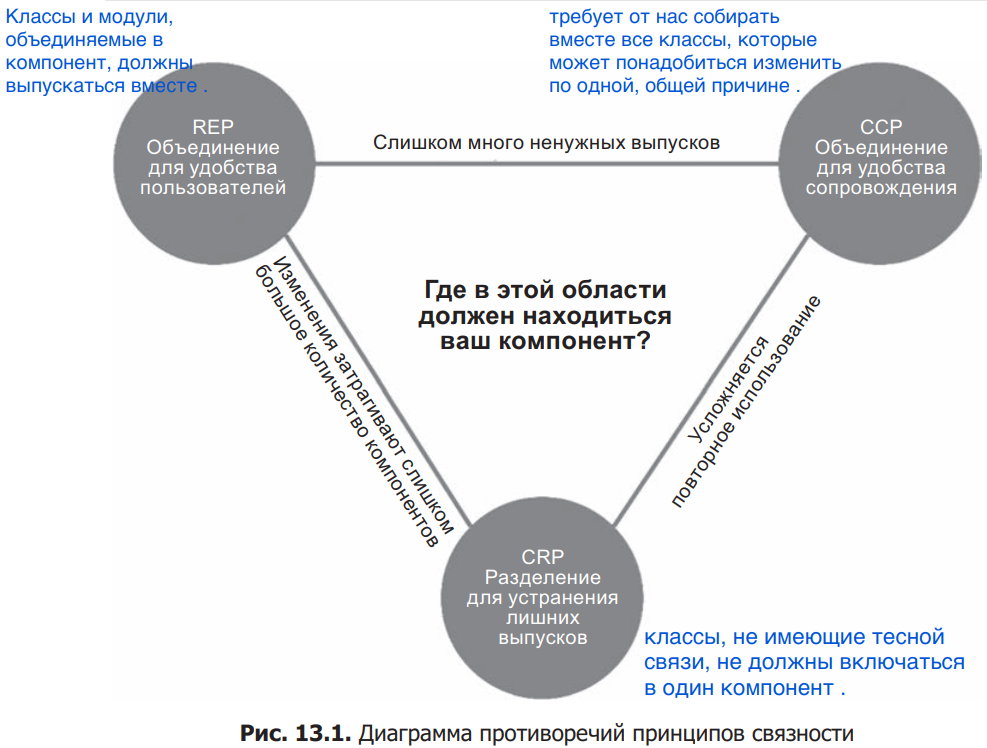

# Robert C. Martin - Clean Architecture

- [About the author](#about-the-author)
- [Важные моменты](#важные-моменты)
  - [Обозначения в книге](#обозначения-в-книге)
  - [Как я могу применить эти знания в своих проектах](#как-я-могу-применить-эти-знания-в-своих-проектах)
- [Часть I. Введение](#часть-i-введение)
  - [Глава 1. Дизайн и архитектура](#глава-1-дизайн-и-архитектура)
  - [Глава 2. Две ценности](#глава-2-две-ценности)
- [Часть II. Начальные основы: парадигмы программирования](#часть-ii-начальныеосновы-парадигмы-программирования)
  - [Глава 3. Парадигмы программирования](#глава-3-парадигмы-программирования)
  - [Глава 4. Структурное программирование](#глава-4-структурное-программирование)
  - [Глава 5. Объектно-ориентированное программирование](#глава-5-объектно-ориентированное-программирование)
  - [Глава 6. Функциональное программирование](#глава-6-функциональное-программирование)
- [Часть III. Принципы дизайна](#часть-iii-принципы-дизайна)
  - [Глава 7. Принцип единственной ответственности (SRP)](#глава-7-принцип-единственной-ответственности-srp)
  - [Глава 8. Принцип открытости-закрытости (OCP)](#глава-8-принцип-открытости-закрытости-ocp)
  - [Глава 9. Принцип подстановки Барбары Лисков (LSP)](#глава-9-принцип-подстановки-барбары-лисков-lsp)
  - [Глава 10. Принцип разделения интерфейсов (ISP)](#глава-10-принцип-разделения-интерфейсов-isp)
  - [Глава 11. Принцип инверсии зависимости (DIP)](#глава-11-принцип-инверсии-зависимости-dip)
- [Часть IV. Принципы организации компонентов](#часть-iv-принципы-организации-компонентов)
  - [Глава 12. Компоненты](#глава-12-компоненты)
  - [Глава 13. Связность компонентов](#глава-13-связность-компонентов)
  - [Глава 14. Сочетаемость компонентов](#глава-14-сочетаемость-компонентов)
- [Часть V. Архитектура](#часть-v-архитектура)
  - [Глава 15. Что такое архитектура?](#глава-15-что-такое-архитектура)
  - [Глава 16. Независимость](#глава-16-независимость)
  - [Глава 17. Граница](#глава-17-граница)
  - [Глава 18. Анатомия границ](#глава-18-анатомия-границ)
  - [Глава 19. Политика и уровень](#глава-19-политика-и-уровень)
  - [Глава 20. Бизнес-правила](#глава-20-бизнес-правила)
  - [Глава 21. Кричащая архитектура](#глава-21-кричащая-архитектура)
  - [Глава 22. Чистая архитектура](#глава-22-чистая-архитектура)
  - [Глава 23. Презентаторы и скромные объекты](#глава-23-презентаторы-и-скромные-объекты)
  - [Глава 24. Неполные границы (не понял эту главу)](#глава-24-неполные-границы-не-понял-эту-главу)
  - [Глава 25. Уровни и границы](#глава-25-уровни-и-границы)
  - [Глава 26. Main компонент](#глава-26-main-компонент)
  - [Глава 27. Службы](#глава-27-службы)
  - [Глава 28. Границы тестов](#глава-28-границы-тестов)
  - [Глава 29. Чистая встраиваемая архитектура](#глава-29-чистая-встраиваемая-архитектура)
- [Часть VI. Детали](#часть-vi-детали)
  - [Глава 30. База данных — это деталь](#глава-30-база-данных--это-деталь)
  - [Глава 31. Веб — это деталь](#глава-31-веб--это-деталь)
  - [Глава 32. Фреймворк — это деталь](#глава-32-фреймворк--это-деталь)

## About the author

- http://cleancoders.com

## Важные моменты

### Обозначения в книге

- `<I>` - обозначение интерфейса.
- `<DS>` - обозначение структуры данных.
- `<T>` - обозначение шаблона.
- `<A>` - обозначение абстракции.
- Стрелочка использования (UML) обычно направлена по потоку управления.
- Стрелочка наследования(UML) часто направлена обратно потоку управления, если применяется для инверсии зависимостей.

### Как я могу применить эти знания в своих проектах

- Я могу снизить просачивание зависимостей из низкоуровневых либ вроде SDL и GLM в код игровой логики.
- Можно попытаться сделать ImGui плагином для подсистемы двумерной графики, создав в бизнел логике высокоуровневый интерфейс для рисования меню и диалогов.

## Часть I. Введение

### Глава 1. Дизайн и архитектура

Программное обеспечение часто страдает от нарастающего беспорядка, вызванного поспешной реализацией функций без должного внимания к качеству кода. Разработчикам нужно взять на себя ответственность за созданный беспорядок и с самого начала уделять внимание архитектурной составляющей, чтобы избежать необходимости переписывать систему.

### Глава 2. Две ценности

В каждой программной системе важны две вещи — поведение и структура. Разработчикам необходимо фокусироваться на важности архитектуры и поддерживаемости кода, даже если срочные задачи требуют скорейшего изменения поведения.

- **У меня есть два вида дел, срочные и важные. Срочные дела, как правило, не самые важные, а важные — не самые срочные.** — Дуайт Эйзенхауэр

## Часть II. Начальные основы: парадигмы программирования

### Глава 3. Парадигмы программирования

Рассматриваются три основные парадигмы: структурное, объектно-ориентированное и функциональное программирование. Каждая из них накладывает свои ограничения: структурное программирование — на управление потоком, ООП — на косвенные передачи управления, а функциональное — на присваивание. Эти парадигмы используются для создания модулей, которые обеспечивают модульность и управляемость системы.

### Глава 4. Структурное программирование

Любая программа может быть создана, используя три основные структуры: последовательность, выбор и итерацию. Структурное программирование делает акцент на разложение программы на доказуемые единицы через функциональную декомпозицию, что позволяет эффективно тестировать код и выявлять ошибки.

Возможность создавать программные единицы, неправильность которых можно доказать, является главной ценностью структурного программирования. Поэтому функциональная декомпозиция считается одним из лучших приемов на архитектурном уровне.

### Глава 5. Объектно-ориентированное программирование

Основные концепции ООП — наследование, инкапсуляция и полиморфизм. Полиморфизм позволяет избежать изменений в коде при изменении поведения объектов и способствует реализации принципа **инверсии зависимостей**. Благодаря полиморфизму зависимости между высокоуровневыми и низкоуровневыми модулями могут быть инвертированы — вместо того чтобы высокоуровневые модули зависели от низкоуровневых, оба типа модулей **зависят от абстракций**. Это позволяет архитекторам системы создавать модули и **плагины**, которые могут быть взаимозаменяемыми и разрабатываться независимо, обеспечивая гибкость и контроль над направлением зависимостей в коде.

### Глава 6. Функциональное программирование

В функциональном программировании переменные неизменяемы. Это исключает состояния гонки и проблемы одновременного изменения. Архитекторы должны стремиться минимизировать изменяемый код и использовать как можно больше неизменяемых компонентов. Основной урок последних десятилетий — учиться тому, как не надо делать, через ограничения парадигм.

## Часть III. Принципы дизайна

### Глава 7. Принцип единственной ответственности (SRP)

Модуль должен иметь только одну причину для изменения. Применение этого принципа предполагает разбиение кода на компоненты, каждый из которых отвечает за конкретную задачу. На уровне компонентов SRP трансформируется в принцип Common Closure, а на архитектурном уровне — в принцип оси изменения, что помогает создавать архитектурные границы.

Можно использовать, в конце концов, фасад для низковыровневых функций, если их очень много.

### Глава 8. Принцип открытости-закрытости (OCP)

Код должен быть открыт для расширений, но закрыт для изменений. Правильная организация зависимостей между компонентами предотвращает изменения в одном компоненте от влияния на другие. Важно направлять зависимости от конкретных компонентов к абстракциям, что позволяет инвертировать направление зависимостей и создавать более устойчивую архитектуру.

- Программные сущности не должны зависеть от того, что они никогда не используют непосредственно.
- Транзитивные зависимости нарушают общий принцип.

### Глава 9. Принцип подстановки Барбары Лисков (LSP)

Подтипы должны заменять базовые типы без изменения поведения программы. Этот принцип гарантирует корректное поведение программ при замене объектов одного типа их подтипами. Если поведение меняется, то нарушается совместимость типов, что подрывает устойчивость системы.

### Глава 10. Принцип разделения интерфейсов (ISP)

Интерфейсы должны быть узкоспециализированными, чтобы клиенты не зависели от ненужных им методов. Этот принцип предотвращает создание модулей, содержащих избыточные зависимости, и делает код более чистым и управляемым.

### Глава 11. Принцип инверсии зависимости (DIP)

Зависимости должны быть направлены на абстракции, а не на конкретные реализации. Интерфейсы менее изменчивы, чем конкретные классы, поэтому хорошая архитектура минимизирует зависимости от изменчивых компонентов, направляя зависимости на устойчивые абстракции.

## Часть IV. Принципы организации компонентов

### Глава 12. Компоненты

Компоненты — это единицы развертывания, такие как библиотеки (например, DLL), которые могут разрабатываться и развёртываться независимо. Эта независимость важна для сокращения времени компиляции и улучшения поддержки системы. С развитием технологий появилась возможность загружать компоненты во время выполнения, что привело к созданию архитектур на основе плагинов. Динамически связанные файлы, которые можно включать в систему на этапе выполнения, представляют собой программные компоненты, играющие ключевую роль в современных архитектурах.

### Глава 13. Связность компонентов

Три принципа связности компонентов:
- **REP (Reuse-Release Equivalence Principle)** — компоненты, которые можно повторно использовать, должны выпускаться и поддерживаться вместе.
- **CCP (Common Closure Principle)** — классы в компоненте должны быть закрыты для одних и тех же изменений.
- **CRP (Common Reuse Principle)** — классы, которые используются вместе, должны быть объединены в один компонент.

Эти принципы помогают найти баланс между поддерживаемостью и удобством повторного использования компонентов. Но нужно учитывать, что этот баланс со временем может изменяться в зависимости от потребностей проекта. Также напоминаю, что в этой главе была диаграмма противоречия принципов связанности, которую нужно добавить в твои заметки.

Состав компонентов почти наверняка будет меняться с течением времени и смещением фокуса проекта с удобством разработки к удобству повторного использования.

### Глава 14. Сочетаемость компонентов

Здесь вводятся важные принципы управления зависимостями:
- **Принцип отцикличности зависимости (Acyclic Dependency Principle)** — циклы в графе зависимостей компонентов недопустимы. Для устранения циклов следует разделять проект на компоненты, которые могут выпускаться независимо, используя **Dependency Inversion Principle** для разрыва циклических зависимостей.

- **Принцип устойчивых зависимостей (Stable Dependencies Principle, SDP)** — зависимости должны направляться в сторону устойчивости. Это означает, что компоненты, которые трудно изменить, не должны зависеть от изменчивых компонентов. **Метрика устойчивости (I)** измеряется как отношение числа исходящих зависимостей к сумме исходящих и входящих зависимостей. Уровень устойчивости колеблется от 0 (максимальная устойчивость) до 1 (максимальная неустойчивость).

- **Принцип устойчивости абстракции (Stable Abstractions Principle, SAP)** — устойчивость компонента пропорциональна его абстрактности. Устойчивые компоненты должны быть абстрактными, а неустойчивые — конкретными. **Метрика абстрактности (A)** определяется как отношение числа абстрактных классов (na) к общему числу классов (nc) в компоненте, и варьируется от 0 до 1.

Также важно помнить о графике зависимости между метриками абстрактности (A) и неустойчивости (I). Компоненты, находящиеся в «зоне боли» (A=0, I=0), состоят из множества конкретных классов, используемых всеми, тогда как компоненты в «зоне бесполезности» (A=1, I=1) содержат только абстракции, которые никто не использует. Оптимальное расположение находится на **главной последовательности** — линии, на которой классы должны располагаться, чтобы соответствовать хорошему дизайну.

## Часть V. Архитектура

### Глава 15. Что такое архитектура?

Архитекторы — это опытные программисты, которые направляют команду, стремясь минимизировать затраты на протяжении всего жизненного цикла системы и максимизировать продуктивность. Основная цель архитектуры — изолировать бизнес-логику от технических деталей, таких как выбор базы данных, фреймворки или пользовательский интерфейс, позволяя разработчикам принимать решения о деталях на более позднем этапе.

- **Хороший архитектор максимизирует количество непринятых решений** (касается фреймворков, баз данных и т. д.).

### Глава 16. Независимость

Принцип независимости заключается в том, чтобы отделять все, что изменяется по разным причинам, и объединять те элементы, которые изменяются по одной причине. Вместе с **горизонтальным** делением на слои система должна разделяться на тонкие **вертикальные** варианты использования.

**Дублирование кода не всегда плохо**. Если два фрагмента кода, кажущиеся одинаковыми, развиваются разными путями - если они изменяются с разной скоростью и по разным причинам - этот случай не является истинным дублированием. Желательно избежать их объединения, иначе потом разделить их будет очень сложно.

Хорошая архитектура позволит создать монолитную систему, развертываемую как один файл, а затем превратить ее в набор независимых единиц развертывания и далее в независимые службы и микросервисы.

### Глава 17. Граница

Границы помогают изолировать бизнес-логику от деталей. Эти границы можно проводить между бизнес-правилами, базой данных и пользовательским интерфейсом. Направление зависимостей всегда должно идти от деталей к бизнес-логике, чтобы бизнес-логика оставалась независимой. Высокоуровневые компоненты не должны зависеть от низкоуровневых. Правильное проектирование границ позволяет системе легко адаптироваться к изменениям.

### Глава 18. Анатомия границ

Границы остаются важными, даже если они не видны в монолитной системе. Зависимости должны пересекать границы только в одном направлении: от низкоуровневых компонентов к высокоуровневым. Это гарантирует, что высокоуровневые компоненты остаются независимыми. В идеале, низкоуровневые компоненты становятся плагинами для высокоуровневых процессов.

### Глава 19. Политика и уровень

Программные системы состоят из множества политик — правил, управляющих преобразованием входных данных в выходные. Эти политики должны быть разделены в зависимости от того, как они изменяются. Политики, изменяющиеся по одной причине, должны быть сгруппированы в одном компоненте, а те, что изменяются по разным причинам, должны быть разделены на разные компоненты.

### Глава 20. Бизнес-правила

Бизнес-правила — это основа любой системы, которая определяет, как зарабатываются или экономятся деньги. В центре системы находятся сущности, которые представляют критические бизнес-данные и правила. Эти сущности должны быть независимыми от таких деталей, как выбор базы данных или пользовательского интерфейса. Бизнес-правила должны быть самым независимым и переиспользуемым кодом в системе.

### Глава 21. Кричащая архитектура

Архитектура системы должна отражать ее предназначение, а не используемые фреймворки. Если это медицинская система, ее структура должна быть очевидна из кода. Новые программисты должны сразу понимать, с какой системой они работают, даже не вдаваясь в детали доставки услуг или реализации.

### Глава 22. Чистая архитектура

Чем ближе к центру, тем выше уровень.
- Внешние круги — это механизмы.
- Внутренние — это политики.
- Центральный уровень — сущности.

В чистой архитектуре зависимости направлены внутрь, к более высоким уровням. Центральным элементом архитектуры являются сущности, encapsulating the most general and high-level rules that are least likely to change. Следующий уровень — варианты использования, представляющие бизнес-правила приложения. Далее идут интерфейсные адаптеры, преобразующие данные для внешних систем, таких как базы данных или веб-интерфейсы. Самый внешний уровень — это детали, такие как базы данных и фреймворки. Принцип заключается в том, что внутренние элементы не должны зависеть от внешних.

- Никакие имена, объявленные во внешних кругах, не должны упоминаться во внутренних.
  - Используйте простейшие структуры или объекты передачи данных – Data Transfer Objects, DTO.
- Мы используем преимущество динамического полиморфизма, чтобы обратить зависимость в исходном коде в направлении противоположным потоку управления.

### Глава 23. Презентаторы и скромные объекты

Шаблон «скромный объект» подразумевает разделение поведения на две части: одна из них трудна для тестирования, но имеет простой код (скромный объект), а другая легко тестируется, но может быть сложной. Применение этого шаблона к архитектурным границам повышает тестируемость системы в целом.

### Глава 24. Неполные границы (не понял эту главу)

В этой главе обсуждаются три подхода к реализации неполных границ: пропуск последнего шага, одномерные границы и фасады. Каждый из этих подходов имеет свои преимущества и недостатки, и их границы могут деградировать, если они никогда не будут полностью материализованы. Архитекторы должны принимать решение, где и как проводить границы, с учетом того, когда это становится необходимым.

### Глава 25. Уровни и границы

Архитекторы должны осторожно подходить к проведению границ и делать это только тогда, когда это необходимо. Игнорирование границ может привести к проблемам в будущем, но чрезмерное усложнение конструкции ненужными границами может быть еще хуже. Границы следует проводить в тот момент, когда их реализация становится дешевле, чем продолжение их игнорирования.

### Глава 26. Main компонент

Функция `Main` находится во внешнем круге архитектуры и отвечает за конфигурирование приложения. Для различных целей, таких как разработка, тестирование и эксплуатация, могут использоваться разные функции `Main`. Это считается самым "грязным" компонентом системы, так как он собирает все зависимости в одном месте.

### Глава 27. Службы

Система, разделенная на службы по функциональному признаку, подвержена рискам, связанным с новыми требованиями, которые могут затрагивать несколько уровней функциональности. При реализации служб следует придерживаться принципов SOLID, использовать интерфейсы и абстрактные классы, а также паттерны, такие как шаблонный метод и стратегия.

### Глава 28. Границы тестов

Тесты являются важной частью системы, поддерживающей разработку, но не эксплуатацию. Хрупкие тесты делают систему жесткой, поэтому тестировать следует через API, а не через UI. API-тестирование скрывает внутреннюю структуру системы от тестов, что делает систему более гибкой. Не нужно тестировать каждый класс внутри приложения.

### Глава 29. Чистая встраиваемая архитектура

Встраиваемые системы должны минимизировать зависимость от конкретного оборудования. Существует три шага разработки программного обеспечения: сначала заставить его работать, затем переписать правильно, и, наконец, оптимизировать его для скорости. Знания о аппаратной части могут "заразить" код, поэтому необходимо создавать абстракции для аппаратного обеспечения (Hardware Abstraction Layer) и процессора (Processor Abstraction Layer). Это позволяет тестировать систему без оборудования и делает код более переносимым.

## Часть VI. Детали

### Глава 30. База данных — это деталь

Базы данных — это детали, и не стоит "просачивать" их в бизнес-логику. Задача базы данных — хранение данных, но это не должно диктовать архитектуру системы. Данные имеют значение, а выбор базы данных — это лишь техническая деталь, которая со временем может меняться.

### Глава 31. Веб — это деталь

Пользовательский интерфейс, включая веб-интерфейс, — это всего лишь деталь системы. Важно отделять бизнес-правила от пользовательского интерфейса, поскольку интерфейс может изменяться или развиваться по мере появления новых требований. Бизнес-правила должны оставаться независимыми от того, как они будут отображаться пользователю.

### Глава 32. Фреймворк — это деталь

Фреймворки, как и пользовательский интерфейс, являются деталями системы. Их нельзя позволять проникать в основной код. Они должны быть подключаемыми, чтобы их можно было легко заменить при необходимости. Хотя сложно избавиться от зависимостей на библиотеки вроде STL, фреймворки следует изолировать от бизнес-логики.
