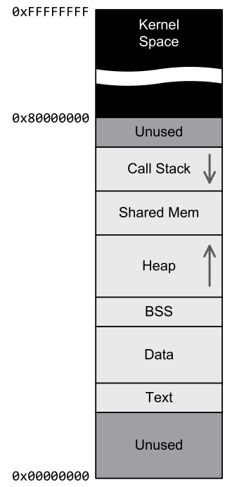

# Jason Gregory - Game Engine Architecture

- [Глава 3. Основы разработки игрового ПО](#глава-3-основы-разработки-игрового-по)
  - [3.1. Обзор C++ и лучшие практики](#31-обзор-c-и-лучшие-практики)
  - [3.2. Поиск и обработка ошибок](#32-поиск-и-обработка-ошибок)
  - [3.3. Данные, код и схема памяти](#33-данные-код-и-схема-памяти)
  - [3.4. Основы аппаратного обеспечения компьютеров](#34-основы-аппаратного-обеспечения-компьютеров)
  - [3.5. Архитектура памяти](#35-архитектура-памяти)
- [Глава 4. Параллелизм и конкурентное программирование](#глава-4-параллелизм-и-конкурентное-программирование)
  - [4.1. Определение конкурентности и параллелизма](#41-определение-конкурентности-и-параллелизма)
  - [4.2. Неявный параллелизм](#42-неявный-параллелизм)
  - [4.3. Явный параллелизм](#43-явный-параллелизм)
  - [4.4. Основы операционной системы](#44-основы-операционной-системы)
  - [4.5. Введение в параллельное программирование](#45-введение-в-параллельное-программирование)
  - [4.6. Примитивы синхронизации потоков](#46-примитивы-синхронизации-потоков)
  - [4.7. Проблемы с параллелизмом на основе блокировки](#47-проблемы-с-параллелизмом-на-основе-блокировки)
  - [4.8. Несколько лучших практик параллелизма](#48-несколько-лучших-практик-параллелизма)
  - [4.9. Параллелизм без блокировок](#49-параллелизм-без-блокировок)
  - [4.10. SIMD/векторная обработка](#410-simdвекторная-обработка)
  - [4.11. Введение в программирование GPGPU](#411-введение-в-программирование-gpgpu)
- [Глава 5. 3D-математика для игр](#глава-5-3d-математика-для-игр)
  - [5.1. Решение 3D-задач в 2D](#51-решение-3d-задач-в-2d)
  - [5.2. Точки и векторы](#52-точки-и-векторы)
  - [5.3. Матрицы](#53-матрицы)
  - [5.4. Кватернионы](#54-кватернионы)
  - [5.5. Сравнение представлений вращения](#55-сравнение-представлений-вращения)
  - [5.6. Другие полезные математические объекты](#56-другие-полезные-математические-объекты)
  - [5.7. Генерация случайных чисел](#57-генерация-случайных-чисел)
- [Глава 6. Системы поддержки движка](#глава-6-системы-поддержки-движка)
  - [6.1. Подсистема запуска и остановки](#61-подсистема-запуска-и-остановки)
  - [6.2. Управление памятью](#62-управление-памятью)
  - [6.3. Контейнеры](#63-контейнеры)
  - [6.4. Строки](#64-строки)
  - [6.5. Конфигурация движка](#65-конфигурация-движка)
- [Глава 7. Ресурсы и файловая система](#глава-7-ресурсы-и-файловая-система)
  - [7.1. Файловая система](#71-файловая-система)
  - [7.2. Менеджер ресурсов](#72-менеджер-ресурсов)
- [Глава 8. Игровой цикл и симуляция в реальном времени](#глава-8-игровой-цикл-и-симуляция-в-реальном-времени)
  - [8.1. Цикл рендеринга](#81-цикл-рендеринга)
  - [8.2. Цикл игры](#82-цикл-игры)
  - [8.3. Архитектурные стили цикла игры](#83-архитектурные-стили-цикла-игры)
  - [8.4. Абстрактные временные шкалы](#84-абстрактные-временные-шкалы)
  - [8.5. Измерение времени и работа с ним](#85-измерение-времени-и-работа-с-ним)
  - [8.6. Многопроцессорные игровые циклы](#86-многопроцессорные-игровые-циклы)

## Глава 3. Основы разработки игрового ПО

### 3.1. Обзор C++ и лучшие практики

- Про наличие классов и ООП.
- Вероятно использование auto повсюду может усложнить чтение кода. Используйте его с итераторами и контейнерами.
- Изучайте стандарты языка С++, но с умом переходите на более новые для использования конкретных возможностей.

### 3.2. Поиск и обработка ошибок

- Типы ошибок и их обработка:
  - **Ошибки пользователя**
    - Обрабатывать как можно более изящно, давая пользователю возможность продолжать игру.
  - **Ошибки программиста**
    - Ошибку отсутвия меша в нужном месте лучше явно подсветить ошибочным мешем, чтобы тестировщики могли быстро найти проблему. Это может быть лучше, чем печатать ошибку в журнал.
    - assert() - это хороший способ проверять утверждения в коде. Они могут быть отключены в релизной сборке.

- Реализация обнаружения ошибок и их обработки
  - **Код возврата** ошибок
    - применяется в случае, если ошибку всегда можно обработать на уровне вызывающего кода.
    - Из минусов, можно сказать, что клиентский код обязан помнить и проверять коды ошибок.
  - **Исключения**
    - простой метод, который позволяет обработать ошибку на любом уровне стека вызовов.
    - Исключения имею накладные расходы в момент вызова.
    - Стековый фрейм любой функции, содержащей try-catch должен быть дополнен информацией для разматывания стека. Это может ухудшить производительность L1 кэша.
    - Исключения хуже, чем метод goto, потому что их нелегко увидеть в исходом коде. Это может затруднить написание exception-safe кода.
    - RAII паттерн часто используется в сочетани с обработкой исключений - когда исключения выкидывается из конструктора - объект не создается.
  - **ASSERTS**
    - Удаляются перед релизом.
    - Должны остановить игру и дать возможность подключится к процессу отладчиком.
    - Можно реализовывать несколько уровней assert'ов, например ASSERT, SLOW_ASSERT(исключается из версии для тестеров).
  - **STATIC ASSERTS**
    - static_assert() - проверяет условие во время компиляции. Позволяет вывести понятное сообщение об ошибке.

### 3.3. Данные, код и схема памяти

- 3.3.1. Числовые представления
  - **прямое кодирование** (бит под знак) и **дополнительное кодирование** (-1 = 0xFFFF) для отрицательных чисел.
  - **Числа с фиксированной точкой** более ограничены по диапазону, чем числа с плавающей точкой.
  - **Чиста с плавающей точкой** содержат биты под знак, мантиссу и экспоненту.
  - Для действительных чисел существует конечный разрыв между нулем и наименьшим ненулевым значением. Говорят, что **действительное число квантуется**. `std::numeric_limits<float>::min()`
  - `std::numeric_limits<float>::epsilon()` - минимальное число, которое можно прибавить к 1.0 и получить результат, отличный от 1.0 - **машинное эпсилон**.
  - 1ULP (**Unit in the Last Place**) - минимальное число, которое можно прибавить к числу и получить другое число. Эта величина зависит от экспоненты числа. Соответственно **точность зависит от степени числа**.

- 3.3.2. Примитивные типы данных
  - `Orge::Radian` и `Ogre::Degree` - классы для работы с углами. По сути это **литералы** времени компиляции, которые позволяют документировать код и делать автоматическое преобразование типов.
  - Многобайтовые числа могуть быть сохранены в памяти как **little-endian или big-endian**. Для решения проблемы портирования кода на разные платформы вы можете использовать свои преобразования к порядку перед записью данных в поток или двоичный файл. Преобразование можно делать через reinterpret_cast или union.

- 3.3.3. Килобайт или кибибайт

- 3.3.4. Объявления, определения и компоновка
  - `*.cpp` - единица компиляции.
  - **Объектный файл** содержит **единицу трансляции** + **глобальные и статические переменные** + **неразрешенные ссылки**.
  - **Компилятор** работает только с одним модулем компиляции.
  - **Линкер** объединяет объектные файлы в один файл. Его задача разрешить все неразрешенные ссылки.
  - Линкер генерирует два типа ошибок: **неразрешенные ссылки** и **множественные определения**.

  - **Объявление** - это описание (имя объекта и его тип).
  - **Определение** - это выделение памяти для объекта.
  - Функции и переменные объявляются и определяются немного по разному.
    - Для объявления функции слово `extern` не обязательно.
    - Для объявления переменной `extern` обязательно, иначе это будет определение переменной со значением по умолчанию.
  - Определения обычно находятся в **заголовочных** файлах.
  - **Объявления не имеют свойств компоновки**, потому что не выделяют никакого хранилища в исполняемом образе.
  - **inline** используется, чтобы указать, что функция имеет внутреннее связывание и должна быть встроена в каждый модуль, который ее вызывает. Линкер видит каждую функцию inline как отделенную функцию.

  - `static` - разные смыслы
    - **внутреннее связывание** - переменная доступна только внутри файла.
    - **глобальная переменная** - если исползуется внутри функции или класса (в классе еще попадает под ограничение видимости), что делает переменную глобальной, не автоматической.

- 3.3.5. Структура памяти программы C/C++
  - Сегменты исполняемого образа (файла ELF или EXE)
    - **Сегмент кода** - содержит исполняемый код. Именованные целочисленные константы `const int x = 5;` могут быть помещены в сегмент кода.
    - **Сегмент данных** - содержит все инициализированные глобальные и статические переменные.
    - **Сегмент BSS** - содержит неинициализированные глобальные и статические переменные.
    - **Сегмент rodata** - содержит константные данные. Read Only Data.

```cpp
enum { kMax = 100 }; // Сегмент кода
F32 x = 5.0f; // Сегмент данных
F32 global; // Сегмент BSS
const F32 pi = 3.14159f; // Сегмент rodata
```

  - **Стек программы** - состоит из **фреймов стека**. Каждый фрейм стека содержит:
    - **Адрес возврата**.
    - Содержимое **регистров ЦП**. После возврата в вызывающую функцию состояние регистров восстанавливается.
    - Локальные переменные (**автоматические переменные**) - переменные, объявленные внутри функции. Каждый вызов метода хранит свои копии локальных переменных. На практике локальные переменные часто хранятся в регистрах процессора.
    - Глобальные и статические переменные не хранятся в стеке. Они размещаются в исполняемом образе (сегмент данных, BSS) - **известные на этапе компиляции**.
    - Для хранения **динамических переменных** используется heap и функции new/delete для выделения/освобождения памяти.
    - New/delete могут быть переопределены для отдельных классов так и глобально.

- 3.3.6. Переменные-члены

- 3.3.7. Расположение объектов в памяти
  - Выравнивание
    - Выравнивание в структурах необходимо соблюдать, чтобы процессор мог эффективно считывать память и записывать в нее.
    - Выравнивание объекта данных относится к тому, кратен ли его адрес в памяти его размеру.
    - Чтение невыровненных данных может привести к ошибкам, либо к снижению производительности (из за чтения нескольких блоков памяти вместо одного).


  - Виртуальные функции
    - Если класс содержит или наследует одну или несколько виртуальных функций, то в структуру памяти класса помещается указатель на таблицу виртуальных функций (**vtable**) - 4 или 8 байт в зависимости от архитектуры.
    - **vtable** для конкретного класса содержит указатели на все виртуальные функции, которые он объявляет или наследует.


### 3.4. Основы аппаратного обеспечения компьютеров

- 3.4.1. Обучение на более простых компьютерах прошлых лет
- 3.4.2. Архитектура компьютера
- 3.4.3. Центральный процессор
  - **ALU**(Arithmetic Logic Unit) - обычно выполняет только целочисленные операции.
  - **FPU**(Floating Point Unit) - выполняет операции с плавающей точкой.
  - **VPU**(Vector Processing Unit) - выполняет операции над векторами, часто заменяет FPUs.
  - **Registers** - высокоскоростная память, доступная непосредственно процессору. Регистры не имеют адресов, а имеют имена.
  - Регистры специального назначения:
    - **IP**(Instruction Pointer) - указатель на текущую инструкцию.
    - **SP**(Stack Pointer) - указатель на вершину стека.
    - **BP**(Base Pointer) - указатель на начало текущего фрейма стека.
    - **FLAGS** (Регистр состояния) - используются для условного ветвления и т.п.


- 3.4.4. Частота
  - Важно понимать, что для выолнения одной инструкции ЦП требуется не один **такт**.
  - Пропускная способность процессора мериется в **инструкциях в секунду** - MIPS(Million Instructions Per Second) или FLOPS(Floating Point Operations Per Second).
- 3.4.5. Память
  - **ROM**(Read Only Memory) - содержит программу, которая загружается при включении компьютера.
  - **RAM**(Random Access Memory) - используется для хранения данных и программ.
    - **SRAM**(Static RAM) - быстрая, но дорогая.
    - **DRAM**(Dynamic RAM) - медленная, но дешевая.
- 3.4.6. Шины
  - Адресная шина (**Address Bus**) - передает адреса памяти.
  - Шина данных (**Data Bus**) - передает данные.
  - Ширина шины (Bus Width) - количество битов, которые могут быть переданы за один такт.
  - Машинное слово (Machine **Word**) - многобайтовое число. Минимально два байта.
- 3.4.7. Машинный и ассемблерный языки
  - ISA(**Instruction Set Architecture**) - набор инструкций, которые процессор может выполнять.
  - Примеры **основных архитектур**: x86, ARM, MIPS, PowerPC.
  - Инструкия на **машиеном языке** состоит из: кода операции(опкод), операндов и поля опций.
  - **Язык ассемблера** - это текстовое представление машинного языка.
    - Каждая инструкция ассемблера получает мнемоническое имя: mov, add, sub, jmp, call, ret.
    - Инструкция состоит из мнемоники и операндов.
  - Существуют разные **режимы адресации**: регистровая, непосредственная, прямая, косвенная, относительная.

### 3.5. Архитектура памяти

- 3.5.1. Сопоставление памяти
  - Диапазон адресов памяти может быть сопоставлен с физической памятью или с другими устройствами (джойстик, сетевая карта) - этот процесс называется **отображением(mapping) ввода-вывода**. При чтении/записи происиходит преобразование в операцию ввода/вывода.
  - **VRAM**(Video RAM) - память видеокарты, которая может быть сопоставлена с физической памятью, но может быть и отдельной.
  - **Разделение между RAM и VRAM** как правильно является узким местом в производительности.
- 3.5.2. Виртуальная память
  - Процессоры и ОС поддерживают функцию переназначения памяти - **виртуальную память**.
  - Виртуальная память позволяет программам **использовать больше памяти, чем физическая память**.
  - Появляются термины **виртуальные адреса** и **физические адреса**.
  - **Страницы памяти** - память, которая может быть загружена в физическую память. Имеет размер 4Кб обычно.
  - **Индекс** страницы и **смещение** внутри страницы - это **виртуальный адрес**.
  - **MMU**(Memory Management Unit) - устройство, которое преобразует виртуальные адреса в физические.
  - Page Hit - когда страница уже находится в физической памяти.
  - Page Fault - когда страница отсутствует в физической памяти.
  - **Page Fault невидим для программы**, но виден ОС. В этот момент ОС приостанавливает программу, загружает страницу в физическую память и возобновляет выполнение программы.
  - **TLB**(Translation Lookaside Buffer) - кэш, который хранит соответствие виртуальных и физических адресов. Ускоряет процесс преобразования адресов.


- 3.5.3. Архитектуры памяти для уменьшения задержки
  - **Многопортовая RAM** - позволяет одновременно выполнять несколько операций чтения/записи, тем самым уменьшая задержку.
  - Эффективная пропускная способность процессоров увеличивается намного быстрее, чем скорость доступа к памяти - феномен **разрыва памяти**.
  - **Регистровый файл ЦП (Регистры)** - самый яркий пример минимизации задержки доступа к памяти. Лежит ближе чем L1 кэш.
- 3.5.4. Иерархии кэш-памяти
  - Существуют **L1, L2, L3 кэши**. Туда сохраняются локальные копии тех фрагментов памяти, к которым программа чаще всего обращается.
  - **Cache hit** - когда данные находятся в кэше.
  - **Cache miss** - когда данных нет в кэше и нужно обратиться к памяти, чтобы их получить.
  - **Строки кэша** - это фрагменты памяти, которые кэш загружает целиком. Строки кэша обычно имеют размер 64 байта.
  - **Ассоциативность кеша** - это количество строк кеша, которые могут содержать один и тот же фрагмент памяти.
  - **Политика замены кеша** - определяет, какая строка кеша будет заменена, когда кеш заполнен. Примеры политик: LRU(Least Recently Used), LFU(Least Frequently Used), FIFO(First In First Out), Random.
  - Кеш инструкций (**I-Cache**) и кеш данных (**D-Cache**) - разделяются для увеличения производительности.
  - При наличии нескольких ядер для системы важно поддерживать когерентность кеша (**Cache Coherence**) - когда несколько ядер имеют доступ к одним и тем же данным. Как правило **у каждого ядра свой L1 кеш, но L2 и L3 кеши общие**.
  - Для **предотвращения промахов I-Cache** нужно упорядочить данные в RAM, чтобы просиходило минимальное количество промахов.
  - Для **предотвращения промахов D-Cache** нужно стараться не инлайнить слишком большие функции, которые раздувают код.
- 3.5.5. Неоднородный доступ к памяти
  - UMA(Unified Memory Access) - все процессоры имеют равный доступ к памяти.
  - NUMA(Non-Uniform Memory Access) - процессоры имеют разный доступ к памяти. Процессоры могут иметь свою собственную память, а также общую память.


## Глава 4. Параллелизм и конкурентное программирование

### 4.1. Определение конкурентности и параллелизма

- 4.1.1. Конкурентное выполнение
  - **Конкурентное выполнение** - это способность программы выполнять несколько задач одновременно (но не обязательно параллельно).
- 4.1.2. Параллелизм
  - **Параллелизм** - это способность программы выполнять несколько задач параллельно.
  - **Неявный параллелизм** - например параллелизм на уровне команд процессора. ЦП выполняет команды из одного потока инструкций, но каждая команда выполняется с помощью параллелизма аппаратных средств. Как пример - конвейерная обработка.
  - **Явный параллелизм** - одновременный запуск более одного потока инструкций. Примеры: многопоточные процессоры, многоядерные процессоры, распределенные вычисления, облалачные вычисления.
- 4.1.3. Параллелизм данных и задач
  - **Параллелизм задач** - выполнение нескольких разнородных операций.
  - **Параллелизм данных** - выполнение одной операции над несколькими элементами данных.
- 4.1.4. Таксономия Флинна
  - **SISD**(Single Instruction, Single Data) - одиночный поток команд, одиночный поток данных.
  - **MIMD**(Multiple Instruction, Multiple Data) - множество потоков команд, множество потоков данных.
  - **SIMD**(Single Instruction, Multiple Data) - одиночный поток команд, множество потоков данных.
  - **MISD**(Multiple Instruction, Single Data) - множество потоков команд, одиночный поток данных. Редко применяется в играх, используется для обеспечения отказоустойчивости за счет избыточности.
  - **SIMT**(Single Instruction, Multiple Threads) - одиночный поток команд, множество потоков данных. Пример - CUDA.
- 4.1.5. Ортогональность конкурентных вычислений и параллелизма
  - Параллельное программное обеспечение не требует параллельного аппаратного обеспечения.
  - **Вытесняющая многозадачность** - это способность ОС переключать контекст между потоками.

### 4.2. Неявный параллелизм

- 4.2.1. Конвейерная обработка
  - ILP(**Instruction Level Parallelism**) - это способность процессора выполнять несколько инструкций одновременно.
- 4.2.2. Задержка и пропускная способность конвейера
  - Пропускная способность конвейера определяется задержкой его самого медленного этапа.
- 4.2.3. Глубина конвейера
  - Мы стремимся, чтобы все этапа конвейера выполнялись примерно с одинаковой задержкой, поэтому делим конвейер на меньшие этапы.
  - Но чем больше этапов в конвейере, тем выше общая задержка команд.
  - Поэтому стремятся к золотой середине и делают конвейеры от 4 до 30 этапов.
- 4.2.4. Потеря скорости конвейера
  - Если процессор не выдал инструкию на определенном такте, то пузырь простоя начнет передаваться следующим стадиям.
- 4.2.5. Зависимости данных
  - Процессор может выполнять инструкции вне порядка, если они не зависят друг от друга.
  - Т.е. это процессорная оптимизация, которая не связана с оптимизацией времени компиляции.
- 4.2.6. Зависимости ветвления
  - Спекулятивное выполнение - процессор выполняет инструкции из обоих веток и выбирает правильную ветку после того, как условие станет известно.
  - Этот подход дружественен к L1 кешу в том смысле, что процессор всегда предпочитает ветвь, иснтркции которой, скорее всего, находятся в кеше.
- 4.2.7. Суперскалярные процессоры
  - Суперскалярные архитектуры содержат дублирующиеся компоненты в микросхеме, чтобы в каждом такте можно было запускать две или более инструкций.
  - Сложности в суперскалярной архитектуре - это определение зависимостей данных и ветвления.
  - RISC(**Reduced Instruction Set Computer**) - архитектура, которая содержит небольшой набор простых инструкций, но каждая инструкция выполняется за один такт.
  - CISC(**Complex Instruction Set Computer**) - архитектура, которая содержит большой набор в том числе сложных инструкций, которые могут выполняться за разное время.
- 4.2.8. Очень длинные командные слова

### 4.3. Явный параллелизм

- 4.3.1. Гиперпоточность
  - Гиперпоточность - способность процессора выбирать инструкции одновремено из двух отдельных потоков команд.
  - HT-ядро состоит из двух файлов регистров и двух модулей декодирования инструкций, но имеет один общий кеш L1. Поэтому возникает конкуренция за кеш между двумя потоками.
- 4.3.2. Многоядерные процессоры
  - Процессор, который имеет более одного ядра. В каждом ядре есть свои регистры и свой кеш L1.
- 4.3.3. Симметричная и асимметричная многопроцессорная обработка
  - SMP(**Symmetric Multi-Processing**) - все процессоры являются однородными и любой поток может быть запланирован для выполнения на любом ядре через ОС.
  - AMP(**Asymmetric Multi-Processing**) - один процессор является главным и управляет остальными процессорами.
- 4.3.4. Распределенные вычисления
  - Распределенные вычисления - это параллельность благодаря использованию нескольких автономных компьютеров, работающих совместно.

### 4.4. Основы операционной системы

- 4.4.1. Ядро
  - Режим ядра - это режим, в котором процессор может выполнять привилегированные инструкции: wrmsr, cli.
  - Режим пользователя - это режим, в котором процессор может выполнять только те инструкции, которые не могут повредить систему.
  - Ядро -> Драйверы -> Доверенные приложения -> Пользовательские приложения.
- 4.4.2. Прерывания
  - Прерывание - это сигнал, который процессору говорит о том, что произошло какое-то событие, которое требует немедленного внимания.
  - Прерывание вызывает прерывание работы ЦП и процедуру обработки прерывания.
  - Два вида прерываний: **программные** и **аппаратные**.
  - Аппаратные прерывания - вызываются устройствами ввода/вывода.
- 4.4.3. Вызовы ядра
  - Системный вызов (вызов ядра) - это способ вызова функции ядра ОС из пользовательского приложения.
  - Пользовательская программа вызывает функцию API, которая обрабатывает аргументы и уже вызывает прерывание, чтобы передать управление ядру.
- 4.4.4. Вытесняющая многозадачность
  - **Вытесняющая многозадачность** - это способность ОС переключать контекст между потоками. Аппаратное прерывание используется чтобы переодически переключать контекст между различными программами.
  - **Совместная многозадачность** - это способность программы самостоятельно передавать управление другим потокам. Использовалась на ранних версиях Windows.
- 4.4.5. Процессы
  - **Процесс** - способ, применяемы ОС для управления запущенным экземпляром программы, содержащейся в исполняемом файле.
  - Процесс содержит: PID, набор разрешений, виртуальную память, переменные окружения, дескрипторы файлов, рабочий каталог, ресурсы синхронизации (мьютексы, семафоры, очереди сообщений, каналы).
  - **Поток** - это абстракция экземпляра отдельной последовательности инструкций внутри процесса.
  - Процесс обеспечивает **среду выполнения для потоков** (виртуальная память, дескрипторы файлов), а **потоки выполняют инструкции**.
  - Карта памяти процесса:
    - **код, данные, BSS** - ядро при загрузке программы считывает исполняемый файл и загружает его в память.
    - **стек вызовов** - ядро создает один стек(поток) при запуске программы.
    - **куча** - нужна для выделения динамической памяти.
    - **общие библиотеки**(DLL)
      - статическая линковка - библиотека копируется в исполняемый файл.
      - динамическая линковка - библиотека загружается в память при запуске программы.
        - **Повторная загрузка библиотеки не происходит**, даже если она используется несколькими процессами.
        - Вместо повторной загрузки уже загруженные **физические страницы отображаются в адресное пространство нового процесса**.
    - **диапазон адресов пространства ядра** - используется когда пользовательский процесс выполняет системный вызов. Эксполойты **Meltdown** и **Spectre** используют уязвимости в этой области, чтобы получить доступ к памяти ядра.
  - ASLR(**Address Space Layout Randomization**) - это техника, которая случайным образом размещает области памяти процесса, чтобы затруднить эксплуатацию уязвимостей.



- 4.4.6. Потоки
  - Поток состоит из: TID, стека, регистров, TSL(thread-local storage).
  - Потоки **запускаются** и **джойнятся**.
  - Выполнение потока может быть **прервано** несколькими способами:
    - Естественное завершение.
    - `pthread_exit` - поток вызывает эту функцию, чтобы завершить свое выполнение.
    - Может быть убит извне другим потоком - через запрос на уничтожение (которое можно проигнорировать при некоторых опциях).
    - Может быть принудительно убит, потому что его процесс завершен.
  - Поток может ждать завершения какой то операции тремя способами
    - **Опрашивать** (spinlock).
    - **Заблокироваться**
      - Блокировка при открытии файла.
      - Явный сон (sleep).
      - Объединеные с другим потоком.
      - Ожидание блокировки (mutex).
    - Уступить процессор (**yield**) для выполнения других потоков.
      - Такой подход способен уменьшать количество потерянных циклов и энергопотребление.
  - **Состояния потока**:
    - RUNNING - поток выполняется - активно работает на ядре.
    - RUNNALBE - поток готов к выполнению - ожидает получение кванта времени на ядре.
    - BLOCKED - поток заблокирован - спит, ожидая события.
  - **Переключение контекста**
    - При переключении контекста может не требоваться явного сохранения стека.
    - Переключение контекста потоков внутри одного процесса может быть дешевле, чем переключение контекста между процессами.
    - Когда происходит переключения контекста между процессами, приходится очищать буфер TLB(**Translation Lookaside Buffer**) - это довольно дорого.
      - **TLB** - это небольшой кеш на процессоре, который хранит соответствие виртуальных и физических адресов.
  - TLS(**Thread-Local Storage**) - это способность потока хранить свои данные в отдельном месте, чтобы избежать конфликтов с другими потоками.


- 4.4.7. Fibers
  - **Fiber** - это легковесный поток, который управляется самим приложением, а не ОС.
  - Нужны для реализации **совместной многозадачности** (которая упрощает синхронизацию).
  - Когда файбер в **активном состоянии**, то он назначается потоку и выполняется от его имени.
  - Активный файбер может **деактивировать себя и передать управление другому файберу**.
  - Невозможно перевести файбер в состояние ожидания, можно усыпить только поток, который управляет файбером.
  - Выполнение блокирующей операции в файбере - грубая ошибка. Это рушит идею файберов, так как передать управление другому файберу не получится.
  - Между потоками файбер может мигрировать только в неактивном состоянии.
  - Потоки и файберы могут быть тяжелыми если обеспечиваются ядром.
- 4.4.8. Потоки пользовательского уровня и корутины
  - Потоки пользовательского уровня
    - Ядро ничего не знает о потоках пользовательского уровня.
    - Каждый поток пользовательского уровня выполняется в контексте реального потока или файбера, которые предоставлены ОС.
    - Переключение контекста сводится к обмену содержимым регистров процессора.
  - Корутины
    - Корутина - это особый тип потока пользовательского уровня.
    - Корутина может выйти уступив место другой корутине. При этом ее состояние сохраняется, а следующая корутина возобновляет свою работу с ранее сохраненного состояния.

### 4.5. Введение в параллельное программирование

- 4.5.1. Зачем писать параллельное программное обеспечение
  - Иногда модель из нескольких полунезависимых потоко управления лучше решает программу, чем единая схема потока управления.
- 4.5.2. Модели параллельного программирования
  - Два основных способа взаимодейтвия потоков:
    - Обмен сообщениями - по сети, между процессами, через каналы, очереди сообщений в общей памяти. Эта модель не рассматривается в книге.
      - Активно задействуется в программировании сетевых игр.
    - Общая память - потоки внутри одного процесса могут обмениваться данными через общую память.
      - Наиболее эффективный способ, потому что данные не надо копировать.
      - Возникают проблемы синхронизации.
- 4.5.3. Состояние гонки
  - Гонка данных - возникает, когда один поток меняет данных, в то время как другой поток читает их.
- 4.5.4. Критические операции и атомарность
  - **STOPED HERE [TODO]**

### 4.6. Примитивы синхронизации потоков

- 4.6.1. Мьютексы
- 4.6.2. Критически важные секции
- 4.6.3. Переменные условия
- 4.6.4. Семафоры
- 4.6.5. События Windows

### 4.7. Проблемы с параллелизмом на основе блокировки

- 4.7.1. Взаимная блокировка
- 4.7.2. Динамическая взаимная блокировка
- 4.7.3. Ресурсное голодание
- 4.7.4. Инверсия приоритетов
- 4.7.5. Обедающие философы

### 4.8. Несколько лучших практик параллелизма

- 4.8.1. Правила глобального порядка
- 4.8.2. Алгоритмы на основе транзакций
- 4.8.3. Минимизация раздоров
- 4.8.4. Безопасность потоков

### 4.9. Параллелизм без блокировок

- 4.9.1. Причины ошибок в гонке данных
- 4.9.2. Реализация атомарности
- 4.9.3. Барьеры
- 4.9.4. Семантика упорядочения памяти
- 4.9.5. Атомарные переменные
- 4.9.6. Параллельность в интерпретируемых языках программирования
- 4.9.7. Спин-блокировки
- 4.9.8. Транзакции без блокировок
- 4.9.9. Связанный список без блокировки
- 4.9.10. Дополнительная литература по программированию без блокировок

### 4.10. SIMD/векторная обработка

- 4.10.1. Набор инструкций SSE и его регистры
- 4.10.2. Использование SSE для векторизации цикла
- 4.10.3. Векторизованное скалярное произведение
- 4.10.4. Векторно-матричное умножение с помощью SSE
- 4.10.5. Матрица-матричное умножение с SSE
- 4.10.6. Обобщенная векторизация
- 4.10.7. Предикация векторов

### 4.11. Введение в программирование GPGPU

- 4.11.1. Параллельные вычисления данных
- 4.11.2. Вычислительные ядра
- 4.11.3. Выполнение ядра
- 4.11.4. Потоки GPU и группы потоков
- 4.11.5. Дополнительная литература

## Глава 5. 3D-математика для игр

### 5.1. Решение 3D-задач в 2D

### 5.2. Точки и векторы

- 5.2.1. Точки и декартовы координаты
- 5.2.2. Левосторонние и правосторонние системы координат
- 5.2.3. Векторы
- 5.2.4. Векторные операции
- 5.2.5. Линейная интерполяция точек и векторов

### 5.3. Матрицы

- 5.3.1. Умножение матриц
- 5.3.2. Представление точек и векторов в виде матриц
- 5.3.3. Единичная матрица
- 5.3.4. Инвертирование матриц
- 5.3.5. Транспонирование
- 5.3.6. Однородная система координат
- 5.3.7. Матрицы базовых преобразований
- 5.3.8. Матрицы 4 × 3
- 5.3.9. Координатное пространство
- 5.3.10. Переход к новому базису
- 5.3.11. Преобразование векторов нормали
- 5.3.12. Хранение матриц в памяти

### 5.4. Кватернионы

- 5.4.1. Единичные кватернионы как трехмерные вращения
- 5.4.2. Операции с кватернионами
- 5.4.3. Вращение векторов через кватернионы
- 5.4.4. Кватернионно-матричная эквивалентность
- 5.4.5. Линейная интерполяция вращения

### 5.5. Сравнение представлений вращения

- 5.5.1. Углы Эйлера
- 5.5.2. Матрицы 3 × 3
- 5.5.3. Ось + угол
- 5.5.4. Кватернионы
- 5.5.5. Преобразования SRT
- 5.5.6. Двойные кватернионы
- 5.5.7. Вращения и степени свободы

### 5.6. Другие полезные математические объекты

- 5.6.1. Прямые, лучи и отрезки
- 5.6.2. Сферы
- 5.6.3. Плоскости
- 5.6.4. Параллельные осям ограничивающие параллелепипеды
- 5.6.5. Ориентированные ограничивающие параллелепипеды
- 5.6.6. Усеченная пирамида
- 5.6.7. Выпуклые многогранные области

### 5.7. Генерация случайных чисел

- 5.7.1. Линейные конгруэнтные генераторы
- 5.7.2. Вихрь Мерсенна
- 5.7.3. Мать всего, Xorshift и KISS99
- 5.7.4. PCG

## Глава 6. Системы поддержки движка

### 6.1. Подсистема запуска и остановки

- 6.1.1. Порядок статической инициализации C++ (или его отсутствие)
- 6.1.2. Простой работающий подход
- 6.1.3. Некоторые примеры реальных движков

### 6.2. Управление памятью

- 6.2.1. Оптимизация динамического распределения памяти
- 6.2.2. Фрагментация памяти

### 6.3. Контейнеры

- 6.3.1. Операции с контейнерами
- 6.3.2. Итераторы
- 6.3.3. Алгоритмическая сложность
- 6.3.4. Создание пользовательских контейнерных классов
- 6.3.5. Динамические массивы и выделение памяти фрагментами
- 6.3.6. Словари и хеш-таблицы

### 6.4. Строки

- 6.4.1. Проблема со строками
- 6.4.2. Классы строк
- 6.4.3. Уникальные идентификаторы
- 6.4.4. Локализация

### 6.5. Конфигурация движка

- 6.5.1. Параметры загрузки и сохранения
- 6.5.2. Параметры для каждого пользователя
- 6.5.3. Управление конфигурацией в некоторых реальных движках

## Глава 7. Ресурсы и файловая система

### 7.1. Файловая система

- 7.1.1. Имена файлов и пути к ним
- 7.1.2. Базовый файловый ввод/вывод
- 7.1.3. Асинхронный файловый ввод/вывод

### 7.2. Менеджер ресурсов

- 7.2.1. Автономное управление ресурсами и цепочка инструментов
- 7.2.2. Управление ресурсами среды выполнения

## Глава 8. Игровой цикл и симуляция в реальном времени

### 8.1. Цикл рендеринга

### 8.2. Цикл игры

- 8.2.1. Простой пример: пинг-понг

### 8.3. Архитектурные стили цикла игры

- 8.3.1. Конвейер сообщений Windows
- 8.3.2. Фреймворки на основе обратных вызовов
- 8.3.3. Обновление на основе событий

### 8.4. Абстрактные временные шкалы

- 8.4.1. Реальное время
- 8.4.2. Игровое время
- 8.4.3. Локальное и глобальное время

### 8.5. Измерение времени и работа с ним

- 8.5.1. Частота смены кадров и время
- 8.5.2. От частоты кадров к скорости
- 8.5.3. Измерение реального времени с помощью таймера высокого разрешения
- 8.5.4. Единицы измерения времени и переменные часов
- 8.5.5. Работа с точками останова

### 8.6. Многопроцессорные игровые циклы

- 8.6.1. Разложение задания
- 8.6.2. Один поток на подсистему
- 8.6.3. Разбиение/сборка
- 8.6.4. Система заданий
