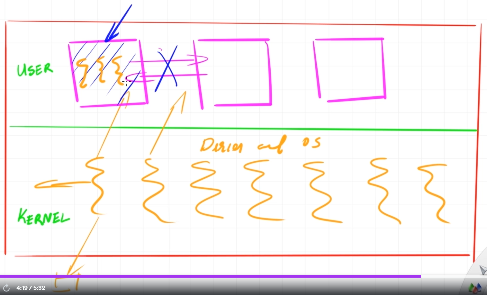

# Windbg - A complete guide for Advanced Windows Debugging

- [About the course](#about-the-course)
- [Course content](#course-content)
  - [3. Introduction to Debugger](#3-introduction-to-debugger)
  - [4. WinDbg Installation](#4-windbg-installation)
  - [5. Debugging Simple Program](#5-debugging-simple-program)
    - [Типы отладки](#типы-отладки)
  - [7. Concenpts of programm execution](#7-concenpts-of-programm-execution)
  - [8. Memory Dump](#8-memory-dump)
  - [9. Debug symbols](#9-debug-symbols)
  - [10. Callstack, globals and local](#10-callstack-globals-and-local)
    - [Call Stack vs Thread Stack](#call-stack-vs-thread-stack)
  - [11. Kernel, process, threads, stack](#11-kernel-process-threads-stack)
  - [12. Some more concepts](#12-some-more-concepts)
    - [Type of dumps](#type-of-dumps)
  - [13. How to take a dump](#13-how-to-take-a-dump)
  - [14. Debugger Commands](#14-debugger-commands)
    - [Type of commands (!, ., native)](#type-of-commands---native)
  - [15. Help Commands](#15-help-commands)
  - [16. Setting symbol path](#16-setting-symbol-path)
  - [17. Mismatched symbols, synoisly and symquiet](#17-mismatched-symbols-synoisly-and-symquiet)
  - [18. `!analyze -v` and stack commands](#18-analyze--v-and-stack-commands)
  - [19. `.sympath`](#19-sympath)
  - [20. Debugger extensions - добавляют новые команды в дебаггер](#20-debugger-extensions---добавляют-новые-команды-в-дебаггер)

## About the course

Link: https://www.udemy.com/course/windbg-a-complete-guide
Teacher: https://www.linkedin.com/in/georgeasourcelens/
Duration: 26 hours
Code: [text](../code/windbg_course/005-0-simple-program)

## Course content

### 3. Introduction to Debugger

- Plan of the course
  - Chapter 1. Simple Commands
  - Chapter 2. Scenarios. User/Kernel Mode debugging.
  - Chapter 3. Real World Dumps. Other tools.

- How it works:
  - Text editor -> Compiler -> Linker -> Binary -> Running App (via kernel also) -> Attach debugger

- Debuggers
  - Visual Studio
  - GDB (Linux)
  - WinDbg (Windows) - allow user and kernel debugging.
  - Windows Error Reporting

- Problem to solve
  - Crashing
  - Hanging

### 4. WinDbg Installation

- Comes with Windows SDK/WDK.
- https://learn.microsoft.com/en-us/windows-hardware/drivers/debugger/

### 5. Debugging Simple Program

- Стек и символы корректно отображаются для C и С++ программ.
- Для .NET нужно использовать плагины.
- Символы необходимы, чтобы дебажить программу через WinDbg.
- `_asm int 3;`
  - Этот вызов бряки прямо из кода С++. Инструкция доступна только при сборке под x86.
  - Если дебаггер не подключен, то возникнет исключение и программа завершиться с ошибкой.
- При запуске процесса из WinDbg, он автоматически останавливает процесс до входа в main.
- Команды в WinDbg:
  - Command `g` - продолжить выполнение программы.
  - Command `k` - вывести стек вызовов.
  - Command `dv` - вывести локальные переменные.
  - Command `qd` - отключить дебаггер и позволить программе продолжить выполнение.
- Клавиши в WinDbg:
  - `F9` - установить брякпоинт в коде С++ на определенную строку.
- Kernel vs User mode debugging: Kernel debugging нужен для отладки драйверов.

#### Типы отладки

- Live Debugging
  - Отладка в реальном времени на работающем процессе.
  - Примеры: gdb, lldb, Visual Studio Debugger.
  - Для диагностики проблем в активно работающем приложении, особенно если ошибки трудно воспроизвести вне рабочей среды
- Dump Debugging
  - Анализ дампа памяти после сбоя программы.
  - Примеры: WinDbg, cdb, Visual Studio.
  - Для диагностики аварийных завершений (crash), deadlock-состояний и других ошибок, которые нельзя отладить в реальном времени
- **Binary Debugging**:
  - Отладка без исходного кода, анализ машинного кода.
  - Примеры: **IDA Pro, Ghidra**, gdb.
  - Реверс-инжиниринг, изучение чужого кода, исправление ошибок в сторонних библиотеках.
- TTT Debugging (Time-Travel Debugging):
  - Перемотка выполнения программы для анализа.
  - Примеры: WinDbg Preview, rr.
  - Для анализа сложных и трудно воспроизводимых ошибок.

### 7. Concenpts of programm execution

- Interrupt - прерывание, сигнал от устройства или программы, требующий немедленного внимания процессора.
- Debugging - это тип прерывания, которое фризит выполнение программы и передает управление дебаггеру.
- Command `~` - список всех потоков.
- Command `~1s` - переключиться на поток 1. В индикаторе у командной строки поменяется номер потока на `0:001`. Нулевой поток - это главный поток.

### 8. Memory Dump

- Full Dump (Kernel) - Полное состояние ядра операционной системы, включая все данные, которые находятся в памяти (RAM), и активные процессы. Используется в случае системных сбоев (например, BSOD на Windows).
- Full Dump (User) - Полное состояние пользовательского процесса, включая его память, стек вызовов, переменные, библиотеки, и другие ресурсы.
- Mini Dump - Минимальный объём информации: регистры процессора, стек вызовов и часть памяти процесса. Не включает полные данные о состоянии памяти.

### 9. Debug symbols

- Код программы переводится в машинный(бинарный) код.
- Символы (pdb) - это информация, которая связывает машинный код с исходным кодом для отладки.
- pdb - эта таблица которая матчит адреса на человекочитаемые имена (строки кода).

```
*.cpp -> compiler -> *.obj -> linker -> *.exe
                                     -> *.pdb
```

### 10. Callstack, globals and local

- История про Тесея и Минотавра про лабиринт и клубок ниток аналогия к стеку вызовов.
- Command `k` - вывести стек вызовов.

```
00 00affbb0 002c2c03     005_0_simple_program!main+0x1b                         # TOP OF THE STACK
01 00affbd0 002c2a4a     005_0_simple_program!invoke_main+0x33
02 00affc2c 002c28dd     005_0_simple_program!__scrt_common_main_seh+0x15a
03 00affc34 002c2c88     005_0_simple_program!__scrt_common_main+0xd
04 00affc3c 76117ba9     005_0_simple_program!mainCRTStartup+0x8
05 00affc4c 77eac0cb     KERNEL32!BaseThreadInitThunk+0x19
06 00affca4 77eac04f     ntdll!__RtlUserThreadStart+0x2b
07 00affcb4 00000000     ntdll!_RtlUserThreadStart+0x1b                         # BOTTOM OS THE STACK
```

#### Call Stack vs Thread Stack

- **Call Stack** - это структура данных, используемая для отслеживания последовательности вызовов функций в пределах одного потока выполнения. Содержит
  - Адрес возврата (куда вернуться после завершения функции).
  - Локальные переменные функции.
  - Аргументы функции.
  - Временные данные, необходимые для выполнения функции.
- **Thread Stack** - это область памяти, выделенная для работы конкретного потока выполнения. В неё входит Call Stack, но она шире по функциональности. Содержит
  - Все кадры вызовов (Call Stack) для функций, выполняющихся в данном потоке.
  - Состояние потока, включая:
    - Регистры процессора.
    - Данные, относящиеся к управлению самим потоком.

- Command `x` - для просмотра глобальных переменных: `x 005_0_simple_program!*part_of_var_name*`
- Command `k` + click on the number of the stack frame => `dx <...> dv <...>` - показать список локальных переменных на этом фрейме.

- Глобальные переменные могут давать нам подсказки о состоянии программы, полезной для отладки.

### 11. Kernel, process, threads, stack

- Kernel - это операционная система сама по себе. Имеет direct access к hardware.
- Kernel - Это как будто один процесс с кучей потоков, которые могут запускать привелигированные инструкции.
- Пользовательский процес - это вроде домика для потоков.
- Поток - это группа ЦПУ инструкций, котороые гарантированно выполнятся в заданном порядке.



### 12. Some more concepts

#### Type of dumps

- Crash - when the problem was not handled by the program and OS managed to catch it.
- Hang - very slow to do something.
- Kernel/User
- TTT(Time-Travel Debugging) (user only)

### 13. How to take a dump

- Command `.dump /ma C:\path\to\save\dump.dmp` - создать дамп памяти.
- Command `qd` - quit and detach from the process.
- `File -> Open Crash Dump` - open the dump file in WinDbg.
- Command `||` - получить информацию о типе отладки

```
0:000> ||
.  0 Live user mode: <Local>

0:000> ||
.  0 Full memory user mini dump: C:\dev\cpp_notes\code\windbg_course\005-0-simple-program\Debug\dump.dmp

```

- Command `r` - показать регистры процессора.
- Command `|` - показать информацию о процессе, по которому был сделан дамп.

```
0:000> |
.  0	id: 541c	examine	name: C:\dev\cpp_notes\code\windbg_course\005-0-simple-program\Debug\005-0-simple-program.exe
```

### 14. Debugger Commands

- We will be using 100 - 1000 commands.
- Handful commands number is 15.

#### Type of commands (!, ., native)

- Config (начинаются с `.`)
  - Это команды, которые управляют настройками и поведением отладчика.
  - Для настройки символов, загрузки модулей, отображения выходных данных, управления потоками и т.п.
- Native (начинаются сразу с команды без дополнительного символа)
  - Это базовые команды отладчика, которые позволяют взаимодействовать с памятью, процессами, регистрами и другим системным состоянием.
  - Для анализа состояния программы: чтение памяти, управление точками останова, изучение содержимого регистров процессора.
- Extension (начинаются с `!`)
  - plugins for the debugger.

- Только загруженные символы уже позволяют нам смотреть стек вызовов и локальные переменные. Сам код не нужен для этого.

### 15. Help Commands

- Menu -> File -> Local Help.
- Command `.hh` - open help.

### 16. Setting symbol path

- Command `lm` - list modules.
  - Показывает информацию о загруженных символах.
- `C:\ProgramData\Dbg\sym\` - default path for symbols. Сюда грузятся все символы, которые WinDbg находит. В том числе из локальных сборок Visual Studio.
- File -> Settings -> Debugging Settings - Default Symbol Path - для установки пути к символам.
- Command `.sympath` - показать текущий путь к символам.
- Если удалить символы от exe файла и из кеша для нашего приложения, то WinDbg не найдет их. Вот как будет выглядет вывод команды `lm`:

```
0:000> lm
start    end        module name
00020000 00042000   005_0_simple_program C (no symbols)

0:000> k
 # ChildEBP RetAddr
WARNING: Stack unwind information not available. Following frames may be wrong.
00 00cffc7c 00032c03     005_0_simple_program+0x12235
01 00cffc9c 00032a4a     005_0_simple_program+0x12c03
```

- Command `lmvm 005_0_simple_program` - показать информацию о модуле.
- `VCRUNTIME140D   (deferred)` - означает, что не пытается загрузить эти символы.
- `005_0_simple_program C (no symbols)` - означает, что пытается загрузить символы, но не может найти.
- Обратите внимание, что в выводе дебаггера есть **кликабельные синие ссылки**, которые формируют команды автоматически.
- Если переименовать файл с символами, то WinDbg не сможет их загрузить.

### 17. Mismatched symbols, synoisly and symquiet

- Command `!sym noisy` - показывать подробную информацию о загрузке символов.
- Command `!sym quiet` - показывать только ошибки загрузки символов.
  - В случае перезагрузки символов будет показана только `005-0-simple-program   The system cannot find the file specified`.
- Command `.reload /f <name of the module>` - перезагрузить все символы (можно делать без перезапуска отладчика).
- Если подложить неправильные символы, то WinDbg выдаст ошибку:
  - `DBGHELP: C:\ProgramData\Dbg\sym\path\to\app.pdb - mismatched pdb`
- Command `.reload /i` - игнорировать ошибки загрузки символов.
  - Лучше так не делать, так как это может привести к неверным результатам отладки.
- Есть еще возможность использовать кастомные сервера для символов. Но обычно в компании используют только кеши.

### 18. `!analyze -v` and stack commands

- Допольно часто применяется при крешах, но не часто видел, чтобы применяли для зависаний.
- Пример вывода команды `!analyze -v`:

```

# важные флаги отладчика, которые влияют на поведение
NTGLOBALFLAG:  70

APPLICATION_VERIFIER_FLAGS:  0

EXCEPTION_RECORD:  (.exr -1)

# Показывает в какой точке произошло исключение
ExceptionAddress: 00142465 (005_0_simple_program!main+0x00000035)

    # показывает почему процесс закрешился. В нашем случае это точка останова.
   ExceptionCode: 80000003 (Break instruction exception)

# Поток, в котором произошло исключение
FAULTING_THREAD:  0000288c

# Наиболее важная информация, которая показывает стек вызовов
STACK_TEXT:
004ffbd0 00142c33     00000001 008e6a08 008ec228 005_0_simple_program!main+0x35
...

# Показывает пример команды, которую можно использовать для вывода стека вызовов
STACK_COMMAND:  ~0s; .ecxr ; kb

# Хеш проблемы, который можно использовать для поиска информации в интернете. Майкрософт категоризирует информацию по этому хешу.
FAILURE_BUCKET_ID:  BREAKPOINT_80000003_005-0-simple-program.exe!main

```

- Command `~0s` - переключиться на поток 0.
- Command `.ecxr` - устанавливает контекст исключения.
- Command `kb` - вывести стек вызовов.

- Когда вы открываете dump, то следующая строка значит, что этот дамп полный:
  - `User Mini Dump File with Full Memory: Only application data is available`.

### 19. `.sympath`

- Command `.sympath` - показать текущий путь к символам.
- Command `.sympath "C:/Temp"` - установить путь к символам.

### 20. Debugger extensions - добавляют новые команды в дебаггер

- Command `.chain` - показать все загруженные расширения и пути, по которым происходит поиск.
- Command `.load C:\Windows\Microsoft.NET\Framework\v4.0.30319\SOS.dll` - загрузить расширение для .NET.
  - Command `!help` - показать все команды расширения.
  - Command `!sos.help` - показать все команды расширения `sos`.
- Command `.extmatch /D /e dbghelp *` - показать все расширения, которые содержат в названии `dbghelp`. Чем то это похоже на команду `help`.
- Command `.unload C:\Windows\Microsoft.NET\Framework\v4.0.30319\SOS.dll` - выгрузить расширение.
- `C:\Program Files\WindowsApps\Microsoft.WinDbg_1.2410.11001.0_x64__8wekyb3d8bbwe\x86\winext`
  - По этому пути есть все расширения для WinDbg. Этот путь можно получить выполнив команду `.chain`.

- Command `lmvn <name of the module>` - load modules verbose no. Показывает все загруженные модули и их пути.
- Command `lm` - load modules. Показывает только имена модулей.
- Command `!lmi <name of the module>` - load module info. Показывает больше инфы о модуле. Например, путь к pdb файлу.
