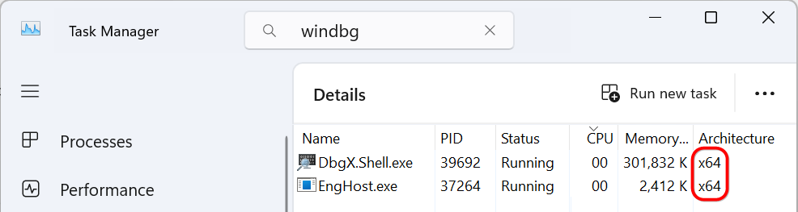
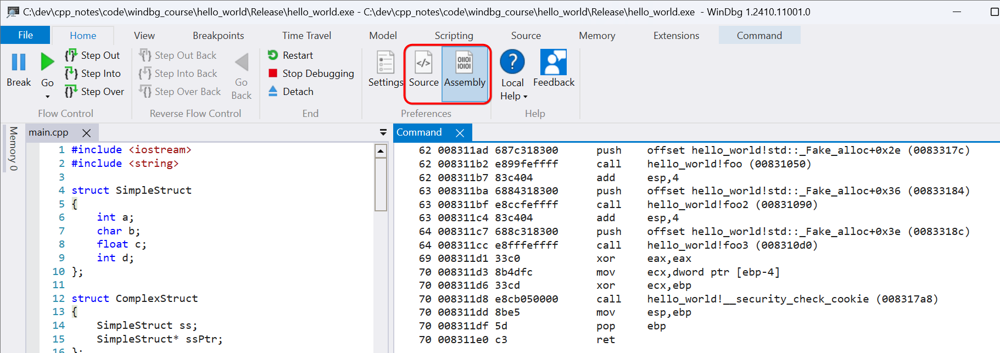
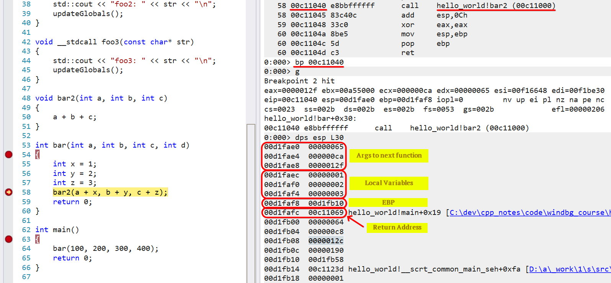

# Windbg - A complete guide for Advanced Windows Debugging

- [About the course](#about-the-course)
- [Section 1. Windbg Basics](#section-1-windbg-basics)
  - [3. Introduction to Debugger](#3-introduction-to-debugger)
  - [4. WinDbg Installation](#4-windbg-installation)
  - [5. Debugging Simple Program. Commands: `g`, `k`, `dv`, `qd`](#5-debugging-simple-program-commands-g-k-dv-qd)
    - [Command `g` - Go](#command-g---go)
    - [Command `k` - Display the stack](#command-k---display-the-stack)
    - [Command `dv` - Display Local Variable](#command-dv---display-local-variable)
    - [Command `dv /V` - Display Local Variable with Addresses](#command-dv-v---display-local-variable-with-addresses)
    - [Command `qd` - Quit and Detach](#command-qd---quit-and-detach)
    - [Key `F9` - Set Breakpoint](#key-f9---set-breakpoint)
    - [Типы отладки](#типы-отладки)
      - [Kernel vs User mode](#kernel-vs-user-mode)
      - [Live Debugging](#live-debugging)
      - [Dump Debugging](#dump-debugging)
      - [Binary Debugging (Reverse Engineering)](#binary-debugging-reverse-engineering)
      - [TTT Debugging (Time-Travel Debugging):](#ttt-debugging-time-travel-debugging)
  - [7. Concenpts of programm execution](#7-concenpts-of-programm-execution)
    - [Command `~` - List of threads](#command----list-of-threads)
    - [Command `~0s` - Switch to thread 0](#command-0s---switch-to-thread-0)
  - [8. Types of Memory Dump](#8-types-of-memory-dump)
  - [9. Debug symbols](#9-debug-symbols)
  - [10. Callstack, globals and local](#10-callstack-globals-and-local)
    - [Command `k` - Display the stack](#command-k---display-the-stack-1)
    - [Call Stack vs Thread Stack](#call-stack-vs-thread-stack)
    - [Command `x` - Examine Symbols](#command-x---examine-symbols)
  - [11. Kernel, process, threads, stack](#11-kernel-process-threads-stack)
  - [12. Some more concepts](#12-some-more-concepts)
    - [Type of reasons for debugging](#type-of-reasons-for-debugging)
  - [13. How to take a dump](#13-how-to-take-a-dump)
    - [Command `.dump` - Create dump file](#command-dump---create-dump-file)
    - [Command `||` - получить информацию о типе отладки](#command----получить-информацию-о-типе-отладки)
    - [Command `r` -  Registers](#command-r----registers)
    - [Command `|`](#command-)
  - [14. Debugger Commands](#14-debugger-commands)
    - [Type of commands: config(.), native, extension(!)](#type-of-commands-config-native-extension)
  - [15. Command `.hh` - Help Command](#15-command-hh---help-command)
  - [16. Setting symbol path](#16-setting-symbol-path)
    - [Command `lm` - List Loaded Modules](#command-lm---list-loaded-modules)
    - [Command `.sympath` - Symbol path for Windows debuggers](#command-sympath---symbol-path-for-windows-debuggers)
    - [Command `lmvm` - Показать информацию о конкретном модуле](#command-lmvm---показать-информацию-о-конкретном-модуле)
  - [17. Mismatched symbols, symnoisy and symquiet](#17-mismatched-symbols-symnoisy-and-symquiet)
    - [Command `!sym` - Control verbose of symbol loading](#command-sym---control-verbose-of-symbol-loading)
    - [Command `.reload` - reload symbols](#command-reload---reload-symbols)
  - [18. Command `!analyze -v` - extension displays information about the current exception or bug check](#18-command-analyze--v---extension-displays-information-about-the-current-exception-or-bug-check)
    - [Command `.ecxr` - Display Exception Context Record](#command-ecxr---display-exception-context-record)
    - [Command `kb` - Display the stack with parameters](#command-kb---display-the-stack-with-parameters)
    - [Mini Dump vs Full Dump](#mini-dump-vs-full-dump)
  - [19. Command `.sympath` - Symbol path for Windows debuggers](#19-command-sympath---symbol-path-for-windows-debuggers)
  - [20. Debugger extensions - добавляют новые команды в дебаггер](#20-debugger-extensions---добавляют-новые-команды-в-дебаггер)
    - [Command `.chain` - List Debugger Extensions](#command-chain---list-debugger-extensions)
    - [Command `.load` - Load Extension DLL](#command-load---load-extension-dll)
    - [Command `!help` - показать все команды определенного extension DLL](#command-help---показать-все-команды-определенного-extension-dll)
    - [Command `.extmatch` - Display All Matching Extensions](#command-extmatch---display-all-matching-extensions)
    - [Command `.unload` - Unload Extension DLL](#command-unload---unload-extension-dll)
    - [Command `lmvn` - Load Modules Verbose No](#command-lmvn---load-modules-verbose-no)
    - [Command `!lmi` - Load Module Info. Show path to PDB](#command-lmi---load-module-info-show-path-to-pdb)
  - [21. `x`, `ln` - работают с таблицей символов](#21-x-ln---работают-с-таблицей-символов)
    - [Command `x` - Examine Symbols. По символу показывает адрес](#command-x---examine-symbols-по-символу-показывает-адрес)
    - [Command `ln` - List Nearest Symbols. По адресу определяет символ](#command-ln---list-nearest-symbols-по-адресу-определяет-символ)
  - [22. `r`, `k`](#22-r-k)
    - [Command `r` - CPU Registers](#command-r---cpu-registers)
    - [Command `k` - Display the stack](#command-k---display-the-stack-2)
    - [Command `.frame` - Switch to another frame in the call stack](#command-frame---switch-to-another-frame-in-the-call-stack)
    - [Command `dv` - Display Local Variables](#command-dv---display-local-variables)
    - [Command `~*k` - показать стек вызовов всех потоков](#command-k---показать-стек-вызовов-всех-потоков)
  - [23. `e` - edit memory, `u` - unassemble](#23-e---edit-memory-u---unassemble)
    - [Command `e` - Edit Memory](#command-e---edit-memory)
    - [Command `u` - unassemble (дизассемблировать инструкции в области памяти)](#command-u---unassemble-дизассемблировать-инструкции-в-области-памяти)
  - [24. Command `dc` - display memory as Double-word values (4 bytes) and ASCII characters.](#24-command-dc---display-memory-as-double-word-values-4-bytes-and-ascii-characters)
  - [25. Command `dt` - Display Type (поддерживает рекурсию)](#25-command-dt---display-type-поддерживает-рекурсию)
    - [Command `dt -r<num>` - рекурсивно показать структуру данных](#command-dt--rnum---рекурсивно-показать-структуру-данных)
    - [`?<number>` - hex to dec conversion](#number---hex-to-dec-conversion)
  - [26. Command `dt -l ` - Iterate over Double linked list](#26-command-dt--l----iterate-over-double-linked-list)
  - [27. Real life application of double linked list](#27-real-life-application-of-double-linked-list)
  - [28. Command `dv` - Display Local Variables](#28-command-dv---display-local-variables)
  - [29. Command `s` - Search Memory](#29-command-s---search-memory)
  - [30. Live Debugging Commands](#30-live-debugging-commands)
    - [Command `bp` - breakpoint](#command-bp---breakpoint)
      - [Добавление логики в программу на срабатывание брекпоинта](#добавление-логики-в-программу-на-срабатывание-брекпоинта)
      - [`.if` and `.else` - conditional breakpoints](#if-and-else---conditional-breakpoints)
        - [`poi(varPtr)` - Dereference a pointer](#poivarptr---dereference-a-pointer)
        - [`0n100` - Decimal number](#0n100---decimal-number)
    - [Command `bu` - Breakpoint Unresolved](#command-bu---breakpoint-unresolved)
    - [Command `bm` - set symbol breakpoint](#command-bm---set-symbol-breakpoint)
    - [Command `ba` - Breakpoint on Access (read, write, execute) - Data Breakpoint](#command-ba---breakpoint-on-access-read-write-execute---data-breakpoint)
    - [Command `bl` - List Breakpoints](#command-bl---list-breakpoints)
    - [Command `bd`, `be`, `bc` - Breakpoint Disable / Enable / Clear(Remove)](#command-bd-be-bc---breakpoint-disable--enable--clearremove)
    - [Command `.bpcmds` - Получить все команды для установки бряков, как в данной сессии](#command-bpcmds---получить-все-команды-для-установки-бряков-как-в-данной-сессии)
  - [31. `t`, `p`, `.logopen` - Time Travel Debugging](#31-t-p-logopen---time-travel-debugging)
    - [Command `p` - Step Over](#command-p---step-over)
    - [Command `t` - Step Into](#command-t---step-into)
    - [Command `gu` - Step Out (Analogue of Shift + F11)](#command-gu---step-out-analogue-of-shift--f11)
    - [Command `wt` - Watch and Trace](#command-wt---watch-and-trace)
    - [Command `.logopen` - Enable logging to a file during debugging](#command-logopen---enable-logging-to-a-file-during-debugging)
  - [32. wow64 Debugging](#32-wow64-debugging)
  - [33. Demo - debuggin 64 bit, 32 bit and wow64 applications](#33-demo---debuggin-64-bit-32-bit-and-wow64-applications)
    - [Command `.effmach` - Set Effective Machine](#command-effmach---set-effective-machine)
    - [Kernel Mode Debugging Notes (Commands `.process`, `.thread`)](#kernel-mode-debugging-notes-commands-process-thread)
  - [34. Assembly Language 32bit](#34-assembly-language-32bit)
  - [35. Assembly Language 32bit - DEMO](#35-assembly-language-32bit---demo)
    - [Registers (eax, ebx, ecx, edx, esi, edi, eip, esp, ebp)](#registers-eax-ebx-ecx-edx-esi-edi-eip-esp-ebp)
    - [Command `uf` - Unassemble Function](#command-uf---unassemble-function)
    - [Аллоцирование и деаллоцирование памяти (push и add)](#аллоцирование-и-деаллоцирование-памяти-push-и-add)
    - [Function Prologue](#function-prologue)
    - [Function Epilogue](#function-epilogue)
    - [Source Mode vs Assembly Mode](#source-mode-vs-assembly-mode)
    - [Local Variables like `ebp-<shift>`](#local-variables-like-ebp-shift)
    - [Инструкция `push` для передачи аргументов в функцию](#инструкция-push-для-передачи-аргументов-в-функцию)
    - [Команда `?` для конвертации hex в dec](#команда--для-конвертации-hex-в-dec)
    - [Инструкция `call`](#инструкция-call)
    - [Аллокация памяти под локальные переменные](#аллокация-памяти-под-локальные-переменные)
    - [`ebp+` - это аргументы функции vs `ebp-` - это локальные переменные](#ebp---это-аргументы-функции-vs-ebp----это-локальные-переменные)
    - [Command `dps esp L30` - анализ аргументов переданных в функцию](#command-dps-esp-l30---анализ-аргументов-переданных-в-функцию)
    - [Calling Convention - `__cdecl` and `__stdcall`](#calling-convention---__cdecl-and-__stdcall)
      - [`__cdecl` - C-calling-convention](#__cdecl---c-calling-convention)
      - [`__stdcall` - Standard-calling-convention](#__stdcall---standard-calling-convention)
  - [36. Assembly Language 64bit](#36-assembly-language-64bit)
    - [Command `.asm no_code_bytes` - Отключает отображение столбца команд в ввиде байткода.](#command-asm-no_code_bytes---отключает-отображение-столбца-команд-в-ввиде-байткода)
    - [Homing arguments - создании копии регистров с аргументами в стеке](#homing-arguments---создании-копии-регистров-с-аргументами-в-стеке)
      - [Проверка, что rdx скопировался в rsp+10h:](#проверка-что-rdx-скопировался-в-rsp10h)
      - [Проверка, что ecx скопировался в rsp+8:](#проверка-что-ecx-скопировался-в-rsp8)
    - [`mov` equivalent to `push` for 64 bit](#mov-equivalent-to-push-for-64-bit)
    - [В 64 битной архитектуре нет `ebp`](#в-64-битной-архитектуре-нет-ebp)
      - [Отличия между регистрами EBP (Base Pointer) и RSP (Stack Pointer)](#отличия-между-регистрами-ebp-base-pointer-и-rsp-stack-pointer)
      - [EBP (Extended Base Pointer) x86](#ebp-extended-base-pointer-x86)
      - [RSP (Stack Pointer) x64](#rsp-stack-pointer-x64)
    - [Мой разбор примера 64 битной архитектуры](#мой-разбор-примера-64-битной-архитектуры)
  - [37. ChildEBP, RetAddr, Args to Child (x86) - параметры, которые передаются через стек.](#37-childebp-retaddr-args-to-child-x86---параметры-которые-передаются-через-стек)
    - [Command `kvn` - показать информацию о стеке](#command-kvn---показать-информацию-о-стеке)
  - [38. Address Range (как создавать диапазон адресов для различных команд)](#38-address-range-как-создавать-диапазон-адресов-для-различных-команд)
    - [Command `teb` - Thread Environment Block - найти начало и конец стека](#command-teb---thread-environment-block---найти-начало-и-конец-стека)
    - [Command `dps 00d6d000 00d70000` - распечатать стек через диапазон адресов](#command-dps-00d6d000-00d70000---распечатать-стек-через-диапазон-адресов)
    - [Command `?` + `0n` + `dps` - распечатать стек через указание смещения](#command---0n--dps---распечатать-стек-через-указание-смещения)
  - [39. Command `.foreach` - цикл в WinDbg](#39-command-foreach---цикл-в-windbg)

## About the course

Link: https://www.udemy.com/course/windbg-a-complete-guide
Teacher: https://www.linkedin.com/in/georgeasourcelens/
Duration: 26 hours
Code: [text](../code/windbg_course/005-0-simple-program)

## Section 1. Windbg Basics

### 3. Introduction to Debugger

- Plan of the course
  - Chapter 1. Simple Commands
  - Chapter 2. Scenarios. User/Kernel Mode debugging.
  - Chapter 3. Real World Dumps. Other tools.

- How it works:
  - Text editor -> Compiler -> Linker -> Binary -> Running App (via kernel also) -> Attach debugger

- Debuggers
  - Visual Studio
  - GDB (Linux)
  - WinDbg (Windows) - allow user and kernel debugging.
  - Windows Error Reporting

- Problem to solve
  - Crashing
  - Hanging

### 4. WinDbg Installation

- Comes with Windows SDK/WDK.
- https://learn.microsoft.com/en-us/windows-hardware/drivers/debugger/

### 5. Debugging Simple Program. Commands: `g`, `k`, `dv`, `qd`

- Стек и символы корректно отображаются для C и С++ программ.
- Для .NET нужно использовать плагины.
- Символы необходимы, чтобы дебажить программу через WinDbg.
- `_asm int 3;`
  - Этот вызов бряки прямо из кода С++. Инструкция доступна только при сборке под x86.
  - Если дебаггер не подключен, то возникнет исключение и программа завершиться с ошибкой.
- При запуске процесса из WinDbg, он автоматически останавливает процесс до входа в main.

#### Command `g` - Go

- Продолжить выполнение программы.

#### Command `k` - Display the stack

- Показывает стек вызовов текущего потока.

#### Command `dv` - Display Local Variable

- Показывает локальные переменные текущего фрейма стека вызовов.

```
007ff80c          <virtual frame 7ff824>-0x0018                     c = 0n8386592
```

#### Command `dv /V` - Display Local Variable with Addresses

- Показывает локальные переменные текущего фрейма стека вызовов с адресами.

```
              c = 0n8386592
```

#### Command `qd` - Quit and Detach

- Отключиться от процесса, но не завершить его.

#### Key `F9` - Set Breakpoint

- установить брякпоинт в коде С++ на определенную строку.

#### Типы отладки

##### Kernel vs User mode

- Kernel vs User mode debugging: Kernel debugging нужен для отладки драйверов.

##### Live Debugging

  - Отладка в реальном времени на работающем процессе.
  - Примеры: gdb, lldb, Visual Studio Debugger.
  - Для диагностики проблем в активно работающем приложении, особенно если ошибки трудно воспроизвести вне рабочей среды

##### Dump Debugging

  - Анализ дампа памяти после сбоя программы.
  - Примеры: WinDbg, cdb, Visual Studio.
  - Для диагностики аварийных завершений (crash), deadlock-состояний и других ошибок, которые нельзя отладить в реальном времени

##### Binary Debugging (Reverse Engineering)

  - Отладка без исходного кода, анализ машинного кода.
  - Примеры: **IDA Pro, Ghidra**, gdb.
  - Реверс-инжиниринг, изучение чужого кода, исправление ошибок в сторонних библиотеках.

##### TTT Debugging (Time-Travel Debugging):

  - Перемотка выполнения программы для анализа.
  - Примеры: WinDbg Preview, rr.
  - Для анализа сложных и трудно воспроизводимых ошибок.

### 7. Concenpts of programm execution

- Interrupt - прерывание, сигнал от устройства или программы, требующий немедленного внимания процессора.
- Debugging - это тип прерывания, которое фризит выполнение программы и передает управление дебаггеру.

#### Command `~` - List of threads

- Command `~` - список всех потоков.

#### Command `~0s` - Switch to thread 0

- Command `~1s` - переключиться на поток 1. В индикаторе у командной строки поменяется номер потока на `0:001`. Нулевой поток - это главный поток.

### 8. Types of Memory Dump

- Full Dump (Kernel) - Полное состояние ядра операционной системы, включая все данные, которые находятся в памяти (RAM), и активные процессы. Используется в случае системных сбоев (например, BSOD на Windows).
- Full Dump (User) - Полное состояние пользовательского процесса, включая его память, стек вызовов, переменные, библиотеки, и другие ресурсы.
- Mini Dump - Минимальный объём информации: регистры процессора, стек вызовов и часть памяти процесса. Не включает полные данные о состоянии памяти.

### 9. Debug symbols

- Код программы переводится в машинный(бинарный) код.
- Символы (pdb) - это информация, которая связывает машинный код с исходным кодом для отладки.
- pdb - эта таблица которая матчит адреса на человекочитаемые имена (строки кода).

```
*.cpp -> compiler -> *.obj -> linker -> *.exe
                                     -> *.pdb
```

### 10. Callstack, globals and local

- История про Тесея и Минотавра про лабиринт и клубок ниток аналогия к стеку вызовов.

#### Command `k` - Display the stack

- Command `k` - вывести стек вызовов.

```
00 00affbb0 002c2c03     005_0_simple_program!main+0x1b                         # TOP OF THE STACK
01 00affbd0 002c2a4a     005_0_simple_program!invoke_main+0x33
02 00affc2c 002c28dd     005_0_simple_program!__scrt_common_main_seh+0x15a
03 00affc34 002c2c88     005_0_simple_program!__scrt_common_main+0xd
04 00affc3c 76117ba9     005_0_simple_program!mainCRTStartup+0x8
05 00affc4c 77eac0cb     KERNEL32!BaseThreadInitThunk+0x19
06 00affca4 77eac04f     ntdll!__RtlUserThreadStart+0x2b
07 00affcb4 00000000     ntdll!_RtlUserThreadStart+0x1b                         # BOTTOM OS THE STACK
```

#### Call Stack vs Thread Stack

- **Call Stack** - это структура данных, используемая для отслеживания последовательности вызовов функций в пределах одного потока выполнения. Содержит
  - Адрес возврата (куда вернуться после завершения функции).
  - Локальные переменные функции.
  - Аргументы функции.
  - Временные данные, необходимые для выполнения функции.
- **Thread Stack** - это область памяти, выделенная для работы конкретного потока выполнения. В неё входит Call Stack, но она шире по функциональности. Содержит
  - Все кадры вызовов (Call Stack) для функций, выполняющихся в данном потоке.
  - Состояние потока, включая:
    - Регистры процессора.
    - Данные, относящиеся к управлению самим потоком.

#### Command `x` - Examine Symbols

- Command `x` - для просмотра глобальных переменных: `x 005_0_simple_program!*part_of_var_name*`
- Command `k` + click on the number of the stack frame => `dx <...> dv <...>` - показать список локальных переменных на этом фрейме.

- Глобальные переменные могут давать нам подсказки о состоянии программы, полезной для отладки.

### 11. Kernel, process, threads, stack

- Kernel - это операционная система сама по себе. Имеет direct access к hardware.
- Kernel - Это как будто один процесс с кучей потоков, которые могут запускать привелигированные инструкции.
- Пользовательский процес - это вроде домика для потоков.
- Поток - это группа ЦПУ инструкций, котороые гарантированно выполнятся в заданном порядке.


### 12. Some more concepts

#### Type of reasons for debugging

- Crash - when the problem was not handled by the program and OS managed to catch it.
- Hang - very slow to do something.
- Kernel/User
- TTT(Time-Travel Debugging) (user only)

### 13. How to take a dump

#### Command `.dump` - Create dump file

- Command `.dump /ma C:\path\to\save\dump.dmp` - создать дамп памяти.
- Command `qd` - quit and detach from the process.
- `File -> Open Crash Dump` - open the dump file in WinDbg.

#### Command `||` - получить информацию о типе отладки

```
0:000> ||
.  0 Live user mode: <Local>

0:000> ||
.  0 Full memory user mini dump: C:\dev\cpp_notes\code\windbg_course\005-0-simple-program\Debug\dump.dmp
```

#### Command `r` -  Registers

- Command `r` - показать регистры процессора.

#### Command `|`

- Command `|` - показать информацию о процессе, по которому был сделан дамп.

```
0:000> |
.  0	id: 541c	examine	name: C:\dev\cpp_notes\code\windbg_course\005-0-simple-program\Debug\005-0-simple-program.exe
```

### 14. Debugger Commands

- We will be using 100 - 1000 commands.
- Handful commands number is 15.

#### Type of commands: config(.), native, extension(!)

- Config (начинаются с `.`)
  - Это команды, которые управляют настройками и поведением отладчика.
  - Для настройки символов, загрузки модулей, отображения выходных данных, управления потоками и т.п.
- Native (начинаются сразу с команды без дополнительного символа)
  - Это базовые команды отладчика, которые позволяют взаимодействовать с памятью, процессами, регистрами и другим системным состоянием.
  - Для анализа состояния программы: чтение памяти, управление точками останова, изучение содержимого регистров процессора.
- Extension (начинаются с `!`)
  - plugins for the debugger.

- Только загруженные символы уже позволяют нам смотреть стек вызовов и локальные переменные. Сам код не нужен для этого.

### 15. Command `.hh` - Help Command

- Menu -> File -> Local Help.
- Command `.hh` - open help.
- Command `.hh <command>` - open help for the command.

### 16. Setting symbol path

#### Command `lm` - List Loaded Modules

- Command `lm` - list modules.
  - Показывает информацию о загруженных символах.
- `C:\ProgramData\Dbg\sym\` - default path for symbols. Сюда грузятся все символы, которые WinDbg находит. В том числе из локальных сборок Visual Studio.
- File -> Settings -> Debugging Settings - Default Symbol Path - для установки пути к символам.

#### Command `.sympath` - Symbol path for Windows debuggers

- Command `.sympath` - показать текущий путь к символам.
- Если переименовать файл с символами, то WinDbg не сможет найти обнаружить символы.
- Если удалить символы от exe файла и из кеша для нашего приложения, то WinDbg не найдет их. Вот как будет выглядет вывод команды `lm`:

```
0:000> lm
start    end        module name
00020000 00042000   005_0_simple_program C (no symbols)

0:000> k
 # ChildEBP RetAddr
WARNING: Stack unwind information not available. Following frames may be wrong.
00 00cffc7c 00032c03     005_0_simple_program+0x12235
01 00cffc9c 00032a4a     005_0_simple_program+0x12c03
```

#### Command `lmvm` - Показать информацию о конкретном модуле

- Command `lmvm 005_0_simple_program` - показать информацию о модуле.
- `VCRUNTIME140D   (deferred)` - означает, что не пытается загрузить эти символы.
- `005_0_simple_program C (no symbols)` - означает, что пытается загрузить символы, но не может найти.
- Обратите внимание, что в выводе дебаггера есть **кликабельные синие ссылки**, которые формируют команды автоматически.

### 17. Mismatched symbols, symnoisy and symquiet

#### Command `!sym` - Control verbose of symbol loading

- Command `!sym noisy` - показывать подробную информацию о загрузке символов.
- Command `!sym quiet` - показывать только ошибки загрузки символов.
  - В случае перезагрузки символов будет показана только `005-0-simple-program   The system cannot find the file specified`.

#### Command `.reload` - reload symbols

- Command `.reload /f <name of the module>` - перезагрузить все символы (можно делать без перезапуска отладчика).
- Если подложить неправильные символы, то WinDbg выдаст ошибку:
  - `DBGHELP: C:\ProgramData\Dbg\sym\path\to\app.pdb - mismatched pdb`
- Command `.reload /i` - игнорировать ошибки загрузки символов.
  - Лучше так не делать, так как это может привести к неверным результатам отладки.
- Есть еще возможность использовать кастомные сервера для символов. Но обычно в компании используют только кеши.

### 18. Command `!analyze -v` - extension displays information about the current exception or bug check

- Допольно часто применяется при крешах, но не часто видел, чтобы применяли для зависаний.
- Пример вывода команды `!analyze -v`:

```

# важные флаги отладчика, которые влияют на поведение
NTGLOBALFLAG:  70

APPLICATION_VERIFIER_FLAGS:  0

EXCEPTION_RECORD:  (.exr -1)

# Показывает в какой точке произошло исключение
ExceptionAddress: 00142465 (005_0_simple_program!main+0x00000035)

    # показывает почему процесс закрешился. В нашем случае это точка останова.
   ExceptionCode: 80000003 (Break instruction exception)

# Поток, в котором произошло исключение
FAULTING_THREAD:  0000288c

# Наиболее важная информация, которая показывает стек вызовов
STACK_TEXT:
004ffbd0 00142c33     00000001 008e6a08 008ec228 005_0_simple_program!main+0x35
...

# Показывает пример команды, которую можно использовать для вывода стека вызовов
STACK_COMMAND:  ~0s; .ecxr ; kb

# Хеш проблемы, который можно использовать для поиска информации в интернете. Майкрософт категоризирует информацию по этому хешу.
FAILURE_BUCKET_ID:  BREAKPOINT_80000003_005-0-simple-program.exe!main

```

- Command `~0s` - переключиться на поток 0.

#### Command `.ecxr` - Display Exception Context Record

- Command `.ecxr` - устанавливает контекст исключения.

#### Command `kb` - Display the stack with parameters

- Command `kb` - вывести стек вызовов.

#### Mini Dump vs Full Dump

- Когда вы открываете dump, то следующая строка значит, что этот дамп полный:
  - `User Mini Dump File with Full Memory: Only application data is available`.

### 19. Command `.sympath` - Symbol path for Windows debuggers

- Command `.sympath` - показать текущий путь к символам.
- Command `.sympath "C:/Temp"` - установить путь к символам.

### 20. Debugger extensions - добавляют новые команды в дебаггер

#### Command `.chain` - List Debugger Extensions

- Command `.chain` - показать все загруженные расширения и пути, по которым происходит поиск.

#### Command `.load` - Load Extension DLL

- Command `.load C:\Windows\Microsoft.NET\Framework\v4.0.30319\SOS.dll` - загрузить расширение для .NET.

#### Command `!help` - показать все команды определенного extension DLL

- Command `!help` - показать все команды расширения.
- Command `!sos.help` - показать все команды расширения `sos`.

#### Command `.extmatch` - Display All Matching Extensions

- Command `.extmatch /D /e dbghelp *` - показать все расширения, которые содержат в названии `dbghelp`. Чем то это похоже на команду `help`.

#### Command `.unload` - Unload Extension DLL

- Command `.unload C:\Windows\Microsoft.NET\Framework\v4.0.30319\SOS.dll` - выгрузить расширение.
- `C:\Program Files\WindowsApps\Microsoft.WinDbg_1.2410.11001.0_x64__8wekyb3d8bbwe\x86\winext`
  - По этому пути есть все расширения для WinDbg. Этот путь можно получить выполнив команду `.chain`.

#### Command `lmvn` - Load Modules Verbose No

- Command `lmvn <name of the module>` - load modules verbose no. Показывает все загруженные модули и их пути.
- Command `lm` - load modules. Показывает только имена модулей.

#### Command `!lmi` - Load Module Info. Show path to PDB

- Command `!lmi <name of the module>` - load module info. Показывает больше инфы о модуле. Например, путь к pdb файлу.

### 21. `x`, `ln` - работают с таблицей символов

- Обе команды манипулируют таблицей символов. Таблица символов матчит адреса на имена.
- Example of the table:

```
Address     Symbol
0x0001      main
0x0002      foo
0x0003      bar
```

#### Command `x` - Examine Symbols. По символу показывает адрес

- Command `x`: `x <module>!<symbol_mask>` - показать адреса для символа.

#### Command `ln` - List Nearest Symbols. По адресу определяет символ

- Command `ln`: `ln <address>` - используется для определения символа (например, функции) по указанному адресу.

- Чтобы обе команды работали надо **изменить дефолтные настройки линкера** при сборке:
  - `Project -> Properties -> Linker -> Debugging -> Generate Debug Info -> `
    - Дефолтное значение: `Generate Debug Information (/DEBUG)`
      - Генерирует базовую информацию отладки. Оптимизировано для уменьшения размера PDB-файлов. Может опускать неиспользуемые символы.
    - Новое значение: `Generate Debug Information optimized for sharing and publishing (/DEBUG:FULL)`
      - Генерирует полную информацию для отладки. Включает все символы, независимо от их использования. Это обеспечивает точную работу команд x и ln.

### 22. `r`, `k`

#### Command `r` - CPU Registers

- Command `r` - показать регистры процессора текущего потока текущего контекста.
  - Может использоваться для изменения регистров: `r eax=0x12345678`.
- Command `.hh r` - открыть справку по команде `r`.
- Command `~` - показать список всех потоков. Кликабельные номера слева позволяют переключаться между фреймами потока.

#### Command `k` - Display the stack

- Command `k` - показать стек вызовов текущего потока.
  - Command `kvn` - вариация `k`. Показать стек вызовов с параметрами (аргументами).
  - **Command `kf` - вариация `k`. Показывает как много памяти занимает каждый фрейм**.
    - Может помочь при отладке stack overflow и других проблем с памятью.
    - Потому что память стека очень лимитирована.
  - Command `kp` - показать параметры функции в стеке вызовов в скобочках.

#### Command `.frame` - Switch to another frame in the call stack

- Command `.frame <frame number>` - переключиться на другой фрейм стека вызовов.

#### Command `dv` - Display Local Variables

- Command `dv` - вывести список локальных переменных текущего фрейма.

#### Command `~*k` - показать стек вызовов всех потоков

- **Command `~*k` - показать стек вызовов всех потоков**.
  - **Формат `~*<command>` может использовать для любой команды, чтобы применить ее ко всем потокам**.

### 23. `e` - edit memory, `u` - unassemble

#### Command `e` - Edit Memory

- Может использоваться только для Live Debugging.

```
008ff8b4          char * str = 0x00eedd68 "hello world"
```

- Command `ea 0x00eedd68 "karamba"` - **изменить строку в памяти**.
  - Команда ea работает с текстовым представлением данных (например, строка), но не может преобразовать текст в числовой формат для целого числа.
- Command `dv` - показать локальные переменные.

```
            str = 0x00eedd68 "karambaorld"
```

- Если выйти за границы памяти по адресу, то это может перезаписать другие данные.

Команда eb, ew, ed, eq: Используется для записи числовых данных в память. Пишется в 16-ричной системе.
- Command `eb` — записывает 1 байт (8 бит).
- Command `ew` — записывает 2 байта (16 бит).
- Command `ed` — записывает 4 байта (32 бит).
- Command `eq` — записывает 8 байт (64 бит).

#### Command `u` - unassemble (дизассемблировать инструкции в области памяти)

- Command `u` - unassemble.
  - Используется для дизассемблирования инструкций машинного кода в области памяти.
  - Каждая строка представляет собой машинную инструкцию, декодированную в человекочитаемый ассемблерный формат.
- Command `u eip L20`
  - EIP указывает на адрес следующей инструкции, которая будет выполнена процессором.
  - Использование eip в качестве адреса позволяет дизассемблировать текущий поток выполнения.
  - `L20` - Указывает количество инструкций, которые WinDbg должен дизассемблировать и вывести.
- Command `ub` - unassemble backwards. Показывает инструкции, распологающиеся перед указанным адресом.
- Command `uf <module>!<function>` - unassemble function. Очень полезная для reverse engineering.
- Command `uf /c <module>!<function>` - показывает какие функции вызывает данная функция.

### 24. Command `dc` - display memory as Double-word values (4 bytes) and ASCII characters.

- Command `dc <addr1> <addr2>` - показать содержимое памяти между двумя адресами.
- Command `dc <addr1> L20` - показать 20 байт памяти начиная с адреса.
- Command `dps <addr>` - показать содержимое памяти, и если найдены символы, то показать их имена. Полезно когда ищем ошибки вроде stack corraption.

- Command `!teb` в WinDbg показывает Thread Environment Block (TEB)
  - является важной структурой данных в Windows, содержащей информацию, связанную с потоком выполнения.
  - Это часть внутренней инфраструктуры Windows для управления потоками.

```
0:000> !teb
TEB at 01051000
    ExceptionList:        012fff08
    StackBase:            01300000 - Это максимальный адрес памяти, отведённой для стека.
    StackLimit:           012fe000 - Это минимальный адрес памяти для стека. Стек растет сверху вниз.
    SubSystemTib:         00000000
    FiberData:            00001e00
    ArbitraryUserPointer: 00000000
    Self:                 01051000
    EnvironmentPointer:   00000000
    ClientId:             00005bcc . 0000559c - Идентификаторы процесса и потока.
    RpcHandle:            00000000
    Tls Storage:          01434ea8
    PEB Address:          0104e000
    LastErrorValue:       0
    LastStatusValue:      0
    Count Owned Locks:    0
    HardErrorMode:        0
```

- Command `dps 012fe000 01300000` - **показать содержимое стека между двумя адресами. Взят из TEB. Помогает отладить ошибки stack corruption**.

### 25. Command `dt` - Display Type (поддерживает рекурсию)

- Command `dt` - dump type. Показывает структуру данных.
- Command `dt <type>` - показывает структуру данных для типа.

```
struct SimpleStruct
{
    int a;
    char b;
    float c;
    int d;
};

0:000> dt SimpleStruct
005_0_simple_program!SimpleStruct
   +0x000 a                : Int4B
   +0x004 b                : Char
   +0x008 c                : Float
   +0x00c d                : Int4B

simpleStructPtr = 0x005bfda0
0:000> dt SimpleStruct 0x005bfda0
Local var @ 0x5bfda0 Type SimpleStruct
   +0x000 a                : 0n777
   +0x004 b                : 120 'x'
   +0x008 c                : 66.59999847
   +0x00c d                : 0n100
```

#### Command `dt -r<num>` - рекурсивно показать структуру данных

- **Command `dt -r<num> <type>` - рекурсивно показать структуру данных**.

```
0:000> dv
            str = 0x00dadd68 "hello world"
   simpleStruct = struct SimpleStruct
              c = 0n300
simpleStructPtr = 0x00fbfe54
  complexStruct = struct ComplexStruct

0:000> dt -r complexStruct
Local var @ 0xfbfe2c Type ComplexStruct
   +0x000 ss               : SimpleStruct
      +0x000 a                : 0n777
      +0x004 b                : 120 'x'
      +0x008 c                : 66.59999847
      +0x00c d                : 0n100
   +0x010 ssPtr            : 0x00fbfe54 SimpleStruct
      +0x000 a                : 0n777
      +0x004 b                : 120 'x'
      +0x008 c                : 66.59999847
      +0x00c d                : 0n100
```

#### `?<number>` - hex to dec conversion

- Command `?309` => `Evaluate expression: 777 = 00000309`

### 26. Command `dt -l ` - Iterate over Double linked list

- `dt kcmd!MY_TEST_LIST -l list_entry.Flink 0xc9b484-0xc`
  - Флаг -l используется для определения начальной точки обхода связанных списков.
  - Флаг говорит отладчику, что он должен пройти по связанному списку, начиная с узла, адрес которого будет передан в следующем аргументе.
  - `0xc9b484-0xc` - Здесь указывается адрес, с которого следует начать обход.
    - `0xc9b484` — это адрес структуры MY_TEST_LIST в памяти.
    - `-0xc` — это вычитание смещения для получения адреса начала структуры.

```cpp
typedef struct _LIST_ENTRY {
  struct _LIST_ENTRY  *Flink;
  struct _LIST_ENTRY  *Blink;
} LIST_ENTRY, *PLIST_ENTRY;

struct MY_TEST_LIST
{
	int a;                            // 4 bytes                    //
	int b;                            // 4 bytes                    // Total: 12 bytes
	char c;                           // 1 byte + 3 bytes padding   //
	LIST_ENTRY list_entry;
	float d;
};
```

### 27. Real life application of double linked list

- Препод подключился к ядру винды на виртуалке и таким образом вывел список всех процессов на машине, зная структуру данных, которая хранит процессы и указатель на начало листа.

### 28. Command `dv` - Display Local Variables

- Command `k` - показать стек вызовов текущего потока.
- Command `.frame 03` - переключиться на другой фрейм стека вызовов.
- Command `dv` - показать локальные переменные текущего фрейма.
  - Command `dv /V` - показать также адреса переменных.
  - Отображение этой команды зависит от оптимизаций компилятора (лучше отключить отпимизации).

### 29. Command `s` - Search Memory

- **Этой команды нет в Visual Studio. Это уникальная для WinDbg команда**
- `s -a 0 L?7fffffff "hello"`
  - Это команда поиска (search). Она используется для поиска значения (например, строки, числа или байтов) в указанном диапазоне памяти.
  - Флаг -a задает интерпретацию искомого значения как строку ASCII.
  - `0` - это адрес начала поиска.
  - `L` указывает длину диапазона памяти, в котором будет производиться поиск.
  - Символ `?` используется для интерпретации числа в соответствии с разрядностью отладчика (32-битный или 64-битный).
  - Таким образом, поиск охватывает весь доступный диапазон user space памяти.

### 30. Live Debugging Commands

#### Command `bp` - breakpoint

- Бряка на определенном адресе или функции.
- `bp ntdll!RtlRaiseException "r eax; dt MyVar; g"`
  - sets a breakpoint at RtlRaiseException, displays the eax register, displays the value of the symbol MyVar, and continues.
  - Это что-то вроде умной печати в апликации. При срабатывании бряки будет показано значение eax и MyVar. И далее выполнение продолжится, потому что есть команда `g`.

```
bp `my_source.cpp:143` - поставить бряк на строке 143 файла my_source.cpp.
```

##### Добавление логики в программу на срабатывание брекпоинта

- **По сути, это как будто вы добавили логирование в программу, но без изменения кода.**
- **Еще это можна расценивать как инжектирование логики в программу.**
- `bp hello_world!foo "r eax; dv /V; dt ga; k; gc"`
  - `r eax` - показать значение регистра eax.
  - `dv /V` - показать локальные переменные.
  - `dt ga` - распечатать глобальную переменную. Хотя можно было и через `x` сделать.
  - `k` - показать стек вызовов.
  - `gc` (go from conditional breakpoint) - продолжить выполнение, я не сомсем понял, чем это отличается от `g`.
    - `gc` удобно, если вы попали на точку останова с условием, но хотите пропустить текущую проверку и продолжить выполнение.

##### `.if` and `.else` - conditional breakpoints

- `bp hello_world!foo " .if () {} .else {} "` - базовый синтаксис условного брекпоинта.
- `bp hello_world!foo " .if ( poi(ga) == 0n333 ) {} .else { dt ga; gc } "`
  - Если значение глобальной переменной `ga` равно 333, то сделать остановку и ждать команды от пользователя.
  - Если значение глобальной переменной `ga` не равно 333, вывести значение переменной и продолжить выполнение.
  - `poi` - dereference a pointer.
  - `0n333` - decimal number.

###### `poi(varPtr)` - Dereference a pointer

- Имя статической переменной должно быть дереференсировано, чтобы получить значение. Это своего рода особенность.
- `bp hello_world!foo " .if (poi(VarPtr) == 0) {} .else {} "`

###### `0n100` - Decimal number

- `bp hello_world!foo " .if (poi(VarPtr) == 0n100) {} .else {} "`

#### Command `bu` - Breakpoint Unresolved

- Вводится имя функции.
- Бряка появится только тогда, когда символы разрешаться (например, при загрузке модуля dll).
- Сохраняется, даже если закрывается сессия отладки.
- Пример использования:

```
Запускаем Notepad
Подключаемся к процессу и видим, что при попытке открыть меню загружается NInput.dll
Значит мы можем перезапустить Notepad и поставить бряку на NInput!DllMain, потому что эта функция
  всегда вызывается при загрузке dll:
bu NInput!DllMain
```

- На самом деле если `bp` не найдет символ, то он сам станет `bu`.

#### Command `bm` - set symbol breakpoint

- Создает несколько бряков по шаблону, который указан. Могут ресолвится не сразу, а после того, как символы будут загружены.
- Command `bm myprogram!mem*` - создаст бряки на все функции, которые начинаются с `mem`.
- Желательно использовать проверку фильтрации через `x myprogram!mem*` перед использованием `bm`.

#### Command `ba` - Breakpoint on Access (read, write, execute) - Data Breakpoint

- Command `dv /V` - показать адреса локальных переменных.
- Command `ba r4 0x00fbfe54` - создать брякпоинт на чтение по адресу.
  - `r4` - наблюдает за 4 байтами с начала этого адреса на чтение.
- Из за того, что процессор может переупорядочивать инструкции, то дебаггер может указывать на соседние строки кода.

#### Command `bl` - List Breakpoints

- Command `bl` - показать все бряки.

#### Command `bd`, `be`, `bc` - Breakpoint Disable / Enable / Clear(Remove)

- Command `bd <number>` - отключить бряк по номеру.
- Можно использовать `bd *` для отключения всех бряков.

#### Command `.bpcmds` - Получить все команды для установки бряков, как в данной сессии

- Command `.bpcmds` - показать все команды для установки бряков.

```
0:000> .bpcmds
ba0 r4 0x00500000 ;
bd 0;
bp1 0x009f9910 ;
bd 1;
bu2 `hello_world!C:\dev\cpp_notes\code\windbg_course\hello_world\main.cpp:40`;
bd 2;
ba3 e1 0x00000000 ;
bd 3;
ba4 r4 0x004fdd84 ;
bd 4;
ba5 r4 0x00fef848 ;
bd 5;
```

### 31. `t`, `p`, `.logopen` - Time Travel Debugging

#### Command `p` - Step Over

- Command `p` - шагнуть через функцию. Аналогично `F10` в Visual Studio.

#### Command `t` - Step Into

- Command `t` - шагнуть в функцию. Аналогично `F11` в Visual Studio.

#### Command `gu` - Step Out (Analogue of Shift + F11)

- Command `gu` - шагнуть из функции. Аналогично `Shift + F11` в Visual Studio.

#### Command `wt` - Watch and Trace

- Включает трассировку вызовов функции и выводит ее в ввиде дерева.
- Попробуй выполнить команду, когда находишься на входе в функцию.
- Очень полезно для реверс инжиниринга.

```
0:000> wt
    7     0 [  0] hello_world!foo3

7 instructions were executed in 6 events (0 from other threads)

Function Name                               Invocations MinInst MaxInst AvgInst
hello_world!foo3                                      1       7       7       7

0 system calls were executed
```

#### Command `.logopen` - Enable logging to a file during debugging

- Запустить запись лога в файл.
- Полезно, когда вы запускаете очень долгие команды.
- `Menu -> Command -> Save Window to File -> as text` - сохранить вывод в файл.
- Command `.logopen /t C:\Temp\log.txt` - включить логирование в файл.
- Command `.logfile` - проверить статус логирования.
- Command `.logclose` - выключить логирование.

### 32. wow64 Debugging

- `wow` - это сокращение от `Windows on Windows`. Это слой совместимости, который позволяет запускать 32-битные приложения на 64-битной версии Windows.
- 64 bit WinDbg может отлаживать и 32 bit и 64 bit приложения.
  - Но если отлаживать 32 bit приложение на 64 bit WinDbg, то будет использовать слой wow64. Обычно это не нужно, и поэтому лучше использовать 32 bit WinDbg для отладки 32 bit приложений.
- Общая рекомендация - матчить архитектуру дебаггера и приложения. Это касатся и dump файлов.

### 33. Demo - debuggin 64 bit, 32 bit and wow64 applications



- Установить разные версии WinDbg можно через установщик Windows SDK.
- Если установить через Windows Store, то WinDbg будет версии x64 (как я понял).
- Если попытаться отладить 64 битное приложение из 32 битного WinDbg, то будет выведена ошибка.
- Регистры и адреса в 64 битном приложении будут 64 битные.

```
0:020> r
rax=000000e311a86000 rbx=0000000000000000 rcx=0000000000000000
```

- Но WinDbg32 умеет открывать дампы 64 битных приложений. И наоброт.

#### Command `.effmach` - Set Effective Machine

- Находясь в 64 битном WinDbg, можно отлаживать 32 приложение.
- Чтобы отображать адреса в 32 битном формате, нужно использовать команду `.effmach x86`.
- Тогда нули в старших адресах не будут отображаться.

```
0:029> .effmach x86
Effective machine: x86 compatible (x86)
0:029:x86> lm
start    end        module name
00780000 0232a000   express    (deferred)
```

- Command `.effmach amd64` - вернуться к 64 битному формату.

- `wow64cpu` в call stack означает, что мы находимся в wow64 слое. Например при отладки из 64 битного WinDbg 32 битного приложения

```
  28  Id: 570.61e4 Suspend: 1 Teb: 00000000`025ae000 Unfrozen "ThreadPoolForegroundWorker"
 # Child-SP          RetAddr               Call Site
00 00000000`02b9eb88 00000000`77391b56     wow64cpu!CpupSyscallStub+0x13
01 00000000`02b9eb90 00000000`77391d75     wow64cpu!Thunk0ArgReloadState+0x5
02 00000000`02b9ec40 00007ff8`4b08ea8d     wow64cpu!BTCpuSimulate+0xbb5
```

- `.chain` - покажет, что используется wow64exts.dll

```
0:029> .chain

Extension DLL chain:
    wow64exts: image 10.0.22621.2428, API 1.0.0,
        [path: C:\Program Files (x86)\Windows Kits\10\Debuggers\x64\WINXP\wow64exts.dll]
```

- Command `.extmatch /D /e wow64exts *` - показать все команды, которые предоставляет wow64exts.dll.

- .NET extensions могут не работать в режиме wow64 или в режиме effmach x86. Я точно не понял этот момент.

#### Kernel Mode Debugging Notes (Commands `.process`, `.thread`)

- При отладке kernel и подключении через пайп, если система 64 битная, то WinDbg должен быть 64 битным.

```
.process 0 0 onedrive.exe - получить информацию о процессе
.process /r /p <address> - переключится на контекст процесса.
.thread /r /p /w <thread address> - переключится на контекст потока.

/w - говорит нам о том, что мы хотим видеть память, как x86 приложение, т.е. `.effmach x86`.
Затем будут работать команды вроде `k`, `dv`, `dt`.
```

- `.effmach #` - Переключить контекст процесса на архитектуру процесса.
- `.effmach .` - Переключить контекст процесса на архитектуру операционной системы.

### 34. Assembly Language 32bit

- Ассемблер нужен, чтобы понять поток выполнения без наличия исходного кода.
- В кейсах отладки ассемблер может быть полезен, чтобы понять аргументы, которые передаются в функцию.
- Ассемблер требует много времени в изучении и применении. Но иногда это довольно умный способ понять, что происходит в программе.

- Термины
  - Top of the stack - вершина стека (lowest address).
  - Stack Limit (lower address)
  - Stack Base (higher address)

  - Stack frame - это часть стека, которая используется одной определенной функцией. Ниже пример стек фрейма 32 битного приложения.
    - (AP) Arguments Passed to Function - аргументы, которые передаются в функцию извне.
    - (RA) Return Address - адрес, на который нужно вернуться после завершения функции.
    - (EBP) Frame Pointer (Base Pointer ommistion optimization)
    - (LV) Local Variables

### 35. Assembly Language 32bit - DEMO

- Ссылка на лекцию: https://www.udemy.com/course/windbg-a-complete-guide/learn/lecture/26327402
- Она настолько крутая, что я приложил ссылку тут

- Настраиваем проект для отладки в WinDbg.
  - Переключил конфигурацию исследуемого проекта на Release.
  - Выключил `Project -> Properties -> C/C++ -> Optimization`.
  - Выключил `Project -> Properties -> C/C++ -> Optimization -> Inline Function Expansion`.

#### Registers (eax, ebx, ecx, edx, esi, edi, eip, esp, ebp)

- General Purpose Registers
  - `eax=76a052e0 ebx=00305000 ecx=00000000 edx=00000000`
  - eax - значение, которое возвращается из функции в компиляторе microsoft.
- General or Special Purpose Registers (depends on the context)
  - `esi=00767d68 edi=00760ec0`
- Very Special Registers
  - `eip=00a91540 esp=0053f860 ebp=0053f8a4`
  - eip - next instruction program going to execute (после нажатия F10).
  - esp - stack pointer. Всегда указывает на вершину стека.
  - ebp - base pointer. Указывает на низину(начало) текущего стек фрейма. Адреча локальных переменных считается относительно ebp.

#### Command `uf` - Unassemble Function

```
eax=76a052e0 ebx=00bdc000 ecx=00000000 edx=00000000 esi=00c87620 edi=00c87b60
eip=00831110 esp=0080fcac ebp=0080fcf0 iopl=0         nv up ei pl nz na pe nc
cs=0023  ss=002b  ds=002b  es=002b  fs=0053  gs=002b             efl=00000206
```

#### Аллоцирование и деаллоцирование памяти (push и add)

- stack increment - это аллоцирование памяти.
  - `   55 00f6102d 68c8000000      push    0C8h` или
  - `   49 00d81003 83ec0c          sub     esp,0Ch`
- stack decrement - это деаллоцирование памяти.
  - `   55 00f61039 83c410          add     esp,10h` или
  - `   70 008311df 5d              pop     ebp`

#### Function Prologue

```
Decrement the stack pointer (ESP): Указатель стека (esp) уменьшается, резервируя место в стеке для сохранения значения ebp.
   49 00831110 55              push    ebp

Устанавливает ebp равным текущему значению esp (указателя стека). Теперь ebp используется как базовый указатель для доступа к локальным переменным и аргументам функции.
   49 00831111 8bec            mov     ebp,esp
```

- Для понимания, что тут просиходит можно выполнить такие команды

```
0:000> ?0080fcac-4
Evaluate expression: 8453288 = 0080fca8
0:000> dc 0080fca8 L1
0080fca8  0080fcf0                             ....
```

#### Function Epilogue

```
   70 008311df 5d              pop     ebp
   70 008311e0 c3              ret
```

#### Source Mode vs Assembly Mode

- В режиме Source Mode один шаг будет равен одной строке кода. Работает только если открыт исходный код.
- В режиме Assembly Mode один шаг будет равен одной инструкции.



#### Local Variables like `ebp-<shift>`

- `ebp-4` - это первая локальная переменная.
- Идея в том, что все локальные переменные и аргументы представлены спещением отностиельно ebp.

#### Инструкция `push` для передачи аргументов в функцию

- Команды push сдвигают указатель стека и добавляют значения в стек, после чего инструкция call вызывает функцию.
- Другими словами, команда push добавляет данные в стек сверху. Затем эти данные будут использоваться вызываемой фукнцией, т.е. станут ее параметрами.

```
   // bar(100, 200, 300, 400);
   55 00f61023 6890010000      push    190h
   55 00f61028 682c010000      push    12Ch
   55 00f6102d 68c8000000      push    0C8h
   55 00f61032 6a64            push    64h
   55 00f61034 e8c7ffffff      call    hello_world!bar (00f61000)
```

#### Команда `?` для конвертации hex в dec

```
0:000> ?190h
Evaluate expression: 400 = 00000190
0:000> ?12ch
Evaluate expression: 300 = 0000012c
```

#### Инструкция `call`

- Инструкция `call` - это инструкция перехода, которая вызывает функцию.
- Она уменьшает стек поинтер, как и push. И кладет на это место адрес возврата. Т.е. на вершине стека будет адресс возврата, а это следующий адресс после инструкции call. `00f61039` - будет записан в адресс возврата:

```
   55 00f61034 e8c7ffffff      call    hello_world!bar (00f61000)
   55 00f61039 83c410          add     esp,10h
```

- Изменяет eip на адрес функции. Т.е. по сути делает jump на адрес функции (т.е. следующей операции, которая будет вызывана).

#### Аллокация памяти под локальные переменные

- `dword ptr [ebp-4]` - это дереференсинг
  - [ebp-4] означает: "Взять адрес из регистра ebp, уменьшить его на 4, и обратиться к значению по этому адресу".
  - `dword ptr` указывает, что мы работаем с 4 байтами (размером int в x86).
  - `dword ptr [ebp-4]` — это операция получения данных из памяти по адресу [ebp-4].

```
int bar(int a, int b, int c, int d)
{
    int x = 1;
    int y = 2;
    int z = 3;
    return x + y + z + a + b + c + d;
}

   49 00d81000 55              push    ebp
   49 00d81001 8bec            mov     ebp,esp
   49 00d81003 83ec0c          sub     esp,0Ch                  // <=== Аллокация памяти под три int переменные.
   50 00d81006 c745fc01000000  mov     dword ptr [ebp-4],1      // x = 1
   51 00d8100d c745f802000000  mov     dword ptr [ebp-8],2      // y = 2
   52 00d81014 c745f403000000  mov     dword ptr [ebp-0Ch],3    // z = 3

```

#### `ebp+` - это аргументы функции vs `ebp-` - это локальные переменные

```

int bar(int a, int b, int c, int d)
{
    int x = 1;
    int y = 2;
    int z = 3;
    return x + y + z + a + b + c + d;       // <===
}

// Локальные переменные
   53 00d8101b 8b45fc          mov     eax,dword ptr [ebp-4]
   53 00d8101e 0345f8          add     eax,dword ptr [ebp-8]
   53 00d81021 0345f4          add     eax,dword ptr [ebp-0Ch]

// Аргументы функции (они были выделены на стеке до прыжка в функцию, поэтому они находятся в + стороне)
   53 00d81024 034508          add     eax,dword ptr [ebp+8]
   53 00d81027 03450c          add     eax,dword ptr [ebp+0Ch]
   53 00d8102a 034510          add     eax,dword ptr [ebp+10h]
   53 00d8102d 034514          add     eax,dword ptr [ebp+14h]
```

#### Command `dps esp L30` - анализ аргументов переданных в функцию

- `dps` - Display Pointer Symbols. Показывает память и символы, если они есть.

- Ставим бряку на инструкции call.
- Значит в стеке будут лежать аргументы функции, которые попали туда через push.
- Command `dsp esp L30` - показать содержимое стека, начиная с esp.
  - `esp` указывает на вершину стека, где лежат последние добавленные данные.



- Эта информация очень важна, когда у вас нет call stack в случае stack corraption.

#### Calling Convention - `__cdecl` and `__stdcall`

- Соглашения вызова (Calling Conventions) определяют:
  - как передаются аргументы функции,
  - кто отвечает за очистку стека, и
  - как происходит возврат значений.

##### `__cdecl` - C-calling-convention

- `__cdecl` - аргументы передаются через стек. `C-calling-convention`.
  - Caller cleanup the stack. Caller (вызывающая сторона) отвечает за очистку стека.

- Преимущества __cdecl:
  - Поддерживает переменное количество аргументов.
  - Например, printf. Caller (вызывающая сторона) отвечает за очистку стека после вызова функции.

```
   58 00c11040 e8bbffffff      call    hello_world!bar2 (00c11000)
   58 00c11045 83c40c          add     esp,0Ch                     <=== Caller cleanup the stack (этого вызова не будет в __stdcall, за счет этого уменьшается размер бинарника).
```

##### `__stdcall` - Standard-calling-convention

- `__stdcall` - аргументы передаются через регистры. `standard-calling-convention`.
  - Callee cleanup the stack. Callee (вызываемая функция) отвечает за очистку стека.

- Преимущества __stdcall:
  - Более оптимизированное соглашение, так как вызывающий код не тратит дополнительные инструкции на очистку стека.
  - Широко используется в Windows API.
  - Размер бинарника будет меньше.

- Пример, как стек очищается внутри вызываемого метода:

```
void __stdcall bar2(int a, int b, int c)
{
    a + b + c;
}

0:000> uf hello_world!bar2
hello_world!bar2 [C:\dev\cpp_notes\code\windbg_course\hello_world\main.cpp @ 49]:
   49 00711000 55              push    ebp
   49 00711001 8bec            mov     ebp,esp
   51 00711003 5d              pop     ebp
   51 00711004 c20c00          ret     0Ch      <=== Callee cleanup the stack (удаляет 12 байт из стека).
```

### 36. Assembly Language 64bit

- Ключевые отличия от 32 битной архитектуры:
  - Аргументы в 64 битной архитектуре передаются через регистры, а не через стек. Это ключевое отличие.
  - Только если аргументов больше 4 (регистров всего 4 для аргументов), то используется дополнительно стек.
  - Нет концепции `ebp` в 64 битной архитектуре.
    - Все считается относительно `rsp` (аналог `esp`).
  - **Отладка усложняется**, потому что агрументы не видны в стеке, а передаются через регистры.
    - Только в неопримизированном коде есть parameter homing, который копирует регистры в стек для упрощения отладки.

- Example of the stack frame in 64 bit assembly (меньше 4 аргументов):
  - (RA) Return Address
  - (HP) Home params (помощь от компилятора, для упрощения отладки, отсутсвует в обычных билдах).
    - Т.к. аргументы передаются через регистры (а не через стек), то без этой информации было бы сложно понять какие аргументы были переданы в функции несколько вызовов назад (в соседних фреймах).
    - Без этой информации отладка 64 битных приложений гораздо сложнее.
  - (LV) Local Variables

- Регистры
  - rax=0000000000000000 rbx=00007ff73e9221e8 rcx=00007ff849230df0
    - Аналогично eax, ebx, ecx, но 64 битные.
  - rdx=0000000000000000 rsi=0000000000000000 rdi=00007ff73e9221f8
  - rip=00007ff73e921000 rsp=00000087fe0ffab8 rbp=0000000000000000
    - Аналог eip, esp.
  -  r8=0000000000000001  r9=00000087fe0ffa68 r10=0000000000000012
  - r11=0000000000000000 r12=0000000000000000 r13=0000000000000000
  - r14=0000000000000000 r15=0000000000000000

#### Command `.asm no_code_bytes` - Отключает отображение столбца команд в ввиде байткода.

- Command `.asm no_code_bytes` - отключает отображение столбца команд в ввиде байткода.

```
до
   63 00007ff6`85c71080 4883ec28        sub     rsp,28h
после
   63 00007ff6`85c71080 sub     rsp,28h
```

#### Homing arguments - создании копии регистров с аргументами в стеке

```
int main(int argc, char** argv)                                           // <=== argv передается через rdx
{
    bar(100, 200, 300, 400);
    return 0;
}

   63 00007ff7`89e91080 4889542410      mov     qword ptr [rsp+10h],rdx  // <=== Сохранение регистра rdx (argv) в стеке.
   63 00007ff7`89e91085 894c2408        mov     dword ptr [rsp+8],ecx
```

##### Проверка, что rdx скопировался в rsp+10h:

```
0:000> r rdx
rdx=0000025c0d388110
0:000> r rsp
rsp=000000a50f5efa28
0:000> ?000000a50f5efa28+10
Evaluate expression: 708927486520 = 000000a5`0f5efa38
0:000> dq 000000a5`0f5efa38
000000a5`0f5efa38  0000025c`0d388110 00000000`00000000
```

##### Проверка, что ecx скопировался в rsp+8:

```
0:000> r ecx
ecx=1
0:000> dq rsp+8 L1
000000a5`0f5efa30  00000000`00000001
```

#### `mov` equivalent to `push` for 64 bit

- Ниже пример, где мы кладем переменные в регистры (которые используются для аргументов функции). Затем вызываем `    bar(100, 200, 300, 400);`

```
   63 00007ff7`89e91089 4883ec28        sub     rsp,28h             // <=== Аллокация памяти под локальные переменные.
   64 00007ff7`89e9108d 41b990010000    mov     r9d,190h            // <=== Переменная 400
   64 00007ff7`89e91093 41b82c010000    mov     r8d,12Ch            // <=== Переменная 300
   64 00007ff7`89e91099 bac8000000      mov     edx,0C8h            // <=== Переменная 200
   64 00007ff7`89e9109e b964000000      mov     ecx,64h             // <=== Переменная 100
   64 00007ff7`89e910a3 e868ffffff      call    hello_world!bar (00007ff7`89e91010)
   65 00007ff7`89e910a8 33c0            xor     eax,eax             // <=== Записываем 0 в регистр результата.
   66 00007ff7`89e910aa 4883c428        add     rsp,28h             // <=== Деаллокация памяти под локальные переменные.
   66 00007ff7`89e910ae c3              ret                         // <=== Возврат из функции.
```

#### В 64 битной архитектуре нет `ebp`

- Поэтому в 64 битной архитектуре все считается относительно `rsp`.
- Это позволило использовать rbp (аналог ebp в 64-битной архитектуре) как дополнительный регистр общего назначения, освобождая его для других задач.

##### Отличия между регистрами EBP (Base Pointer) и RSP (Stack Pointer)

EBP и RSP выполняют разные роли в работе с памятью и стеком в архитектуре процессоров x86 и x64. Они используются для управления стеком, но их задачи и использование значительно отличаются.

##### EBP (Extended Base Pointer) x86

- Указывает на "базу" (основание) текущего фрейма стека, который используется для адресации локальных переменных и параметров функции.
- **Фиксированный указатель** на определённое место в стеке.
- Использование:
  - Традиционно используется для доступа к локальным переменным и параметрам функции через смещения:
    - EBP-<offset> — локальные переменные.
    - EBP+<offset> — параметры функции.

##### RSP (Stack Pointer) x64

- Указывает на вершину стека, где находятся последние сохранённые данные.
- **Динамически изменяется** при добавлении или извлечении данных из стека (PUSH и POP).
- Использование:
  - Автоматически управляет стеком:
    - Уменьшается (sub) при добавлении данных в стек.
    - Увеличивается (add) при извлечении данных.
- `RSP-<offset>` - не возможно использовать, т.к. RSP уже и есть минимальный адрес стека. Напомним, что стек растет вниз.

#### Мой разбор примера 64 битной архитектуры

```
int bar(int a, int b, int c, int d)
{
    int x = 1;
    int y = 2;
    int z = 3;
    bar2(a + x, b + y, c + z);
    return 0;
}

0:000> uf hello_world!bar
hello_world!bar [C:\dev\cpp_notes\code\windbg_course\hello_world\main.cpp @ 54]:

Копирование аргументов в регистры (Homing arguments) - 4х8 = 32 байта
   54 00007ff7`89e91010 44894c2420      mov     dword ptr [rsp+20h],r9d
   54 00007ff7`89e91015 4489442418      mov     dword ptr [rsp+18h],r8d
   54 00007ff7`89e9101a 89542410        mov     dword ptr [rsp+10h],edx
   54 00007ff7`89e9101e 894c2408        mov     dword ptr [rsp+8],ecx

Уменьшаем указатель стека на 56 байт (32 для аргументов и 24 для локальных переменных - смотри дальше)
До этой инструкции локальные переменные не были выделены в стеке, а указатель стека (rsp) всё ещё указывает на верх стека до вызова функции
   54 00007ff7`89e91022 4883ec38        sub     rsp,38h

Память стека уже выделена к этому моменту и туда копируются локальные переменные. 3х8 = 24 байта
   55 00007ff7`89e91026 c744242801000000 mov     dword ptr [rsp+28h],1
   56 00007ff7`89e9102e c744242402000000 mov     dword ptr [rsp+24h],2
   57 00007ff7`89e91036 c744242003000000 mov     dword ptr [rsp+20h],3

Просиходят арифметические операции и добавление в стек аргументов для вызова функции bar2
   58 00007ff7`89e9103e 8b442420        mov     eax,dword ptr [rsp+20h]
   58 00007ff7`89e91042 8b4c2450        mov     ecx,dword ptr [rsp+50h]
   58 00007ff7`89e91046 03c8            add     ecx,eax                     // exc = exc + eax = c + z
   58 00007ff7`89e91048 8bc1            mov     eax,ecx                     // eax = ecx - это аргумент для bar2

   58 00007ff7`89e9104a 8b4c2424        mov     ecx,dword ptr [rsp+24h]
   58 00007ff7`89e9104e 8b542448        mov     edx,dword ptr [rsp+48h]
   58 00007ff7`89e91052 03d1            add     edx,ecx                     // edx = edx + ecx = b + y
   58 00007ff7`89e91054 8bca            mov     ecx,edx                     // ecx = edx - это аргумент для bar2

   58 00007ff7`89e91056 8b542428        mov     edx,dword ptr [rsp+28h]
   58 00007ff7`89e9105a 448b442440      mov     r8d,dword ptr [rsp+40h]
   58 00007ff7`89e9105f 4403c2          add     r8d,edx                     // r8d = r8d + edx = a + x
   58 00007ff7`89e91062 418bd0          mov     edx,r8d                     // edx = r8d - это аргумент для bar2

Какие то жонглирования с переменными, чтобы сформировать аргументы для bar2
   58 00007ff7`89e91065 8954242c        mov     dword ptr [rsp+2Ch],edx
   58 00007ff7`89e91069 448bc0          mov     r8d,eax
   58 00007ff7`89e9106c 8bd1            mov     edx,ecx
   58 00007ff7`89e9106e 8b44242c        mov     eax,dword ptr [rsp+2Ch]
   58 00007ff7`89e91072 8bc8            mov     ecx,eax

arg1 (первый аргумент) передаётся через ecx.
arg2 (второй аргумент) передаётся через edx.
arg3 (третий аргумент) передаётся через r8.
   58 00007ff7`89e91074 e887ffffff      call    hello_world!bar2 (00007ff7`89e91000)

Подготавливаем значение 0 для возврата из функции
   59 00007ff7`89e91079 33c0            xor     eax,eax

Освобождаем память стека
   60 00007ff7`89e9107b 4883c438        add     rsp,38h

Возвращаемся из функции
   60 00007ff7`89e9107f c3              ret
```

### 37. ChildEBP, RetAddr, Args to Child (x86) - параметры, которые передаются через стек.

#### Command `kvn` - показать информацию о стеке

- `ChildEBP` - Это указатель на вершину стека в конкретном стек фрейме.
- `RetAddr` - Это адрес, на который нужно вернуться после завершения функции.
- `Args to Child` - Это аргументы, которые передаются в функцию. Отображаются только три аргумента.
  - Для х64 архитектуры эти агрументы тоже будут отображаться, но они будут некорректными, т.к. аргументы передаются через регистры.

```
0:000> kvn
 # ChildEBP RetAddr      Args to Child
00 00d6f93c 00c61251     00000001 01007050 0100b930 hello_world!main+0xf (FPO: [Non-Fpo]) (CONV: cdecl) [C:\dev\cpp_notes\code\windbg_course\hello_world\main.cpp @ 65]
01 (Inline) --------     -------- -------- -------- hello_world!invoke_main+0x1c (Inline Function @ 00c61251) (CONV: cdecl) [D:\a\_work\1\s\src\vctools\crt\vcstartup\src\startup\exe_common.inl @ 78]
02 00d6f984 762f7ba9     00b05000 762f7b90 00d6f9ec hello_world!__scrt_common_main_seh+0xfa (FPO: [Non-Fpo]) (CONV: cdecl) [D:\a\_work\1\s\src\vctools\crt\vcstartup\src\startup\exe_common.inl @ 288]
```

### 38. Address Range (как создавать диапазон адресов для различных команд)

- Есть два способа:
  - Указать начальный адрес и количество элементов `dps 00d6d000 L3072`
    - После `L` указывается количество `dword` элементов, а не байт.
  - Указать начальный и конечный адрес: `dps 00d6d000 00d70000`

#### Command `teb` - Thread Environment Block - найти начало и конец стека

```
0:000> !teb
TEB at 00b08000
    ExceptionList:        00d6f974
    StackBase:            00d70000
    StackLimit:           00d6d000
```

#### Command `dps 00d6d000 00d70000` - распечатать стек через диапазон адресов

```
0:000> dps 00d6d000 00d70000
```

#### Command `?` + `0n` + `dps` - распечатать стек через указание смещения

```
0:000> ?00d70000-00d6d000
Evaluate expression: 12288 = 00003000

0:000> ?12288/4
Evaluate expression: 18594 = 000048a2

0:000> ?0n12288/4                       <=== 0n - указывает на десятичную систему счисления
Evaluate expression: 3072 = 00000c00
0:000> dps 00d6d000 L3072
```

### 39. Command `.foreach` - цикл в WinDbg
